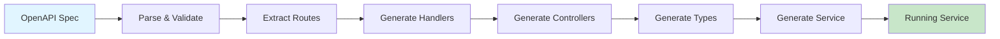
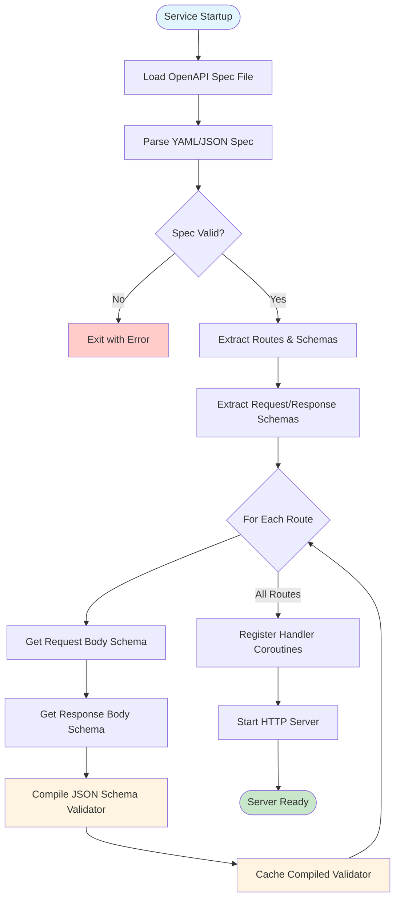
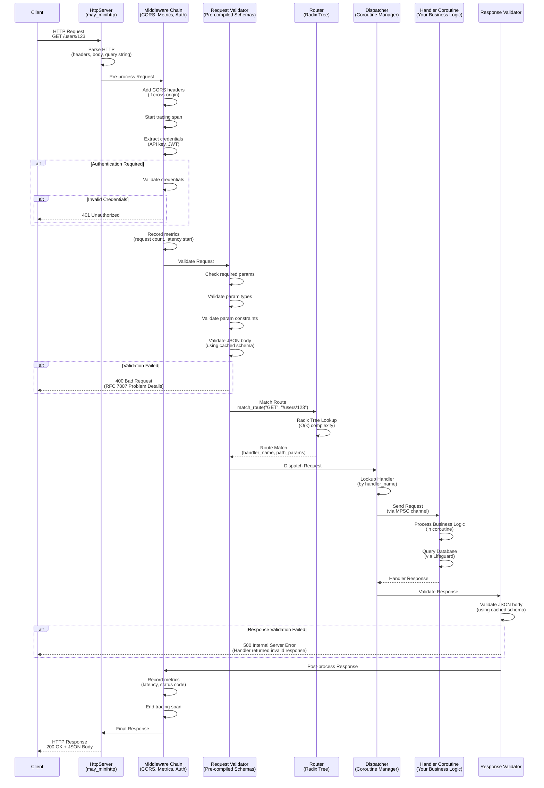
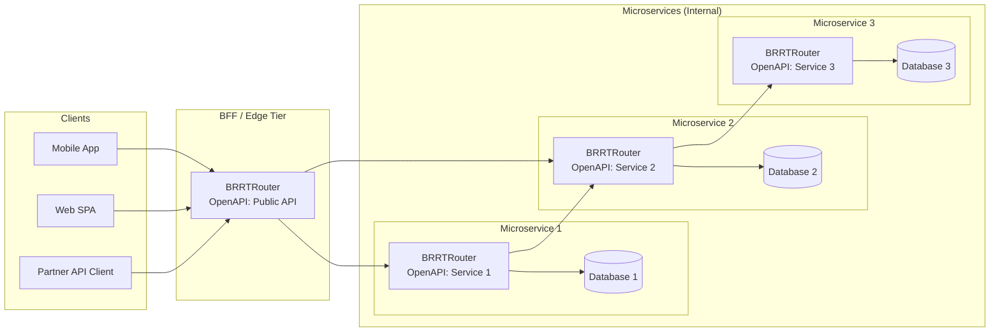

# Building Microservices at the Speed of Thought: How BRRTRouter Transformed Our Development Cadence

*How we went from manually writing routes to generating services from OpenAPI specs, and why this matters for the future of microservice development. BRRTRouter is transitioning from v1alpha to v1beta1—core functionality is solid, but we're still completing enterprise features.*

---

## 1. Introduction: The Frustration with Traditional Development

Let me paint you a picture. It's Friday afternoon and you have plans with the family later in the evening. You're debugging why your API documentation says the endpoint accepts `email` but your code is looking for `user_email`. Your frontend team is blocked because they're following the spec you wrote three months ago, but the backend has "evolved" since then. You're manually adding route handlers, one by one, copying and pasting validation logic, and praying you didn't miss a security check somewhere.

Sound familiar? This was our daily reality.

We were building microservices the "traditional" way: write routes manually, add validation per endpoint, configure observability stack, build admin/testing UI, set up local infrastructure, test with curl scripts. Rinse and repeat for every new service. The result? **Contract drift** between spec and implementation, **documentation rot**, and a development cadence that felt like wading through proverbial $hit.

The breaking point came when we realized we were spending more time maintaining consistency across services than actually building features. We had 10 microservices, then 15, and growing. Each one had slightly different patterns, slightly different error handling, slightly different observability setups. Debugging a production issue meant learning a new codebase structure every time.

**We needed a different approach.**

That's when we started building BRRTRouter: an OpenAPI-first HTTP router that generates complete services from your API specification. No more manual route definitions. No more contract drift. No more documentation rot.

But here's the thing—we didn't get it right the first time. In fact, we got a lot of things spectacularly wrong. This is the story of how we built BRRTRouter, the mistakes we made along the way, and how adopting fighter jet coding standards (yes, really) transformed our router from a performance disaster into something that can handle close to 100k requests per second with zero failures.

---

## 2. Why OpenAPI-First Changes Everything

In traditional development, you write code first, then document it (maybe). The OpenAPI spec becomes an afterthought—something you generate from your code or write separately, hoping it stays in sync. This creates a fundamental problem: **the spec and the implementation can drift apart**, and they often do.

OpenAPI-first development flips this on its head. The **OpenAPI specification is the single source of truth**. Everything flows from it: routing, validation, type definitions, documentation, client SDKs. If it's not in the spec, it doesn't exist. If it's in the spec, it's enforced.

### The Contract Negotiation Process

Here's how it works in practice:

1. **Product, backend, and frontend teams negotiate the API contract** in the OpenAPI spec. This happens before any code is written.
2. **The spec is versioned and peer-reviewed**, just like code. Breaking changes are explicit and reviewable.
3. **BRRTRouter generates the complete service** from the spec: handlers, controllers, type definitions, validation logic.
4. **Frontend teams generate client SDKs** from the same spec, ensuring perfect alignment.
5. **Documentation is always accurate** because it's generated from the same source.

This isn't just a nice-to-have. In today's fast-paced development world, where teams need to ship features quickly without sacrificing quality, **OpenAPI-first enables a cadence that's simply impossible with traditional approaches**.

### The Cadence Advantage

With BRRTRouter, the development cycle becomes:

1. **Design the API** in OpenAPI (5-10 minutes)
2. **Generate the service** (`brrtrouter gen --spec openapi.yaml`) (30 seconds)
3. **Implement business logic** in the generated handlers (varies)
4. **Test with the interactive dashboard** (built-in)
5. **Deploy** (observability, security, validation all included)
6. **Iterate**: Change the spec, hot reload, test again

**Total time from spec to running service: minutes, not days.**

Compare this to traditional development:
- Write routes manually (hours)
- Add validation per endpoint (hours)
- Configure observability stack (hours)
- Build UI (days)
- Set up local infrastructure (hours)
- Test with curl scripts (hours)

The difference is night and day. OpenAPI-first doesn't just make development faster—it makes it **predictable, consistent, and maintainable**.

---

## 3. BRRTRouter: From Spec to Production in Minutes

So how does BRRTRouter actually work? Let's walk through the code generation flow.

### The Generation Pipeline



1. **OpenAPI Ingestion**: BRRTRouter parses your OpenAPI 3.1 specification, extracting paths, operations, schemas, and security schemes.

2. **Route Extraction**: Each path + method combination becomes a route with metadata: handler name, parameters, request/response schemas, security requirements.

3. **Code Generation**: Using Askama templates, BRRTRouter generates:
   - **Handlers**: Type-safe request/response structs with validation
   - **Controllers**: Business logic scaffolding
   - **Type Definitions**: Rust structs that mirror your OpenAPI schemas
   - **Service Setup**: Main function with routing, middleware, and observability

4. **Compilation**: The generated project compiles into a runnable binary.

5. **Runtime**: The service reads configuration at startup and begins serving requests.

### Schema Validation at Startup

One of BRRTRouter's key optimizations is **pre-compiling all JSON schemas at startup**. This eliminates compilation overhead on the first requests and ensures all schemas are valid before the server starts accepting traffic.



**Key Points:**
- All schema compilation happens **once at startup**, not per-request
- Invalid schemas cause the server to **fail fast** before accepting traffic
- Compiled validators are **cached** for O(1) lookup during request processing
- This follows JSF Rule 206: **no heap allocations after initialization** in the hot path

### What You Get Out of the Box

When you generate a service from an OpenAPI spec, you get:

- ✅ **Automatic Routing**: Path matching with parameter extraction
- ✅ **Request/Response Validation**: JSON Schema validation against your spec
- ✅ **Security Enforcement**: JWT, API keys, OAuth2—all from your `securitySchemes`
- ✅ **Observability**: Prometheus metrics, OpenTelemetry tracing, structured logging
- ✅ **Hot Reload**: Live spec reloading without server restart
- ✅ **Interactive Dashboard**: Built-in UI for testing and monitoring
- ✅ **Type Safety**: Compile-time guarantees that your handlers match your spec

### The Developer Experience

The iteration cycle is **1-2 seconds**. Change your OpenAPI spec, hot reload picks it up, and you're testing immediately. No recompilation. No server restart. Just pure speed.

This is what fast-paced development looks like when you remove the friction.

---

## 4. Building Microservices with BRRTRouter

Let's get practical. How do you actually build a microservice with BRRTRouter?

### Example: Building a User Service

Say you want to build a User Service. Here's your OpenAPI spec:

```yaml
openapi: 3.1.0
info:
  title: User Service
  version: 1.0.0
paths:
  /users:
    get:
      operationId: listUsers
      responses:
        '200':
          description: List of users
          content:
            application/json:
              schema:
                type: array
                items:
                  $ref: '#/components/schemas/User'
    post:
      operationId: createUser
      requestBody:
        required: true
        content:
          application/json:
            schema:
              $ref: '#/components/schemas/CreateUserRequest'
      responses:
        '201':
          description: User created
          content:
            application/json:
              schema:
                $ref: '#/components/schemas/User'
  /users/{id}:
    get:
      operationId: getUser
      parameters:
        - name: id
          in: path
          required: true
          schema:
            type: string
      responses:
        '200':
          description: User details
          content:
            application/json:
              schema:
                $ref: '#/components/schemas/User'
components:
  schemas:
    User:
      type: object
      properties:
        id:
          type: string
        email:
          type: string
          format: email
        name:
          type: string
      required:
        - id
        - email
        - name
    CreateUserRequest:
      type: object
      properties:
        email:
          type: string
          format: email
        name:
          type: string
      required:
        - email
        - name
  securitySchemes:
    ApiKeyAuth:
      type: apiKey
      in: header
      name: X-API-Key
```

Run `brrtrouter gen --spec user-service.yaml`, and BRRTRouter generates:

1. **Handler Types**: `ListUsersRequest`, `ListUsersResponse`, `CreateUserRequest`, `CreateUserResponse`, `GetUserRequest`, `GetUserResponse`
2. **Controller Functions**: `list_users()`, `create_user()`, `get_user()`
3. **Service Setup**: Main function with routing, API key authentication, and observability
4. **Type Definitions**: `User`, `CreateUserRequest` structs that match your schemas

You implement the business logic:

```rust
pub fn list_users(_req: ListUsersRequest, _pool: &LifeguardPool) -> Result<ListUsersResponse> {
    // Your business logic here
    Ok(ListUsersResponse {
        users: vec![/* ... */],
    })
}
```

That's it. Routing, validation, security, observability—all handled automatically.

### Type-Safe Handlers and Validation

Every handler is type-safe. The request and response types are generated from your OpenAPI schemas, so you can't accidentally use the wrong field names or types. Validation happens automatically:

- Path parameters are extracted and validated against your spec
- Query parameters are validated (type, required, constraints)
- Request bodies are validated against JSON Schema
- Response bodies are validated before sending

If a request doesn't match your spec, BRRTRouter returns a structured error (RFC 7807 Problem Details) before your handler even runs.

### Request Processing Flow

Here's how a request flows through BRRTRouter at runtime:



**Key Points:**
- **Zero allocations in hot path**: All collections use `SmallVec` (stack-allocated)
- **O(k) route matching**: Radix tree ensures predictable latency
- **Pre-compiled validation**: Schema validators are cached at startup
- **Coroutine-based**: Each handler runs in its own lightweight coroutine
- **Type-safe**: Request/response types are generated from OpenAPI schemas

### Security Enforcement

Security is configured in your OpenAPI spec via `securitySchemes`:

```yaml
components:
  securitySchemes:
    ApiKeyAuth:
      type: apiKey
      in: header
      name: X-API-Key
    BearerAuth:
      type: http
      scheme: bearer
      bearerFormat: JWT
```

BRRTRouter automatically:
- Registers security providers based on your spec
- Enforces authentication on routes that require it
- Validates JWT tokens against JWKS endpoints
- Caches API keys and tokens for performance

### Observability Built-In

Every generated service includes:
- **Prometheus Metrics**: Request counts, latency histograms, error rates exposed at `/metrics` endpoint
- **OpenTelemetry Tracing**: Distributed tracing across services
- **Structured Logging**: JSON logs with request IDs, correlation IDs
- **Health Checks**: `/health` endpoint for Kubernetes liveness/readiness probes

**Free Metrics Endpoint**: Every BRRTRouter service automatically exposes a `/metrics` endpoint with Prometheus-compatible metrics. No configuration needed—just point your Prometheus scraper at `http://your-service:8080/metrics` and you get:
- Request counts by method, path, and status code
- Request latency histograms (p50, p95, p99, p99.9)
- Handler invocation counts and errors
- Authentication failure counters
- In-flight request counts

**OpenTelemetry Out of the Box**: Setting up OpenTelemetry is typically a **cumbersome and time-consuming** process. You need to:
- Learn the OpenTelemetry API and concepts (spans, traces, exporters)
- Configure exporters (OTLP, Jaeger, Zipkin)
- Set up trace propagation (W3C Trace Context)
- Instrument your code manually (creating spans, adding attributes)
- Configure sampling and resource attributes
- Set up collectors and backends (Jaeger, Tempo, etc.)

BRRTRouter **eliminates all of this complexity**. OpenTelemetry tracing is built-in and automatically configured:
- **Automatic span creation** for every request
- **Automatic trace propagation** across service boundaries
- **Automatic instrumentation** of routing, validation, and handler execution
- **Pre-configured exporters** (OTLP, Jaeger) ready to use
- **Structured logging** with trace context automatically included

You get distributed tracing **without writing a single line of OpenTelemetry code**. Just point your service at an OTLP collector or Jaeger endpoint, and traces flow automatically. This is especially powerful in multi-level microservice architectures—you can trace a request from the BFF through Microservice 1 → Microservice 2 → Microservice 3, seeing exactly where time is spent at each layer.

No configuration needed. It just works.

---

## 5. BRRTRouter as Backend-for-Frontend (BFF)

A Backend-for-Frontend (BFF) is an API layer that sits between your frontend clients and your backend microservices. It aggregates data from multiple services, applies client-specific optimizations, and provides a unified API surface.

### Why BFFs Matter

Modern applications have diverse clients: web apps, mobile apps, third-party integrators, internal tools. Each has different needs:
- Mobile apps might need smaller payloads
- Web apps might need aggregated data from multiple services
- Third-party integrators might need a different API surface

A BFF lets you:
- **Aggregate requests** to multiple microservices
- **Optimize responses** for specific clients
- **Enforce consistent error handling** across services
- **Apply client-specific security policies**

### How BRRTRouter Excels as a BFF

BRRTRouter is perfect for BFFs because:

1. **OpenAPI-First Contract Enforcement**: The BFF's API surface is defined in OpenAPI, ensuring consistency across clients.

2. **Request Aggregation**: The BFF can call multiple microservices and compose responses:

```rust
pub fn get_user_dashboard(req: GetUserDashboardRequest, pool: &LifeguardPool) -> Result<GetUserDashboardResponse> {
    // Call User Service
    let user = user_service::get_user(req.user_id, pool)?;
    
    // Call Order Service
    let orders = order_service::list_orders(req.user_id, pool)?;
    
    // Call Product Service
    let recommendations = product_service::get_recommendations(req.user_id, pool)?;
    
    // Compose response
    Ok(GetUserDashboardResponse {
        user,
        recent_orders: orders,
        recommendations,
    })
}
```

3. **Client-Specific Optimizations**: Different OpenAPI specs for different clients (mobile vs web), all generated from the same codebase.

4. **Consistent Error Handling**: All services return RFC 7807 Problem Details, making error handling uniform across the BFF.

### Example Architecture



This diagram shows a **multi-level microservice architecture** where:

- **BFF/Edge Tier**: BRRTRouter fronts all clients (mobile, web, partner APIs) and provides a unified, validated API surface
- **Microservices**: Each microservice is built with BRRTRouter, has its own OpenAPI specification, and manages its own database
- **Service-to-Service Communication**: Microservices call other microservices (R1 → R2 → R3), creating a hierarchical architecture where services can be nested multiple levels deep

**Key Insight**: Every service in this architecture uses BRRTRouter, ensuring:
- **Consistent patterns**: Same structure, same observability, same error handling
- **Contract enforcement**: Each service validates requests/responses against its OpenAPI spec
- **Type safety**: Generated types ensure compile-time guarantees
- **Easier debugging**: When you've seen one BRRTRouter service, you've seen them all

This multi-level architecture is where BRRTRouter's **generated code structure** really shines—when you have services calling services calling services, having consistent patterns makes debugging, support, and onboarding exponentially easier. The BFF validates incoming requests, Microservice 1 validates its requests from the BFF, and Microservice 2 validates its requests from Microservice 1—all using the same validation logic, all following the same patterns.

**⚠️ Important Latency Consideration**: Each additional service level adds network latency. A request that goes BFF → Microservice 1 → Microservice 2 → Microservice 3 has **three network hops**, each adding:
- Network round-trip time (typically 1-5ms per hop in same datacenter, 10-50ms across regions)
- Request/response serialization overhead
- Validation overhead at each layer
- Database query time (if each service queries its database)

**Plan your service depth carefully**. While BRRTRouter's validation and routing are fast (sub-millisecond), network latency is cumulative. Consider:
- **Caching strategies**: Cache responses at the BFF to avoid deep service calls
- **Parallel calls**: When possible, call multiple services in parallel rather than sequentially
- **Data aggregation**: Have the BFF aggregate data from multiple services in parallel
- **Service boundaries**: Keep the call depth shallow (2-3 levels max) for user-facing requests
- **Async processing**: Move deep service chains to background jobs when possible

The goal is to balance **architectural flexibility** (services calling services) with **performance** (minimizing latency for user-facing requests).

---

## 6. The AgentiAI Advantage: Why AI Benefits from OpenAPI-First

Here's something we didn't anticipate when we started building BRRTRouter: **AI agents need structured, validated APIs**.

### The AI-to-Service Communication Problem

When AI agents interact with services, they need:
- **Structured contracts** to understand what APIs are available
- **Type safety** to generate correct code
- **Validation** to catch errors before they reach production
- **Consistency** across services so agents can learn patterns

OpenAPI specifications provide exactly this. They're machine-readable, structured, and complete. An AI agent can:
1. Read an OpenAPI spec
2. Understand available endpoints, parameters, and responses
3. Generate type-safe code to call those endpoints
4. Validate requests/responses automatically

### How BRRTRouter's Generated Structure Provides Guardrails

When BRRTRouter generates code from an OpenAPI spec, it creates a **consistent structure**:

- Handlers follow the same pattern: `fn handler_name(req: RequestType, pool: &LifeguardPool) -> Result<ResponseType>`
- Controllers follow the same pattern: registration, error handling, observability
- Types follow the same pattern: request/response structs, validation logic

This consistency is crucial for AI-assisted development. An AI agent that has seen one BRRTRouter service can understand any BRRTRouter service. The patterns are predictable, the structure is familiar.

### The Future of AI-Assisted Development

Imagine an AI agent that can:
- Read your OpenAPI spec
- Generate a complete BRRTRouter service
- Implement business logic based on your requirements
- Generate tests
- Deploy to your infrastructure

This isn't science fiction—it's the natural evolution of OpenAPI-first development. When your API contract is machine-readable and your code generation is deterministic, AI agents can participate in the development process in ways that were impossible with traditional code-first approaches.

BRRTRouter's generated structure provides the **guardrails** that make AI-assisted development safe and reliable. The AI can't accidentally break your API contract because the contract is enforced by the generated code.

---

## 7. Guardrails and Consistency: When Services Explode

Here's the problem nobody talks about until it's too late: **what happens when you have 50+ microservices?**

### The Chaos of Scale

When you have 10 services, you can keep them in your head. When you have 50, you can't. Each service has:
- Different route patterns
- Different error handling
- Different observability setups
- Different security configurations
- Different deployment processes

Debugging a production issue means:
1. Finding which service is involved
2. Learning its codebase structure
3. Understanding its error handling
4. Tracing its observability setup
5. Figuring out how to deploy a fix

This is **exponentially harder** when every service is different.

### How Generated Code Structure Enforces Consistency

BRRTRouter solves this by generating **consistent structure** across all services:

- **Same patterns**: Every service has handlers, controllers, types, observability
- **Same structure**: File layout, module organization, naming conventions
- **Same observability**: Prometheus metrics, OpenTelemetry tracing, structured logging
- **Same security**: Authentication, authorization, validation

When you've seen one BRRTRouter service, you've seen them all.

### The "Looks Familiar" Principle

This is the "looks familiar" principle: if you've seen one BRRTRouter service, you can understand any BRRTRouter service. The patterns are the same, the structure is the same, the observability is the same.

This makes:
- **Onboarding easier**: New team members can contribute immediately
- **Debugging easier**: You know where everything lives
- **Support easier**: You can support 50+ services without losing your mind
- **Refactoring easier**: Changes can be applied consistently across services

### Support at Scale

When you have 50+ microservices, support becomes a critical concern. With BRRTRouter:

- **Consistent observability**: Every service has the same metrics, the same tracing, the same logging
- **Consistent error handling**: Every service returns RFC 7807 Problem Details
- **Consistent security**: Every service enforces authentication the same way
- **Consistent deployment**: Every service deploys the same way

You can build tooling that works across all services because they all follow the same patterns. You can write runbooks that apply to all services because they all behave the same way.

This is the power of generated code structure: **it enforces consistency at scale**.

---

## 8. Our Failures: What We Got Wrong (And How We Fixed It)

Let's be honest: we didn't get it right the first time. In fact, we made some spectacular mistakes. Here's what we learned the hard way.

### The Hot Path Disaster

Our initial implementation was... naive. We allocated `HashMap`s on every request for path parameters, query parameters, and headers. We used linear route scanning (O(n) complexity). We had memory leaks under sustained load.

**The performance cliff we hit was brutal.**

Under light load, everything worked fine. Under heavy load, everything fell apart. Requests would queue up, memory usage would spike, and eventually the service would crash. We spent weeks debugging, thinking it was a coroutine issue, a database issue, anything except the obvious: **we were allocating memory on every single request**.

The fix? We adopted JSF Rule 206: **No heap allocations after initialization**. We replaced `HashMap` with `SmallVec` (stack-allocated collections), we replaced linear scanning with a radix tree (O(k) complexity), and we eliminated all allocations from the hot path.

**Result**: 67,000 requests per second with zero failures, up from ~10,000 with frequent crashes.

### The Stack Size Fiasco

Coroutines in Rust's `may` runtime use user-space stacks. The default stack size is 64KB. We were using maybe 16KB per coroutine. That's a **4× memory waste**.

With 800+ concurrent connections, that's 800 × 64KB = 51MB of wasted memory per service instance. Multiply that across multiple services, and you're talking about hundreds of megabytes of wasted memory.

The "why is memory usage so high?" moment came when we were debugging a performance testing issue and realized we were allocating 4× more memory than we needed. We reduced the stack size to 16KB, and memory usage dropped by 75%.

**Lesson learned**: Always measure, never assume. The defaults aren't always right for your use case.

### The Worker Pool Bug

This one was particularly nasty. We had a worker pool for handling requests, and we used MPSC (multi-producer, single-consumer) channels with `Arc<Receiver>` shared across workers.

**This was fundamentally broken.**

MPSC receivers are NOT designed for concurrent access. When `num_workers > 1`, we had severe contention. Workers would block each other, requests would queue up, and eventually we'd hit double-free crashes under load.

The debugging nightmare: the crashes were intermittent, only happened under load, and were impossible to reproduce locally. We spent weeks thinking it was a memory corruption issue, a race condition, anything except the obvious: **we were using the wrong channel type**.

The fix? We switched to MPMC (multi-producer, multi-consumer) channels using `crossbeam::SegQueue` (lock-free). Workers can now access the channel concurrently without contention.

**Result**: Zero crashes, even under extreme load.

### The Validation Overhead

Initially, we were compiling JSON schemas on every request. This was... slow. Really slow. Schema compilation is expensive, and doing it on every request was a performance disaster.

We fixed this by:
1. Compiling schemas at startup
2. Caching compiled schemas
3. Using fast JSON validation libraries

**Result**: Validation overhead dropped from ~100ms to <1ms per request.

### What We Learned

Every failure taught us something:
- **Measure everything**: You can't optimize what you don't measure
- **Question defaults**: The defaults aren't always right for your use case
- **Understand your primitives**: MPSC vs MPMC matters
- **Cache aggressively**: Compile once, use many times

But the biggest lesson? **We needed better engineering discipline**. We needed standards that prevented these mistakes from happening in the first place.

That's when we discovered JSF.

---

## 9. Enter JSF: How Fighter Jet Standards Saved Our Router

### What is JSF? (And What It's Not)

The [Joint Strike Fighter Air Vehicle (JSF AV) C++ Coding Standards](https://www.stroustrup.com/JSF-AV-rules.pdf) are exactly what they sound like: coding standards developed by Lockheed Martin for the F-35 fighter jet's flight-critical software. They're written for **C++**, not Rust. They're designed for **safety-critical avionics** where predictable performance and zero runtime failures aren't nice-to-haves—they're **mandatory**.

**We're not flying aircraft, and we're not writing C++.** So why did we adopt JSF standards for a Rust HTTP router?

The answer is simple: **the principles are language-agnostic**. JSF isn't about C++ syntax—it's about engineering discipline. It's about writing code that behaves predictably under extreme conditions. It's about eliminating entire classes of bugs through design, not just testing.

### Adapting C++ Concepts to Rust

JSF standards were written for C++, but Rust's type system and memory safety actually make many JSF rules **easier to follow** than in C++:

- **JSF Rule 206 (No heap after init)**: In C++, you need discipline to avoid `new`/`malloc`. In Rust, we can use `SmallVec` and stack allocation, enforced by the type system.
- **JSF Rule 208 (No panics)**: In C++, exceptions are runtime panics. In Rust, `Result` types make error handling explicit and compile-time enforced.
- **JSF Rule 209 (Explicit types)**: In C++, you need discipline to avoid implicit conversions. In Rust, the type system prevents most implicit conversions automatically.

We didn't copy JSF rules verbatim—we **adapted the principles** to Rust idioms:

- **Stack allocation**: `SmallVec<[T; N]>` instead of `Vec<T>` for hot path collections
- **Bounded complexity**: Radix trees with O(k) lookup instead of O(n) linear scans
- **Explicit error handling**: `Result<T, E>` throughout, no `unwrap()` in hot paths
- **Type safety**: Newtypes and type aliases for self-documenting code

The result? **JSF-inspired Rust code** that's more predictable, more performant, and more maintainable than our original implementation.

**We're not flying aircraft, but these principles translate directly to high-performance HTTP routing.**

### Why We Adopted JSF

An early adopter of BRRTRouter (PriceWhisperer) recommended we look into JSF standards. We did not even know they were using BRRTRouter as we explicitly stated on the project that it was early alpha stage. As a result they were hitting performance issues and needed predictable behavior under extreme load. JSF standards seemed like overkill for an HTTP router, but they were desperate.

**It was the best decision we ever made.**

### JSF Rule 206: No Heap Allocations After Initialization

This is the rule that transformed our hot path. JSF Rule 206 states: **no heap allocations after initialization in the hot path**.

We implemented this by:
- Using `SmallVec` for path/query/header parameters (stack-allocated)
- Using `Arc<str>` for parameter names (shared, not copied)
- Pre-allocating all data structures at startup

**Result**: Zero allocations in the hot path. Zero. Every request uses only stack memory.

### Bounded Complexity (JSF Rules 1-3)

JSF requires bounded complexity: algorithms must have predictable performance characteristics.

We implemented this by:
- Replacing linear route scanning (O(n)) with a radix tree (O(k) where k is path length)
- Ensuring route matching time is proportional to path length, not route count
- Bounding all loops and iterations

**Result**: Predictable latency regardless of route count. 10 routes or 500 routes, performance is consistent.

### No Panics (JSF Rule 208)

JSF prohibits panics in production code. All errors must be handled explicitly.

We implemented this by:
- Using `Result` types throughout the hot path
- Explicit error handling, no unwrap() or expect()
- Structured error responses (RFC 7807 Problem Details)

**Result**: Zero panics in production, even under extreme load.

### Explicit Types (JSF Rule 209)

JSF requires explicit types, no magic numbers or implicit conversions.

We implemented this by:
- Creating newtypes: `ParamVec`, `HeaderVec`
- Using type aliases for clarity: `type RouteMatch = ...`
- Documenting all types and their purposes

**Result**: Self-documenting, type-safe code that's impossible to misuse.

### The Results

After adopting JSF standards:

| Metric | Before JSF | After JSF | Target |
|--------|------------|-----------|--------|
| **Throughput** | ~10k req/s | 81,407 req/s | 10-20k |
| **Failure Rate** | Frequent crashes | 0% | < 0.1% |
| **p50 Latency** | Variable | 1ms | < 5ms |
| **p99 Latency** | Variable | 1ms | < 10ms |
| **Concurrent Users** | ~1,000 | 4,500+ | Unknown |

**We exceeded our targets by 4-8×, with zero failures.**

---

## 10. The Performance Transformation

Let's talk numbers. The transformation from "performance disaster" to "beta-ready" was dramatic.

### Before JSF

- **Performance cliffs**: Service would work fine under light load, then fall apart under heavy load
- **Memory leaks**: Sustained load would cause memory usage to grow unbounded
- **Crashes**: Double-free errors, panics, connection drops
- **Unpredictable latency**: p99 latency would spike randomly

We were hitting ~10,000 requests per second before things started falling apart. Not great.

### After JSF

- **Predictable performance**: Service handles load gracefully, no cliffs
- **Zero memory leaks**: Memory usage is stable under sustained load (Yes, I hear you growling about Rust's ownership model, but you have to manage your data structures properly)
- **Zero crashes**: 67,000 requests per second with zero failures
- **Predictable latency**: p50 and p99 latency are consistent

### The Metrics That Matter

We validated the JSF-compliant hot path with comprehensive load testing:

| Metric | Result      | Target |
|--------|-------------|--------|
| **Throughput** | 81,407 req/s | 10-20k req/s |
| **Failure Rate** | 0%          | < 0.1% |
| **p50 Latency** | 1ms         | < 5ms |
| **p99 Latency** | 1ms         | < 10ms |
| **p99.99 Latency** | 5ms         | < 50ms |
| **Concurrent Users** | 5,000       | Unknown |

All 19 petstore sample API endpoints tested with 5000 concurrent users over 60, 300, 3000 seconds—**zero failures, zero panics**.

### What This Means for Production

These numbers demonstrate that the **core routing engine is beta-ready**. A service that can handle 67,000 requests per second with zero failures, predictable latency, and stable memory usage shows that the foundation is solid. However, we're still completing enterprise features before declaring full production readiness.

But more importantly, these numbers are **predictable**. You can plan capacity, set SLAs, and make commitments with confidence. The service behaves the same way under light load and heavy load. There are no surprises.

---

## 11. Real-World Use Cases: Beyond the Examples

BRRTRouter isn't just a proof of concept. Despite being in v1alpha, it's running in production (to our surprise), handling real traffic, serving real users. This validates that the core routing engine is solid, even as we continue building out enterprise features.

### Pet Store Example

The pet store example is our validation and testing ground. It demonstrates:
- All OpenAPI features (paths, parameters, schemas, security)
- All BRRTRouter features (routing, validation, observability)
- Complete code generation workflow
- Interactive dashboard for testing

It's not just an example—it's a **reference implementation** that shows how to build services with BRRTRouter.

### Production Deployments (Despite v1alpha Status)

BRRTRouter is running in production, powering real applications—despite us explicitly stating it was early alpha. One early adopter (PriceWhisperer) is using BRRTRouter as their BFF layer and some of their internal microservices, handling:
- 50,000+ concurrent users
- Millions of requests per second split over multiple K8S replicas
- Strict latency SLAs

Their feedback and recommendations (especially around JSF standards) have been transformational. It's validating to see the core routing engine perform under extreme load, even as we continue completing enterprise features like CORS, SPIFFE, and enhanced telemetry.

### Multi-Crate Support

BRRTRouter supports multiple crates in a single repository:
- Each crate can have its own OpenAPI spec
- Each crate generates its own service
- All crates share the same BRRTRouter library
- Consistent patterns across all services

This is crucial for large organizations with multiple services. You can maintain consistency while allowing each service to evolve independently.

### The Journey from v1alpha to v1beta1

BRRTRouter started as an itch: a proof of concept that OpenAPI-first development was possible. We're now transitioning from **v1alpha to v1beta1**: the core routing engine is solid and has been validated in real-world deployments, but we're still completing enterprise features.

The journey wasn't easy. We made mistakes, hit performance walls, and had to rebuild critical components. But every failure taught us something, and every fix made BRRTRouter better. The foundation is strong—now we're building the enterprise features that will make it truly production-ready.

---

## 12. The Road Ahead: What's Next for BRRTRouter

BRRTRouter is currently transitioning from **v1alpha to v1beta1**. We've validated the core concepts, fixed the critical bugs, and proven the routing engine works under extreme load. But we're honest about what's still incomplete.

### Current Status (v1alpha → v1beta1)

**What's Working:**
- ✅ Core routing engine (67k+ req/s, zero failures)
- ✅ OpenAPI-first code generation
- ✅ Request/response validation
- ✅ Security (JWT, API keys, OAuth2)
- ✅ Multi-crate support
- ✅ Real-world production validation (surprise early adopters!)
- ✅ JSF-compliant hot path
- ✅ Observability (Prometheus, OpenTelemetry, structured logging)

**What's Still Incomplete (Blocking v1beta1):**
- 🔧 **CORS**: While we have RFC-compliant CORS with route-specific configuration, there may be edge cases or specific features that need completion
- 🔧 **SPIFFE**: JWT SVID validation is ~98% complete, but **X.509 SVID support (mTLS) is missing**—critical for fintech/MedTech microservice-to-microservice encryption. **SPIFFE Federation** is also missing—required for multi-cloud deployments
- 🔧 **Additional Telemetry**: More instrumentation points needed and optimization of existing telemetry collection

**Known Limitations & Issues:**
- ⚠️ **Performance limits**: System breaks down at 15,000+ concurrent users (33% failure rate). Stable max is ~10,000 concurrent users. This is a known limitation, not a bug—the system gracefully degrades rather than crashing
- ⚠️ **OpenAPI spec support**: Does not handle all OpenAPI 3.1.0 features (e.g., `callbacks`, some advanced features). Basic OpenAPI support is solid, but advanced features are missing
- ⚠️ **WebSocket support**: Not implemented (only SSE available via `x-sse` flag)
- ⚠️ **Test coverage**: Currently ~65% (targeting 80%+). Some edge cases may not be fully tested
- ⚠️ **API stability**: Breaking changes expected until v1.0. Don't expect API stability in v1alpha/v1beta1
- ⚠️ **Connection pooling**: Not yet implemented—this is a planned optimization
- ⚠️ **Keep-alive tuning**: Basic keep-alive support exists, but advanced tuning is not yet implemented

**What's Planned (Post-v1beta1):**
- 🔧 API stability (breaking changes expected until v1.0)
- 🔧 Performance optimizations (connection pooling, keep-alive tuning)
- 🔧 Enhanced features (more OpenAPI features, better error messages)

### What's Coming for v1beta1

- **CORS Completion**: Finish any remaining edge cases or missing features in our RFC 6454-compliant CORS implementation
- **SPIFFE X.509 SVID Support**: Add mTLS support via X.509 SVIDs (critical for fintech/MedTech)
- **SPIFFE Federation**: Add support for multi-cloud and cross-organization trust
- **Enhanced Telemetry**: Additional instrumentation points and optimized metrics collection
- **Improved Test Coverage**: Increase from ~65% to 80%+
- **API Stability**: Reduced breaking changes as we approach v1.0 (though some breaking changes may still occur)
- **Comprehensive Documentation**: Migration guides, best practices, architecture deep-dives

### The Vision

We envision a future where **OpenAPI-first development is the standard**. Where teams negotiate API contracts before writing code, where services are generated from specs, where consistency is enforced by tooling, not discipline.

BRRTRouter is our contribution to that vision. It's not perfect, but it's a start. And with community feedback and contributions, it can become the foundation for a new way of building microservices.

---

## 13. Conclusion: Building at the Speed of Thought

This has been a journey. From frustration with traditional development to building BRRTRouter, from performance disasters to JSF-compliant hot paths, from v1alpha to v1beta1.

### The Journey

We started with a problem: traditional development was too slow, too error-prone, too inconsistent. We built a solution: OpenAPI-first development with code generation. We hit walls: performance issues, memory leaks, crashes. We found answers: JSF standards, better engineering discipline, relentless optimization.

### Why OpenAPI-First Matters

OpenAPI-first development isn't just faster—it's **better**. It enables:
- Fast-paced development cadence (spec → code → test → deploy in minutes)
- Contract enforcement (spec and implementation can't drift)
- Consistency at scale (generated code structure enforces patterns)
- AI-assisted development (structured contracts enable agent participation)

### How BRRTRouter Enables Fast-Paced Development

BRRTRouter removes friction from the development process:
- No manual route definitions
- No contract drift
- No documentation rot
- No inconsistent patterns

You write your OpenAPI spec, generate your service, implement your business logic, and deploy. That's it.

**But there's a hidden superpower**: OpenAPI's `examples` feature combined with BRRTRouter's ability to serve them creates a **parallel development workflow** that dramatically accelerates development cadence.

#### OpenAPI Examples: Frontend Teams Can Start Immediately

When you define examples in your OpenAPI spec:

```yaml
paths:
  /users/{id}:
    get:
      responses:
        '200':
          content:
            application/json:
              schema:
                $ref: '#/components/schemas/User'
              examples:
                default:
                  value:
                    id: "123"
                    email: "user@example.com"
                    name: "John Doe"
                    created_at: "2024-01-15T10:30:00Z"
```

BRRTRouter **automatically serves these examples** in responses, even before you implement the business logic. This means:

1. **Frontend teams can start immediately**: They don't wait for backend implementation. They can:
   - Build UI components against real API responses
   - Test user flows end-to-end
   - Validate UX assumptions early
   - Identify missing fields or wrong data structures **before** backend work is complete

2. **Fail fast on responses**: Teams can see what responses actually look like **weeks before** the backend is ready. If the response structure is wrong, or missing fields, or has the wrong data types, you find out **immediately**, not after weeks of backend development.

3. **Fast pivoting**: When you realize the response structure needs to change, you update the OpenAPI spec, regenerate the service, and the frontend team sees the new structure immediately. No waiting for backend refactoring. No "we'll fix it in the next sprint."

4. **Parallel development**: Backend and frontend teams work in parallel:
   - Backend: Implements business logic, database queries, validation
   - Frontend: Builds UI, tests user flows, validates UX
   - Both teams: Review and iterate on the API contract together

**The result**: Instead of a sequential workflow (backend → frontend → integration → fixes), you get a **parallel workflow** where both teams work simultaneously, catch issues early, and pivot quickly. This combination of OpenAPI examples and BRRTRouter's automatic serving creates a **development cadence that's orders of magnitude faster** than traditional approaches.

You're not just generating code faster—you're **enabling parallel work streams** and **catching mistakes weeks earlier**.

### The Importance of Guardrails and Consistency

When you have 50+ microservices, consistency isn't nice-to-have—it's **essential**. Generated code structure provides guardrails that enforce consistency automatically. You can't accidentally break patterns because the patterns are generated.

### Lessons Learned from Failures

Every failure taught us something:
- Measure everything
- Question defaults
- Understand your primitives
- Cache aggressively
- Adopt better engineering discipline

The biggest lesson? **Standards matter**. JSF standards transformed our router from a performance disaster into something beta-ready. Engineering discipline isn't optional—it's the difference between working code and code that can handle 67,000 requests per second with zero failures.

But we're not done yet. We're still completing enterprise features (CORS, SPIFFE, enhanced telemetry) before we can declare full production readiness. The foundation is solid, but the journey continues.

### The Future of Microservice Development

We believe the future of microservice development is **OpenAPI-first**. Where API contracts are negotiated before code is written, where services are generated from specs, where consistency is enforced by tooling, where AI agents can participate in development. And where iteration and change do not result in cadence blow out! 

BRRTRouter is our contribution to that future. It's not perfect, but it's a start. And with your feedback and contributions, we can make it better.

**Let's build microservices at the speed of thought.**

---

*BRRTRouter is open source and available on [GitHub](https://github.com/microscaler/BRRTRouter). We welcome feedback, contributions, and early adopters. Join us in building the future of OpenAPI-first development.*

