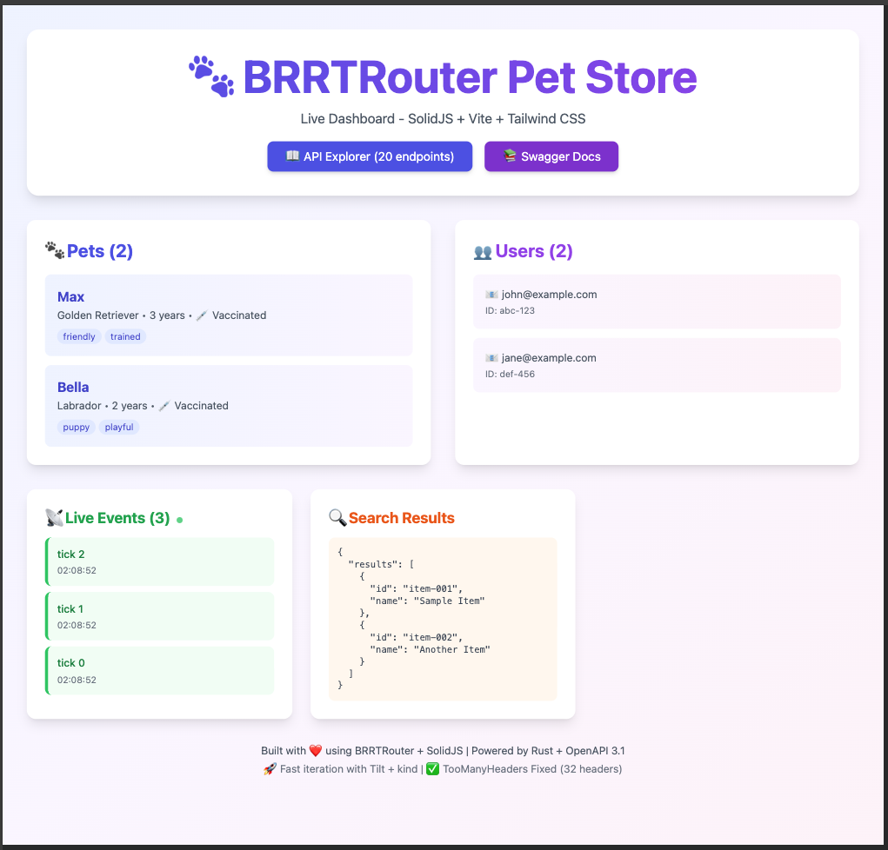
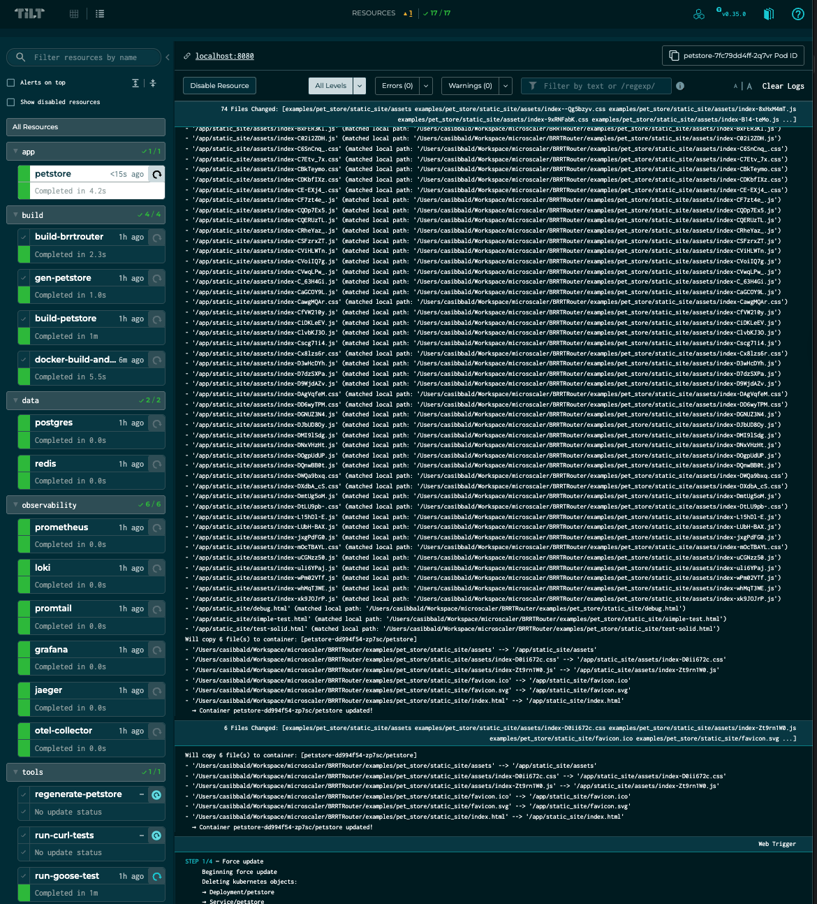

# Contributing to BRRTRouter

Thank you for your interest in contributing to **BRRTRouter**! 🎉

This guide will help you get started quickly with our local development environment.

## Getting Started as a Contributor

1. **🚀 Set up your development environment** (5 minutes):
   ```bash
   git clone https://github.com/microscaler/BRRTRouter.git
   cd BRRTRouter
   just dev-up  # Creates cluster + starts everything
   ```

2. **✅ Verify everything works**:
   ```bash
   curl http://localhost:8080/health
   curl -H "X-API-Key: test123" http://localhost:8080/pets
   ```

3. **📖 Read the contribution guide**: [CONTRIBUTING.md](CONTRIBUTING.md)

4. **🔍 Pick an issue**: Look for [`good first issue`](https://github.com/microscaler/BRRTRouter/labels/good%20first%20issue) labels

5. **🧪 Run tests before committing**:
   ```bash
   just nt        # Fast parallel tests with nextest
   cargo fmt      # Format code
   ```

## Areas for Contribution

We welcome contributions that improve:
- 🧵 Typed handler deserialization
- ✨ Auto-generation of `impl From<HandlerRequest>` for `TypedHandlerRequest<T>` based on schema
- 🚧 Dynamic dispatcher route registration
- 🚧 Hot reload
- 🚧 Header parsing and extraction
- 🚧 Cookie parsing and extraction
- 🚧 WebSocket support
- 🚧 Server-side events
- 🚧 SPIFFE support if we have enterprise interest for windows users single signon
- 🧪 Test coverage and spec validation
- 🧠 Coroutine handler ergonomics
- 📊 Benchmarks for match throughput (goal: 100k matches/sec)
- 🔐 Middleware hooks (metrics, tracing, auth, **RFC-compliant CORS with route-specific configuration**)
- 💥 Reusable SDK packaging and publishing to crates.io

**Benchmark goal:**
- Raspberry Pi 5
- 100k route matches/sec
- ≤8ms latency (excluding handler execution)

## 🏃 Quick Start

**Goal: Running in <5 minutes**

### Option 1: Tilt + kind (Recommended) ⭐

```bash
# Prerequisites: Docker, kind, kubectl, tilt
# See docs/LOCAL_DEVELOPMENT.md for installation

# 1. Clone and setup (30 seconds)
git clone https://github.com/microscaler/BRRTRouter.git
cd BRRTRouter

# 2. Start development environment (2 minutes)
just dev-up

# 3. Access your services
open http://localhost:8080           # 🎨 Interactive Dashboard
open http://localhost:8080/docs      # 📖 Swagger UI
open http://localhost:3000           # 📊 Grafana (admin/admin)
```

**That's it!** You now have a running API with full observability stack.

### Option 2: Simple cargo run

For quick testing without Kubernetes:

```bash
git clone https://github.com/microscaler/BRRTRouter.git
cd BRRTRouter

# Start the Pet Store example
just start-petstore

# Test the API
curl -H "X-API-Key: test123" http://localhost:8080/pets
curl http://localhost:8080/health

# Visit the Interactive Demo Dashboard
open http://localhost:8080/
```

### Prerequisites

Install these tools before starting:

```bash
# macOS
brew install docker kind kubectl tilt just

# Linux (Ubuntu/Debian)
sudo apt-get install docker.io kubectl
curl -Lo ./kind https://kind.sigs.k8s.io/dl/latest/kind-linux-amd64
chmod +x ./kind && sudo mv ./kind /usr/local/bin/
curl -fsSL https://github.com/tilt-dev/tilt/releases/latest/download/tilt.$(uname -s)-$(uname -m).tar.gz | tar -xzv tilt && sudo mv tilt /usr/local/bin/
```

See [docs/LOCAL_DEVELOPMENT.md](docs/LOCAL_DEVELOPMENT.md) for full installation details.

### Development Cycle

1. **Edit code** in `src/` or `examples/pet_store/src/`
2. **Tilt auto-rebuilds** and syncs changes (~1-2 seconds!)
3. **Test immediately**: `curl` or visit http://localhost:8080/docs
4. **View logs**: `kubectl logs -f -n brrtrouter-dev deployment/petstore`
5. **Check metrics**: http://localhost:3000 (Grafana: admin/admin)

## 📸 See It In Action

### 🎨 Interactive Dashboard Demo (SolidJS UI)

**Dashboard showcasing all BRRTRouter capabilities:**



**Features:**
- 🐾 **Live Data Display** - Real-time pets/users with auto-refresh and modal views
- 📡 **SSE Streaming** - Real-time server-sent events with visual connection indicator
- 🔍 **API Explorer** - All 25+ endpoints with color-coded HTTP methods
- 🧪 **API Testing Suite** - Test any endpoint with parameter forms, body editors, and response viewer
- 🔒 **Authentication UI** - API Key + Bearer Token configuration with visual status
- 🎯 **Professional Design** - SolidJS + Vite + Tailwind CSS with gradient themes

**Access:** `http://localhost:8080/` after running `just dev-up` or `just start-petstore`

## 📊 Observability Stack

**Full monitoring with Tilt + kind:**



- **Metrics**: Prometheus for request rates, latency, errors
- **Logs**: Loki + Promtail for centralized logging with LogQL
- **Traces**: Jaeger + OTEL Collector for distributed tracing
- **Unified UI**: Grafana with all datasources pre-configured

### Service URLs (when Tilt is running)

| Service | URL | Purpose |
|---------|-----|---------|
| **🎨 Interactive Dashboard** | http://localhost:8080/ | **START HERE** - SolidJS UI with live data, SSE, API testing |
| **Pet Store API** | http://localhost:8080 | Main API (standard HTTP port) |
| **Swagger UI** | http://localhost:8080/docs | OpenAPI documentation |
| **Health Check** | http://localhost:8080/health | Readiness probe |
| **Metrics** | http://localhost:8080/metrics | Prometheus metrics |
| **Grafana** | http://localhost:3000 | Dashboards (admin/admin) |
| **Prometheus** | http://localhost:9090 | Metrics database |
| **Jaeger** | http://localhost:16686 | Distributed tracing |
| **PostgreSQL** | localhost:5432 | Database (user: brrtrouter, db: brrtrouter, pass: dev_password) |
| **Redis** | localhost:6379 | Cache/session store |
| **Tilt Web UI** | http://localhost:10351 | Dev dashboard (press 'space' in terminal) |

## 📋 Before Submitting a Pull Request

```bash
# 1. Format your code
cargo fmt

# 2. Run all tests (fast parallel execution)
just nt

# 3. Check test coverage (must be ≥80%)
just coverage

# 4. Verify docs build
just docs

# 5. (Optional) Load test if you modified performance-critical code
cargo run --release --example api_load_test -- --host http://localhost:9090 -u10 -r2 -t30s
```

## 🛠 Working with Generated Code

**IMPORTANT**: Files under `examples/pet_store/` are **auto-generated**. Do not edit them directly!

### Generator Architecture

- **Generator logic**: `src/generator/`
- **Templates**: `templates/`
- **OpenAPI spec**: `examples/openapi.yaml`
- **Output**: `examples/pet_store/` (generated)

### Modifying Generated Code

1. Edit templates in `templates/` or generator logic in `src/generator/`
2. Regenerate the pet store example:
   ```bash
   just gen
   # or
   cargo run --bin brrtrouter-gen -- generate --spec examples/openapi.yaml --force
   ```
3. Verify the generated code compiles: `cargo build -p pet_store`
4. Run tests: `just nt`
5. Commit both template changes AND regenerated files together

## Documentation Standards

BRRTRouter follows strict documentation standards to help contributors understand the codebase.

### Module Documentation

Every public module must have module-level documentation (`//!`) that includes:

1. **Title** - A clear, concise module name
2. **Overview** - What the module does and why it exists
3. **Architecture** - How the module works (diagrams welcome)
4. **Usage Examples** - At least one practical example
5. **Key Types** - Links to important types exported by the module

Example:

```rust
//! # Router Module
//!
//! Provides path matching and route resolution for BRRTRouter.
//!
//! ## Overview
//!
//! The router matches incoming requests to handlers defined in OpenAPI specs...
//!
//! ## Example
//!
//! ```rust
//! use brrtrouter::router::Router;
//! let router = Router::from_spec(&spec);
//! ```
```

### Function and Type Documentation

All public functions, structs, enums, and traits must have doc comments (`///`) that include:

1. **Purpose** - What the item does
2. **Arguments** - Description of each parameter (for functions)
3. **Returns** - What the function returns
4. **Examples** - Code examples for non-trivial items
5. **Panics** - Document panic conditions
6. **Safety** - Document unsafe requirements (if applicable)

Example:

```rust
/// Loads an OpenAPI specification from a file.
///
/// # Arguments
///
/// * `path` - Path to the OpenAPI YAML or JSON file
///
/// # Returns
///
/// Returns the parsed `Spec` object or an error if parsing fails.
///
/// # Example
///
/// ```rust
/// let spec = load_spec("openapi.yaml")?;
/// ```
pub fn load_spec(path: &str) -> Result<Spec, Error> {
    // ...
}
```

### Generating Documentation

Generate and view the documentation locally:

```bash
# Using just (recommended)
just docs              # Generate and open docs with Mermaid diagrams
just docs-build        # Generate without opening
just docs-check        # Check for warnings and broken links

# Or using cargo directly
cargo doc --no-deps --lib --open

# The project is configured to automatically include Mermaid.js for diagram rendering
# via .cargo/config.toml and doc/head.html
```

**Note**: The documentation includes interactive Mermaid sequence diagrams. These are automatically rendered when you view the docs in a browser thanks to the Mermaid.js library loaded via `doc/head.html`.

**Quick Reference:**
- `just docs` - Most common: build and view docs
- `just docs-check` - Verify docs before committing
- Docs auto-include Mermaid.js for diagram rendering

### CI Checks

The CI pipeline automatically checks:
- Missing documentation warnings
- Broken intra-doc links
- Example code in docs compiles (when not marked as `ignore`)

### Test Documentation

Test modules should have a module-level comment explaining:
- What is being tested
- Test coverage scope
- Any special setup or teardown

Example:

```rust
//! # Router Tests
//!
//! Tests for path matching, parameter extraction, and route resolution.
//!
//! Coverage:
//! - Path parameter extraction
//! - Query parameter parsing
//! - HTTP method matching
//! - 404 handling
```

## Code Base Overview

### General Structure

**README overview** – BRRTRouter aims to be a “high‑performance, coroutine‑powered request router for Rust” driven entirely by an OpenAPI 3.1 specification. The vision calls for “millions of requests per second” with a goal of one million route matches per second on a Raspberry Pi 5.

**Crate layout** – The library is defined in `src/` and exposes modules such as `router`, `dispatcher`, `server`, `spec`, `typed`, etc. (`lib.rs` re‑exports several of them). There is a small CLI binary `src/bin/brrrouter_gen.rs` which just invokes `brrrouter::cli::run_cli()`.

**OpenAPI specification parsing** – `spec.rs` reads a spec file (JSON or YAML) and produces `RouteMeta` values describing HTTP method, path, handler name, request/response schemas, and examples. The `build_routes` function walks the spec’s paths and operations to create `RouteMeta` entries and captures JSON schema info where available.

**Router** – `router.rs` converts each OpenAPI path into a regular expression and stores the method + regex. At runtime `Router::route` matches a (method, path) pair to a `RouteMatch` containing path parameters and handler metadata.

**Dispatcher** – `dispatcher.rs` registers handler functions under string names and spawns a coroutine (using the may runtime) for each. Incoming requests are dispatched through channels to the registered handler. If a handler panics, the dispatcher returns a 500 error response. The `dispatch` method forwards a request and waits for the handler’s reply.

**HTTP server** – `server.rs` implements the `may_minihttp::HttpService` trait. It parses query parameters and JSON bodies, then uses the router and dispatcher to produce a JSON response or a 404/500 fallback.

**Typed handlers** – `typed.rs` offers a higher‑level interface: `Dispatcher::register_typed` automatically deserializes request bodies into strongly typed structures and serializes responses. It defines `TypedHandlerRequest<T>` and `TypedHandlerResponse<T>` as generics for typed data.

**Code generator** – `generator.rs` reads an OpenAPI spec and writes an example project under `examples/`. Templates in `templates/` define the generated `Cargo.toml`, handler stubs, controller stubs, and registry. See `generate_project_from_spec` which writes these files and creates typed structs from schema definitions.

**Examples and tests** – `examples/` contains an OpenAPI spec (`openapi.yaml`) and a generated “pet_store” example. Unit tests in `tests/router_tests.rs` focus on route matching for various HTTP verbs and paths. The README demonstrates running the server with `cargo run` and hitting it via `curl`, as well as running the tests with `cargo test -- --nocapture`.

### Module Overview

The `src/` directory is organized into several modules:

- **`cli`** – command-line interface and entry points for the generator.
- **`dispatcher`** – coroutine-based dispatcher that invokes handlers for matched routes.
- **`router`** – path matcher that builds a routing table from the OpenAPI spec.
- **`server`** – lightweight HTTP server built on `may_minihttp` plus request/response types.
- **`middleware`** – pluggable middleware such as metrics, CORS, and security hooks.
- **`security`** – implementations of bearer and OAuth2 security providers.
- **`generator`** – reads templates and the OpenAPI spec to produce example projects.
- **`spec`** – OpenAPI 3.1 parser used by the router and generator.
- **`typed`** – traits for typed request/response handlers.
- **`runtime_config`** – loads runtime options from environment variables.
- **`sse`** and **`static_files`** – helpers for server-sent events and serving static assets.

Key components include:

- `Router` – performs regex-based path matching and extracts path parameters.
- `Dispatcher` – coordinates coroutine execution of request handlers.
- `HttpServer` – drives the request/response loop and integrates middleware.

### Important Things to Know

- **OpenAPI‑driven** – The router relies entirely on the OpenAPI spec to define routes and handler names. Handler functions must be registered with exactly those names.
- **Coroutine runtime** – The project uses the may crate for lightweight coroutines and may_minihttp for serving HTTP. The project is generally incompatible with Tokio and an async bridge will need to be implemented specifically for Otel tracing.
- **Safety** – Handler registration uses unsafe (`register_handler` and `register_typed`) because the caller must guarantee the handler is safe in a concurrent environment.
- **Code generation** – The CLI (`brrrouter-gen`) can generate starter projects from a spec using Askama templates. This includes request/response structs, handler stubs, and controllers.
- **Testing focus** – Current unit tests verify the router’s matching logic for all HTTP verbs and for unknown paths.

### Pointers for Next Steps

- **Understand the spec module** – Learning how `spec.rs` parses the OpenAPI file and how `RouteMeta` is constructed is key to extending or validating new spec features.
- **Explore coroutine runtimes** – Look into the may crate to understand how coroutines and channels work, since handlers are expected to run in those coroutines.
- **Study the generator templates** – To customize generated code, review the templates under `templates/` (for example `handler.rs.txt` and `controller.rs.txt`) which show how typed handler modules are produced.
- **Run the example** – Try `cargo run` with the provided `examples/openapi.yaml` to see the router and echo handler in action.
- **Examine the unit tests** – `tests/router_tests.rs` illustrates how to parse a spec and check route matching; it’s a good starting point for adding more tests.

This repository demonstrates a minimal but modular OpenAPI-driven router. Once comfortable with the basics, explore improving typed request/response deserialization, dynamic handler registration, and the advanced features listed in the README’s “Contributing & Benchmarks” section.

For more details, consult the inline documentation in each module. Contributions that improve tests and documentation are highly appreciated!