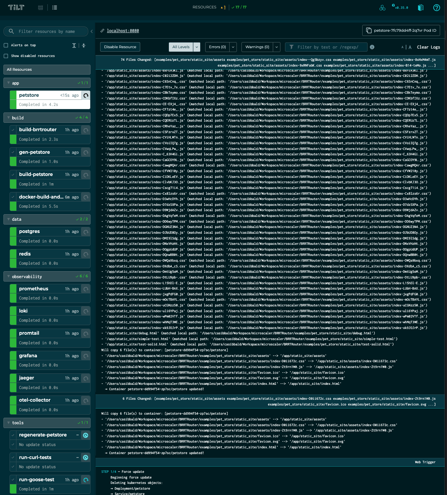

# 🚀 BRRTRouter

> **Production-ready HTTP router for Rust, powered by OpenAPI 3.1.0**

[](https://github.com/microscaler/BRRTRouter/actions)
[](https://crates.io/crates/brrrouter)
[](https://docs.rs/brrrouter)

---

## What is BRRTRouter?

**BRRTRouter** generates a complete, type-safe HTTP server from your OpenAPI specification. Write your API definition once, get routing, validation, middleware, observability, and handler scaffolding automatically. Ship production-ready APIs faster.

Inspired by the *GAU-8/A Avenger* on the A-10 Warthog, this router delivers precision request dispatch with massive throughput. Built on `may` coroutines for lightweight concurrency (800+ concurrent connections), it's designed for developers who want OpenAPI-first development without sacrificing performance.

---

## 🎯 Why BRRTRouter?

| Traditional Approach | BRRTRouter |
|---------------------|------------|
| Write routes manually for each endpoint | Generated from OpenAPI spec |
| Add validation per endpoint | Automatic from JSON Schema |
| Configure observability stack | Built-in, zero config (Prometheus, Jaeger, Loki) |
| Build admin/testing UI | Included (production SolidJS dashboard) |
| Setup local infrastructure | One command: `just dev-up` (Tilt + kind) |
| Test with curl scripts | Interactive dashboard with API testing |
| Memory leak hunting | Goose load tests (2+ minute sustained tests) |

✅ **Design Once, Deploy Everywhere**  
OpenAPI spec generates server, client SDKs, and docs

✅ **Production-Ready Day One**  
Observability, security, and error handling included

✅ **Developer Experience First**  
Hot reload, live metrics, comprehensive testing, 1-2s iteration cycle

---

## 🏗️ Architecture at a Glance

```
OpenAPI Spec → Code Generator → Type-Safe Handlers → Production Server
                                          ↓
                              Observability Stack
                         (Metrics/Traces/Logs/Dashboard)
```

**Key Technologies:**
- **Core**: Rust 1.75+, `may` coroutines (async runtime), OpenAPI 3.1.0
- **Local Dev**: Tilt + kind (fast iteration), cross-compilation (macOS → Linux)
- **Observability**: Prometheus + Grafana (metrics), Jaeger + OTEL (traces), Loki + Promtail (logs)
- **Storage**: PostgreSQL, Redis (included in dev environment)
- **Backup**: Velero + MinIO (optional)
- **Load Testing**: Goose (tests all endpoints, not just `/health`)

---
## ⚠️ Alpha Stage Notice

**This library is currently in alpha stage (v0.1.0-alpha.1).**

This documentation is published for **review and feedback purposes**, not for production adoption.

**Status:**
- ✅ Core functionality working
- 🔧 API may change (breaking changes expected)
- 🔧 Performance optimization ongoing
- 🧪 Seeking early feedback and testing

**We welcome:**
- 📝 Documentation feedback
- 🐛 Bug reports
- 💡 API suggestions
- 🧪 Testing and experimentation

**Not recommended for production use yet.** Wait for v0.1.0 stable release.

---

## ✨ Key Features

- **📜 OpenAPI-First**: Your API spec is the single source of truth - routing, validation, and handlers generated automatically
- **🎨 Interactive Dashboard**: Production-ready SolidJS UI with live data, SSE streaming, and comprehensive API testing
- **⚡ Coroutine-Powered**: Built on `may` coroutines for lightweight concurrency (800+ concurrent connections on 1MB stack)
- **🔐 Security Built-In**: JWT/JWKS, OAuth2, API Keys with auto-registration from OpenAPI `securitySchemes`
- **📊 Zero-Config Observability**: Prometheus metrics, OpenTelemetry tracing, health checks out of the box
- **🔥 Hot Reload**: Live spec reloading without server restart
- **🧪 Well-Tested**: 219 tests, 80%+ coverage, parallel execution support

---

## 🏃 Quick Start

**Goal: Running in <5 minutes**

### Option 1: Tilt + kind (Recommended) ⭐

```bash
# Prerequisites: Docker, kind, kubectl, tilt
# See docs/LOCAL_DEVELOPMENT.md for installation

# 1. Clone and setup (30 seconds)
git clone https://github.com/microscaler/BRRTRouter.git
cd BRRTRouter

# 2. Start development environment (2 minutes)
just dev-up

# 3. Access your services
open http://localhost:8080           # 🎨 Interactive Dashboard
open http://localhost:8080/docs      # 📖 Swagger UI
open http://localhost:3000           # 📊 Grafana (admin/admin)
```

**That's it!** You now have a running API with full observability stack.

### Option 2: Simple cargo run

For quick testing without Kubernetes:

```bash
git clone https://github.com/microscaler/BRRTRouter.git
cd BRRTRouter

# Start the Pet Store example
just start-petstore

# Test the API
curl -H "X-API-Key: test123" http://localhost:8080/pets
curl http://localhost:8080/health

# Visit the Interactive Dashboard
open http://localhost:8080/
```

---

## 📸 See It In Action

### 🎨 Interactive Dashboard (SolidJS UI)

**Production-ready dashboard showcasing all BRRTRouter capabilities:**


**Features:**
- 🐾 **Live Data Display** - Real-time pets/users with auto-refresh and modal views
- 📡 **SSE Streaming** - Real-time server-sent events with visual connection indicator
- 🔍 **API Explorer** - All 25+ endpoints with color-coded HTTP methods
- 🧪 **API Testing Suite** - Test any endpoint with parameter forms, body editors, and response viewer
- 🔒 **Authentication UI** - API Key + Bearer Token configuration with visual status
- 🎯 **Professional Design** - SolidJS + Vite + Tailwind CSS with gradient themes

**Access:** `http://localhost:8080/` after running `just dev-up` or `just start-petstore`

---

### 📊 Observability Stack

**Full monitoring with Tilt + kind:**



- **Metrics**: Prometheus for request rates, latency, errors
- **Logs**: Loki + Promtail for centralized logging with LogQL
- **Traces**: Jaeger + OTEL Collector for distributed tracing
- **Unified UI**: Grafana with all datasources pre-configured

---

## ✅ Feature Status

### 🎯 Production-Ready (October 2025)
| Feature                                          | Status | Description                                                                                                                                                               |
|--------------------------------------------------|--------|---------------------------------------------------------------------------------------------------------------------------------------------------------------------------|
| **OpenAPI 3.1 Spec Parser**                      | ✅      | Parses `paths`, `methods`, parameters, and `x-handler-*` extensions                                                                                                       |
| **Routing Table Construction**                   | ✅      | Compiles OpenAPI paths into regex matchers with param tracking                                                                                                            |
| **Coroutine-Based Server**                       | ✅      | Fully integrated with `may_minihttp` and `may` coroutine runtime                                                                                                          |
| **Dynamic Handler Dispatch**                     | ✅      | Request is dispatched to named handlers via coroutine channels                                                                                                            |
| **Full Request Context Support**                 | ✅      | Request path, method, path params, query params, and JSON body all passed into the handler                                                                                |
| **`echo_handler` Coroutine**                     | ✅      | Mock handler that serializes and returns all request input data                                                                                                           |
| **Query Parameter Parsing**                      | ✅      | Fully extracted from the request URI and passed to handler                                                                                                                |
| **Request Body Decoding (JSON)**                 | ✅      | JSON body is read and deserialized for POST/PUT/PATCH handlers                                                                                                            |
| **404 and 500 Handling**                         | ✅      | Fallback responses for unknown routes or missing handlers                                                                                                                 |
| **Verbose Mode for CLI**                         | ✅      | `--verbose` flag enables OpenAPI parsing debug output                                                                                                                     |
| **Modular Design**                               | ✅      | Clean separation of `spec`, `router`, `dispatcher`, and `server` logic                                                                                                    |
| **Composable Handlers**                          | ✅      | Coroutine-safe handler registry for runtime dispatch                                                                                                                      |
| **Regex-Based Path Matching**                    | ✅      | Path parameters are extracted using fast regex matchers                                                                                                                   |
| **Zero I/O Testing Support**                     | ✅      | `load_spec_from_spec()` allows programmatic spec testing                                                                                                                  |
| **Test Coverage**                                | ✅      | 219 tests covering all HTTP verbs, paths, and fallback routing                                                                                                            |
| **Swagger UI & Spec Endpoints**                  | ✅      | Bundled Swagger UI at `/docs` and spec served from `/openapi.yaml` |
| **Prometheus metrics middleware**                | ✅      | Complete metrics collection for requests, responses, latency, auth failures; `/metrics` endpoint for Prometheus scraping                                                  |
| **Interactive Dashboard (SolidJS UI)**           | ✅      | Production-ready UI with live data, SSE streaming, API explorer/testing, authentication UI |
| **Pluggable Security Providers**                 | ✅      | `SecurityProvider` trait enables custom authentication schemes |
| **Server-Sent Events**                           | ✅     | `x-sse` extension with `sse::channel` helper; streaming fixes pending |
| **JWT/OAuth2 & API Key Auth**                    | ✅      | `BearerJwtProvider`, `OAuth2Provider`, `JwksBearerProvider` (JWKS HS/RS algs), and `RemoteApiKeyProvider`; scope checks, cookie support, metrics, and OpenAPI-driven registration |
| **Schema validation**                            | ✅      | Request and response validation against OpenAPI JSON Schema with clear 400 errors; exercised in tests.                                                                    |
| **Improved handler ergonomics**                  | ✅     | Use `#[handler]` to implement the `Handler` trait automatically. |
| **Fix flaky tests / deterministic startup**      | ✅     | Tests use a fixed sleep to wait for server readiness and cancel the coroutine abruptly.                                                                                   |
| **Investigate config context**                   | ✅     | A pragmatic way to pass Configuration across the entire code base, possibly with an immutable global config that is loaded at start time                                  |
| **Panic recovery for handlers**                  | ✅     | Un-typed handlers recover from panics using `catch_unwind`; typed handlers do not.                                                                                        |
| **Extend fake otel collector across all tests**  | 🚧     | Fake OpenTelemetry collector is used in just tests, but not all tests utilize it.                                                                                         |
| **handler coroutine stack size**                 | 🚧     | Coroutine stack size is set via `BRRTR_STACK_SIZE` env var, but not dynamically adjustable or measured.                                                                   |
| **implement tracing across entire codebase**     | 🚧     | Tracing is implemented in some places, but not consistently across the entire codebase.                                                                                   |
| **Deep dive into OpenAPI spec**                  | 🚧     | OpenAPI spec parsing is basic; does not handle all features like `callbacks` and other functions, produce GAP analysis in order to completely support OpenAPI 3.1.0 spec. |
| **Multiple security providers**                  | ✅      | Multiple providers supported and auto-registered from OpenAPI schemes; per-route scheme enforcement tested; supports ApiKey, Bearer, OAuth2, JWKS, RemoteApiKey           |
| **Configurable stack size with instrumentation** | 🚧     | Stack size comes from `BRRTR_STACK_SIZE` environment variable and is logged in metrics; no runtime API or used-stack metrics.                                             |
| **Hot reload on spec change**                    | 🚧     | `hot_reload::watch_spec` rebuilds the `Router`, but the server doesn't automatically update the dispatcher or routes.                                                     |
| **Code generation for typed handlers**           | ✅      | Complete template system generates `TryFrom<HandlerRequest>` impls, Request/Response structs with serde annotations; production-ready                                     |
| **Dynamic route registration**                   | ✅      | `Dispatcher::add_route` and `register_from_spec` working; used in production; tests cover this functionality                                                              |
| **Structured tracing (OTEL)**                    | ✅      | OpenTelemetry tracing implemented with test support; integrated with Jaeger in Tilt environment                                                                           |
| **WebSocket support**                            | 🚧     | Not implemented. Only SSE is available via `x-sse` flag.                                                                                                                           |
| **Performance target (100k req/sec)**            | 🚧     | Criterion benchmarks exist, but no explicit optimization work toward the 100k req/sec goal.                                                                                 |
| **Documentation & packaging**                    | 🚧     | README and roadmap exist; crate not yet prepared for crates.io publication.                                                                                               |

---

## 📊 Performance Benchmarks

### Current: ~40k req/s

| Stack / "hello-world" benchmark          | Test rig(s)*                               | Req/s (steady-state) | Comments                                |
| ---------------------------------------- | ------------------------------------------ | -------------------- | --------------------------------------- |
| Node 18 / Express                        | Same class HW                              | 8–15 k               | Single threaded; many small allocations |
| Python / FastAPI (uvicorn)               | Same                                       | 6–10 k               | Async IO but Python overhead dominates  |
| **Rust / BRRTRouter**                    | M-class laptop – 8 wrk threads / 800 conns | **≈ 40 k**           | Average latency ≈ 6 ms                  |
| Go / net-http                            | Same                                       | 70–90 k              | Go scheduler, GC in play                |
| Rust / Axum (tokio)                      | Same                                       | 120–180 k            | Native threads, zero-copy write         |
| Rust / Actix-web                         | Same                                       | 180–250 k            | Pre-allocated workers, slab alloc       |
| Nginx (static)                           | Same                                       | 450–550 k            | C, epoll, no JSON work                  |

*Community figures taken from TechEmpower round-20-equivalent and recent blog posts; all on laptop-grade CPUs (Apple M-series or 8-core x86).

### Interpretation

* **40k req/s** with JSON encode/parse on every call is respectable for a coroutine runtime that **doesn't** use a thread-per-core model.
* It's ~4–6× slower than the fastest Rust HTTP frameworks due to the comprehensive safeguarding and validation that BRRTRouter implements on every route.
* Socket-level errors show the client saturated or the server closed connections under load – this artificially deflates RPS a bit.

### Why BRRTRouter is currently slower

| Factor                                                                                                                    | Impact |
| ------------------------------------------------------------------------------------------------------------------------- | ------ |
| **may_minihttp** does its own tiny HTTP parse; not as tuned as hyper/actix.                                               |        |
| Each request still goes through **MPSC** channel → coroutine context switch → `serde_json` parse even for small bodies. |        |
| Default coroutine **stack size** = 1 MB; 800 concurrent requests ⇒ 800 MB virtual memory ⇒ minor kernel pressure.       |        |
| No **connection pooling / keep-alive tuning** yet.                                                                        |        |

### 🔭 Performance Vision

Build the fastest, most predictable OpenAPI-native router in Rust — capable of **millions of requests per second**, entirely spec-driven, and friendly to coroutine runtimes.

> **Goal: 100K route matches/sec on a single-core**, with sub-millisecond latency (excluding handler execution cost).


---

## 📈 Recent Progress (October 2025)

- **🎨 Production SolidJS Dashboard**: Complete interactive UI showcasing all BRRTRouter capabilities
  - Live data display with auto-refresh and modal views
  - Real-time SSE streaming with visual connection indicator
  - API Explorer with 25+ endpoints and color-coded HTTP methods
  - Comprehensive API testing suite with parameter forms and body editors
  - Authentication UI with API Key + Bearer Token configuration
  - Professional design with SolidJS + Vite + Tailwind CSS

- **🎉 Tilt + kind Local Development**: Fast iteration (~1-2s) with full observability stack
  - Cross-compilation support for Apple Silicon → x86_64 Linux
  - Live binary syncing without container rebuilds
  - PostgreSQL and Redis included for multi-service testing
  - Docker Hub proxy cache (70% faster startup, saves ~4GB bandwidth/day)

- **🎉 100% Documentation Coverage**: All public APIs, impl blocks, complex functions, and test modules comprehensively documented

- **✅ Parallel Test Execution**: Fixed Docker container conflicts for nextest parallel execution (219 tests pass)

- **🦆 Goose Load Testing**: Comprehensive CI load tests covering ALL OpenAPI endpoints (unlike wrk)
  - Tests authenticated endpoints with API keys
  - Detects memory leaks via sustained 2-minute tests
  - Per-endpoint metrics with ASCII output for CI/CD
  - HTML reports with interactive visualizations

- **🔐 Production-Ready Security**:
  - `JwksBearerProvider` with full JWKS support (HS256/384/512, RS256/384/512)
  - `RemoteApiKeyProvider` with caching and configurable headers
  - OpenAPI-driven auto-registration of security providers

- **📊 Enhanced Metrics**: Request counts, latency tracking, auth failure counters, stack usage monitoring

- **🔥 Hot Reload**: Live spec reloading with filesystem watching

- **📝 Code Generation**: Complete typed handler generation from OpenAPI schemas

---

## 🛠️ Development

### Prerequisites
- Rust 1.75+ • Docker • kind • kubectl • Tilt

### Common Tasks
```bash
just dev-up           # Start development environment (kind + Tilt)
just test             # Run test suite
just nt               # Fast parallel tests with nextest (recommended)
just curls            # Test all API endpoints
just coverage         # Run tests with coverage (≥80% required)
just bench            # Run performance benchmarks
just docs             # Generate and open documentation
just build-ui         # Build SolidJS dashboard (auto-run by Tilt)
just dev-down         # Stop everything
```

### Development Workflow

1. **Edit code** in `src/` or `examples/pet_store/src/`
2. **Tilt auto-rebuilds** and syncs (~1-2s)
3. **Test immediately** with dashboard, curl, or Swagger UI
4. **View logs**: `kubectl logs -f -n brrtrouter-dev deployment/petstore`
5. **Check metrics**: http://localhost:3000 (Grafana)
6. **Trace requests**: http://localhost:16686 (Jaeger)

See [CONTRIBUTING.md](CONTRIBUTING.md) for detailed development guide.

---

## 📋 Quick Reference

### Service URLs (when Tilt is running)

| Service | URL | Purpose |
|---------|-----|---------|
| **🎨 Interactive Dashboard** | http://localhost:8080/ | **START HERE** - SolidJS UI with live data, SSE, API testing |
| **Pet Store API** | http://localhost:8080 | Main API (standard HTTP port) |
| **Swagger UI** | http://localhost:8080/docs | OpenAPI documentation |
| **Health Check** | http://localhost:8080/health | Readiness probe |
| **Metrics** | http://localhost:8080/metrics | Prometheus metrics |
| **Grafana** | http://localhost:3000 | Dashboards (admin/admin) |
| **Prometheus** | http://localhost:9090 | Metrics database |
| **Jaeger** | http://localhost:16686 | Distributed tracing |
| **PostgreSQL** | localhost:5432 | Database (user: brrtrouter, db: brrtrouter, pass: dev_password) |
| **Redis** | localhost:6379 | Cache/session store |
| **Tilt Web UI** | http://localhost:10351 | Dev dashboard (press 'space' in terminal) |

### Environment Variables

BRRTRouter reads `BRRTR_STACK_SIZE` to determine the stack size for coroutines. The value can be a decimal number or a hex string like `0x8000`. If unset, the default stack size is `0x4000` bytes.

---

## 📚 Documentation

**Organized by user journey, not by component**

### Getting Started
- [🚀 Local Development](docs/LOCAL_DEVELOPMENT.md) - **START HERE** for Tilt + kind setup
- [🧪 Running Tests](docs/TEST_DOCUMENTATION.md) - Complete test suite overview
- [🦆 Load Testing](docs/GOOSE_LOAD_TESTING.md) - Goose load testing guide

### Core Concepts  
- [🏗️ Architecture](docs/ARCHITECTURE.md) - System design with Mermaid diagrams
- [🔄 Request Lifecycle & Code Generation](docs/RequestLifecycle.md) - End-to-end request flow from OpenAPI to response
- [🔐 Security & Authentication](docs/SecurityAuthentication.md) - OpenAPI-driven security with multiple auth providers
- [📡 Server-Sent Events](#-server-sent-events) - SSE implementation guide

### Operations
- [🏗️ Tilt Implementation](docs/TILT_IMPLEMENTATION.md) - Architecture of the dev environment
- [📁 K8s Directory Structure](docs/K8S_DIRECTORY_STRUCTURE.md) - Organized Kubernetes manifests
- [💾 Backup & Recovery](docs/VELERO_BACKUPS.md) - Velero backup system

### Advanced
- [🔥 Flamegraphs](docs/flamegraph.md) - Performance profiling guide
- [🚀 Publishing](docs/PUBLISHING.md) - Release process for crates.io
- [📊 Roadmap](docs/ROADMAP.md) - Future plans and completed work

**Build and view docs locally:**

```bash
just docs
# or
cargo doc --open
```

---

## 🧪 Testing

### Running Tests

```bash
# Standard cargo test
just test

# Fast parallel execution with nextest (recommended). Note that the first time this runs, it downloads some large docker containers 
# for build purposes and may show as a slow running test. This should improve on subsequent test runs.

just nt

# All 219 tests pass reliably with parallel execution ✅
```

### Code Coverage

```bash
just coverage  # Generates HTML coverage report
# Must maintain ≥80% coverage
```

### Load Testing with Goose

BRRTRouter includes comprehensive load testing using [Goose](https://book.goose.rs/), which tests **ALL OpenAPI endpoints** (unlike wrk):

```bash
# Quick 30-second load test
cargo run --release --example api_load_test -- \
  --host http://localhost:8080 \
  -u10 -r2 -t30s \
  --header "X-API-Key: test123"

# Full load test with HTML report
cargo run --release --example api_load_test -- \
  --host http://localhost:8080 \
  -u20 -r5 -t2m \
  --no-reset-metrics \
  --header "X-API-Key: test123" \
  --report-file goose-report.html
```

**What Goose tests that wrk doesn't:**
- ✅ Authenticated endpoints (`GET /pets`, `/users` with API keys)
- ✅ All routes from OpenAPI spec (not just `/health`)
- ✅ Static files (`/openapi.yaml`, `/docs`, CSS, JS)
- ✅ Memory leak detection (sustained 2+ minute tests)
- ✅ Per-endpoint metrics with automatic failure detection

**CI Integration:**
Every PR runs a 2-minute Goose load test that tests 20 concurrent users across all endpoints and uploads ASCII metrics, HTML, and JSON reports.

See [docs/GOOSE_LOAD_TESTING.md](docs/GOOSE_LOAD_TESTING.md) for complete guide.

### Running Benchmarks

```bash
just bench  # Executes cargo bench with Criterion
```

Recent profiling with `flamegraph` highlighted regex capture and `HashMap` allocations as hotspots. Preallocating buffers in `Router::route` and `path_to_regex` trimmed roughly 5% off benchmark times.

### Generating Flamegraphs

```bash
just flamegraph  # Produces flamegraph.svg in target/flamegraphs/
```

See [docs/flamegraph.md](docs/flamegraph.md) for tips on reading the output.

---

## 🤝 Contributing

We welcome contributions from developers at all levels!

### Getting Started as a Contributor

1. **🚀 Set up your development environment** (5 minutes):
   ```bash
   git clone https://github.com/microscaler/BRRTRouter.git
   cd BRRTRouter
   just dev-up  # Creates cluster + starts everything
   ```

2. **✅ Verify everything works**:
   ```bash
   curl http://localhost:8080/health
   curl -H "X-API-Key: test123" http://localhost:8080/pets
   ```

3. **📖 Read the contribution guide**: [CONTRIBUTING.md](CONTRIBUTING.md)

4. **🔍 Pick an issue**: Look for [`good first issue`](https://github.com/microscaler/BRRTRouter/labels/good%20first%20issue) labels

5. **🧪 Run tests before committing**:
   ```bash
   just nt        # Fast parallel tests with nextest
   cargo fmt      # Format code
   ```

### Areas for Contribution

We welcome contributions that improve:
- 🧵 Typed handler deserialization
- ✨ Auto-generation of `impl From<HandlerRequest>` for `TypedHandlerRequest<T>` based on schema
- 🚧 Dynamic dispatcher route registration
- 🚧 Hot reload
- 🚧 Header parsing and extraction
- 🚧 Cookie parsing and extraction
- 🚧 WebSocket support
- 🚧 Server-side events
- 🚧 SPIFFE support if we have enterprise interest for windows users single signon
- 🧪 Test coverage and spec validation
- 🧠 Coroutine handler ergonomics
- 📊 Benchmarks for match throughput (goal: 100k matches/sec)
- 🔐 Middleware hooks (metrics, tracing, auth, CORS)
- 💥 Reusable SDK packaging and publishing to crates.io

**Benchmark goal:**
- Raspberry Pi 5
- 100k route matches/sec
- ≤8ms latency (excluding handler execution)

---

## 📞 Community & Support

- **Issues**: [GitHub Issues](https://github.com/microscaler/BRRTRouter/issues)
- **Discussions**: [GitHub Discussions](https://github.com/microscaler/BRRTRouter/discussions)
- **Roadmap**: [docs/ROADMAP.md](docs/ROADMAP.md)

**Found a bug?** Open an issue with:
- Steps to reproduce
- Expected vs actual behavior
- Output of `just dev-status` and relevant logs

**Have an idea?** Start a discussion or open a feature request!

---

## 📄 License

See [LICENSE](LICENSE) for details.

---

## 👁️ Logo & Theme

The logo features a stylized **A-10 Warthog nose cannon**, symbolizing BRRTRouter's precision and firepower. This reflects our goal: maximum routing performance with zero stray shots.
