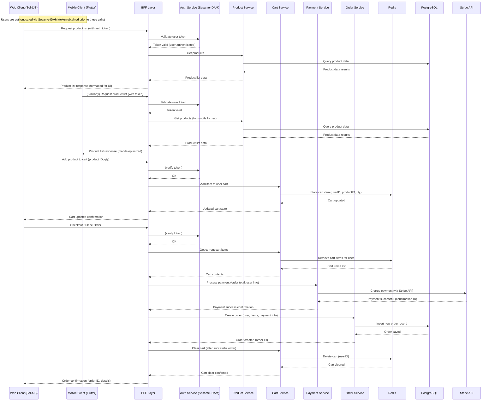

Implementing a BFF Architecture in a Microservices E-commerce System

What is a BFF and Why Use It in This Scenario

The Backend-for-Frontend (BFF) is a microservice architecture pattern that creates a layer between backend systems and frontend applications . Instead of having a one-size-fits-all API for every client, each client (web, mobile, etc.) can have its own specialized backend. This pattern addresses the challenge of serving diverse client applications by providing dedicated backends for each type of client, optimizing performance and reducing client-side complexity . In practice, a BFF works by exposing a tailored API for a specific user interface or device, then internally calling the necessary microservices to gather and shape data as needed .

Below is a sequence diagram that visualizes this end-to-end user journey, capturing the interactions between the Web client, Mobile client, BFF, backend services, database, cache, and external systems:

In a microservices-based e-commerce system with multiple frontends (SolidJS web app and Flutter mobile app), using a BFF offers clear advantages. Often, the raw data from various microservices (Products, Orders, Customers, etc.) is not formatted in the exact way the frontend needs . Without a BFF, the frontends would have to orchestrate multiple API calls and perform data transformations locally (in the browser or mobile device), which increases complexity and uses more client resources . A BFF shifts some of this burden to an intermediate server layer: when the frontend needs something, it calls an API on the BFF, which in turn calls the relevant microservices, aggregates or reformats the data, and returns exactly what the UI requires . This means minimal business logic on the frontend and a streamlined, optimized payload for each request, improving the user experience and performance .

Importantly, different clients have different needs and constraints. For example, a mobile app might require smaller payloads and fewer round trips due to bandwidth and latency concerns, while a web app can afford to receive richer or more verbose data. The BFF pattern lets us cater to these differences. Each frontend gets only the data and functionality it needs, nothing more. This leads to better performance (no unnecessary data over the network) and a simpler frontend implementation . In fact, real-world adopters like Airbnb and Netflix use separate BFF services to ensure, for instance, that mobile clients get lighter, faster responses and web clients receive more detailed data where appropriate . In our scenario, the SolidJS web frontend and the Flutter mobile app could either share a BFF with conditional logic or have distinct BFF services – either way, each client interface’s requirements are met without bloating the other.

Finally, a BFF can improve security and user experience. By interposing an extra layer, the BFF can filter out or hide sensitive data from responses and enforce security measures tuned to each client  . Error handling can also be improved – the BFF can translate backend errors into user-friendly messages or handle partial failures gracefully without exposing raw errors to users . Overall, introducing a BFF in this e-commerce system helps decouple the frontend from the complexity of the microservices, letting each evolve independently while ensuring optimal data delivery to the user  .

Architectural Layout of BFF with Frontends and Microservices

In this e-commerce architecture, the BFF layer sits between the client applications and the myriad of backend microservices. Both the SolidJS web client and the Flutter mobile client will make API calls to the BFF (rather than calling microservices directly). The BFF then communicates with the appropriate backend services – for example, the Product Service for product data, Cart Service for shopping cart operations, Order Service for order processing, and Payment Service for payment transactions. This is illustrated conceptually as each frontend interacting only with its own BFF API, which in turn calls into the microservice layer . The BFF acts as an aggregation and translation layer: it preprocesses and combines data from various services, presenting it in the exact format the frontend expects . This way, the frontend is shielded from the complexity and granularity of the internal APIs.

Centralized authentication and authorization are handled by the Sesame-IDAM service (Identity and Access Management). In practice, this means the BFF will integrate with Sesame for verifying user identity and permissions. For example, when a client includes an access token (issued by Sesame) in a request, the BFF can validate this token – potentially by calling Sesame’s introspection endpoint or using Sesame’s public keys to verify a JWT – before proceeding. Since all authorization is centralized in Sesame, the BFF does not implement its own complex auth logic; instead it acts as a gatekeeper, ensuring only authenticated requests with valid tokens reach the microservices . We can even extend the BFF to handle the login flow: the web or mobile app could be redirected to Sesame for login, and Sesame would issue a token that the BFF uses on subsequent calls. With the BFF pattern, it’s sensible to handle user auth on the server side – the BFF can manage user sessions or tokens and attach a valid bearer token to any downstream service requests on behalf of the user  . In our system, Sesame-IDAM serves as the identity provider; the BFF trusts Sesame to authenticate users and may forward tokens to downstream calls (so each microservice can also verify or extract user info as needed).

Data flow and storage: Microservices remain responsible for the heavy lifting and data persistence. The Product Service might query a PostgreSQL database to retrieve product catalog information. The Cart Service could use Redis as a fast in-memory store for the user’s shopping cart (carts are often transient and benefit from quick read/write). The Order Service would likely persist orders and related data to PostgreSQL for durability. The Payment Service, integrated with Stripe, handles payment processing – it may call Stripe’s APIs to create charges or payment intents, and could store transaction records in PostgreSQL as well. The BFF orchestrates all these calls. For instance, a single frontend request (like “checkout now”) can trigger the BFF to call multiple services in sequence: verify user auth via Sesame, get cart details from Redis via the Cart Service, charge the payment through the Payment Service/Stripe, and create an order in Postgres via the Order Service. The BFF aggregates the results or errors from these steps and returns one cohesive response to the client. This orchestration means the frontends don’t need to coordinate multiple calls or maintain complex state – the BFF coordinates the workflow among services.

It’s worth noting that this BFF layer is conceptually similar to an API Gateway, but domain-specific. In many implementations, you would create one BFF per client application . For example, a “Web BFF” service could handle requests from the SolidJS app, and a separate “Mobile BFF” service could handle Flutter app requests. This allows each to evolve and optimize independently (perhaps the mobile BFF merges certain endpoints or omits fields to save bandwidth, whereas the web BFF might provide more detailed endpoints). In our discussion, we refer to the BFF layer for simplicity – but one could deploy two Rust BFF services, one for web and one for mobile, each interfacing with the same set of backend microservices. The architectural layout remains the same: the clients talk only to their BFF, and the BFF(s) talk to the internal services. This isolation also improves reliability: if the mobile BFF encounters an issue, it doesn’t directly impact the web BFF, and vice versa, since each is a separate service instance .

In summary, the architecture looks like:
•	Frontends (Web and Mobile) ←→ BFF Layer ←→ Microservices (Product, Cart, Order, Payment, etc.) ←→ Databases/Cache (PostgreSQL, Redis).
•	Sesame-IDAM (Auth Service) is invoked by the BFF as needed for authentication/authorization checks, and Stripe is invoked by the Payment Service for payment processing. The BFF stands in the center of all these, ensuring each client gets a unified, simplified view of the backend.

Pros and Cons of Using a BFF in this Microservice Setup

Using a BFF architecture in our Rust-based microservice e-commerce platform brings a variety of benefits, along with some trade-offs. Below are the key pros and cons specific to this setup:

Pros:
•	Tailored APIs for Each Client: The BFF can present client-specific endpoints that return exactly the data each frontend needs, reducing over-fetching and under-fetching. For example, the mobile app’s BFF endpoints can deliver compact responses (only essential fields), whereas the web app’s endpoints can include additional product details for a richer interface. This optimizes network usage and performance for each platform . As noted, each client gets only relevant data and functionality, which improves speed and user experience across devices .
•	Reduced Frontend Complexity: With BFF handling data formatting and aggregation, the frontends (SolidJS and Flutter) become simpler. They no longer need to contain complex logic to call multiple microservices or transform the raw data. The BFF can call all necessary services and combine the results before responding. This means lighter frontend code and less client-side processing, which is especially beneficial for mobile devices with limited resources . In short, the BFF provides a well-focused interface for the frontend, so the clients can just render data without heavy computation .
•	Optimized Backend Interactions: The BFF can reduce chattiness between frontend and backend. Rather than a client making, say, five HTTP calls to different services (products, inventory, pricing, cart, etc.), it can make a single call to the BFF, which internally makes those calls (often concurrently) and composes a single response. This not only lowers latency (one round-trip instead of many) but also decreases the load on client networks (important for mobile) and consolidates error handling. This pattern of aggregating multiple microservice calls into one improves efficiency and ensures the user sees all needed data together .
•	Isolation and Independent Evolution: By introducing a BFF layer, each frontend and its backend interface can evolve independently of others. The web team can change their BFF’s logic or response formats without affecting the mobile app’s BFF. The microservices themselves can also evolve behind the scenes – as long as the BFF adapts to those changes, the clients don’t need to know. This fosters a separation of concerns that can aid in scaling development. Different teams can own the web BFF and mobile BFF, working in parallel on features specific to each channel . It also means reliability is segmented: the availability of one client interface is decoupled from another (an issue in one BFF doesn’t take down the whole system) .
•	Enhanced Security and Control: The BFF acts as a controlled gateway to backend services. It can enforce additional security checks or data filtering per client. For instance, if certain internal data should never be exposed to the mobile app, the mobile BFF can strip it out (even if the microservice provides it). Also, sensitive operations can be wrapped in extra verification if needed. Because the BFF sits server-side, it’s harder for malicious users to bypass security compared to code running on the client. The architecture also reduces the API surface area exposed to the outside world – clients only talk to the BFF, not directly to every microservice, which can minimize potential attack vectors . In our scenario, having Sesame-IDAM integrated at the BFF means we ensure centralized authorization checks on each request before any backend action is taken. This central point of entry helps maintain consistent security measures (tokens, roles, etc.) across the many services.
•	Better User Experience (Consistency and Error Handling): The BFF can consolidate errors or inconsistencies from the backend and handle them gracefully. For example, if one of the microservices is slow or down, the BFF could return a partial response or a friendly error message rather than failing outright. It could also use cached data to respond (perhaps serving slightly stale product info from Redis if the Product Service is unavailable) to avoid total failure . By managing these aspects on the server side, users get a more seamless experience (fewer weird errors or half-loaded pages). Consistency is also improved because the BFF can ensure that data coming from different services conforms to a unified schema or naming convention that the frontend expects.

Cons:
•	Increased Architectural Complexity: Introducing a BFF means adding another service (or multiple services) to the system, which adds complexity. Each BFF needs to be developed, deployed, and maintained. In our case, if we have one BFF for web and one for mobile, that’s two additional components. This extra layer means more moving parts that can fail or need updates, monitoring, scaling, etc. . Teams must manage this complexity, ensuring the BFF itself is reliable and doesn’t become a single point of failure for the frontends.
•	Higher Maintenance Overhead: Because the BFF is tightly coupled to its frontend’s needs, any changes in the frontend (e.g. new UI features requiring new data) or in the microservices (e.g. a service API changes) may require updates to the BFF. If the same business logic or data is needed by both web and mobile, you might end up implementing it in two places (each BFF) unless you factor it out. This can lead to duplication of code or logic across BFFs . Keeping multiple BFFs in sync with core business rules or API changes can be challenging. Developers need to coordinate changes and possibly update several codebases when microservice contracts change, which increases effort and the chance of inconsistencies .
•	Performance Overhead and Latency: A BFF adds an extra network hop and processing step for each request. In a worst-case scenario, this could introduce latency if not optimized. For example, a poorly implemented BFF that calls microservices serially or that does heavy processing could slow down responses. There is also the overhead of serialization/deserialization at the BFF. While usually negligible compared to network calls, it’s something to consider. If the BFF is not carefully designed (e.g., if it becomes a large monolithic gateway doing too much), it could become a bottleneck. Proper use of async and parallel calls can mitigate this, but it’s a factor to watch – the BFF must be efficient to avoid adding noticeable delay to user requests .
•	Scalability Considerations: Each BFF service has to scale according to the load from its respective client. On big shopping events (say a Black Friday sale), if the web traffic spikes, the Web BFF needs to handle that surge. This may require independent scaling infrastructure. Managing the scaling and performance of multiple BFFs (web, mobile, etc.) can be complex, as each might have different usage patterns . Additionally, if multiple BFFs all depend on a single microservice heavily (e.g., Product Service), that backend could become a shared bottleneck (“service fuse” problem ). We need to ensure the backend can handle aggregated load coming from all BFFs.
•	Potential for Logic Duplication: As mentioned, having separate backends per frontend can lead to implementing similar features twice. For example, both web and mobile BFFs might need a “place order” flow, leading to parallel implementations. If not managed, this duplicates effort and can introduce divergence (the two might behave slightly differently). It requires discipline and possibly shared libraries or common modules to avoid drifting logic . Some solutions include factoring common code into a crate or library that both Rust BFF services use, but that adds complexity in itself.
•	Dependency on BFF Availability: When a frontend is tightly coupled to its BFF, an outage in the BFF means the frontend effectively cannot function (even if all the underlying microservices are healthy). In our setup, if the BFF goes down, the clients have no fallback path to get data (because direct calls to microservices are not designed or may be blocked). So the BFF is a critical component that must be highly available. While it limits blast radius to that one frontend (the mobile app BFF outage wouldn’t directly affect the web app, for example), it’s still a single point of failure for each channel. Proper redundancy and failover planning are needed to mitigate this risk.

Despite these challenges, many of the cons can be managed with good engineering practices (as we’ll discuss in Best Practices). The key is that the benefits (better UX, decoupling, and performance) often outweigh the added complexity for scenarios like ours where multiple distinct clients consume a broad set of microservices. Next, we’ll look at how to implement the BFF effectively in Rust, leveraging those benefits while mitigating the downsides.

Best Practices for Implementing the BFF in Rust

Implementing a BFF in Rust can be highly effective, given Rust’s performance and reliability, but it requires careful design. Here are some best practices and considerations for building the BFF layer in Rust for our system:
•	Keep BFF Logic Lightweight and Focused: The BFF should not replicate the business logic of the underlying services. Instead, it should focus on orchestrating calls and transforming data for the frontend . Given that our CPU-intensive business rules run in the Rust microservices, the BFF’s role is to delegate those tasks to the appropriate service and then combine results. In practice, this means if the frontend needs to show an “Order Confirmation” page, the BFF might call the Order Service and Payment Service and then merge their outputs, but it wouldn’t, say, calculate pricing or perform authorization checks itself. This separation ensures the BFF remains a thin layer; it’s easier to maintain and less prone to become a bottleneck.
•	Use an Async Rust Web Framework: Leverage Rust’s modern web frameworks that are designed for asynchronous, high-performance IO. Two of the most popular choices are Actix Web and Axum, which are both mature, production-grade frameworks in 2025. Actix Web, in particular, is considered one of the fastest and most established Rust web frameworks , and Axum is a newer but very ergonomic and tower-compatible framework. These frameworks make it straightforward to define HTTP endpoints for the BFF and handle requests concurrently. They integrate with Tokio (Rust’s async runtime) so that calls to backend services (e.g., HTTP requests to microservice APIs or database queries) are all non-blocking. Using such a framework ensures the BFF can handle many simultaneous requests efficiently — crucial when it’s the entry point for all client traffic. In our scenario, we could create a Rust web server (with Actix Web or Axum) that defines routes like /products, /cart, /checkout, etc., each route handler then calls the necessary internal services.
•	Robust HTTP Client and Protocols: For calling the internal microservices, use a reliable async HTTP client (like Reqwest or Actix’s built-in client) or gRPC client if the services expose gRPC endpoints. Rust’s strong type system is beneficial here: you can define data models that match the microservices’ request/response schemas (using serde to serialize/deserialize JSON, for instance) ensuring compile-time checks on data shapes. If the microservices publish OpenAPI specs or gRPC proto files, consider generating Rust client bindings for them – this reduces manual coding and keeps the BFF in sync with service interfaces. The BFF should also implement timeouts and retries when calling microservices: you wouldn’t want a slow downstream service to hang the BFF indefinitely. Using futures, the BFF can even call multiple services in parallel (e.g., fetch product info and price from two services concurrently) to minimize latency.
•	Integrate Authentication & Authorization Middleware: Since Sesame-IDAM is our auth provider, the BFF should enforce auth on incoming requests. A common pattern is to have a middleware in the BFF that intercepts requests, checks for a valid JWT or session token, and verifies it. In Rust, crates like jsonwebtoken (for JWT verification) or oauth2 (for handling OAuth/OIDC flows) can be used. Best practice is to validate the token’s signature and claims (expiration, audience, etc.) using Sesame’s public keys or via an introspection endpoint, and reject requests that are not authorized. The BFF can decode the token to get the user’s identity and roles/permissions, which might be needed to decide if the user can perform an action. For example, if an “admin” role is required to access a certain backend service, the BFF can check the user’s roles in their token before calling that service. Implementing these checks at the BFF ensures consistent security before touching any core service . Moreover, as part of the BFF Security Pattern, the BFF could handle user login by redirecting to Sesame and storing the resulting token (often via an HTTP-only cookie or in-memory session) . However, even if login is handled entirely by Sesame (e.g., via OAuth redirect from the client), the BFF must validate tokens on each request. Keep Sesame’s base URL and credentials (if using client credentials to introspect) configurable, and ensure to forward authentication info downstream – for instance, include the user’s JWT or an internal auth header when calling microservices, so those services know who is making the request (they might do their own auth check or use the info for authorization decisions).
•	Caching and Rate Limiting: Introduce caching in the BFF layer to improve performance and resilience. Since we have Redis in our tech stack, the BFF can use it to cache frequently requested data or responses. For example, product catalog data that doesn’t change often could be cached so that repeated requests (from many users browsing the same popular product) don’t always hit the Product Service or database. This can reduce load on backend services and lower latency for the user . Another use of caching is to handle failure scenarios gracefully: if the Product Service is temporarily down, the BFF might return a cached copy of product info (with an indication that data might be stale) instead of an error, as a form of graceful degradation . Implement caching with appropriate TTLs to ensure data consistency and avoid serving very stale information. Alongside caching, implement rate limiting on the BFF endpoints . This prevents abuse (accidental or malicious) from overwhelming the microservices. For instance, a user could be limited to X requests per second for certain expensive operations. There are Rust crates (like tower::limit or custom middleware) that can handle rate limiting. By enforcing this at the BFF, you protect the downstream services (like Stripe or the Order Service) from traffic spikes, and you can return a friendly “Too Many Requests, slow down” response when limits are exceeded.
•	Error Handling and Circuit Breakers: A robust BFF should anticipate that some downstream calls may fail. Implement error handling logic that can aggregate errors from multiple services and decide what to do. For example, if the Cart Service call fails during checkout, should the whole operation abort with an error, or can we proceed to charge payment and then let the user know the cart couldn’t be cleared? These decisions depend on use-case, but the code should handle each call’s Result/Option gracefully and not simply panic. Consider using a circuit breaker pattern or at least timeouts to avoid cascading failures: if a downstream service is known to be failing or slow, the BFF could short-circuit further attempts for a short period (returning an error or cached data immediately) instead of hanging every time. Rust’s reliability makes it a good fit for implementing these resilience patterns (e.g., using libraries or writing your own stateful logic for retries/backoff). Logging such failures with context (service name, operation, user ID involved) is important for debugging.
•	Logging, Monitoring, and Tracing: Treat the BFF as a first-class component in observability. Enable structured logging in the BFF (with frameworks like tracing or log crates) to record each incoming request and the outcome of calls to microservices. Include correlation IDs – for instance, generate a request ID for the external request and pass it to microservices (via an HTTP header) so that logs in the BFF and logs in the microservices can be correlated. Because BFF orchestrates multiple calls, implementing distributed tracing (using something like OpenTelemetry) is extremely useful: it would allow you to visualize a single user request’s path through the BFF into, say, the Product and Order services, and see where time is spent. This can help pinpoint performance bottlenecks or failures quickly. Monitoring metrics should be in place as well (requests per second, error rates, latency percentiles for each endpoint, etc.), so you can scale the BFF or address issues proactively. In Rust, libraries like metrics combined with exporters (Prometheus, etc.) can be used to record such metrics.
•	Scalability and Deployment: The BFF service(s) should be stateless (or as close to stateless as possible) to allow easy horizontal scaling. Avoid storing session state in-memory on one instance; instead rely on Sesame tokens for stateless auth or use Redis for shared session/cache if needed. This way, you can run multiple instances of the BFF behind a load balancer to handle increasing load or to provide high availability. Use containers (Docker) and orchestration (Kubernetes or similar) to deploy the BFF just like your other microservices. Because our entire backend stack is in Rust, the BFF will nicely fit into the same deployment pipelines and benefit from Rust’s small footprint and speed. Also remember to configure proper TLS (HTTPS) for communication with clients (and even between BFF and microservices if within zero-trust networks), especially since sensitive data (personal info, payment details) may flow through the BFF. Terminating TLS at the BFF or at a reverse proxy in front of it is essential for security.
•	Shared Code and Consistency: To avoid the duplication pitfall when having multiple BFFs, identify common logic or data models that both the web and mobile BFF might use, and factor them into a shared library/crate. For example, if both BFFs need to format a product listing response, that formatting code could live in a shared module. Be cautious to not over-couple them, but sharing utility code (like request validators, response mappers, or client code for calling microservices) can ensure consistency. Also maintain consistent API design principles across the BFFs (even though they’re separate services): use similar naming conventions, error handling approaches, and versioning strategies so that your overall platform feels coherent. While each BFF is tailored for a specific frontend, core patterns of accessing microservices and formatting data should remain consistent to avoid confusion and reinventing the wheel .

Following these best practices, a Rust-based BFF will remain efficient, secure, and maintainable. It will truly serve its purpose as a thin but powerful layer between the user interface and the microservice ecosystem, enabling the frontends to deliver a great user experience without compromising the decoupled nature of the backend.

Example User Flow: Placing an Order via the BFF

To illustrate how all these pieces come together, let’s walk through a realistic mock flow of a user placing an order on the e-commerce platform, from product selection to checkout and payment. This flow will involve the web or mobile client, the BFF, and multiple backend services (Product, Cart, Order, Payment, etc.), as well as the auth and storage components:
1.	Product Browsing: The user opens the app (web or mobile) and views a list of products. The client (SolidJS or Flutter) calls the BFF’s /products endpoint (e.g., via HTTP GET) to retrieve products. This request carries the user’s authentication token (issued by Sesame-IDAM) in the headers.
•	The BFF receives the request and first validates the auth token (it could call the Sesame Auth Service to ensure the token is valid or decode a JWT to verify signature and expiration). Assuming the token is valid, the BFF then calls the Product Service (perhaps an internal REST API like /api/products) to fetch the product list or details.
•	The Product Service queries its PostgreSQL database to get the latest product info (names, prices, stock, descriptions, etc.). The data is returned to the BFF.
•	The BFF may perform some lightweight transformation – for example, filtering out any fields not needed by the UI or combining data if it had to call multiple services (in this simple case, maybe not). It then sends the product data back to the client in the response. The user sees the list of products or product details on their screen.
2.	Adding Item to Cart: The user decides to add a product to their cart. The frontend triggers an API call to the BFF’s /cart endpoint (e.g., an HTTP POST to /cart/items) with the product ID (and desired quantity).
•	The BFF (again) ensures the user is authenticated (it can reuse the validated token from before or re-verify quickly). It then calls the Cart Service – for instance, a POST to /api/cart/{userId}/items – including the user’s ID (derived from the token) and the product ID & quantity in the request.
•	The Cart Service updates the user’s cart. Internally, the Cart Service might use Redis as a storage for cart data. For example, it could store a hash or list in Redis under a key like cart:{userId} with the item IDs and quantities. Writing to Redis is very fast. The Cart Service might also query Product Service or a pricing service to validate item price or availability, but in our scenario we’ll assume it trusts that the item can be added. It then returns a confirmation or the updated cart contents.
•	The BFF receives the response from Cart Service. It might merge this with product info (if the cart service only returned IDs and quantities, the BFF could call Product Service to get item names/prices for display). Alternatively, the Cart Service might already return enough info. The BFF responds to the client confirming the item is in the cart (often the updated cart state is sent so the UI can show the cart contents).
3.	Initiating Checkout: The user proceeds to the checkout page. The client calls a BFF endpoint like GET /cart to fetch the current cart contents for review, and the BFF forwards this to the Cart Service (which reads from Redis and returns the list of items in the cart with their quantities). The BFF passes the cart data back to the frontend for display. Now the user clicks “Place Order” or “Checkout” which triggers the main checkout flow via the BFF (say a POST request to /order/checkout). This is the critical step involving payment.
•	The BFF receives the checkout request. It likely performs another auth check (ensuring the user token is valid and perhaps that the user has the necessary role or is not banned, etc., via Sesame). It then proceeds to orchestrate the order transaction. A typical sequence is: first charge the payment, then create the order. So the BFF calls the Payment Service to initiate a payment with Stripe. This call could include details like the user’s ID, the order total amount, and maybe a payment method token (if the frontend provided one or if one is on file). In many implementations, the frontend might have already collected payment details via Stripe’s SDK and exchanged them for a payment token; in that case, the BFF just sends that token and amount to the Payment Service.
•	The Payment Service interacts with Stripe. It might call Stripe’s API (e.g. creating a charge or a Payment Intent) using Stripe credentials on the server side. Stripe processes the payment (which could involve contacting the user’s bank, etc.). We assume the payment is approved. Stripe returns a success response (perhaps a transaction ID or confirmation). The Payment Service records the outcome (it could log the transaction in its own database or just rely on Stripe’s records) and sends a success status back to the BFF. (If Stripe reported a failure – insufficient funds, card declined – the Payment Service would relay that, and the BFF would likely abort the order process and inform the user to retry or use a different method. For this flow, we’ll assume success.)
•	Upon payment success, the BFF now calls the Order Service to actually create the order in the system. This might be a POST to /api/orders with a payload containing the user’s ID, shipping address, and the list of items (product IDs and quantities) that the user is purchasing, along with the payment confirmation info (transaction ID). The Order Service, in turn, will perform its tasks: it might generate a new order ID, calculate the final order record, and store it in PostgreSQL (orders table, order_items table, etc.). It could also publish an event or send an email, but those are beyond our current scope. The Order Service might also call the Product Service or an Inventory Service to decrement stock for the purchased items – but since such a service isn’t explicitly in our list, we’ll assume the Order service handles stock update in the same database or via a separate internal call. Once the order is saved to the database, the Order Service responds to the BFF with an acknowledgment, typically including the new Order ID and details.
4.	Completing the Order: Now the BFF has successfully charged the user and recorded the order. It can send a response back to the client confirming that the order was placed. This response may include the order number and a summary of the order (items, total paid, expected delivery, etc.). At this point, the user’s purchase is completed. As a cleanup step, the BFF (or Order Service) might instruct the Cart Service to clear the user’s cart in Redis, since those items have been checked out. For instance, the BFF could call DELETE /api/cart/{userId} to empty the cart. This ensures that if the user navigates back to the cart, it’s now empty (or contains any items they didn’t purchase if we allowed partial checkout). The Cart Service would delete the Redis key for that cart or mark it as cleared. This step is optional but a good practice to keep data consistent. Finally, the BFF would not include cart data in the order confirmation response (or it might explicitly say cart is now empty).

Throughout this flow, the Sesame-IDAM Auth Service is involved in the background to verify tokens on each request, and Stripe is involved during payment processing. PostgreSQL is used for durable data (products, orders, etc.) and Redis is used for ephemeral fast data (carts, possibly session tokens or cached content). The BFF coordinates all these interactions.

