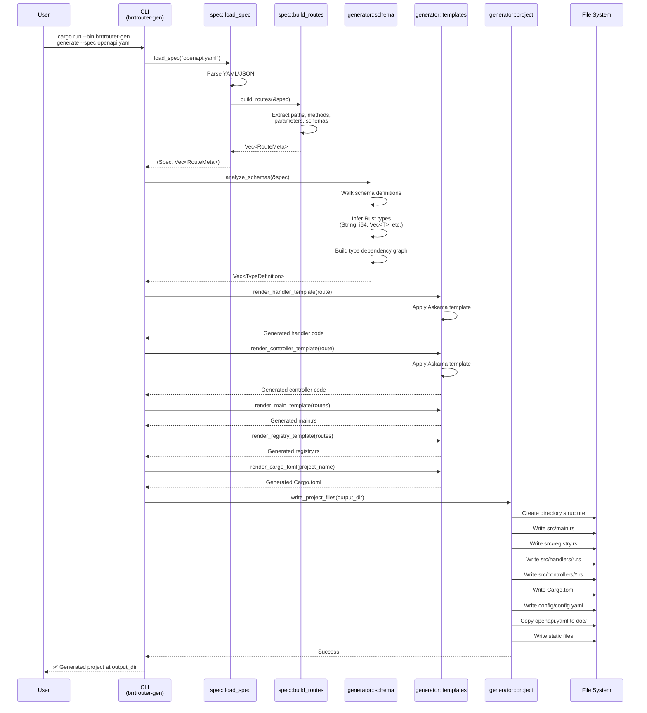
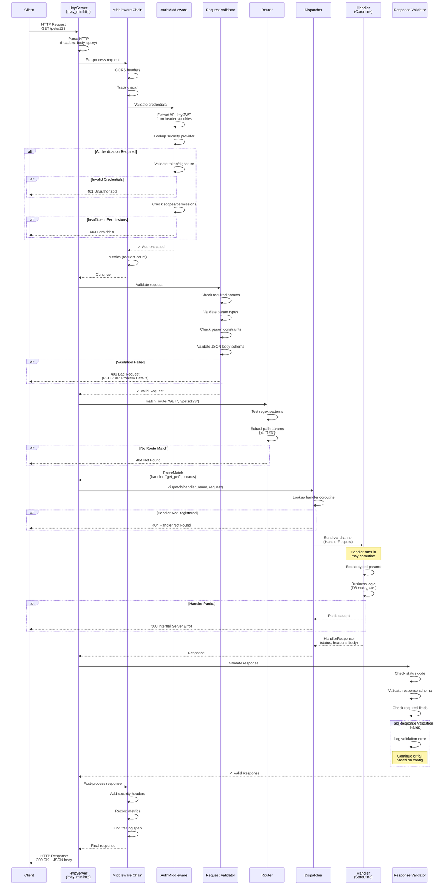

# BRRTRouter Architecture

This document provides detailed architectural diagrams and explanations of how BRRTRouter works.

## Table of Contents

- [Overview](#overview)
- [Code Generation Flow](#code-generation-flow)
- [Request Handling Flow](#request-handling-flow)
- [Key Components](#key-components)
- [Architectural Patterns](#architectural-patterns)

## Overview

BRRTRouter is a high-performance, OpenAPI-driven HTTP router for Rust that uses coroutines for efficient concurrency. The architecture consists of two main workflows:

1. **Code Generation** - Transforms OpenAPI specs into runnable Rust services
2. **Request Handling** - Processes HTTP requests through a layered architecture

## Code Generation Flow

The code generator reads an OpenAPI specification and produces a complete, production-ready service with handlers, controllers, and configuration.



### Code Generation Steps

1. **Specification Loading** (`spec::load_spec`)
   - Reads OpenAPI YAML/JSON file
   - Validates specification structure
   - Returns parsed `Spec` object

2. **Route Building** (`spec::build_routes`)
   - Extracts all path + method combinations
   - Captures parameters (path, query, header)
   - Extracts request/response schemas
   - Determines handler names from `operationId`
   - Returns vector of `RouteMeta` objects

3. **Schema Analysis** (`generator::schema`)
   - Walks OpenAPI schema definitions
   - Infers corresponding Rust types
   - Builds type dependency graph
   - Generates struct/enum definitions
   - Handles references and nested types

4. **Template Rendering** (`generator::templates`)
   - Applies Askama templates with route metadata
   - Generates handler stubs with typed parameters
   - Generates controllers that call handlers
   - Generates main.rs with routing setup
   - Generates registry for handler registration

5. **Project Writing** (`generator::project`)
   - Creates directory structure
   - Writes all generated source files
   - Copies OpenAPI spec to output
   - Writes configuration files
   - Formats generated code with `rustfmt`

### Generated Project Structure

```
my-service/
├── Cargo.toml              # Dependencies
├── config/
│   └── config.yaml         # Security & HTTP config
├── doc/
│   ├── openapi.yaml        # API specification
│   └── openapi.html        # Rendered docs
├── static_site/
│   └── index.html          # Landing page
└── src/
    ├── main.rs             # Service startup
    ├── registry.rs         # Handler registration
    ├── handlers/
    │   ├── mod.rs
    │   └── *.rs            # One per operation
    └── controllers/
        ├── mod.rs
        └── *.rs            # One per operation
```

## Request Handling Flow

When a request arrives at a running BRRTRouter service, it flows through multiple validation and processing layers before reaching the handler.



### Request Processing Layers

1. **HTTP Server** (`server::HttpServer`)
   - Accepts incoming TCP connections
   - Parses HTTP/1.1 protocol
   - Extracts headers, query parameters, body
   - Built on `may_minihttp`

2. **Middleware Chain** (`middleware::*`)
   - **CORS Middleware** - Adds CORS headers, handles preflight
   - **Tracing Middleware** - Starts distributed tracing spans
   - **Auth Middleware** - Validates credentials and permissions
   - **Metrics Middleware** - Collects request/response metrics
   - Executed in order, can short-circuit

3. **Authentication** (`security::SecurityProvider`)
   - Extracts credentials from request (headers, cookies, query)
   - Looks up appropriate security provider (API key, JWT, OAuth2)
   - Validates credentials against provider
   - Checks scopes and permissions
   - Returns 401/403 on failure

4. **Request Validation** (`validator`)
   - Validates required parameters are present
   - Checks parameter types match OpenAPI spec
   - Validates parameter constraints (min, max, pattern)
   - Validates JSON body against schema
   - Returns RFC 7807 Problem Details on failure

5. **Routing** (`router::Router`)
   - Tests request path against compiled regex patterns
   - Extracts path parameters from matched pattern
   - Returns `RouteMatch` with handler name and params
   - Returns 404 if no route matches

6. **Dispatching** (`dispatcher::Dispatcher`)
   - Looks up handler coroutine by name
   - Sends request via MPSC channel to handler
   - Waits for response from handler
   - Catches handler panics and returns 500

7. **Handler Execution** (user code)
   - Runs in lightweight `may` coroutine
   - Extracts typed parameters from request
   - Executes business logic (DB queries, etc.)
   - Returns typed response

8. **Response Validation** (`validator`)
   - Validates response status code
   - Validates response body against schema
   - Checks required fields are present
   - Logs validation errors (fail or continue based on config)

9. **Middleware Post-Processing**
   - Adds security headers
   - Records final metrics
   - Ends tracing spans
   - Returns final response to client

## Key Components

### Router
- **Purpose**: Match incoming requests to handlers
- **Implementation**: Regex-based path matching
- **Performance**: O(n) where n = number of routes
- **Key Operations**: Compile patterns, match paths, extract params

### Dispatcher
- **Purpose**: Route requests to handler coroutines
- **Implementation**: MPSC channels for communication
- **Concurrency**: Each handler runs in its own coroutine
- **Error Handling**: Catches panics, returns 500 errors

### Middleware
- **Purpose**: Cross-cutting concerns (auth, metrics, tracing)
- **Implementation**: Chain of responsibility pattern
- **Ordering**: CORS → Tracing → Auth → Metrics → Handler
- **Flexibility**: Composable, can short-circuit

### Security Providers
- **Purpose**: Authenticate and authorize requests
- **Implementations**: 
  - `StaticApiKeyProvider` - Simple key validation
  - `BearerJwtProvider` - JWT signature validation
  - `OAuth2Provider` - OAuth2 token validation
- **Extensibility**: Implement `SecurityProvider` trait

### Validator
- **Purpose**: Ensure requests/responses match OpenAPI spec
- **Request Validation**: Parameters, body schema
- **Response Validation**: Status codes, body schema
- **Error Format**: RFC 7807 Problem Details

## Architectural Patterns

### 1. OpenAPI-Driven Development
- **Single Source of Truth**: OpenAPI spec defines all routes, types, validation
- **Code Generation**: Automatic handler scaffolding from spec
- **Runtime Validation**: Requests/responses validated against spec
- **Documentation**: API docs generated from spec

### 2. Coroutine-Based Concurrency
- **Runtime**: `may` coroutine library (not tokio/async-std)
- **Lightweight**: Coroutines cheaper than OS threads
- **Stack Size**: Configurable via `BRRTR_STACK_SIZE` env var
- **Isolation**: Each handler runs in isolated coroutine

### 3. Channel-Based Communication
- **Pattern**: MPSC channels for dispatcher ↔ handler
- **Benefits**: Lock-free, fast, type-safe
- **Flow**: Request in → handler processes → response out
- **Error Handling**: Channels handle disconnection gracefully

### 4. Middleware Chain
- **Pattern**: Chain of responsibility
- **Composability**: Mix and match middleware as needed
- **Ordering**: Matters! CORS first, metrics last
- **Short-Circuiting**: Middleware can stop chain (e.g., 401 auth failure)

### 5. Fail-Fast Validation
- **Philosophy**: Validate early, fail fast
- **Benefits**: Don't waste resources on invalid requests
- **Layers**: Parameter validation → Body validation → Business logic
- **Error Responses**: Clear, actionable error messages (RFC 7807)

### 6. Template-Based Generation
- **Tool**: Askama template engine
- **Consistency**: All generated code follows same patterns
- **Customization**: Modify templates to change output
- **Maintenance**: Single template updates all generated code

## Performance Considerations

### Routing
- O(n) route matching where n = number of routes
- Regex compilation happens once at startup
- Path parameter extraction uses regex captures

### Dispatching
- Lock-free MPSC channels
- Minimal per-request allocation
- Coroutine context switch overhead

### Validation
- JSON schema validation has overhead
- Can be disabled in production (not recommended)
- Caching can reduce repeated validations

### Concurrency
- Coroutines more efficient than OS threads
- Stack size × concurrent requests = memory usage
- Tune stack size based on handler complexity

## Security Model

### Authentication
- Multiple providers supported (API key, JWT, OAuth2)
- Extracted from headers, cookies, or query params
- Validated before request reaches handler

### Authorization
- Scope-based permissions (OAuth2)
- Custom authorization via security providers
- Fail with 403 if insufficient permissions

### Validation
- All input validated against OpenAPI spec
- Path traversal protection for static files
- JSON schema validation for request bodies

## Extension Points

### Custom Middleware
Implement the `Middleware` trait:
```rust
impl Middleware for CustomMiddleware {
    fn handle(&self, req: &mut Request, res: &mut Response) -> bool {
        // Your logic here
        true // Continue chain
    }
}
```

### Custom Security Providers
Implement the `SecurityProvider` trait:
```rust
impl SecurityProvider for CustomProvider {
    fn validate(&self, scheme: &SecurityScheme, scopes: &[String], req: &SecurityRequest) -> bool {
        // Your validation logic
        true
    }
}
```

### Custom Templates
Modify templates in `templates/` directory to customize generated code.

## Resources

- [OpenAPI 3.1 Specification](https://spec.openapis.org/oas/v3.1.0)
- [May Coroutine Library](https://github.com/Xudong-Huang/may)
- [RFC 7807 Problem Details](https://tools.ietf.org/html/rfc7807)
- [Askama Template Engine](https://github.com/djc/askama)

