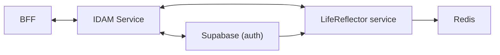
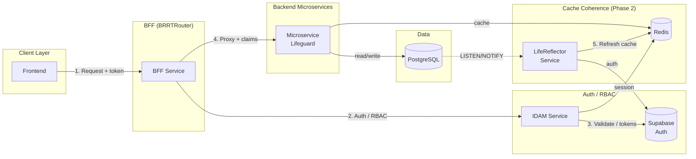
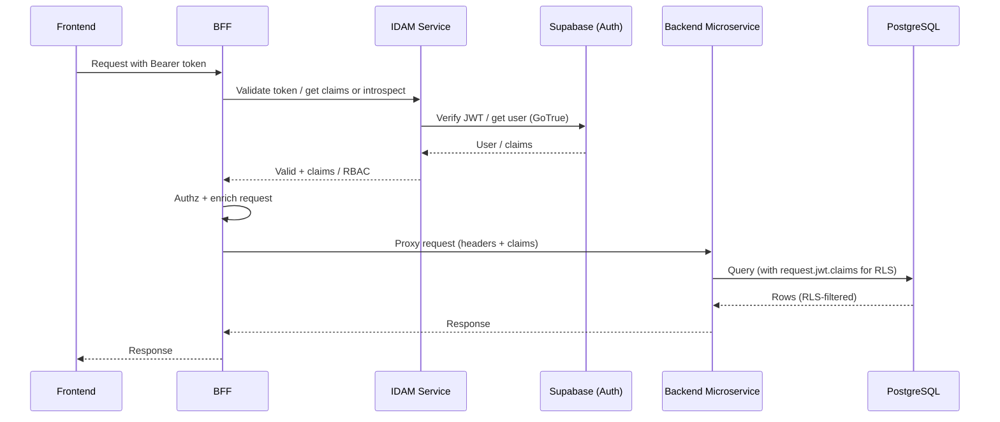
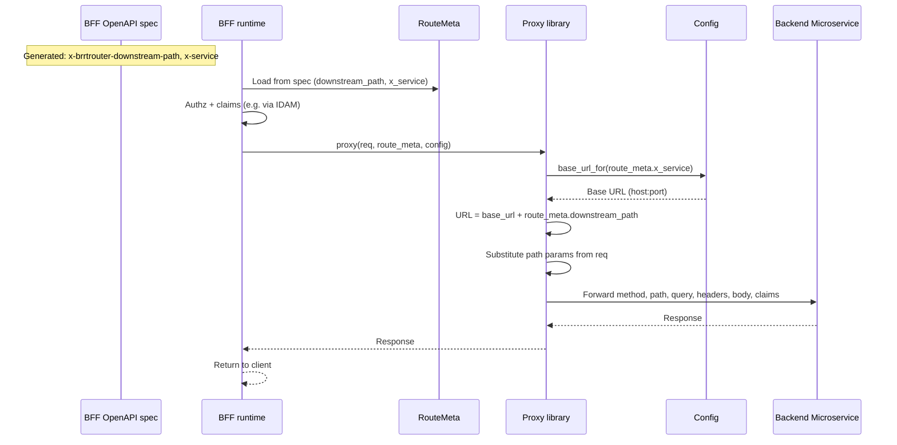
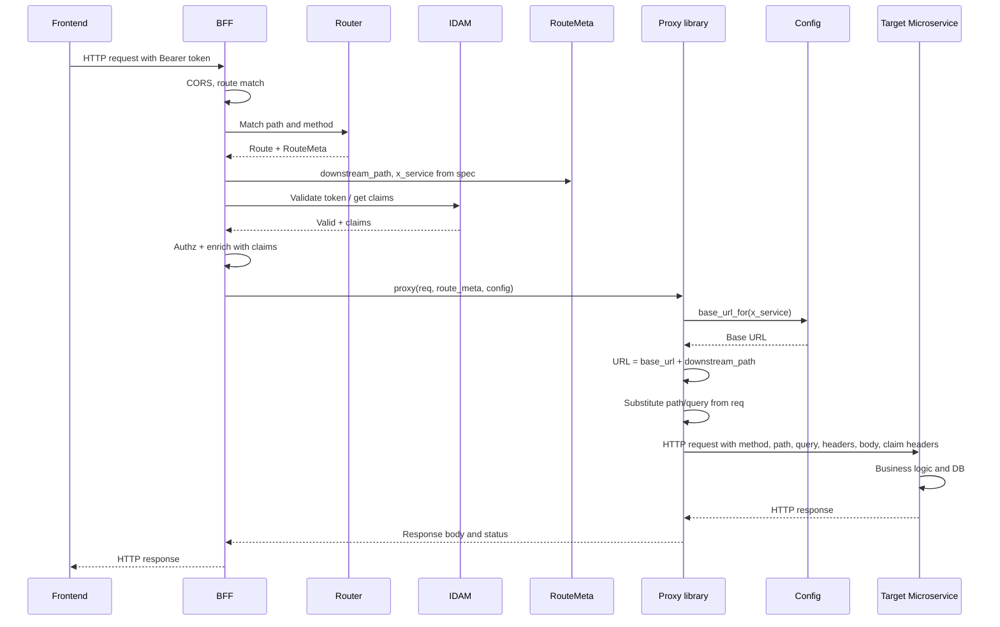
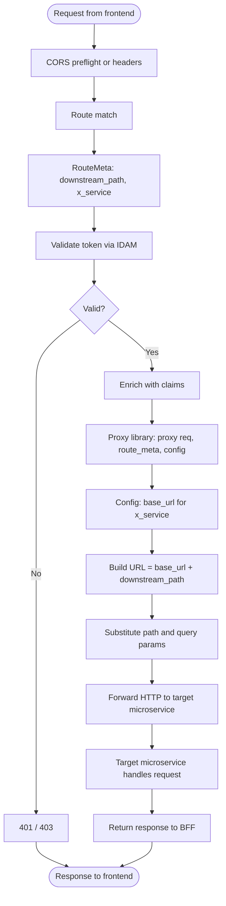
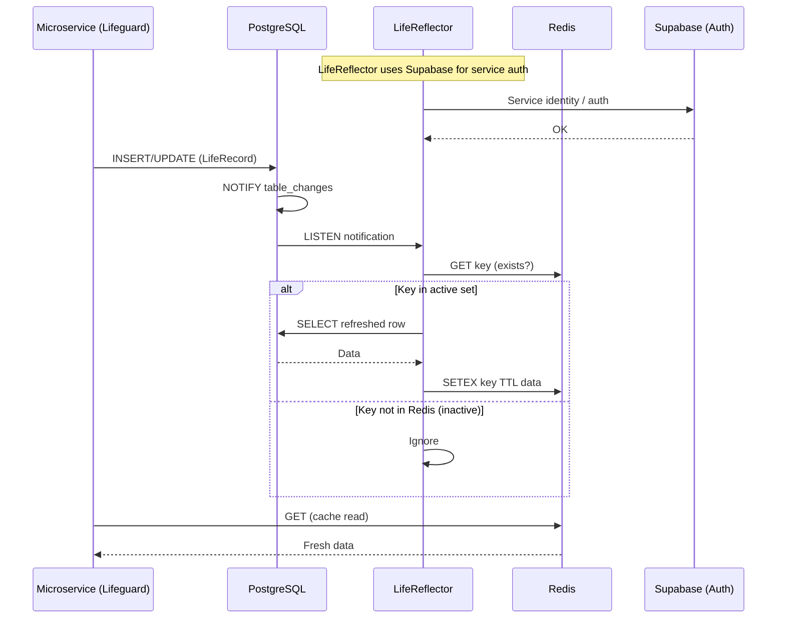
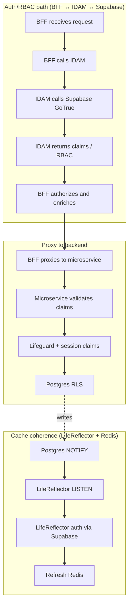

# BFF Proxy Analysis: BRRTRouter, OpenAPI, Claims, and RERP BFF

**Purpose:** Deep-dive analysis to enable BRRTRouter to support BFF proxy behaviour **out of the box**, so consumers do not have to build authz, CORS, IDAM claims, downstream enrichment, and response proxying themselves. **No code changes**—analysis and recommendations only, for user review before implementation.

**Stack choice (initial):** Auth and RBAC go through **IDAM**, which uses **Supabase** for auth (BFF does **not** talk to Supabase directly). Backend microservices use **Lifeguard** for DB access and must **validate claims** and use that **metadata in entities/requests to the DB** for **row-based access** (e.g. Postgres RLS). **LifeReflector** is a separate service (Postgres LISTEN/NOTIFY → Redis for cache coherence; see `../lifeguard-reflector/README.md`) and is **not** part of the initial implementation—it will be added as a **future phase** at the end of this process.

**Auth/RBAC and cache flow (target):**

- **BFF ↔ IDAM ↔ Supabase:** All auth/RBAC requests: BFF calls IDAM; IDAM calls Supabase GoTrue (and optionally Redis for sessions). No direct BFF–Supabase.
- **LifeReflector:** Standalone microservice for distributed cache coherence (Postgres LISTEN/NOTIFY → Redis). It uses Supabase for its own service auth and Redis for cache state. It sits in the data layer used by microservices (Lifeguard), not in the BFF–IDAM auth path. **LifeReflector is a future implementation**—see Implementation phasing below.

**Implementation phasing:**  
- **Initial implementation (Phase 1):** BFF, IDAM ↔ Supabase auth/RBAC, spec-driven proxy to backend microservices, Lifeguard with claims/row-based access. **No LifeReflector**—microservices may use Redis or direct Postgres as today.  
- **Later (Phase 2):** Add **LifeReflector** at the end of this process for distributed cache coherence (Postgres LISTEN/NOTIFY → Redis). All BFF and backend flows described in this document work without LifeReflector; LifeReflector is an optional enhancement to the data/cache layer.

**References:**
- BRRTRouter: `docs/ARCHITECTURE.md`, `docs/ADRS/002-BFF-Implementations-for-microservices.md`, `src/server/service.rs`, `src/dispatcher/core.rs`, `src/security/mod.rs`, `src/spec/types.rs`, `src/typed/core.rs`, `OPENAPI_3.1.0_COMPLIANCE_GAP.md`
- RERP: `openapi/accounting/bff-suite-config.yaml`, `tooling/src/rerp_tooling/bff/generate_system.py`, `microservices/accounting/bff/impl/`, `entities/` (Lifeguard), `docs/BFF_COMPONENT_DESIGN_PROPOSAL.md`, `docs/IDAM_ARCHITECTURE_ANALYSIS.md`
- IDAM: `idam/README.md`, `idam/common/src/supabase.rs` (Supabase GoTrue client); **IDAM strategy (general vs per-system):** [IDAM Microscaler Analysis](IDAM_MICROSCALER_ANALYSIS.md); **IDAM core + extension and BFF usage:** [IDAM Design: Core and Extension](IDAM_DESIGN_CORE_AND_EXTENSION.md)
- Lifeguard: `lifeguard/README.md`, `lifeguard/src/connection.rs`, `lifeguard/src/pool/` (no session/claims support today)
- LifeReflector: `../lifeguard-reflector/README.md` (cache coherence microservice; **future implementation**, not in Phase 1)

---

## 1. Desired BFF Behaviour (Target)

When a component is a **BFF**, it should:

| # | Capability | Description |
|---|------------|-------------|
| 1 | **Authz** | Authorize the incoming request (e.g. validate JWT / API key before proceeding). |
| 2 | **CORS** | Handle CORS (preflight and response headers) so frontends can call the BFF. |
| 3 | **Custom claims from IDAM** | Obtain custom claims from an IDAM endpoint (not only from the validated JWT payload). |
| 4 | **Enrich downstream** | Call the backend microservice with claims/RBAC so only permitted data is requested. |
| 5 | **Proxy response** | Receive the backend response and return it to the requester (no hand-written proxy in each handler). |

The goal is that **BRRTRouter (and/or generated code)** provides this pipeline so the consumer does not have to implement it per-route.

---

## 2. Auth/RBAC and LifeReflector: Request Flow and Architecture

Auth and RBAC are **not** done by the BFF talking directly to Supabase. The BFF talks to **IDAM**; IDAM talks to **Supabase** for auth. **LifeReflector** is a separate microservice (cache coherence: Postgres LISTEN/NOTIFY → Redis); it is documented here for completeness but is **not** part of the initial implementation—it will be added as a **future phase** at the end of the process (see Implementation phasing above).

### 2.1 Auth/RBAC and cache flow (high-level)

- **1.** Frontend sends request (with token) to BFF.
- **2.** BFF calls IDAM for auth/RBAC (validate token, get claims/roles).
- **3.** IDAM uses Supabase (GoTrue) for auth; optionally Redis for sessions.
- **4.** BFF proxies to backend microservice with enriched claims; **proxy target path and service key come from the BFF spec** (`x-brrtrouter-downstream-path`, `x-service` in `RouteMeta`), host from config—minimal Askama logic. Microservice uses Lifeguard and optionally Redis cache.
- **5.** *(Future)* LifeReflector listens to Postgres NOTIFY, refreshes Redis (cache coherence); LifeReflector authenticates to Supabase for its own service identity. **Phase 1 is implemented without LifeReflector.**

### 2.2 Sequence: BFF auth and proxy to backend

### 2.2b Sequence: Spec-driven proxy (RouteMeta from spec, minimal Askama)

When the BFF OpenAPI spec is generated from downstream services, **downstream path and service key** are added to the spec at generation time. BRRTRouter reads them into `RouteMeta`; the proxy library builds the URL from config + `RouteMeta`—no per-route URL logic in Askama.

**Summary:** Downstream path lives in the **spec** (set at BFF spec generation); host/port come from **config**. Askama only generates a thin call to the proxy library; the library uses `RouteMeta` + config only.

### 2.2c BFF logic and downstream request flow

End-to-end view of how the BFF handles a request and calls the target microservice: from receipt through auth, RouteMeta, proxy library, HTTP to the backend, and response back.

**Sequence diagram: BFF logic and request to target microservice**

**Flowchart: BFF request flow (receive to response)**

**Summary:** Request hits BFF → CORS and route match → RouteMeta (from spec) and auth (IDAM) → if valid, proxy library builds URL from config + RouteMeta and forwards to the target microservice → BFF returns the microservice response to the frontend.

### 2.3 Sequence: LifeReflector (cache coherence, not in BFF auth path) — *Future implementation*

LifeReflector is **not** part of the initial rollout. The following diagram describes the **future** behaviour when LifeReflector is added at the end of the process. Phase 1 implements BFF, IDAM, proxy, and Lifeguard without LifeReflector.

### 2.4 Flow chart: Where auth runs vs where cache runs

**Summary:** BFF never talks to Supabase directly for auth; it always goes through IDAM. LifeReflector (**future phase**) is in the data/cache layer (Postgres NOTIFY → Redis) and uses Supabase for its own service auth; it is not part of the BFF–IDAM auth path. **Initial implementation is without LifeReflector.**

---

## 3. Current State

### 3.1 BRRTRouter

**Request flow (ARCHITECTURE.md):**  
Middleware (CORS, metrics, auth) → route match → security validation → request validation → dispatcher → handler → response validation.

**Authz:**  
- Security is driven by OpenAPI `security` and `securitySchemes`.  
- For routes with security, the server builds a `SecurityRequest` (headers, etc.), looks up the provider for the scheme, and calls `provider.validate()`.  
- On success, **JWT claims** are obtained via `provider.extract_claims(scheme, &sec_req)` and passed into the dispatcher as `jwt_claims` (`service.rs` ~1282–1313).

**CORS:**  
- Implemented in middleware.  
- Route-level behaviour from OpenAPI `x-cors` (inherit / disabled / custom).  
- Origins from config (e.g. `config.yaml`), not from the spec.

**Claims:**  
- **Source today:** Decoded JWT payload only.  
- `HandlerRequest` has `jwt_claims: Option<Value>` (`dispatcher/core.rs`).  
- Handlers can read claims and forward them (e.g. as headers) to downstream—**but there is no built-in HTTP client or proxy**.  
- All “call backend” logic would be **hand-written** in each handler.

**Proxy / downstream:**  
- **No** generated proxy.  
- **No** OpenAPI-driven “downstream URL” or “proxy target” in BRRTRouter.  
- `RouteMeta` (`spec/types.rs`) has security, CORS policy, request/response schema, parameters, `base_path`, `sse`, `x_brrtrouter_stack_size`, etc. **No** `downstream_url`, `x-brrtrouter-proxy`, or similar.

**Summary:**  
BRRTRouter already does **authz** (validate token) and **CORS**, and exposes **JWT claims** to handlers. It does **not** do: custom claims from a separate IDAM endpoint, built-in downstream HTTP call, or generated proxy-and-return response.

### 3.2 OpenAPI Spec and BFF/Proxy Extensions

**BRRTRouter today:**  
- Vendor extensions used: `x-cors`, `x-brrtrouter-stack-size`, `x-brrtrouter-body-size-bytes`, `x-handler-*`, `x-sse`.  
- **No** `x-brrtrouter-proxy`, `x-brrtrouter-downstream`, or operation-level server URL for proxy target.

**RERP BFF spec (generate_system.py):**  
- Writes **per-operation** `x-service` and `x-service-base-path` when merging sub-services (e.g. `x-service: invoice`, `x-service-base-path: /api/v1/accounting/invoice`).  
- So the BFF spec **does** carry “which backend service” and “path prefix” for each operation.  
- **Not** in the spec: full downstream URL, host, or port.  
- **BRRTRouter** does **not** read `x-service` or `x-service-base-path`; they are not in `RouteMeta` or `spec/build.rs`.

**OPENAPI_3.1.0_COMPLIANCE_GAP.md §8 (BFF generator):**  
- When a BFF spec is produced by bff-generator and consumed by BRRTRouter: if `components.parameters`, `components.securitySchemes`, or root `security` are missing/not merged, params or auth can be dropped or missing.  
- Recommendation: extend bff-generator to merge those (and/or inject security metadata) so the BFF spec works with BRRTRouter security.

**Summary:**  
OpenAPI has no standard “proxy target”; RERP adds `x-service` / `x-service-base-path` but BRRTRouter does not use them. There is no spec-level “this route is a proxy to that URL” in BRRTRouter today.

### 3.3 Claims and IDAM

**Claims in BRRTRouter:**  
- **Only from validated JWT:** `extract_claims()` returns the decoded token payload (e.g. JWKS bearer, SPIFFE).  
- **No** “fetch custom claims from an IDAM HTTP endpoint” (e.g. introspection or a dedicated “claims” API).  
- So “custom claims from an IDAM endpoint” is **not** implemented; it would require a new integration (e.g. call IDAM after token validation and merge/filter claims).

**IDAM (RERP docs):**  
- IDAM is an HTTP microservice (e.g. JWT, sessions, Supabase GoTrue).  
- BFF is expected to validate tokens (e.g. JWKS or IDAM introspection) and possibly forward token/claims downstream.  
- Custom claims from a **separate** IDAM endpoint are not specified in the analysed IDAM doc; the BFF pattern in ADR 002 is “validate token, forward token or claims”.

**Summary:**  
- Today: claims = JWT payload only.  
- Gap: “Custom claims from an IDAM endpoint” would need either a new SecurityProvider extension or a dedicated “claims enrichment” step that calls IDAM and merges into the context passed to handlers.

### 3.4 RERP BFF Setup and “Mirroring” Downstream

**Config (`bff-suite-config.yaml`):**  
- Defines suite (e.g. `accounting`), BFF service name (`bff`), and **per-service** `base_path`, `port`, `spec_path` (e.g. `general-ledger`: base_path `/api/general-ledger`, port 8001).  
- So “which backend and on which port” is in **config**, not in the OpenAPI spec.

**BFF spec generation (`generate_system.py`):**  
- Discovers sub-services under `openapi/{system}/{service}/openapi.yaml`.  
- Merges paths/schemas with prefixing; adds `x-service` and `x-service-base-path` on each operation.  
- **Does not** yet write a single **exact downstream path** (e.g. `x-brrtrouter-downstream-path` = `base_path + path`) or downstream URL/host into the BFF spec; adding it at generation time would enable spec-driven proxy with minimal Askama (§5.2).  
- RERP’s **accounting** BFF spec is generated from a different flow (e.g. `openapi.yaml` under accounting) and contains the same `x-service` / `x-service-base-path` pattern.

**BFF service implementation (e.g. `microservices/accounting/bff/impl/`):**  
- **gen/** is BRRTRouter-generated (routes, handlers, types).  
- **impl/** controllers are **stubs**: they return example/hardcoded responses (e.g. `get_invoice.rs` returns a fixed `Response`).  
- **No** `reqwest` or other HTTP client; **no** proxy to backend microservices in the analysed controllers.  
- So the BFF “mirrors” the API surface (same paths/schemas as the aggregated spec) but **does not implement proxying**—that would have to be added by hand in each handler.

**Summary:**  
- BFF spec = aggregated paths + schemas + `x-service` + `x-service-base-path`.  
- BFF config = base_path + port per backend.  
- BRRTRouter does not read `x-service`/`x-service-base-path` or config to build a downstream URL.  
- Current BFF impl = stub handlers; no generated proxy.

---

## 4. Gaps (Summary)

| Gap | Description |
|-----|-------------|
| **G1. No generated proxy** | Handlers are stubs; there is no BRRTRouter-generated “forward request to backend and return response”. |
| **G2. No spec-driven proxy target** | RouteMeta has no downstream path or proxy flag; BRRTRouter does not read `x-service`/`x-service-base-path` or `x-brrtrouter-downstream-path`. Recommended: BFF generator adds `x-brrtrouter-downstream-path` (exact path on downstream) at merge time; BRRTRouter reads it into RouteMeta so proxy library can build URL from config + RouteMeta (minimal Askama). |
| **G3. Downstream URL not in spec** | RERP config has host/port per service; the BFF spec has only path prefix. Building the full downstream URL would require either spec extension (e.g. `x-brrtrouter-downstream-url` or use of `x-service` + config) or convention. |
| **G4. Custom claims from IDAM** | Claims today = JWT payload only. “Custom claims from an IDAM endpoint” (e.g. extra roles/permissions) is not implemented. |
| **G5. Enrich downstream with RBAC** | No built-in step to “enrich the downstream call with the claims that the user’s RBAC permits”; that would be handler logic today. |
| **G6. BFF generator / security merge** | OPENAPI_3.1.0_COMPLIANCE_GAP §8: BFF spec may lack `components.parameters` / `securitySchemes` / `security`; needs bff-generator or merge so BRRTRouter auth works. |

**Gaps for Auth/RBAC (BFF ↔ IDAM ↔ Supabase) and Lifeguard row-based access at microservices (see §6–§7):**

| **G7. BFF ↔ IDAM for auth** | BFF must validate tokens and obtain RBAC via IDAM (IDAM talks to Supabase); BRRTRouter has no built-in "call IDAM for auth/claims" integration. |
| **G8. BFF ↔ IDAM for RBAC** | RBAC (custom claims in JWT from Supabase Auth Hooks, or IDAM "get roles" API) must be available to BFF via IDAM; no framework integration today. |
| **G9. Claims in typed handlers** | `TypedHandlerRequest<T>` does not expose `jwt_claims`; backend microservice handlers using typed API cannot access claims unless the generated `Request` type includes them (it does not today). |
| **G10. Lifeguard + request-scoped claims** | Lifeguard has no support for setting Postgres session variables (e.g. `request.jwt.claims`) per request; row-based access via RLS requires claims in the DB session. |
| **G11. Microservice claims validation** | Backend microservices must validate claims (e.g. JWT or signed headers from BFF) and use that metadata for DB access; no standard “validate forwarded claims and bind to Lifeguard” flow. |

---

## 5. Recommendations (Options for Implementation)

**No code is proposed here;** these are directions for when you decide to implement.

### 5.1 Authz and CORS

- **Keep as-is.** BRRTRouter already does authz (security validation) and CORS. Ensure BFF specs include `securitySchemes` and `security` (via bff-generator or merge) so that authz is applied.

### 5.2 Spec and RouteMeta for Proxy

**Spec-driven downstream mapping (recommended):**  
Because the BFF OpenAPI spec is **generated** from the downstream service specs, we can add **at generation time** the exact downstream path and service key. That fits the existing “full path enrichment” used for request/response validation and keeps proxy logic out of Askama as much as possible.

- **At BFF spec generation (e.g. RERP `generate_system.py` or bff-generator):**
  - For each operation, the generator already has the **path** from the sub-service (e.g. `/invoices/{id}`) and the **base_path** for that service (e.g. `/api/invoice` from `bff-suite-config`).
  - Add a single extension that carries the **exact path on the downstream service** (path only, no host), e.g. `x-brrtrouter-downstream-path: "/api/invoice/invoices/{id}"` = `base_path + path` (normalized).
  - Keep (or add) `x-service` (e.g. `invoice`) so the runtime can resolve **host/port** from config (e.g. map `x-service` → base URL from `bff-suite-config` or app config).
  - No need to encode full URL in the spec; host is deployment-specific and comes from config.

- **In BRRTRouter (`RouteMeta` / spec build):**
  - Read `x-brrtrouter-downstream-path` and `x-service` from the operation and add them to `RouteMeta` (e.g. `downstream_path: Option<String>`, `x_service: Option<String>`).
  - Proxy runtime then builds: **URL = config.base_url_for(route_meta.x_service) + route_meta.downstream_path**, with path params substituted from the request. No Askama logic to build paths per route.

- **Benefits:**
  - **Minimal Askama:** Generated BFF handlers can be a thin call to a library (e.g. `brrtrouter::bff::proxy(req, route_meta, config)`). The library uses `RouteMeta` + config only; no per-route URL construction in templates.
  - **Single source of truth:** Downstream path is defined once at BFF spec generation and reused for both validation and proxying.
  - **Consistent with existing enrichment:** Same pattern as other spec-driven metadata (e.g. path enrichment for validation).

### 5.2a Kubernetes deployment and service addressing

BRRTRouter is designed for deployment in **Kubernetes**. The BFF spec carries only the logical service key (`x-service`) and downstream path (`x-brrtrouter-downstream-path`); the **service address** (host/port or base URL) is resolved at runtime from config and is deployment-specific.

| Concern | Guidance |
|--------|----------|
| **BFF → microservice** | Config maps `x-service` (e.g. `invoice`) to a **K8s Service** base URL, e.g. `http://invoice-service.bff-backend.svc.cluster.local:80`. BFF→microservice traffic stays **cluster-internal**; no ingress in the path. |
| **K8s Service DNS** | Use `<service>.<namespace>.svc.cluster.local:<port>` (or short form `<service>.<namespace>:<port>` within the cluster). Same `x-service` key in the spec; different base URL per environment (dev: localhost, prod: K8s service). |
| **Ingress** | The BFF is typically exposed to **clients** via a K8s Ingress (or LoadBalancer). Microservices are **not** usually exposed via ingress to the BFF—internal calls use K8s service URLs. If a microservice is intentionally reached via an ingress host (e.g. shared API gateway), config can set that base URL for the corresponding `x-service`. |
| **Config shape** | Config (e.g. `config.yaml` under a `bff.downstream_services` section) maps service key → base URL. Story 2.2 defines and documents this; it must support K8s service URLs and optionally ingress/external hosts. |

**Summary:** Same BFF spec and RouteMeta; config supplies the appropriate base URL per environment (localhost, K8s service, or ingress). No change to RouteMeta or spec extensions—only config and documentation for K8s and ingress.

**Other options (for comparison):**

- **Option A – Use existing RERP extensions only:**  
  - In BRRTRouter, read `x-service` and `x-service-base-path` from the operation and add them to `RouteMeta`.  
  - Downstream path would be computed at runtime as `base_path + request.path` (or from path_pattern). Works but duplicates path logic in runtime; spec-driven `x-brrtrouter-downstream-path` is clearer and avoids mismatches.

- **Option B – New BRRTRouter extension (full URL):**  
  - Define e.g. `x-brrtrouter-proxy: true` and `x-brrtrouter-downstream-url: "http://backend/host"` (or a reference to a named backend).  
  - Less ideal for generated BFF specs: host/port are deployment-specific and usually come from config, not the spec.

- **Option C – Convention + config:**  
  - No new spec fields; config lists backends by name/URL. Handlers receive route name (or operationId) and look up backend from config.  
  - More flexible per deployment but no spec-driven path; path building stays in code or templates.

### 5.3 Generated Proxy Logic

- **Recommended – Library + RouteMeta (minimal Askama):**  
  - With spec-driven downstream mapping (§5.2), for operations that have `x-brrtrouter-downstream-path` (and `x-service`) in `RouteMeta`, the generated handler is a thin wrapper: e.g. `brrtrouter::bff::proxy(req, route_meta, config)`.  
  - The **library** (in BRRTRouter or a BFF support crate) builds the downstream URL from `config.base_url_for(route_meta.x_service)` + `route_meta.downstream_path`, substitutes path/query from `req`, forwards method/headers/body, injects claims headers if configured, and returns the backend response.  
  - Askama does **not** build URLs or paths; it only passes `RouteMeta` and `HandlerRequest` into the library. This minimises template logic.

- **Option B – Library in BRRTRouter:**  
  - Provide a `brrtrouter::bff::proxy_to_backend(req, downstream_url, claims)` (or similar) so that hand-written BFF handlers can one-line the proxy call.  
  - No generated proxy; each handler still exists but delegates to the library.

- **Option C – Hybrid:**  
  - Generator emits a proxy handler that calls the same library with `RouteMeta` + `HandlerRequest`. Same as recommended; all behaviour stays in the library.

### 5.4 Custom Claims from IDAM

- **Option A – New SecurityProvider or “claims enrichment” step:**  
  - After JWT validation, call an IDAM endpoint (e.g. “get claims for this token”) and merge result into `HandlerRequest` (e.g. `custom_claims: Option<Value>` or extend `jwt_claims`).  
  - Configuration: IDAM base URL, endpoint path, and possibly headers (e.g. forward `Authorization`).

- **Option B – Handler-level:**  
  - Handlers that need custom claims call IDAM themselves using a shared client.  
  - No framework change; more duplication and less consistent behaviour.

### 5.5 Enrich Downstream with RBAC

- **Option A – In generated proxy / library:**  
  - When building the downstream request, add headers (or a small payload) derived from `jwt_claims` and/or `custom_claims` (e.g. `X-User-Id`, `X-Roles`, `X-Permissions`).  
  - Backend is responsible for interpreting these for RBAC.

- **Option B – Configurable “claim → header” mapping:**  
  - OpenAPI extension or config lists which claims to forward and under which header names.  
  - Proxy/library applies this mapping so the downstream call is “enriched” without hard-coding in each handler.

### 5.6 BFF Generator (RERP / bff-generator)

- **Merge components and security:**  
  - Ensure BFF spec includes `components.parameters`, `components.securitySchemes`, and root `security` when the BFF is protected (see OPENAPI_3.1.0_COMPLIANCE_GAP §8).  
  - Either extend RERP’s `generate_system.py` (or the standalone bff-generator) to merge these from sub-specs or from a suite-level config.

- **Emit spec-driven proxy extensions:**  
  - When merging sub-services, for each operation set **`x-brrtrouter-downstream-path`** = exact path on the downstream service (path only), e.g. `base_path + path` normalised (e.g. `/api/invoice/invoices/{id}`).  
  - Keep (or add) **`x-service`** (e.g. `invoice`) so BRRTRouter can resolve host/port from config.  
  - BRRTRouter then reads these into `RouteMeta`; generated BFF handlers call the proxy library with `RouteMeta` + config—no Askama path logic.

---

## 6. BFF ↔ IDAM ↔ Supabase (Target and Gaps)

**Target:** The BFF does **not** talk to Supabase directly. The BFF talks to **IDAM** for auth and RBAC; IDAM talks to **Supabase** (GoTrue) for auth. The BFF must be able to call IDAM for token validation and role/permission data so it can authorize requests and enrich downstream calls. Whether IDAM is a shared Microscaler service or a per-system implementation is analysed in [IDAM Microscaler Analysis](IDAM_MICROSCALER_ANALYSIS.md); the BFF contract described here applies in either case.

### 6.1 Current State

**IDAM and Supabase GoTrue (microscaler/idam):**
- IDAM is an HTTP microservice that wraps **Supabase GoTrue**.
- `idam/common/src/supabase.rs`: `SupabaseClient` calls GoTrue for `sign_in_with_password`, `refresh_token`, `logout` (async, reqwest).
- Apps (e.g. BFF) are intended to call **IDAM** over HTTP, not Supabase directly; IDAM returns JWTs issued via GoTrue.
- BRRTRouter has **no** Supabase or GoTrue-specific SecurityProvider; validation today is generic JWT (e.g. JWKS bearer) or API key / SPIFFE.

**Supabase RBAC:**
- Supabase supports custom claims via **Auth Hooks** (e.g. add `user_role` to the JWT at issuance); RLS policies can then use `request.jwt.claim('user_role')` (or `auth.uid()`).
- Alternatively, RBAC can be implemented by a separate API (e.g. “get roles/permissions for user”) that the BFF calls.
- There is **no** BRRTRouter integration that “talks to Supabase” for auth or for fetching RBAC.

### 6.2 Gaps (Summary)

| Gap | Description |
|-----|-------------|
| **BFF ↔ IDAM auth** | BFF must validate tokens and obtain RBAC via IDAM (IDAM calls Supabase GoTrue). BRRTRouter can validate JWT with JWKS bearer provider if the token is issued by the same issuer IDAM uses; no built-in "call IDAM for validate/introspect" integration. |
| **BFF ↔ IDAM RBAC** | BFF needs role/permission data for authorization and for enriching downstream. Options: (1) custom claims in JWT (Auth Hooks); (2) call Supabase/IDAM “get user roles” (or similar) after validation. Neither is built into BRRTRouter today. |
| **IDAM as BFF auth backend** | If BFF delegates auth to IDAM (which calls GoTrue), BFF can use BRRTRouter JWT validation with JWKS from the same issuer IDAM uses; no change. If BFF must call IDAM for “introspect token” or “get claims”, that is a custom claims-enrichment step (see §5.4). |

### 6.3 Recommendations (Options)

- **Validate JWT at BFF:** Use BRRTRouter’s existing JWKS bearer SecurityProvider with the same issuer IDAM/Supabase uses (e.g. Supabase project JWKS URL). BFF does **not** call Supabase directly; tokens are issued via IDAM → Supabase. Ensure BFF OpenAPI has `securitySchemes` and `security` so auth runs.
- **RBAC from JWT claims:** Use Supabase Auth Hooks (via IDAM) to add roles/permissions to the JWT; BFF reads `HandlerRequest::jwt_claims` (and forwards to downstream). No new framework code if claims are in the token.
- **RBAC from IDAM API:** Add a “claims enrichment” step after validation that calls IDAM (e.g. “get user metadata / roles”) and merges into request context (see §5.4).

---

## 7. Microservices: Lifeguard and Row-Based Access (Target and Gaps)

**Target:** Backend microservices use **Lifeguard** for DB access. They must (1) **validate claims** that arrived in the request (e.g. from BFF via headers or JWT), and (2) use that **metadata in entities/requests to the DB** so that **row-based access** is enforced (e.g. Postgres RLS using `request.jwt.claims` or equivalent).

### 7.1 Current State

**Lifeguard (microscaler/lifeguard):**
- Coroutine-native ORM for Postgres (`may_postgres`); used by RERP entities (`rerp-entities`).
- Provides `LifeguardPool`, connection pooling, LifeModel/LifeRecord, raw SQL; **no** concept of “per-request claims” or “session variables for RLS”.
- No API to set `request.jwt.claims` (or similar) on a connection before running queries.

**BRRTRouter and claims in handlers:**
- `HandlerRequest` has `jwt_claims: Option<Value>`; it is set when security is validated (e.g. JWT).
- **TypedHandlerRequest&lt;T&gt;** does **not** expose `jwt_claims`; it has `method`, `path`, `handler_name`, `path_params`, `query_params`, and `data: T`. The generated `Request` type in RERP (from `HandlerRequest` via `TryFrom`) does **not** include claims. So backend microservice handlers using the typed API **do not** receive claims unless they use raw `HandlerRequest` or the generated type is extended.

**Row-based access in Postgres (Supabase-style):**
- RLS policies can use `current_setting('request.jwt.claims', true)::json` or Supabase’s `auth.uid()` / `request.jwt.claim('key')`. For that to work, the session must have `request.jwt.claims` set (e.g. `SELECT set_config('request.jwt.claims', '<json>', true);`) before running queries. Lifeguard does not set this.

### 7.2 Gaps (Summary)

| Gap | Description |
|-----|-------------|
| **Claims in typed handlers** | Microservice handlers using `TypedHandlerRequest<Request>` do not get `jwt_claims`; the typed request type does not include it. Either extend `TypedHandlerRequest` to expose claims (e.g. `jwt_claims: Option<Value>`) or add claims to the generated `Request` type. |
| **Lifeguard + request-scoped claims** | To enforce row-based access, each request’s DB usage must run with the correct `request.jwt.claims` (or equivalent) in the Postgres session. Lifeguard has no “with_claims” or “set_session_claims” API; connections are not request-scoped. |
| **Validate forwarded claims** | Backend must trust only validated claims (e.g. verify JWT or signed header from BFF). Today microservices can use BRRTRouter security to validate a JWT and get claims; if BFF forwards claims in headers, the microservice needs a way to validate those (e.g. verify signature or HMAC). |

### 7.3 Recommendations (Options)

- **Expose claims to typed handlers:** Add `jwt_claims: Option<Value>` to `TypedHandlerRequest<T>` (or a separate “context” passed to handlers), or extend the generator to include a `claims` field in the generated Request type so handlers can read and use claims.
- **Lifeguard: set session claims per use:** Add an API (e.g. “execute with session claims”) that, for the duration of a query or transaction, runs `set_config('request.jwt.claims', claims_json, true)` on the connection (or uses a request-scoped connection wrapper). This allows RLS policies that read `current_setting('request.jwt.claims', true)::json` to enforce row-based access.
- **Microservice auth model:** (1) **JWT at microservice:** Microservice validates the same JWT (e.g. Supabase) and gets claims in `HandlerRequest::jwt_claims`; then passes claims into Lifeguard session when doing DB work. (2) **BFF forwards claims in headers:** Microservice validates a signed header (e.g. `X-User-Id`, `X-Claims` with HMAC) and maps to session claims; no JWT at microservice. Either way, a single pattern (“validate → bind claims to DB session”) should be documented and, where possible, provided by shared code or Lifeguard.

---

## 8. Document Status

- **Scope:** Analysis only; no code changes.  
- **Next step:** Review this document; then decide which options (spec extension, generated proxy vs library, IDAM claims, RBAC enrichment, BFF ↔ IDAM ↔ Supabase auth, Lifeguard + claims for row-based access) to implement first.  
- **Implementation phasing:** **Phase 1** = BFF, IDAM ↔ Supabase, spec-driven proxy, Lifeguard + claims/row-based access; **no LifeReflector**. **Phase 2** = add LifeReflector (cache coherence) at the end of the process.
- **References:** BRRTRouter architecture and ADR 002, OPENAPI_3.1.0_COMPLIANCE_GAP §8 and §11, RERP BFF config and generator, RERP BFF impl stubs, IDAM and Supabase GoTrue (idam), [IDAM Microscaler Analysis](IDAM_MICROSCALER_ANALYSIS.md) (general vs per-system IDAM), Lifeguard ORM, LifeReflector (lifeguard-reflector/README.md; future), TypedHandlerRequest (typed/core.rs).
- **Auth flow (corrected):** BFF **never** talks to Supabase directly; BFF ↔ IDAM ↔ Supabase for auth/RBAC. LifeReflector is a **future** separate service (Supabase auth, Redis cache coherence); see §2 for sequence and flow diagrams. Initial implementation is without LifeReflector.
- **Enrichment:** §6 covers BFF ↔ IDAM ↔ Supabase; §7 covers microservices using Lifeguard to validate claims and enforce row-based access. Gaps G7–G11 summarise the additional work.
