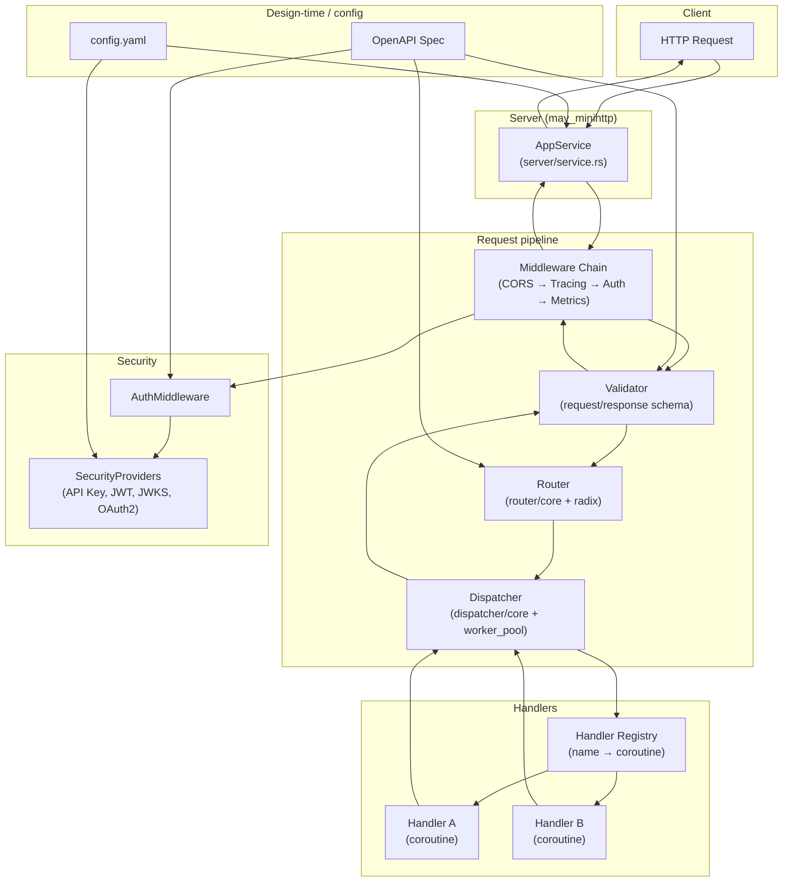
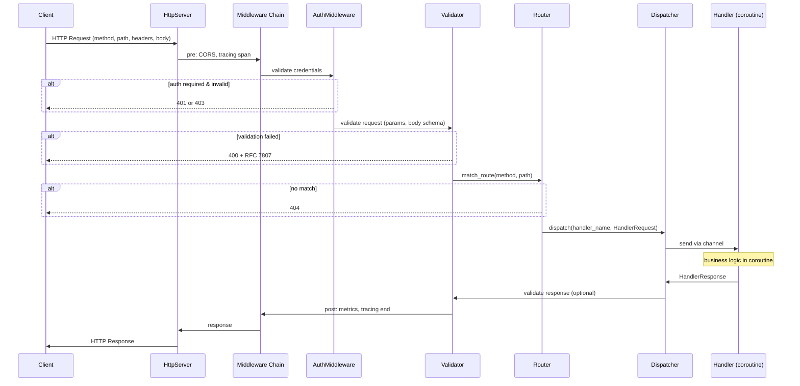

# BRRTRouter: What It Is, Concepts, and How It Works

**Purpose:** Single reference for what BRRTRouter is, the concepts behind it, how it works, the core components of the codebase, and how the pieces fit together. For deeper flows and code-generation details, see [ARCHITECTURE.md](ARCHITECTURE.md) and [RequestLifecycle.md](RequestLifecycle.md).

---

## Table of Contents

1. [What is BRRTRouter?](#1-what-is-brrrouter)
2. [Concepts](#2-concepts)
3. [How It Works (Two Flows)](#3-how-it-works-two-flows)
4. [Core Components of the Codebase](#4-core-components-of-the-codebase)
5. [Component / Architecture Graph](#5-component--architecture-graph)
6. [Request Flow: Sequence Diagram](#6-request-flow-sequence-diagram)
7. [References](#7-references)

---

## 1. What is BRRTRouter?

**BRRTRouter** is a high-performance, **OpenAPI-driven HTTP router** for Rust. It does two main things:

1. **Code generation** — Turns an OpenAPI 3.1 specification into a complete, runnable Rust service (handlers, controllers, config, registry).
2. **Runtime** — Serves HTTP by matching requests to handlers, validating input/output, enforcing security, and dispatching work to **coroutines** (lightweight threads via the `may` runtime).

So: you **define your API once** in OpenAPI; BRRTRouter gives you a type-safe server with routing, validation, auth, CORS, metrics, and observability out of the box. No hand-written route tables or per-endpoint glue.

**In short:** OpenAPI spec → generated service + runtime that routes, validates, authenticates, and runs your handlers in coroutines.

---

## 2. Concepts

| Concept | Description |
|--------|-------------|
| **OpenAPI as source of truth** | Paths, methods, parameters, request/response schemas, and security are read from the spec. Routing, validation, and generated code all derive from it. |
| **RouteMeta** | Internal representation of one route: path, method, handler name, parameters, security, CORS, etc. Built from the spec by `spec::build_routes`. |
| **Router** | Compiles paths into matchers (regex and/or radix tree). At runtime, takes method + path and returns a **RouteMatch** (handler name + path/query params). |
| **Dispatcher** | Looks up the handler by name and sends the request into a **handler coroutine** via a channel. Collects the response and returns it. Uses a worker pool and MPSC/MPMC channels. |
| **Middleware chain** | Request/response pipeline: CORS → tracing → auth → metrics → … . Each step can modify the request/response or short-circuit (e.g. 401/403). |
| **Security providers** | Pluggable auth: API key, JWT/JWKS, OAuth2, remote API key. Registered from OpenAPI `securitySchemes` and invoked by auth middleware. |
| **Validation** | Request parameters and body are validated against the OpenAPI schema; response can be validated too. Failures return RFC 7807 Problem Details. |
| **Typed handlers** | Generated or hand-written handlers receive a **HandlerRequest** (or a typed `TryFrom<HandlerRequest>` request) and return a **HandlerResponse**. |
| **Code generation** | CLI `brrtrouter-gen` loads the spec, builds routes, analyzes schemas, renders Askama templates, and writes a full project (main, registry, handlers, controllers, config). |
| **Hot reload** | Optional: watch the OpenAPI file and rebuild the router + re-register routes without restarting the process. |

---

## 3. How It Works (Two Flows)

### 3.1 Code generation (design time)

1. **Load spec** — `spec::load_spec` reads and parses the OpenAPI YAML/JSON.
2. **Build routes** — `spec::build_routes` turns paths and operations into `RouteMeta` (handler names, parameters, security, etc.).
3. **Analyze schemas** — `generator::schema` walks `components.schemas`, infers Rust types, and builds a type dependency graph.
4. **Render templates** — Askama templates produce `main.rs`, `registry.rs`, handler modules, controller modules, and `Cargo.toml`.
5. **Write project** — `generator::project` creates the directory structure and writes all generated files, then runs `rustfmt`.

Generated services use the **same runtime** (router, dispatcher, middleware, security, validator) as the library; they just plug in their own handlers and config.

### 3.2 Request handling (runtime)

1. **HTTP server** (`may_minihttp`) accepts the connection and parses the request.
2. **Middleware (pre)** — CORS, tracing span, auth (security providers). Auth can return 401/403.
3. **Validation** — Parameters and body validated against the spec; 400 with Problem Details on failure.
4. **Router** — `match_route(method, path)` returns a `RouteMatch` (handler name + path/query params) or 404.
5. **Dispatcher** — Sends a `HandlerRequest` to the handler coroutine; waits for `HandlerResponse`.
6. **Handler** — Runs in a `may` coroutine; business logic; returns status, headers, body.
7. **Validation (response)** — Optional response schema check; can log or fail.
8. **Middleware (post)** — Metrics, tracing end, security headers.
9. **HTTP response** — Written back to the client.

---

## 4. Core Components of the Codebase

| Component | Path | Role |
|-----------|------|------|
| **spec** | `src/spec/` | Load OpenAPI (`load.rs`), build route list (`build.rs`), types (`types.rs`: `RouteMeta`, `ParameterMeta`, security, etc.). |
| **router** | `src/router/` | Build and run route matching. `core.rs`: `Router`, `RouteMatch`; `radix.rs`: radix tree for O(k) path match. Uses `SmallVec` for params (JSF hot path). |
| **dispatcher** | `src/dispatcher/` | `HandlerRequest` / `HandlerResponse`, handler lookup, channel send/recv, worker pool (`worker_pool.rs`). Dispatches to handler coroutines. |
| **server** | `src/server/` | `AppService`: wires router, dispatcher, security, middleware, static files, validator cache. `service.rs` implements the main request lifecycle; `request.rs` / `response.rs` for HTTP parsing/serialization. |
| **middleware** | `src/middleware/` | CORS (`cors/`), auth (`auth.rs`), metrics (`metrics.rs`), tracing (`tracing.rs`), memory (`memory.rs`). Chain runs before and after handler. |
| **security** | `src/security/` | `SecurityProvider` trait; implementations: API key, Bearer JWT, JWKS, OAuth2, remote API key. Used by auth middleware. |
| **validator** | `src/validator.rs` | Request/response validation against OpenAPI schemas; RFC 7807 errors. `validator_cache.rs` caches compiled validators. |
| **generator** | `src/generator/` | Schema analysis (`schema.rs`), Askama rendering (`templates.rs`), project writing (`project/`). Used by `brrtrouter-gen`. |
| **typed** | `src/typed/` | Typed handler trait and `TryFrom<HandlerRequest>` for generated request types; integrates with dispatcher and codegen. |
| **hot_reload** | `src/hot_reload.rs` | Watches spec file; rebuilds router and re-registers routes with the running server. |
| **cli** | `src/cli/` | CLI for the generator binary: `generate`, etc. |
| **sse** | `src/sse.rs` | Server-Sent Events helpers (`x-sse` extension). |
| **static_files** | `src/static_files.rs` | Serving static files and doc directory. |

The **main binary** (e.g. pet_store) loads the spec, builds the `Router`, creates `AppService`, registers handlers with the `Dispatcher`, and starts the HTTP server. The **generator binary** (`brrtrouter-gen`) uses `spec` + `generator` + `cli` to emit a new project.

---

## 5. Component / Architecture Graph

The following diagram shows how the main runtime components relate. Code generation uses `spec` + `generator` (and `cli`); the running server uses the rest.

**Data flow (simplified):** Client → AppService → Middleware (CORS, tracing, auth) → Validator → Router (get RouteMatch) → Dispatcher → Handler coroutine → response back through Dispatcher → Validator → Middleware → AppService → Client. The OpenAPI spec drives Router, Validator, and auth registration; `config.yaml` drives server and security options.

---

## 6. Request Flow: Sequence Diagram

Companion to the component graph: one request from the client to the handler and back.

Together, the **component graph** (section 5) and this **sequence diagram** (section 6) describe how the code is structured and how a single request moves through it.

---

## 7. References

- [ARCHITECTURE.md](ARCHITECTURE.md) — Detailed architecture, code-generation and request-handling flows, observability.
- [RequestLifecycle.md](RequestLifecycle.md) — End-to-end request lifecycle and code generation.
- [README.md](../README.md) — Features, quick start, benchmarks.
- [DEVELOPMENT.md](DEVELOPMENT.md) — Development workflow and just commands.
