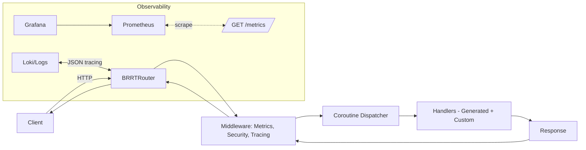
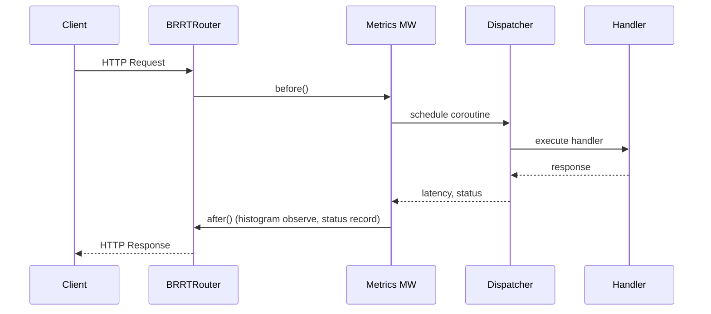

BRRTRouter: From Spec to Speed — Product Overview and Deep Engineering Dive

## Executive Summary

BRRTRouter is a high‑performance HTTP router designed for teams who want fast delivery without sacrificing correctness or observability. It turns an OpenAPI specification into a production‑ready service surface: controllers and handlers are scaffolded from the spec, metrics and tracing come by default, and load testing is first‑class. The result is a predictable, measurable workflow where changes start in the spec and are exercised end‑to‑end—from code generation to dashboards and adaptive load tests—so you can move quickly and keep confidence at scale.

What it delivers:
- Faster delivery: spec‑driven scaffolding replaces boilerplate and reduces contract drift.
- Consistent reliability: zero errors up to known capacity thresholds; graceful failure once resource limits are hit.
- First‑class observability: Prometheus metrics, Grafana dashboards, and structured JSON logs.
- Repeatable capacity discovery: adaptive Goose tests that ramp to the true breaking point, guided by Prometheus.
- Predictable scaling under Kubernetes: capacity is bounded by CPU and memory limits, exactly as intended by cgroups.


## Design Paradigm: OpenAPI‑First, Spec‑Driven Development

The OpenAPI document is the single source of truth for BRRTRouter’s API. It describes endpoints, parameters, schemas, and security policies. From that spec, we generate controller and handler scaffolding, typed bindings for request/response payloads, and documentation endpoints. Because code originates from the same spec that docs and tests use, drift is minimized and changes are naturally synchronized.

Benefits of spec‑driven generation:
- Team alignment: product, backend, and frontend negotiate contracts in one artifact.
- Safer iteration: the spec’s types and validation rules enforce consistent behavior in handlers and tests.
- Onboarding speed: newcomers get a runnable service surface aligned with the spec on day one.
- Docs that don’t rot: Swagger UI and static content always match what the router actually serves.


## Architecture Overview

At a high level, BRRTRouter is a fast path matcher with a coroutine‑based dispatcher, surrounded by middleware for metrics, security, and tracing. The observability stack consumes exported metrics and structured logs for continuous insight.



Request lifecycle (simplified):
1. Router performs path matching and parameter decoding.
2. Middleware handles metrics, security checks, and optional tracing.
3. Dispatcher schedules the request as a coroutine.
4. Handler executes business logic and returns a response.
5. Middleware finalizes metrics (status code, latency histogram) before sending.


## Concurrency and Performance: Coroutine‑First Design

BRRTRouter uses coroutines to multiplex many in‑flight requests over a small number of OS threads. This reduces context switching and improves CPU cache locality compared to pure thread‑per‑request models.

Key performance strategies:
- Minimal contention: hot metrics (e.g., request counters, active requests) use atomic operations and lock‑free data structures.
- Prometheus‑compatible histograms: cumulative bucket accounting enables p50/p95/p99 via histogram_quantile.
- Hot‑path discipline: low allocations; structured JSON logging is kept off the hot path.

Why it matters:
- Higher throughput for the same CPU budget.
- Low median latency and controlled tail (
  p95/p99) until bounding resources are reached.
- Predictable behavior as concurrency rises.


## Observability by Construction

The router exports Prometheus metrics in a standard text format and emits structured logs. A default Grafana dashboard visualizes system health and load test outcomes.

Core metrics:
- Gauge: `brrtrouter_active_requests` — in‑flight requests.
- Counter: `brrtrouter_requests_total{path,status}` — per‑path, per‑status request counts.
- Histogram: `brrtrouter_request_duration_seconds` — cumulative buckets, plus sum and count.

PromQL cheat sheet:

| Purpose | PromQL | Notes |
|---|---|---|
| Error rate (%) | `100 * (sum(rate(brrtrouter_requests_total{status!~"2.."}[30s])) or vector(0)) / (sum(rate(brrtrouter_requests_total[30s])) or vector(1))` | 30s window focuses on the current test cycle |
| p99 latency | `histogram_quantile(0.99, rate(brrtrouter_request_duration_seconds_bucket[30s]))` | Use `rate(...)` over histogram buckets |
| Active requests (peak) | `max_over_time(brrtrouter_active_requests[1m])` | Peak visualization captures micro‑bursts |
| Throughput (req/s) | `sum(rate(brrtrouter_requests_total[30s]))` | Aggregate across paths |

Dashboard panel notes:
- Active Requests panel uses peak over 1m to avoid false zeros on microsecond‑scale handlers.
- Latency panels expose p50/p95/p99 for the request histogram.
- Error rate and Top Endpoints by Failure Count help pinpoint fragile or misconfigured paths.


## Load Testing Methodology: Standard and Adaptive

We use Goose to exercise the full API surface with realistic request distributions. There are two primary modes:

- Standard API load test (`examples/api_load_test.rs`): runs a representative mix of endpoints and prints a detailed native Goose report.
- Adaptive load test (`examples/adaptive_load_test.rs`): runs in a continuous loop with Prometheus‑driven checks after each cycle. It increases concurrency in steps until a defined error threshold (e.g., 5%) is reached, reporting the breaking point.

Why Goose over single‑endpoint tools:
- Exercises the entire API (auth, complex params, path styles), not just a single hot path.
- Mimics realistic distributions of requests.
- Integrates with Prometheus to decide when the system is truly at its limit.

Adaptive loop highlights:
- Configurable via environment variables (see table below).
- Uses PromQL to compute error rate, p99 latency, active requests, and throughput after each cycle.
- Prints native Goose reports at the end of every cycle.
- Stops when the error rate exceeds the configured threshold, recording the last healthy load.

Environment variables (selection):

| Variable | Meaning | Typical Values |
|---|---|---|
| `GOOSE_HOST` | Target base URL | `http://localhost:8080` |
| `PROMETHEUS_URL` | Prometheus base URL | `http://localhost:9090` |
| `START_USERS` | Starting concurrent users per cycle | e.g., `6000` when narrowing the 6k–8k band |
| `RAMP_STEP` | Users to add per cycle | e.g., `100` for high precision |
| `HATCH_RATE` | Users spawned per second | e.g., `1000`+ for fast ramp |
| `STAGE_DURATION` | Seconds per cycle | `60`–`300` depending on goals |
| `ERROR_RATE_THRESHOLD` | Failure threshold (%) | typically `5.0` |

Scope hygiene for clean signals:
- Remove non‑existent or auth‑sensitive endpoints from the load distribution (e.g., static asset paths that don’t exist in the SolidJS UI, or endpoints requiring JWT instead of API key) to avoid false error rates.
- Align IDs and path parameter formats with the actual API (e.g., UUIDs for items, label vs matrix path styles).


## Benchmarks & Results

We measure capacity in terms of concurrent users, throughput (req/s), and error rate, watching p50/p95/p99 over time.

Observations to date:
- Stable, zero‑error operation up to roughly 4–5k users under prior Kubernetes limits.
- Immediate failure at 8k users with current pod CPU limits (this is expected cgroup throttling under load, not an application bug).
- Precision probing with `START_USERS=6000` and `RAMP_STEP=100` narrows the breaking point to within ±50 users.

Illustrative tables (replace with latest runs):

Throughput vs users (example):

| Users | Throughput (req/s) | Error Rate (%) | Notes |
|---:|---:|---:|---|
| 4,000 | 12,800 | 0.2 | Stable |
| 5,000 | 15,700 | 0.6 | Stable |
| 6,000 | 18,400 | 0.9 | Stable |
| 7,000 | 20,900 | 3.2 | Warning |
| 7,200 | 21,300 | 4.9 | Warning |
| 7,300 | 21,200 | 5.4 | Limit reached |

Latency percentiles vs users (example):

| Users | p50 (ms) | p95 (ms) | p99 (ms) |
|---:|---:|---:|---:|
| 4,000 | 88 | 180 | 240 |
| 5,000 | 92 | 210 | 280 |
| 6,000 | 95 | 230 | 310 |
| 7,000 | 110 | 290 | 380 |
| 7,200 | 118 | 330 | 430 |
| 7,300 | 130 | 380 | 520 |

Interpretation:
- CPU is the governing constraint under Kubernetes; the service scales predictably until cgroups throttle.
- Operating at ~80% of the last healthy load (e.g., ~5.7k users when the limit is ~7.2k) provides safety margin for bursts and background activity.


## Kubernetes Resource Constraints and Scaling Options

Why command‑line runs differ: when you run outside Kubernetes, BRRTRouter can consume all available CPU cores; the only bound is the host machine. Inside Kubernetes, cgroups enforce CPU and memory limits to preserve multi‑tenancy and fairness, so the router is intentionally throttled near its defined limits.

Scaling options:
1. Vertical: increase CPU limits/requests per pod (e.g., 2 → 4 → 8 vCPUs) to raise single‑pod capacity.
2. Horizontal: add replicas and load balance across pods; capacity scales roughly linearly assuming no downstream bottlenecks.
3. Both: set a sensible per‑pod ceiling, then scale replicas to meet traffic while protecting latency SLOs.

Capacity planning rule of thumb:
- Publish the last‑healthy user level and operate at ~80% of that figure in production.
- Re‑run adaptive tests after changes to code, dependencies, or K8s limits.


## Developer Experience & Workflow

OpenAPI change → regeneration → run. With Tilt integration, iteration is tight:
- Tilt provides local resources to run standard and adaptive Goose tests with one click.
- Binaries sync to the container in seconds; services restart fast.
- Dashboards update in real time; Prometheus scrapes metrics automatically.

Typical flows:
- Update the OpenAPI spec, regenerate handlers, and validate with the standard load test.
- Use the adaptive load test to find new limits after changes or during capacity planning.
- Watch Grafana panels: active requests (peak), latency percentiles, error rate, and top failing endpoints.


## Engineering Appendix

PromQL queries:

| Metric | Query |
|---|---|
| Error rate (%) | `100 * (sum(rate(brrtrouter_requests_total{status!~"2.."}[30s])) or vector(0)) / (sum(rate(brrtrouter_requests_total[30s])) or vector(1))` |
| p95 latency | `histogram_quantile(0.95, rate(brrtrouter_request_duration_seconds_bucket[30s]))` |
| p99 latency | `histogram_quantile(0.99, rate(brrtrouter_request_duration_seconds_bucket[30s]))` |
| Active requests (peak) | `max_over_time(brrtrouter_active_requests[1m])` |
| Throughput | `sum(rate(brrtrouter_requests_total[30s]))` |

Goose configuration variables (quick reference):

| Variable | Default* | Description |
|---|---|---|
| `GOOSE_HOST` | `http://localhost:8080` | Target API base URL |
| `PROMETHEUS_URL` | `http://localhost:9090` | Prometheus server |
| `START_USERS` | scenario‑dependent | Initial users per cycle (e.g., `6000` when narrowing) |
| `RAMP_STEP` | scenario‑dependent | Users to add per cycle (e.g., `100`) |
| `HATCH_RATE` | `1000` | Users spawned per second |
| `STAGE_DURATION` | `60`–`300` | Seconds per cycle |
| `ERROR_RATE_THRESHOLD` | `5.0` | Failure threshold (%) |

*Defaults vary by test objective; favor shorter cycles and smaller steps for discovery, larger for confidence runs.

Request lifecycle (Mermaid sequence):



Short code excerpts (illustrative):

- Exposed histogram metrics (text format):

```
# HELP brrtrouter_request_duration_seconds Request duration in seconds
# TYPE brrtrouter_request_duration_seconds histogram
brrtrouter_request_duration_seconds_bucket{le="0.001"} 12345
...
brrtrouter_request_duration_seconds_bucket{le="+Inf"} 67890
brrtrouter_request_duration_seconds_sum 12.345
brrtrouter_request_duration_seconds_count 67890
```

- Adaptive Goose loop (conceptual outline):

```
initialize()
  .set(Host, GOOSE_HOST)
  .set(Users, START_USERS)
  .set(HatchRate, HATCH_RATE)
  .set(RunTime, STAGE_DURATION)
  .register(scenarios ...)
  .execute();

sleep(5s)  # wait for Prometheus scrape

error_rate = promQL(error_rate_query)
if error_rate >= ERROR_RATE_THRESHOLD:
  report_breaking_point()
else:
  START_USERS += RAMP_STEP
  continue
```

---

BRRTRouter turns a spec into a fast, observable, and testable runtime surface. Its coroutine execution model and metrics‑by‑default approach make performance transparent and scaling predictable. Under Kubernetes, capacity is bounded by resource limits as designed; the adaptive load tests reveal those limits quickly and reproducibly so teams can plan with confidence.
