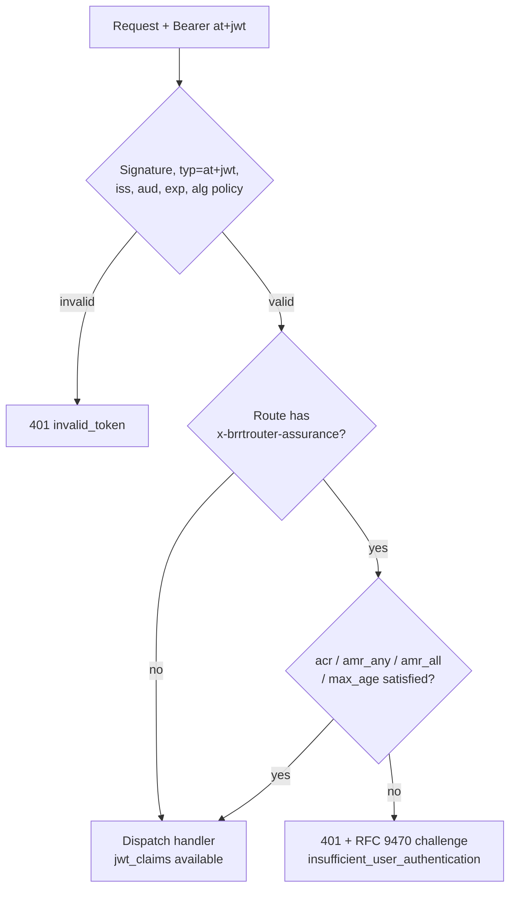

# Design: Route-level authentication assurance (acr/amr/max_age) and RFC 9470 step-up

Status: PROPOSED (2026-07-22)

## Scope and boundary

BRRTRouter validates tokens and enforces *requirements about* authentication;
it never performs authentication. Ceremonies (WebAuthn, OTP, recovery) belong
to the identity provider. This design adds the resource-side half of a
standard step-up architecture:

1. surface the IdP's assurance claims to handlers and middleware;
2. let routes declare minimum assurance **declaratively in the OpenAPI spec**;
3. answer insufficiency with an **RFC 9470** challenge instead of a generic 401/403.

Everything here is IdP-agnostic: any provider that populates `amr` (RFC 8176),
`acr` (OIDC), and `auth_time` (OIDC) in an RFC 9068 `at+jwt` works unchanged.

## 1. Claim surface (already shipped)

`TypedHandlerRequest.jwt_claims` (BR-2) already delivers the decoded claims —
including `amr`, `acr`, `auth_time` — to every handler. This design adds no
new plumbing for handler-level checks; it standardizes middleware-level
enforcement so handlers rarely need any.

## 2. Declaring requirements: `x-brrtrouter-assurance`

Following the existing vendor-extension pattern (`x-brrtrouter-stack-size`,
`x-brrtrouter-downstream-path`), an OpenAPI **operation** may declare:

```yaml
paths:
  /payout-accounts/{id}:
    put:
      operationId: update_payout_account
      security:
        - bearerJwks: []
      x-brrtrouter-assurance:
        acr: "urn:example:acr:aal2-phishing-resistant"   # exact-match OR listed alternative
        amr_any: ["swk", "hwk"]                          # at least one MUST be present
        amr_all: ["mfa"]                                 # all MUST be present
        max_age: 600                                     # seconds since auth_time
```

Semantics (all fields optional; omitted = not constrained):

| Field | Rule |
|---|---|
| `acr` (string or array) | token `acr` MUST equal the value, or be a member of the array. No ordering is assumed between acr values — matching is exact, because acr URIs are opaque identifiers (OIDC Core §2). |
| `amr_any` | token `amr` (RFC 8176 array) MUST intersect this set |
| `amr_all` | token `amr` MUST contain every member |
| `max_age` | `now − auth_time` MUST be ≤ this many seconds; requires `auth_time` present |

The spec loader parses the extension into the existing **RoutePolicyStore**
(which already classifies routes JwtOnly / JwtWithFallback / OnlineOnly);
assurance is evaluated in the same middleware pass, after signature/typ/iss/
aud/exp validation succeeds — assurance never substitutes for validity.



## 3. The insufficiency response: RFC 9470

When a **valid** token fails assurance, the middleware MUST respond:

```
HTTP/1.1 401 Unauthorized
WWW-Authenticate: Bearer error="insufficient_user_authentication",
  error_description="A different authentication level is required",
  acr_values="urn:example:acr:aal2-phishing-resistant",
  max_age="600"
```

- `401` with `insufficient_user_authentication` per RFC 9470 §3 — NOT `403`:
  the client's remedy is re-authentication, not different permissions.
- `acr_values` lists the route's acceptable acr values (space-separated);
  `max_age` echoes the route requirement when it was the failing predicate.
- Response body follows the existing error envelope; the machine-readable
  contract lives in the header, so generic OAuth clients can drive step-up
  without parsing the body.
- Distinctness matters: expired/invalid tokens keep today's
  `error="invalid_token"`; scope failures keep `insufficient_scope`
  (RFC 6750). Three different remedies, three different errors.

## 4. Validation-order and security notes

- Assurance checks run only after full token validation — a forged token must
  never learn which routes are high-value from differentiated errors.
- `amr`/`acr`/`auth_time` are trusted **exactly as far as the issuer is**:
  they are claims inside a signature-verified token from a configured issuer.
  No independent verification is possible or attempted at the resource.
- `auth_time` absent + `max_age` required → insufficiency (fail closed).
- Clock skew: reuse the provider's existing leeway configuration for the
  `max_age` comparison.
- The generator surfaces `x-brrtrouter-assurance` in generated route
  registrations so the requirement is visible in generated code and docs.

## 5. Out of scope (deliberately)

- Performing any authentication ceremony (IdP's job).
- Mapping acr URIs to an ordering/lattice ("aal3 ≥ aal2") — orderings are
  IdP-specific; routes list acceptable values explicitly.
- Step-up *initiation* UX — the application layer redirects to its IdP using
  the challenge parameters; this library only emits the challenge.

## 6. Testing plan

- Unit: predicate matrix (acr exact/array, amr_any/all, max_age boundary,
  missing claims) — fail-closed assertions.
- Integration: spec-driven — an example OpenAPI route with the extension;
  assert 401+RFC 9470 header shape for insufficient tokens, 200 for
  sufficient, `invalid_token` untouched for broken tokens.
- Generator: extension round-trips into RoutePolicyStore and generated code.

## Standards

RFC 6750 (Bearer, error registry), RFC 8176 (amr values), RFC 9068 (at+jwt),
RFC 9470 (step-up challenge), OIDC Core (`acr`, `auth_time`).
