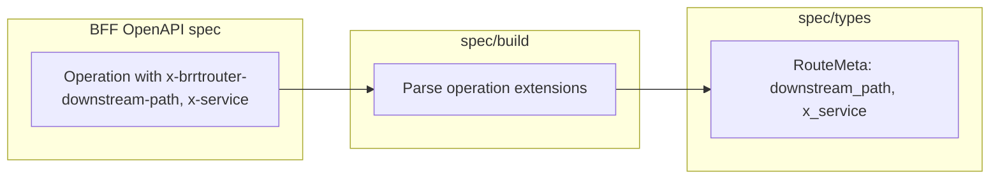

# Story 1.1 — RouteMeta extensions in BRRTRouter

**GitHub issue:** [#259](https://github.com/microscaler/BRRTRouter/issues/259)  
**Epic:** [Epic 1 — Spec-driven proxy](README.md)

## Overview

BRRTRouter must read operation-level OpenAPI extensions `x-brrtrouter-downstream-path` and `x-service` from the BFF spec and store them in `RouteMeta` so the proxy library can build the downstream URL from config + RouteMeta without per-route logic in Askama. The `x-service` value is a **logical service key**; the actual downstream address (host/port or full base URL) is resolved at runtime from config and is deployment-specific—see [Story 2.2](../epic-2-proxy-library/story-2.2-downstream-base-url-config.md) for config shape and Kubernetes/ingress considerations.

## Delivery

- Add fields to the type that represents route metadata (e.g. in `spec/types.rs`): `downstream_path: Option<String>`, `x_service: Option<String>` (or equivalent names matching the extension keys).
- In the spec build path (e.g. `spec/build.rs`), when building route metadata from an operation, read `x-brrtrouter-downstream-path` and `x-service` from the operation object and set these fields.
- No change to proxy behaviour in this story—only spec loading and RouteMeta shape.

## Acceptance criteria

- [ ] RouteMeta (or equivalent struct in `spec/types.rs`) has optional `downstream_path` and `x_service` (or agreed field names).
- [ ] Spec build logic populates these from operation extensions when present.
- [ ] Existing routes without these extensions continue to work (fields are optional).
- [ ] Unit or integration tests verify that a spec with `x-brrtrouter-downstream-path` and `x-service` on an operation produces RouteMeta with those values.

## Example config (OpenAPI)

Operation-level extensions that BRRTRouter will read:

```yaml
paths:
  /api/bff/invoices/{id}:
    get:
      operationId: getInvoice
      x-brrtrouter-downstream-path: "/api/invoice/invoices/{id}"
      x-service: invoice
      responses:
        '200':
          description: OK
```

## Diagram



## Deployment context (Kubernetes)

BRRTRouter is designed for deployment in Kubernetes. The BFF proxies to microservices whose **service address** is not in the spec—it comes from config:

- **Cluster-internal:** The config mapping for `x-service` typically uses a **Kubernetes Service** DNS name, e.g. `http://invoice-service.bff-backend.svc.cluster.local:80` (same namespace) or `http://invoice-service.<namespace>.svc.cluster.local:80`. The proxy library uses this as the base URL when building the downstream request.
- **Ingress:** The BFF itself may be exposed to clients via a K8s Ingress; microservices are usually **not** exposed via ingress to the BFF—BFF→microservice traffic stays cluster-internal using K8s service URLs. If a microservice is ever reached via an ingress host (e.g. shared gateway), config can still map `x-service` to that base URL.
- **Same spec, different config:** The OpenAPI spec carries only the logical key (`x-service`) and path (`x-brrtrouter-downstream-path`). Per-environment config (dev, staging, prod) supplies the appropriate base URL (localhost, K8s service, or ingress) so the same BFF spec works across environments.

This story does not change proxy or config behaviour—it only adds RouteMeta fields. Story 2.2 defines the config format and must support K8s service addresses and document ingress implications.

## References

- BRRTRouter: `src/spec/types.rs`, `src/spec/build.rs`
- `docs/BFF_PROXY_ANALYSIS.md` §5.2, §5.2a (K8s deployment)
- [Story 2.2 — Downstream base URL config](../epic-2-proxy-library/story-2.2-downstream-base-url-config.md) (K8s service and ingress)
