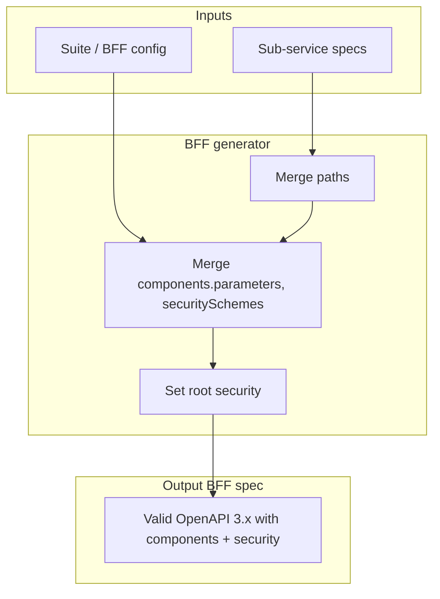

# Story 1.3 — BFF generator components/security merge

**GitHub issue:** [#261](https://github.com/microscaler/BRRTRouter/issues/261)  
**Epic:** [Epic 1 — Spec-driven proxy](README.md)

## Overview

When a BFF spec is produced by merging sub-service specs, `components.parameters`, `components.securitySchemes`, and root `security` can be missing or incomplete, so BRRTRouter auth and parameter handling fail. This story ensures the BFF generator merges (or injects) these so the BFF spec is OpenAPI 3.1 compliant and BRRTRouter security works (OPENAPI_3.1.0_COMPLIANCE_GAP §8).

## Delivery

- Extend the BFF generator to merge or inject:
  - `components.parameters` (referenced by operations).
  - `components.securitySchemes` (e.g. bearer JWT from IDAM/Supabase issuer).
  - Root-level `security` when the BFF is protected.
- Ensure merged spec is valid and that BRRTRouter’s spec load and security validation succeed for the generated BFF spec.

## Acceptance criteria

- [ ] Generated BFF spec includes `components.parameters` where operations reference `$ref` to parameters.
- [ ] Generated BFF spec includes `components.securitySchemes` appropriate for BFF auth (e.g. JWKS bearer).
- [ ] Generated BFF spec includes root `security` when the BFF is protected so BRRTRouter applies auth.
- [ ] BRRTRouter loads the generated spec without errors and applies security validation for secured routes.
- [ ] Document or reference OPENAPI_3.1.0_COMPLIANCE_GAP §8 in generator docs.

## Example config (OpenAPI)

Relevant sections in the merged BFF spec:

```yaml
components:
  parameters:
    id path: { name: id, in: path, required: true, schema: { type: string } }
  securitySchemes:
    bearerAuth:
      type: http
      scheme: bearer
      bearerFormat: JWT
security:
  - bearerAuth: []
```

## Diagram



## References

- OPENAPI_3.1.0_COMPLIANCE_GAP.md §8
- `docs/BFF_PROXY_ANALYSIS.md` §4 (G6), §5.6
- BRRTRouter: `src/security/mod.rs`, `src/spec/build.rs`
