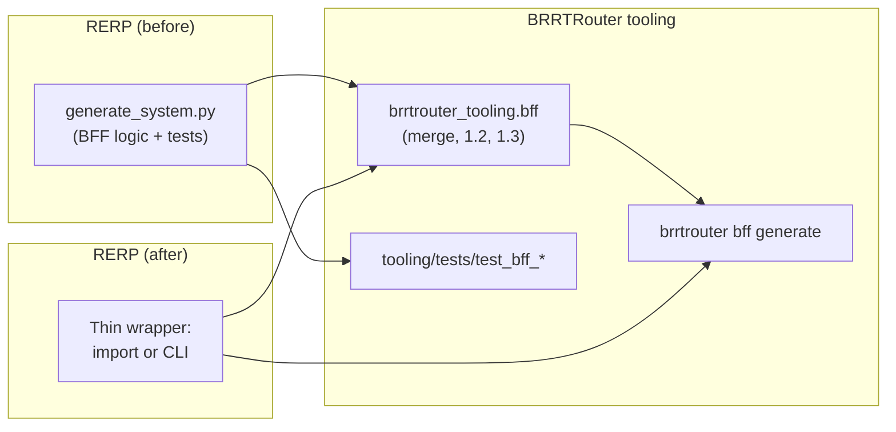

# Story 1.4 — Extract BFF generator to BRRTRouter tooling

**GitHub issue:** [#277](https://github.com/microscaler/BRRTRouter/issues/277)  
**Epic:** [Epic 1 — Spec-driven proxy](README.md)

## Overview

Extract the BFF generator from RERP into BRRTRouter Python tooling so any consumer has a standard BFF tool set. This story implements **Stories 1.2 and 1.3** inside BRRTRouter tooling (proxy extensions and components/security merge), migrates all BFF generator tests from RERP to BRRTRouter tooling, and updates RERP to use BRRTRouter tooling (import or CLI).

## Delivery

1. **Extract BFF generator into BRRTRouter tooling**
   - New package: `tooling/src/brrtrouter_tooling/bff/` (e.g. `config.py`, `merge.py`, `extensions.py`, `components.py`, `generate.py`).
   - CLI: `brrtrouter bff generate --suite-config <path> --output <path>` (and optional `--validate`).
   - Behaviour: merge sub-service specs with prefixing; per operation set `x-brrtrouter-downstream-path` and `x-service` (Story 1.2); merge `components.parameters`, `components.securitySchemes`, root `security` (Story 1.3). Document suite config format (align with RERP `bff-suite-config.yaml` where possible).

2. **Migrate all tests**
   - Identify and migrate every BFF generator test from RERP (unit and integration) into BRRTRouter tooling (e.g. `tooling/tests/test_bff_*.py`).
   - Tests must cover: merge paths/schemas, proxy extensions (1.2), components/security merge (1.3), CLI invocation, and edge cases (missing refs, empty security, etc.).
   - No tests left in RERP that duplicate BRRTRouter tooling behaviour; RERP tests may only verify “RERP calls BRRTRouter tooling and gets valid output”.

3. **Update RERP to use BRRTRouter tooling**
   - RERP removes (or deprecates) its in-repo BFF generator implementation and instead:
     - **Option A (import):** Add `brrtrouter-tooling` as a dependency and call `brrtrouter_tooling.bff` (e.g. `generate_bff_spec(suite_config, output_path)`).
     - **Option B (CLI):** Invoke `brrtrouter bff generate ...` and use the generated spec.
   - RERP’s pipeline (e.g. `generate_system.py` or equivalent) becomes a thin wrapper that uses BRRTRouter tooling; config shape is adapted if needed.
   - Document in RERP how to install/use BRRTRouter tooling (see “Consuming BRRTRouter tooling from GitHub” below).

## Acceptance criteria

- [ ] BFF generator lives in `tooling/src/brrtrouter_tooling/bff/` and implements Stories 1.2 and 1.3.
- [ ] CLI `brrtrouter bff generate` works with a documented suite config format.
- [ ] All BFF generator tests from RERP are migrated to BRRTRouter tooling and pass.
- [ ] RERP uses BRRTRouter tooling (import or CLI); RERP’s own generator code is removed or deprecated.
- [ ] Docs: suite config format, how to install/use from GitHub (pip from git URL).

## Consuming BRRTRouter tooling from GitHub (Python)

**Can Python load a library from a GitHub URL like Rust or Go?**

Python does **not** load packages from a raw HTTP URL at runtime like Go’s `go get` from a URL. You **install** the package first, then import it. Installation can use a **VCS (git) URL**:

- **From GitHub (default branch):**  
  `pip install "brrtrouter-tooling @ git+https://github.com/microscaler/BRRTRouter.git#subdirectory=tooling"`

- **From a specific ref (tag, branch, commit):**  
  `pip install "brrtrouter-tooling @ git+https://github.com/microscaler/BRRTRouter.git@v0.1.0#subdirectory=tooling"`  
  or `...@main#subdirectory=tooling`

- **In pyproject.toml (RERP or any consumer):**  
  ```toml
  [project]
  dependencies = [
    "brrtrouter-tooling @ git+https://github.com/microscaler/BRRTRouter.git#subdirectory=tooling",
  ]
  ```

So RERP can depend on BRRTRouter tooling **directly from GitHub** without publishing to PyPI. Once installed, use `from brrtrouter_tooling.bff import generate_bff_spec` or call the CLI `brrtrouter bff generate ...`. Optional: publish `brrtrouter-tooling` to PyPI later for `pip install brrtrouter-tooling`.

## Example config (suite config)

Suite config format (YAML) consumed by `brrtrouter bff generate`:

```yaml
# bff-suite-config.yaml (or equivalent)
suite: accounting
bff_name: bff
services:
  - name: invoice
    spec_path: openapi/accounting/invoice/openapi.yaml
    base_path: /api/invoice
    port: 8001
  - name: general-ledger
    spec_path: openapi/accounting/general-ledger/openapi.yaml
    base_path: /api/general-ledger
    port: 8002
# Optional: security schemes / root security to inject (Story 1.3)
security_schemes: { }
security: [ ]
```

## Diagram



## References

- [BFF_GENERATOR_EXTRACTION_ANALYSIS.md](../BFF_GENERATOR_EXTRACTION_ANALYSIS.md)
- [Story 1.2 — BFF generator proxy extensions](story-1.2-bff-generator-proxy-extensions.md)
- [Story 1.3 — BFF generator components/security merge](story-1.3-bff-generator-components-security.md)
- BRRTRouter tooling: `tooling/README.md`, `tooling/src/brrtrouter_tooling/cli/main.py`
- RERP: BFF generator and tests to migrate; pipeline to update
