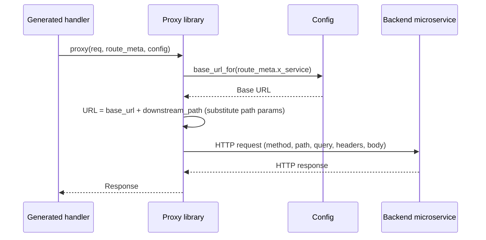

# Story 2.1 — Proxy library

**GitHub issue:** [#262](https://github.com/microscaler/BRRTRouter/issues/262)  
**Epic:** [Epic 2 — BFF proxy library](README.md)

## Overview

Implement a proxy library that, given the incoming request, RouteMeta (with `downstream_path` and `x_service`), and config, builds the downstream URL, substitutes path and query parameters from the request, forwards the HTTP method, path, query, headers, and body to the backend, and returns the backend response. No Askama logic for URL building—all in the library.

## Delivery

- Add a proxy module (e.g. under `brrtrouter::bff` or a BFF support crate) with a function that:
  - Takes: HandlerRequest (or equivalent), RouteMeta (with downstream_path, x_service), and config (or a base-URL resolver).
  - Resolves base URL for `route_meta.x_service` from config.
  - Builds full URL = base_url + route_meta.downstream_path, substituting path parameters from the request.
  - Forwards method, path, query, headers, body to the backend via HTTP client.
  - Returns the backend response (status, headers, body) to the caller.
- Use an async HTTP client (e.g. reqwest) and follow BRRTRouter error and async conventions.
- No claim header injection in this story (Epic 4).

## Acceptance criteria

- [ ] Library function builds URL from config base URL + RouteMeta.downstream_path with path params substituted from request.
- [ ] Query string from the incoming request is forwarded (or merged) to the downstream URL.
- [ ] HTTP method, headers (excluding those that must not be forwarded, e.g. Host), and body are forwarded.
- [ ] Backend response (status, headers, body) is returned to the caller.
- [ ] Unit or integration tests: given a mock backend, proxy call reaches correct URL and returns response.
- [ ] Errors (e.g. backend unreachable, invalid config) are propagated appropriately.

## Example config

Config must provide base URL per service key (see Story 2.2). Library receives something like:

- `route_meta.x_service` = `"invoice"`
- `route_meta.downstream_path` = `"/api/invoice/invoices/{id}"`
- Request path params: `id` = `"123"`
- Resolved base URL for `invoice`: `http://localhost:8001`
- Resulting downstream URL: `http://localhost:8001/api/invoice/invoices/123`

## Diagram

## References

- BRRTRouter: `src/dispatcher/core.rs` (HandlerRequest), `src/spec/types.rs` (RouteMeta)
- `docs/BFF_PROXY_ANALYSIS.md` §5.3
