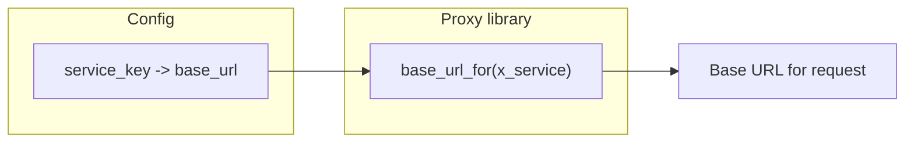

# Story 2.2 — Downstream base URL config

**GitHub issue:** [#263](https://github.com/microscaler/BRRTRouter/issues/263)  
**Epic:** [Epic 2 — BFF proxy library](README.md)

## Overview

The BFF runtime needs a mapping from service key (`x_service` from the spec) to base URL (host:port or full base URL) so the proxy library can resolve the downstream host. This story defines and implements config loading for that mapping. BRRTRouter is designed for **Kubernetes deployment**: the base URL for each `x-service` is typically a **K8s Service** address (cluster-internal) or, when applicable, an ingress-backed URL; config is deployment-specific and must support both.

## Delivery

- Define config shape: map from service key (string, e.g. `invoice`, `general-ledger`) to base URL (e.g. `http://localhost:8001` or a K8s service URL).
- Load this mapping from application config (e.g. existing `config.yaml` or BFF-specific section) so the proxy library can call a resolver like `config.base_url_for(service_key)`.
- Document the config format and how it aligns with RERP `bff-suite-config.yaml` (base_path, port per service) if applicable.
- **Kubernetes and ingress:** Document and support base URLs that are (1) **K8s Service** addresses for cluster-internal BFF→microservice calls (e.g. `http://invoice-service.bff-backend.svc.cluster.local:80`), and (2) optionally ingress or external host when a microservice is reached via ingress. BFF→microservice traffic should normally use cluster-internal K8s service DNS; ingress is relevant when the BFF or microservices are exposed to clients or to a shared gateway.

## Acceptance criteria

- [ ] Config contains a mapping from service key to base URL (or equivalent: host + port).
- [ ] Proxy library (Story 2.1) can resolve base URL for a given `x_service` from this config.
- [ ] Missing or invalid service key produces a clear error (no silent wrong host).
- [ ] Config format is documented; example config is provided.

## Example config

YAML example (format to be aligned with BRRTRouter/RERP):

**Local / dev:**
```yaml
bff:
  downstream_services:
    invoice: "http://localhost:8001"
    general-ledger: "http://localhost:8002"
```

**Kubernetes (cluster-internal service):**
```yaml
bff:
  downstream_services:
    # K8s Service DNS: http://<service>.<namespace>.svc.cluster.local:<port>
    invoice: "http://invoice-service.bff-backend.svc.cluster.local:80"
    general-ledger: "http://general-ledger-service.bff-backend.svc.cluster.local:80"
```

**Optional (microservice behind ingress):**
```yaml
bff:
  downstream_services:
    invoice: "https://invoice.internal.example.com"  # ingress host
```

Or reusing existing suite config structure:

```yaml
# bff-suite-config style: service name -> base_path, port
# Runtime turns into base URL: http://<host>:<port>
# In K8s, host is typically <service>.<namespace>.svc.cluster.local
```

## Diagram



## Kubernetes and ingress impact

| Concern | Guidance |
|--------|-----------|
| **BFF → microservice** | Use **cluster-internal** K8s Service URLs in config (e.g. `http://<svc>.<namespace>.svc.cluster.local:80`). No ingress in the path; lower latency and no external exposure. |
| **BFF exposed to clients** | BFF is typically fronted by an **Ingress** (or LoadBalancer) for external/client traffic; that does not change the downstream_services config—those entries remain K8s service URLs. |
| **Microservice behind ingress** | If a backend is intentionally reached via an ingress host (e.g. shared API gateway), config can set that base URL for the corresponding `x-service`. |
| **Same spec, multiple envs** | One BFF spec; config varies per environment (localhost in dev, K8s service URLs in staging/prod). |

## References

- RERP: `openapi/accounting/bff-suite-config.yaml`
- `docs/BFF_PROXY_ANALYSIS.md` §3.4, §5.2, §5.2a (K8s deployment)
- [Story 1.1 — RouteMeta extensions](../epic-1-spec-driven-proxy/story-1.1-route-meta-extensions.md) (deployment context)
