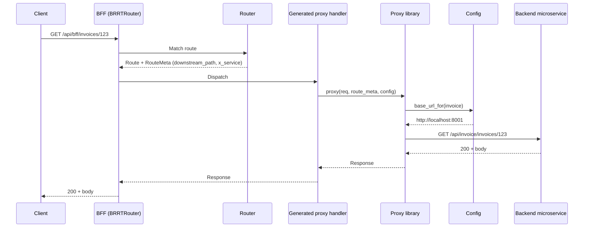

# Story 2.4 — BFF proxy integration

**GitHub issue:** [#265](https://github.com/microscaler/BRRTRouter/issues/265)  
**Epic:** [Epic 2 — BFF proxy library](README.md)

## Overview

End-to-end integration: BFF built from a generated spec (with proxy extensions and merged components/security), config with downstream base URLs, and generated proxy handlers, successfully receives a request and proxies it to a backend microservice, returning the backend response to the client.

## Delivery

- Wire Epic 1 and Epic 2 stories: BFF spec generated with `x-brrtrouter-downstream-path` and `x-service` (and components/security merged), BRRTRouter loading RouteMeta, config providing base URLs, proxy library and generated thin handlers.
- Add or extend an integration test or example: start (or mock) a backend; send request to BFF; assert BFF forwards to correct backend URL and returns backend response.
- Document the E2E flow and any deployment/config requirements.

## Acceptance criteria

- [ ] BFF built from generated spec runs and matches routes.
- [ ] Request to a proxy route (e.g. GET /api/bff/invoices/123) is forwarded to the configured backend URL (e.g. GET /api/invoice/invoices/123 on backend).
- [ ] Backend response (status, body) is returned to the client.
- [ ] Integration test or example demonstrates the full path: spec → RouteMeta → config → proxy library → backend → response.
- [ ] No hand-written proxy code in handler impls—all proxy behaviour from spec + library + config.

## Diagram

## References

- `docs/BFF_PROXY_ANALYSIS.md` §2.2c
- Epic 1 and Epic 2 stories 2.1–2.3
