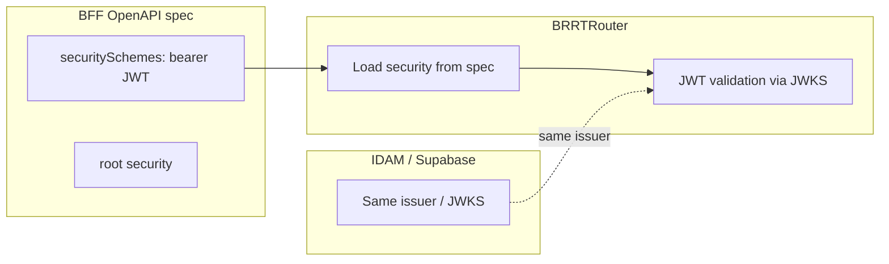

# Story 3.1 — BFF OpenAPI securitySchemes

**GitHub issue:** [#266](https://github.com/microscaler/BRRTRouter/issues/266)  
**Epic:** [Epic 3 — BFF ↔ IDAM auth/RBAC](README.md)

## Overview

The BFF OpenAPI spec must include securitySchemes (e.g. HTTP Bearer JWT) and root-level security so BRRTRouter runs auth. The issuer/JWKS should align with IDAM/Supabase so tokens issued via IDAM → Supabase are validated at the BFF without the BFF calling Supabase directly.

## Delivery

- Ensure generated (or maintained) BFF spec includes:
  - `components.securitySchemes` with a scheme suitable for JWT (e.g. `type: http`, `scheme: bearer`, `bearerFormat: JWT`), and JWKS URL or issuer that matches IDAM/Supabase.
  - Root-level `security` so protected routes require the scheme (e.g. `security: [bearerAuth: []]`).
- BRRTRouter SecurityProvider (e.g. JWKS bearer) is configured with the same issuer/JWKS so tokens issued by IDAM/Supabase validate at the BFF.
- Document: BFF does not call Supabase directly; validation is via BRRTRouter’s JWT validation against the same issuer IDAM uses.

## Acceptance criteria

- [ ] BFF spec contains securitySchemes (e.g. bearer JWT) and root security.
- [ ] BRRTRouter validates JWT for secured BFF routes using the same issuer/JWKS as IDAM/Supabase.
- [ ] Valid token (issued via IDAM/Supabase) is accepted; invalid or missing token returns 401.
- [ ] Documentation states that BFF auth is JWT validation against IDAM/Supabase issuer, not direct Supabase calls.

## Example config (OpenAPI)

```yaml
components:
  securitySchemes:
    bearerAuth:
      type: http
      scheme: bearer
      bearerFormat: JWT
      openIdConnectUrl: https://<project>.supabase.co/auth/v1/.well-known/jwks.json
security:
  - bearerAuth: []
```

## Diagram



## References

- BRRTRouter: `src/security/mod.rs`, `src/server/service.rs`
- `docs/BFF_PROXY_ANALYSIS.md` §6.1, §6.3
