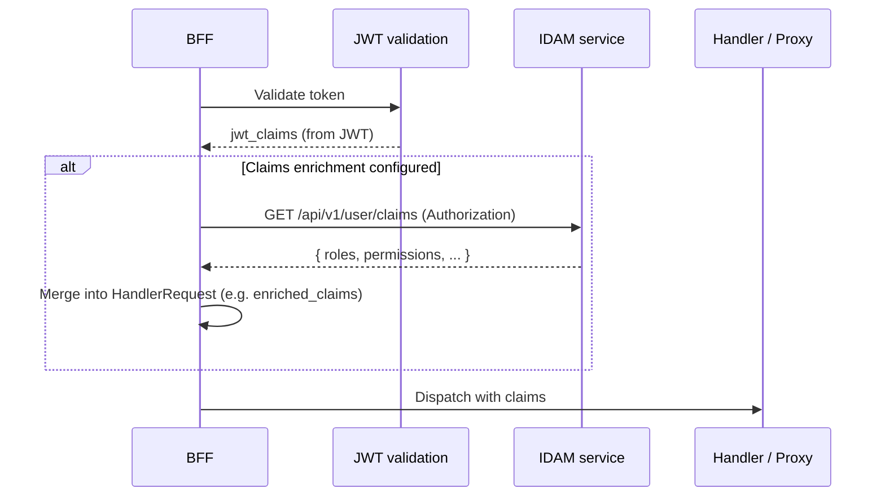

# Story 3.2 — Optional claims enrichment

**GitHub issue:** [#267](https://github.com/microscaler/BRRTRouter/issues/267)  
**Epic:** [Epic 3 — BFF ↔ IDAM auth/RBAC](README.md)

## Overview

After JWT validation, the BFF may need additional claims (e.g. roles, permissions) from an IDAM endpoint rather than only from the JWT payload. This story adds an optional “claims enrichment” step: call IDAM (e.g. “get user metadata/roles”), merge result into HandlerRequest so handlers and proxy can use it.

## Delivery

- Design and implement an optional post-validation step: if configured, call an IDAM HTTP endpoint (e.g. with Authorization header or token) to fetch user metadata/roles; merge into request context (e.g. extend `jwt_claims` or add `custom_claims` / `enriched_claims` on HandlerRequest).
- Configuration: IDAM base URL, endpoint path, and optionally headers (e.g. forward Authorization).
- When not configured, behaviour is unchanged (claims = JWT payload only).

## Acceptance criteria

- [ ] When claims enrichment is configured, after JWT validation the BFF calls the IDAM endpoint and merges the response into the request context.
- [ ] Handlers (and proxy library) can read enriched claims (e.g. from HandlerRequest).
- [ ] When not configured, no IDAM call; claims remain from JWT only.
- [ ] Errors from IDAM (e.g. 5xx) are handled (e.g. fail request or fall back to JWT-only claims) and documented.
- [ ] Config format and IDAM contract (request/response) are documented.

## Example config

Example configuration for IDAM claims endpoint:

```yaml
bff:
  idam:
    base_url: "http://idam:8080"
    claims_path: "/api/v1/user/claims"
    forward_authorization: true
```

## Diagram



## References

- `docs/BFF_PROXY_ANALYSIS.md` §5.4, §6.2, §6.3
- BRRTRouter: `src/dispatcher/core.rs` (HandlerRequest)
