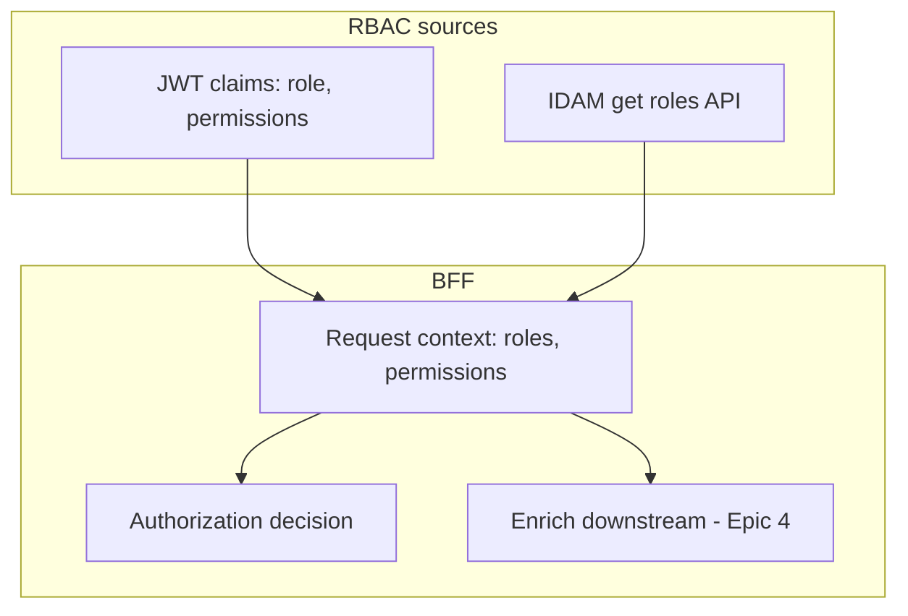

# Story 3.3 — RBAC from JWT or IDAM API

**GitHub issue:** [#268](https://github.com/microscaler/BRRTRouter/issues/268)  
**Epic:** [Epic 3 — BFF ↔ IDAM auth/RBAC](README.md)

## Overview

RBAC (roles/permissions) must be available to the BFF for authorization and for enriching downstream calls. Options: (1) custom claims in JWT (e.g. Supabase Auth Hooks adding `user_role`); (2) call IDAM “get user roles” (or similar) and use result in BFF. This story documents and implements the chosen path(s) so BFF can make authz decisions and pass role context to the proxy.

## Delivery

- Document supported RBAC model(s): JWT-only (Auth Hooks) vs IDAM API vs both.
- Implement or wire the chosen approach:
  - If JWT: ensure BFF reads role/permission claims from HandlerRequest.jwt_claims (or enriched_claims) and uses them for authz and downstream enrichment (Epic 4).
  - If IDAM API: ensure claims enrichment (Story 3.2) or a dedicated “get roles” call provides roles/permissions in request context.
- BFF can authorize requests (e.g. reject if role insufficient) and pass role/permission data to proxy (Epic 4) where applicable.

## Acceptance criteria

- [ ] RBAC model (JWT claims and/or IDAM API) is documented.
- [ ] BFF has access to roles/permissions in request context (from JWT and/or IDAM).
- [ ] BFF can perform authorization decisions (e.g. route-level or handler-level) using roles/permissions.
- [ ] Role/permission data is available for downstream enrichment (Epic 4) when proxy injects claim headers.
- [ ] Example or test demonstrates RBAC in use (e.g. role required for a route, or roles forwarded in headers).

## Example config (OpenAPI)

Security scheme may reference scopes or custom claims; application config may define role-to-permission mapping. Example of JWT with custom claim:

```yaml
# JWT from IDAM/Supabase may contain (via Auth Hooks):
# { "sub": "...", "user_role": "admin", "permissions": ["read:invoices", "write:invoices"] }
# BFF reads these from jwt_claims / enriched_claims for authz and forwarding.
```

## Diagram



## References

- `docs/BFF_PROXY_ANALYSIS.md` §6.2, §6.3
- Epic 4 (proxy claim headers)
