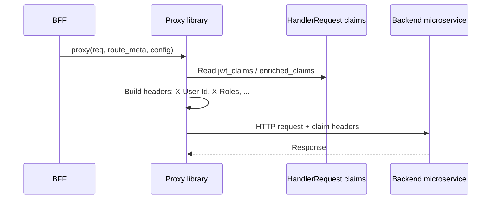

# Story 4.1 — Proxy claim headers

**GitHub issue:** [#269](https://github.com/microscaler/BRRTRouter/issues/269)  
**Epic:** [Epic 4 — Enrich downstream](README.md)

## Overview

The proxy library must inject claim-derived headers into the downstream HTTP request so the backend microservice receives user/role context without re-validating the JWT. Headers (e.g. X-User-Id, X-Roles, X-Permissions) are derived from HandlerRequest.jwt_claims and/or enriched_claims.

## Delivery

- Extend the proxy library (e.g. `brrtrouter::bff::proxy`) so that when building the downstream request it adds headers derived from the request’s claims (jwt_claims and any enriched/custom claims).
- Default or initial mapping: e.g. `sub` → `X-User-Id`, `roles` or `user_role` → `X-Roles`, `permissions` → `X-Permissions` (exact names and JSON handling to be defined).
- Backend is responsible for interpreting these headers for RBAC and Lifeguard session claims (Epic 5).

## Acceptance criteria

- [ ] Proxy library adds claim-derived headers to the downstream request when claims are present.
- [ ] At least user identity (e.g. X-User-Id from sub) and roles (e.g. X-Roles) are supported.
- [ ] Headers are set from HandlerRequest claims (jwt_claims and/or enriched_claims).
- [ ] Integration test or example: BFF proxy forwards request; backend receives expected claim headers.
- [ ] Document header names and semantics for backend consumers.

## Example config

Default mapping (can be overridden in Story 4.2):

- `sub` → `X-User-Id`
- `roles` or `user_role` → `X-Roles` (e.g. JSON array or comma-separated)
- `permissions` → `X-Permissions` (e.g. JSON array or comma-separated)

## Diagram

## References

- BRRTRouter: proxy library (Epic 2), `src/dispatcher/core.rs` (HandlerRequest)
- `docs/BFF_PROXY_ANALYSIS.md` §5.5
- Epic 5 (microservice validates and uses claims)
