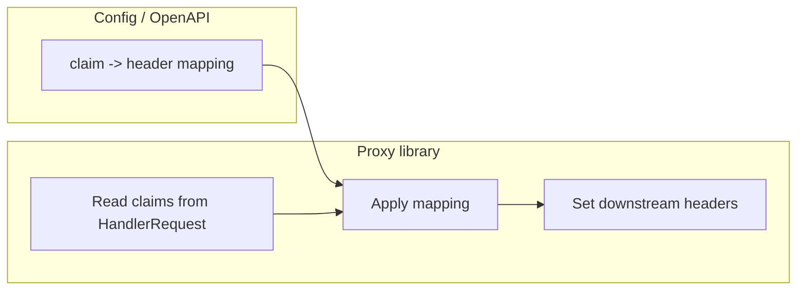

# Story 4.2 — Configurable claim→header mapping

**GitHub issue:** [#270](https://github.com/microscaler/BRRTRouter/issues/270)  
**Epic:** [Epic 4 — Enrich downstream](README.md)

## Overview

Which claims are forwarded and under which header names should be configurable (via config or OpenAPI extension) so different deployments or backends can choose header names and claim keys without code changes. The proxy library applies this mapping when injecting claim headers.

## Delivery

- Define config shape or OpenAPI extension: list of (claim key or path, header name) so the proxy library knows which claims to forward and under which headers.
- Proxy library reads this mapping and applies it when building the downstream request (Story 4.1 behaviour becomes config-driven).
- Default mapping remains available when no config is provided (e.g. sub → X-User-Id, roles → X-Roles).
- Document format and examples.

## Acceptance criteria

- [ ] Config or OpenAPI extension defines claim→header mapping (e.g. claim key/path → header name).
- [ ] Proxy library uses this mapping when injecting claim headers; when not configured, default mapping applies.
- [ ] Multiple claims can map to different headers; same claim can map to one header.
- [ ] Format is documented; example config is provided.
- [ ] Integration test: custom mapping produces expected headers on downstream request.

## Example config

YAML example:

```yaml
bff:
  proxy:
    claim_headers:
      - claim: sub
        header: X-User-Id
      - claim: user_role
        header: X-Role
      - claim: permissions
        header: X-Permissions
```

OpenAPI extension alternative (per-operation or global):

```yaml
x-brrtrouter-claim-headers:
  - claim: sub
    header: X-User-Id
  - claim: roles
    header: X-Roles
```

## Diagram



## References

- `docs/BFF_PROXY_ANALYSIS.md` §5.5
- Story 4.1 (proxy claim headers)
