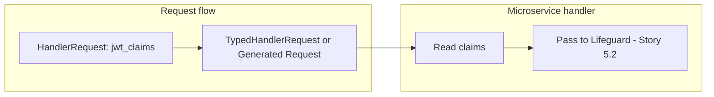

# Story 5.1 — Expose jwt_claims to typed handlers

**GitHub issue:** [#271](https://github.com/microscaler/BRRTRouter/issues/271)  
**Epic:** [Epic 5 — Microservices claims + Lifeguard](README.md)

## Overview

Backend microservice handlers using TypedHandlerRequest or the generated Request type do not currently receive jwt_claims; only raw HandlerRequest has jwt_claims. This story exposes claims to typed handlers so they can pass them to Lifeguard and use them for authz without dropping to raw HandlerRequest.

## Delivery

- Expose jwt_claims (and optionally enriched_claims) on TypedHandlerRequest or on the generated Request type so typed handlers can read claims.
- Options: add `jwt_claims: Option<Value>` (or equivalent) to TypedHandlerRequest; or extend the generator to include a claims field in the generated Request type. Choose one and implement.
- Handlers can then pass claims into Lifeguard session (Story 5.2) and use them for authorization.

## Acceptance criteria

- [ ] TypedHandlerRequest or generated Request type includes a way to read jwt_claims (and enriched_claims if present).
- [ ] Microservice handlers using the typed API can access claims without using raw HandlerRequest.
- [ ] Claims are populated when security validation runs (e.g. JWT or forwarded-claim validation).
- [ ] Unit or integration test: typed handler receives claims when request is validated.
- [ ] No regression for handlers that do not use claims.

## Diagram

## References

- BRRTRouter: `src/typed/core.rs`, `src/dispatcher/core.rs`, generator for Request type
- `docs/BFF_PROXY_ANALYSIS.md` §7.1, §7.3 (G9)
