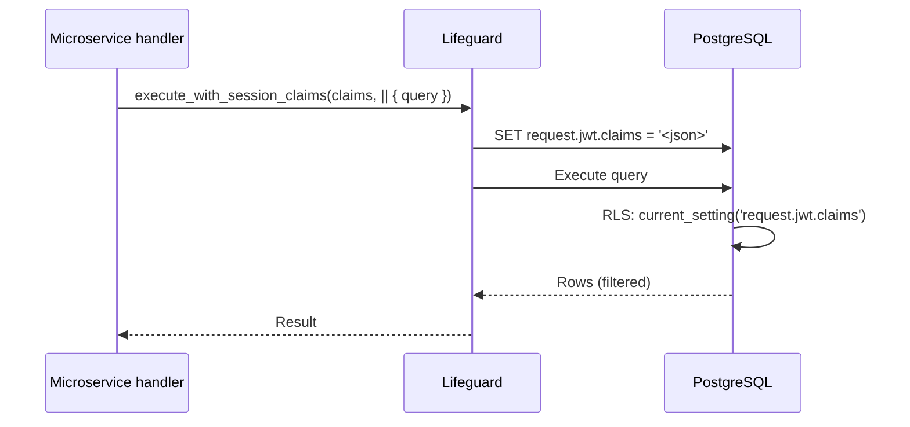

# Story 5.2 — Lifeguard session claims

**GitHub issue:** [#272](https://github.com/microscaler/BRRTRouter/issues/272)  
**Epic:** [Epic 5 — Microservices claims + Lifeguard](README.md)

## Overview

Postgres RLS policies can use `current_setting('request.jwt.claims', true)::json` (or Supabase-style helpers) to enforce row-based access. For that to work, the session must have `request.jwt.claims` set before running queries. Lifeguard currently has no API to set per-request session variables. This story adds an API (e.g. “execute with session claims”) so microservices can run queries with request-scoped claims.

## Delivery

- Add a Lifeguard API to set session claims for the duration of a query or transaction (e.g. `set_config('request.jwt.claims', claims_json, true)` on the connection before executing queries).
- Options: “execute with session claims” wrapper that sets config, runs the closure, then clears; or a request-scoped connection wrapper that holds claims. Implement the chosen approach in Lifeguard (or in a BRRTRouter/Lifeguard integration crate if Lifeguard is external).
- Document usage so microservice handlers (with claims from Story 5.1) can pass claims into Lifeguard and run RLS-filtered queries.

## Acceptance criteria

- [ ] Lifeguard (or integration crate) provides an API to run queries with request-scoped session claims (e.g. `request.jwt.claims` set on the connection).
- [ ] RLS policies that read `current_setting('request.jwt.claims', true)::json` (or equivalent) see the claims set by the microservice.
- [ ] Claims are scoped to the request/transaction; they do not leak to other requests on the same connection after the call.
- [ ] Document API and example: handler gets claims from TypedHandlerRequest, passes to Lifeguard “execute with session claims”, runs query.
- [ ] Test: run query with claims set; RLS policy filters rows correctly.

## Example usage (conceptual)

Handler flow: get claims from TypedHandlerRequest → call Lifeguard “execute with session claims” (claims JSON) → run query/transaction → RLS uses `request.jwt.claims`. No code snippets in story—reference Lifeguard connection/execute APIs and session variable naming.

## Diagram

## References

- Lifeguard: `lifeguard/README.md`, `lifeguard/src/connection.rs`, `lifeguard/src/pool/`
- `docs/BFF_PROXY_ANALYSIS.md` §7.1, §7.2 (G10)
