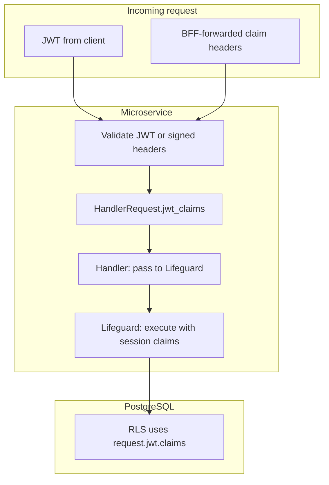

# Story 5.3 — Microservice auth model

**GitHub issue:** [#273](https://github.com/microscaler/BRRTRouter/issues/273)  
**Epic:** [Epic 5 — Microservices claims + Lifeguard](README.md)

## Overview

Backend microservices must validate claims (e.g. JWT or signed headers from BFF) and use that metadata for DB access. This story documents and implements the chosen microservice auth model: (1) JWT at microservice—validate same JWT and get claims in HandlerRequest; or (2) BFF forwards claims in headers—microservice validates signed header (e.g. HMAC) and maps to session claims. A single pattern (“validate → bind claims to Lifeguard”) should be documented and, where possible, provided by shared code or Lifeguard.

## Delivery

- Document the microservice auth model(s): JWT validation at microservice vs forwarded-claim headers (e.g. X-User-Id, X-Claims with HMAC), and how claims are bound to Lifeguard session (Story 5.2).
- Implement the chosen path: e.g. BRRTRouter SecurityProvider for JWT at microservice, or validation of BFF-injected headers (signature/HMAC) and mapping to HandlerRequest.jwt_claims so handlers and Lifeguard can use them.
- Ensure “validate → bind to Lifeguard” flow is clear and, where possible, supported by shared code or docs so microservice authors do not hand-roll auth per service.

## Acceptance criteria

- [ ] Microservice auth model is documented: JWT at microservice and/or forwarded-claim headers, validation, and binding to Lifeguard.
- [ ] Microservices can validate incoming claims (JWT or signed headers) and have them available in HandlerRequest / TypedHandlerRequest.
- [ ] Validated claims can be passed to Lifeguard session claims API (Story 5.2) for RLS.
- [ ] Shared validation or docs reduce per-service auth duplication.
- [ ] Test or example: request with validated claims → handler → Lifeguard with session claims → RLS-filtered result.

## Diagram

## References

- `docs/BFF_PROXY_ANALYSIS.md` §7.2, §7.3 (G11)
- Epic 4 (BFF injects claim headers)
- Story 5.1 (expose claims to handlers), Story 5.2 (Lifeguard session claims)
