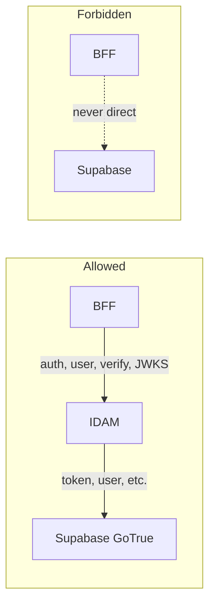
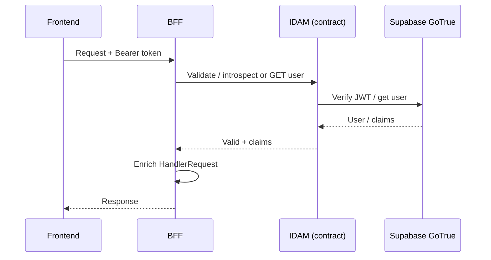

# Story 6.1 — Document IDAM contract

**GitHub issue:** [#282](https://github.com/microscaler/BRRTRouter/issues/282)  
**Epic:** [Epic 6 — IDAM contract and reference spec](README.md)

## Overview

Add the "IDAM contract" to BRRTRouter (or Microscaler) documentation: the endpoints and behaviour the BFF expects from IDAM for auth, RBAC/claims, and JWKS. BFF never talks to Supabase directly; it calls IDAM. This keeps BFF/BRRTRouter agnostic of which IDAM implementation each system uses.

## Diagram: IDAM contract (BFF ↔ IDAM ↔ Supabase)

**Contract:** BFF calls IDAM only; IDAM wraps GoTrue. The documented endpoints and behaviour are what BFF expects from any IDAM implementation.

## Sequence: BFF auth and claims (contract usage)

## Delivery

- Add a doc section (e.g. in `docs/` or ARCHITECTURE) describing the **IDAM contract**:
  - Endpoints: token (login/refresh), logout, signup, recover, otp, verify, user (GET/PUT), reauthenticate, factors, identity link/unlink, authorize, callback, settings, JWKS, health (see [IDAM GoTrue API Mapping](../../../IDAM_GOTRUE_API_MAPPING.md) §1).
  - Behaviour: IDAM wraps Supabase GoTrue; apps never call Supabase directly; IDAM returns JWTs from same issuer BFF validates with JWKS.
  - Optional: "introspect" or "get claims" endpoint for BFF claims enrichment (BFF Proxy Analysis §5.4).
- Cross-link from BFF Proxy Analysis §6 and IDAM Microscaler Analysis.

## Acceptance criteria

- [ ] IDAM contract is documented (endpoints and behaviour expected by BFF).
- [ ] Document states BFF never calls Supabase directly.
- [ ] References to contract from BFF and IDAM analysis docs.

## References

- [IDAM Microscaler Analysis](../../../IDAM_MICROSCALER_ANALYSIS.md)
- [IDAM GoTrue API Mapping](../../../IDAM_GOTRUE_API_MAPPING.md) §1
- [BFF Proxy Analysis](../../../BFF_PROXY_ANALYSIS.md) §5.4, §6
