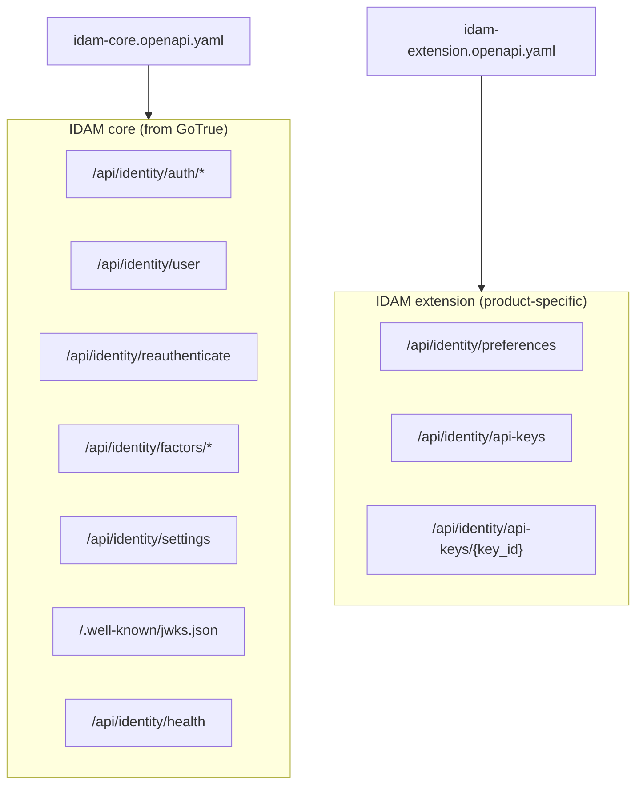
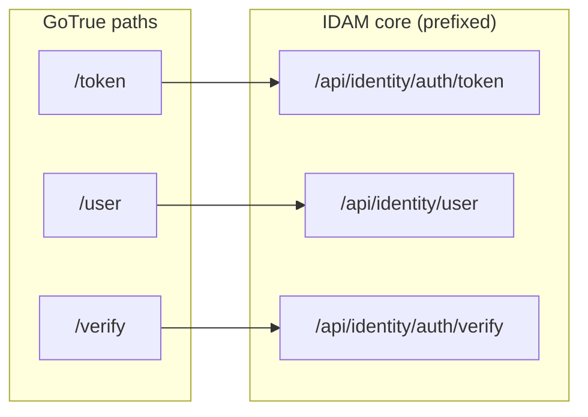

# Story 6.2 — Reference IDAM core OpenAPI

**GitHub issue:** [#283](https://github.com/microscaler/BRRTRouter/issues/283)  
**Epic:** [Epic 6 — IDAM contract and reference spec](README.md)

## Overview

Derive a reference **IDAM core** OpenAPI spec from the GoTrue API (path prefix, e.g. `/api/identity/auth/*`), and document the path layout so core vs extension boundaries are clear for merged-spec and two-service deployments.

## Diagram: Path layout (core vs extension)

## Diagram: GoTrue path → IDAM core path (prefix)

## Delivery

- Produce (or document how to produce) **reference `idam-core.openapi.yaml`** from GoTrue openapi.yaml:
  - Apply path prefix (e.g. `/api/identity/auth` for GoTrue `/token`, `/signup`, etc.) so core paths are distinct.
  - Include: token, logout, signup, recover, resend, magiclink, otp, verify, user (GET/PUT), reauthenticate, factors, identity link/unlink, authorize, callback, SSO/SAML, settings, JWKS, health (and optionally admin).
- Document **path layout**: which paths belong to core vs extension (e.g. core: `/api/identity/auth/*`, `/api/identity/user/*`; extension: `/api/identity/preferences`, `/api/identity/api-keys/*`) so [IDAM Design: Core and Extension](../../../IDAM_DESIGN_CORE_AND_EXTENSION.md) ingress rules and merge logic are unambiguous.

## Acceptance criteria

- [ ] Reference IDAM core OpenAPI exists or is documented (derived from GoTrue + path prefix).
- [ ] Path layout (core vs extension prefixes) is documented.
- [ ] Compatible with IDAM GoTrue API Mapping §3 and IDAM Design §4.2.

## References

- [IDAM GoTrue API Mapping](../../../IDAM_GOTRUE_API_MAPPING.md) §1, §3
- [IDAM Design: Core and Extension](../../../IDAM_DESIGN_CORE_AND_EXTENSION.md) §4.2
