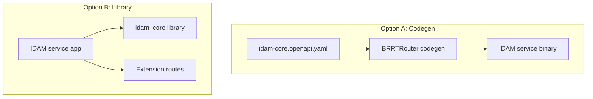
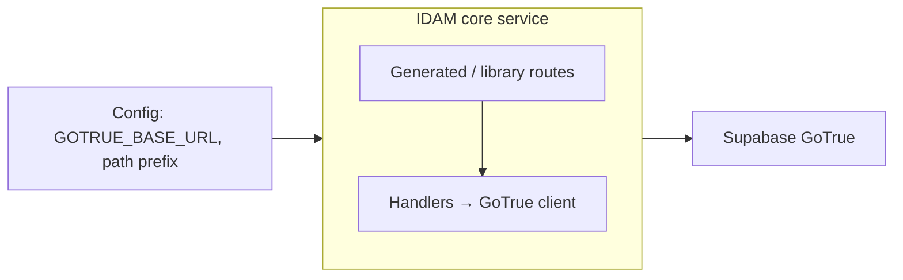

# Story 7.1 — IDAM core service skeleton

**GitHub issue:** [#284](https://github.com/microscaler/BRRTRouter/issues/284)  
**Epic:** [Epic 7 — IDAM core implementation](README.md)

## Overview

Create the IDAM core service skeleton: BRRTRouter codegen from the reference IDAM core OpenAPI (from Epic 6) or a shared library that an IDAM service uses. Config: GoTrue base URL and path prefix so the service can proxy to Supabase Auth.

## Diagram: Build options (codegen vs library)

## Diagram: IDAM core service and config

## Delivery

- **Option A:** Run BRRTRouter codegen on reference `idam-core.openapi.yaml` → IDAM service binary with routes; handlers delegate to GoTrue client (Story 7.2).
- **Option B:** Shared library (e.g. `idam_core`) that exposes the same route/handler surface; IDAM service depends on it and adds extension routes.
- Config: `GOTRUE_BASE_URL` (or equivalent), path prefix if needed; document for local and K8s deployment.

## Acceptance criteria

- [ ] IDAM core service skeleton exists (codegen or library).
- [ ] Config for GoTrue base URL (and optional path prefix) is documented and wired.
- [ ] Service (or library) can be built and run; handlers can be stubbed or delegate to GoTrue client (Story 7.2).

## References

- [Epic 6 — Reference IDAM core OpenAPI](../epic-6-idam-contract/story-6.2-reference-idam-core-openapi.md)
- [IDAM GoTrue API Mapping](../../../IDAM_GOTRUE_API_MAPPING.md)
