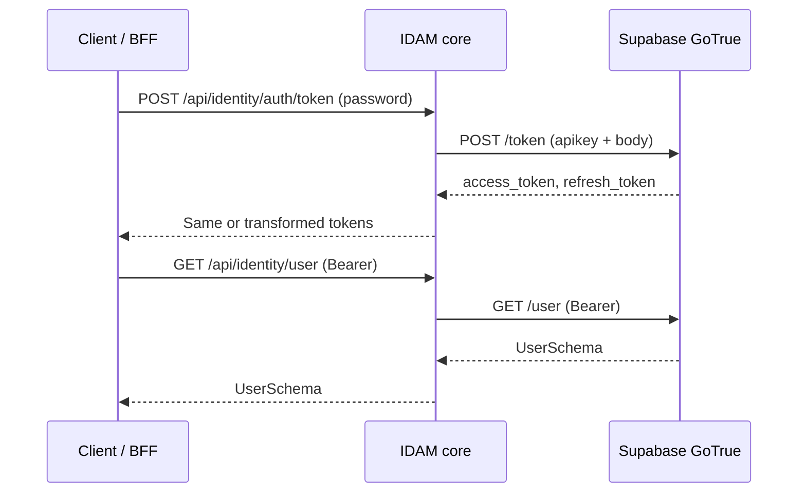
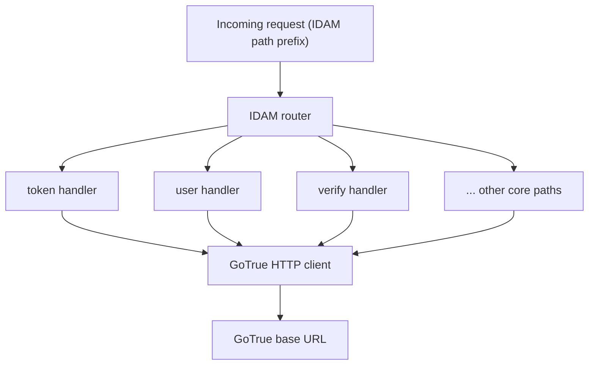

# Story 7.2 — GoTrue client integration

**GitHub issue:** [#285](https://github.com/microscaler/BRRTRouter/issues/285)  
**Epic:** [Epic 7 — IDAM core implementation](README.md)

## Overview

Integrate the IDAM core with Supabase GoTrue: implement (or wire) handlers for all core paths so IDAM is a proper proxy. Use the path list from [IDAM GoTrue API Mapping](../../../IDAM_GOTRUE_API_MAPPING.md) §3.1 (token, logout, signup, recover, resend, magiclink, otp, verify, user GET/PUT, reauthenticate, factors, identity link/unlink, authorize, callback, SSO/SAML, settings, JWKS, health).

## Sequence: IDAM proxy to GoTrue

## Diagram: Handler delegation to GoTrue client

## Delivery

- **GoTrue client:** HTTP client to GoTrue base URL (existing or new): token (password, refresh, pkce, id_token), logout, signup, recover, resend, magiclink, otp, verify, user (GET/PUT), reauthenticate, factors (enroll, challenge, verify, unenroll), identity authorize/delete, callback, sso/saml, settings, health. Pass-through or transform responses as needed for IDAM path prefix.
- **Handlers:** IDAM core routes call the GoTrue client and return responses; JWKS and openid-configuration can proxy to GoTrue or serve from config.
- **Auth:** API key (or service auth) for IDAM→GoTrue; document how IDAM obtains it (env, secret).

## Acceptance criteria

- [ ] All IDAM core paths (from §3.1 mapping) are implemented via GoTrue client.
- [ ] IDAM returns JWTs from same issuer as GoTrue (pass-through or re-issue); BFF can validate with GoTrue JWKS.
- [ ] IDAM→GoTrue authentication (apikey or service role) is documented and configurable.

## References

- [IDAM GoTrue API Mapping](../../../IDAM_GOTRUE_API_MAPPING.md) §1.1, §3.1
