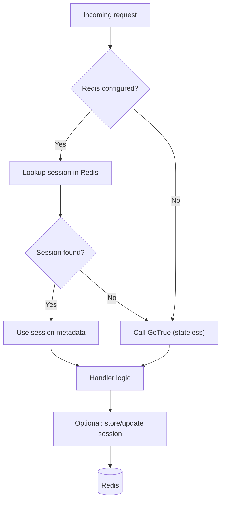
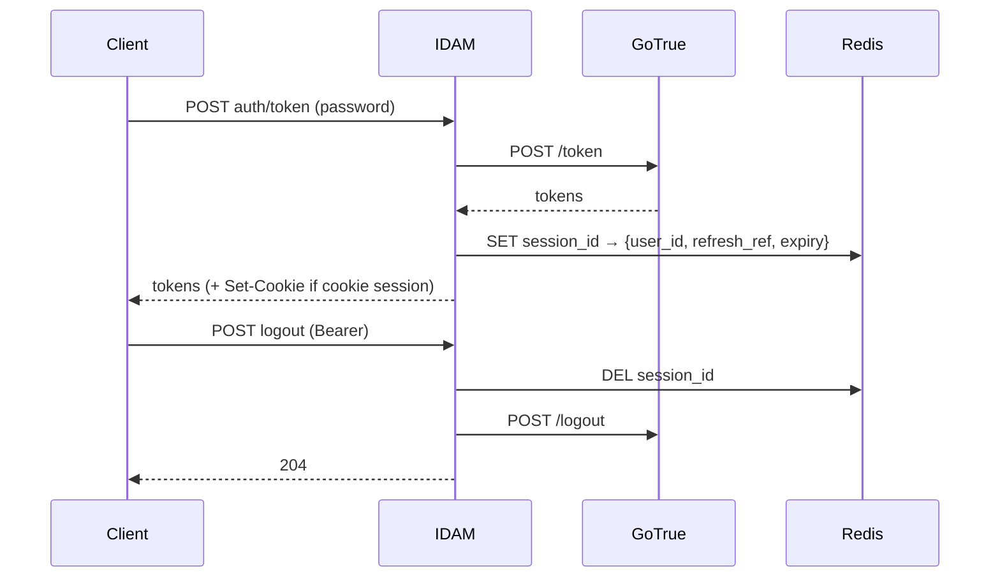

# Story 7.3 — Optional session/Redis store

**GitHub issue:** [#286](https://github.com/microscaler/BRRTRouter/issues/286)  
**Epic:** [Epic 7 — IDAM core implementation](README.md)

## Overview

Add an optional server-side session store (e.g. Redis) for IDAM so sessions can be stored and invalidated server-side. GoTrue is stateless (JWT + refresh); this is an IDAM-layer addition for products that need it.

## Diagram: Request path with vs without Redis

## Sequence: Login and logout with session store

## Delivery

- **Config:** Optional Redis URL (or equivalent); if not set, IDAM runs without session store (stateless like GoTrue).
- **Session store:** Store session metadata (e.g. user id, refresh token reference, expiry) in Redis; key by session id or cookie. Use for: optional session lookup on request, logout-all, or invalidation.
- **Wiring:** IDAM core can check Redis on auth flows (e.g. after token exchange) and on logout; document behaviour when Redis is disabled.

## Acceptance criteria

- [ ] Optional Redis (or equivalent) session store is configurable.
- [ ] When enabled, IDAM can store and retrieve session data; logout can invalidate server-side.
- [ ] When disabled, IDAM behaviour is unchanged (stateless).
- [ ] Document session store behaviour and config in IDAM docs.

## References

- [IDAM Microscaler Analysis](../../../IDAM_MICROSCALER_ANALYSIS.md) §2.1 (Session / Redis)
- [IDAM Design: Core and Extension](../../../IDAM_DESIGN_CORE_AND_EXTENSION.md)
