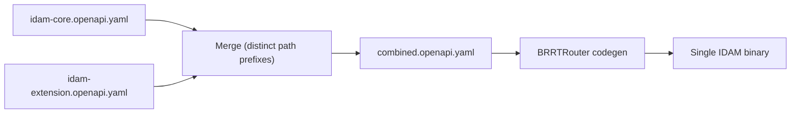
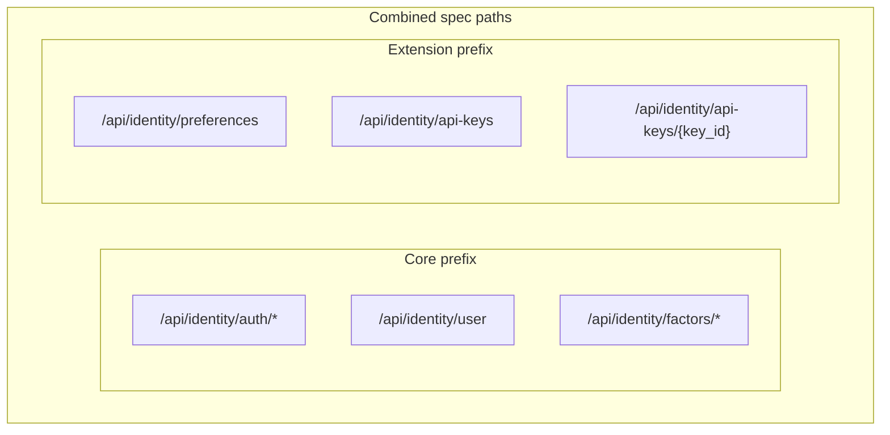

# Story 8.1 — Core + extension spec merge at build

**GitHub issue:** [#287](https://github.com/microscaler/BRRTRouter/issues/287)  
**Epic:** [Epic 8 — IDAM extension and build/deploy](README.md)

## Overview

Implement (or document) a build step that merges the reference IDAM core OpenAPI and the customer IDAM extension OpenAPI into one combined OpenAPI spec so BRRTRouter codegen produces a single IDAM service with both core and extension routes.

## Diagram: Build pipeline (merge → codegen)

## Diagram: Path namespace (no clashes)

## Delivery

- **Merge logic:** Generator script or manual process: input = `idam-core.openapi.yaml` (reference) + `idam-extension.openapi.yaml` (customer); output = combined OpenAPI with no path clashes (core and extension use distinct path prefixes).
- **Codegen:** BRRTRouter codegen runs on the combined spec → one IDAM binary; core paths implemented by shared library or generated handlers; extension paths implemented by customer handlers.
- **Document:** How to run the merge (CLI or build target); how to add extension paths (schema and path conventions from Epic 6.2).

## Acceptance criteria

- [ ] Merge step produces a valid combined OpenAPI (no duplicate paths).
- [ ] BRRTRouter codegen on combined spec produces one IDAM service.
- [ ] Documented: how to add customer extension spec and run merge + codegen.

## References

- [IDAM Design: Core and Extension](../../../IDAM_DESIGN_CORE_AND_EXTENSION.md) §2.2 (Option I)
- [Epic 6.2 — Reference IDAM core OpenAPI](../epic-6-idam-contract/story-6.2-reference-idam-core-openapi.md)
