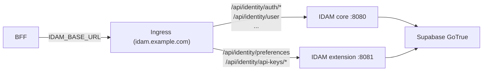
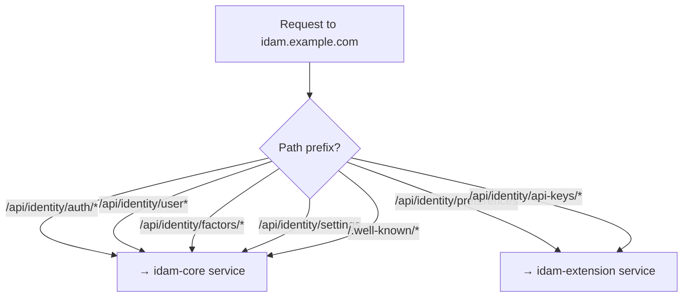

# Story 8.2 — Path conventions and ingress rules

**GitHub issue:** [#288](https://github.com/microscaler/BRRTRouter/issues/288)  
**Epic:** [Epic 8 — IDAM extension and build/deploy](README.md)

## Overview

Document path conventions for IDAM core vs extension so that (1) merged-spec builds use consistent prefixes and (2) the two-service deployment option can use ingress path-based routing (e.g. `/api/identity/auth/*` → core, `/api/identity/preferences`, `/api/identity/api-keys/*` → extension) with one host for the BFF.

## Diagram: Ingress path-based routing (two-service option)

## Diagram: Path → backend mapping

## Delivery

- **Path layout:** Document core path prefix (e.g. `/api/identity/auth/*`, `/api/identity/user/*`, `/api/identity/reauthenticate`, `/api/identity/factors/*`, `/api/identity/settings`, `/api/identity/health`, `/.well-known/*`) and extension path prefix (e.g. `/api/identity/preferences`, `/api/identity/api-keys`, `/api/identity/api-keys/{key_id}`).
- **Ingress rules:** Document example ingress (or API gateway) rules for two-service deployment: one host (e.g. `idam.example.com`), path-based routing to idam-core (port 8080) vs idam-extension (port 8081).
- **Reference:** Align with [IDAM Design: Core and Extension](../../../IDAM_DESIGN_CORE_AND_EXTENSION.md) §4.2, §5.

## Acceptance criteria

- [ ] Path layout (core vs extension prefixes) is documented.
- [ ] Ingress path-based routing rules for two-service option are documented (example rules or snippet).
- [ ] BFF can use one IDAM base URL in both single-service and two-service (with ingress) deployments.

## References

- [IDAM Design: Core and Extension](../../../IDAM_DESIGN_CORE_AND_EXTENSION.md) §4.2, §5
- [IDAM GoTrue API Mapping](../../../IDAM_GOTRUE_API_MAPPING.md) §3
