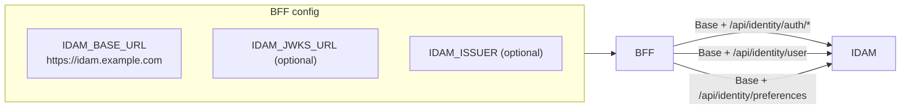
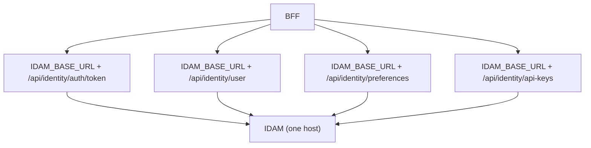

# Story 9.1 — BFF IDAM base URL config and path layout

**GitHub issue:** [#289](https://github.com/microscaler/BRRTRouter/issues/289)  
**Epic:** [Epic 9 — BFF ↔ IDAM integration](README.md)

## Overview

Define and document BFF config for IDAM: a single base URL (`IDAM_BASE_URL`) so all IDAM calls (auth, users/me, preferences, API keys) go to one host. Document the path layout so BFF and IDAM agree on paths (align with IDAM contract and path conventions from Epic 6 and Epic 8).

## Diagram: BFF config and single IDAM URL

## Diagram: Path layout (BFF → IDAM)

## Delivery

- **Config:** BFF (or BRRTRouter) config: `IDAM_BASE_URL` (e.g. `https://idam.example.com`). Optional: `IDAM_JWKS_URL`, `IDAM_ISSUER` if BFF validates tokens locally.
- **Path layout:** Document which paths the BFF calls: e.g. `/api/identity/auth/*`, `/api/identity/user` (users me), `/api/identity/preferences`, `/api/identity/api-keys/*`; align with IDAM contract (Epic 6) and path conventions (Epic 8.2).
- **Env/docs:** Document config keys and example values for local and K8s; link to IDAM Design §4.1.

## Acceptance criteria

- [ ] BFF config for `IDAM_BASE_URL` (and optional JWKS/issuer) is defined and documented.
- [ ] Path layout (which paths BFF calls on IDAM) is documented and aligned with IDAM contract and path conventions.
- [ ] Example env or config for local and K8s deployment.

## References

- [IDAM Design: Core and Extension](../../../IDAM_DESIGN_CORE_AND_EXTENSION.md) §4.1, §4.2
- [Epic 6 — IDAM contract](../epic-6-idam-contract/README.md)
- [Story 8.2 — Path conventions](../epic-8-idam-extension/story-8.2-path-conventions-ingress.md)
