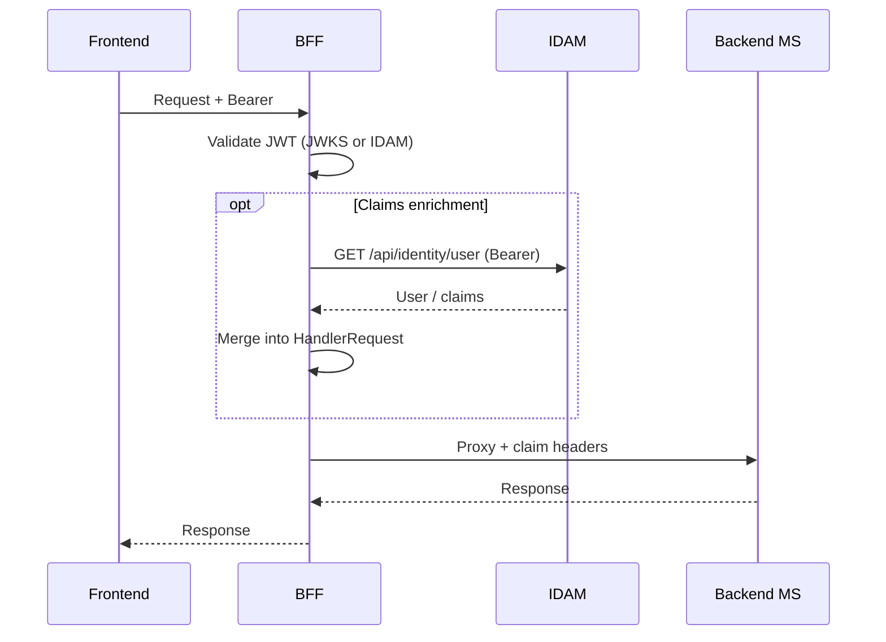
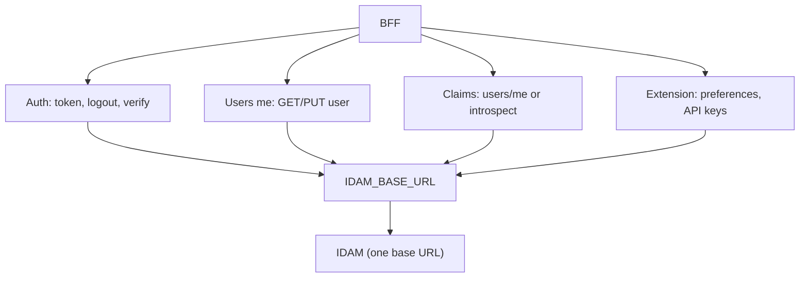
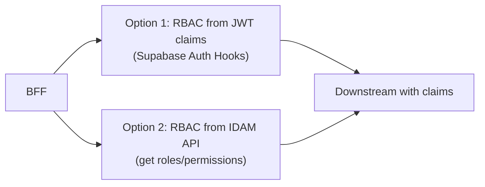

# Story 9.2 — Document BFF usage of IDAM

**GitHub issue:** [#290](https://github.com/microscaler/BRRTRouter/issues/290)  
**Epic:** [Epic 9 — BFF ↔ IDAM integration](README.md)

## Overview

Document how the BFF uses IDAM: single base URL for all IDAM calls; optional claims enrichment (call IDAM users/me or introspect endpoint); RBAC from JWT claims or IDAM API. Cross-link to BFF Proxy Analysis §5.4, §6 so BFF/IDAM auth and RBAC flow are clear.

## Sequence: BFF auth, claims enrichment, and proxy

## Diagram: BFF usage of IDAM (single URL)

## Diagram: RBAC options

## Delivery

- **Doc section:** Add (or extend) documentation: BFF never calls Supabase directly; BFF calls IDAM at `IDAM_BASE_URL` for auth, users/me, and extension endpoints (preferences, API keys).
- **Claims enrichment:** Document optional step: after JWT validation, BFF calls IDAM (e.g. GET users/me or introspect) and merges result into HandlerRequest; link to BFF Proxy Analysis §5.4 (Custom claims from IDAM).
- **RBAC:** Document options: (1) RBAC from JWT claims (Supabase Auth Hooks); (2) RBAC from IDAM API (get roles/permissions); link to BFF Proxy Analysis §6 (BFF ↔ IDAM RBAC).

## Acceptance criteria

- [ ] BFF usage of IDAM (single URL, claims enrichment, RBAC options) is documented.
- [ ] Cross-links to BFF Proxy Analysis §5.4, §6 and IDAM contract (Epic 6).
- [ ] Document states BFF uses one IDAM base URL (single-service or two-service with ingress).

## References

- [BFF Proxy Analysis](../../../BFF_PROXY_ANALYSIS.md) §5.4, §6
- [IDAM Design: Core and Extension](../../../IDAM_DESIGN_CORE_AND_EXTENSION.md) §4
- [Epic 6 — IDAM contract](../epic-6-idam-contract/README.md)
