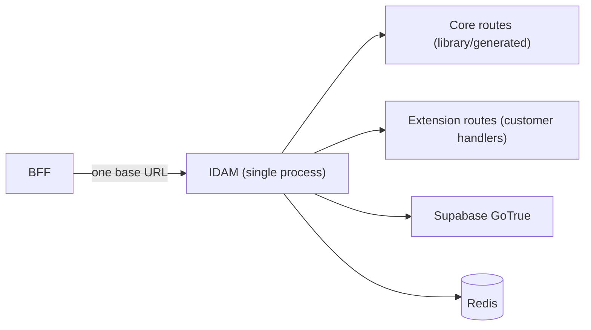
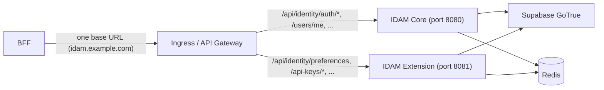
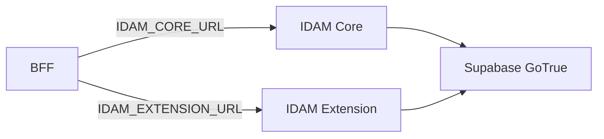

# IDAM Design: Core + Extension and BFF Usage

**Purpose:** Analyse how a “shared IDAM core + customer extension” would be composed: one microservice vs two, reference vs customer OpenAPI, and how the BFF uses IDAM in each case.

**Prerequisite:** [IDAM Microscaler Analysis](IDAM_MICROSCALER_ANALYSIS.md) — recommendation is shared core + per-system IDAM (hybrid), with an optional reference implementation and customer-specific extensions.

---

## 1. Is IDAM “Two Microservices”?

**Short answer:** It can be **one** microservice (recommended default) or **two** (core + extension). It does **not** have to be “BRRTRouter-provided IDAM + customer IDAM extension” as two separate processes unless you choose that deployment.

| Model | Description | BFF sees |
|-------|--------------|----------|
| **A. Single service (merged)** | One IDAM process. OpenAPI = reference core spec + customer extension spec **merged at build/generation time**. One binary, one port, one base URL. | One IDAM base URL. |
| **B. Two services, single ingress** | IDAM core (one service/port) + IDAM extension (second service/port). **Ingress** routes by path to core or extension so the BFF still calls **one host**. | One IDAM base URL (host); ingress fans out by path. |
| **C. Two services, two URLs** | Core and extension are separate services; BFF (or BRRTRouter config) has **two** base URLs and knows which paths go to which. | Two IDAM base URLs; BFF or proxy must route by path. |

So: “Core + extension” is a **logical** split (reference OpenAPI + customer OpenAPI). The **deployment** can be one process (merged) or two processes (with ingress aggregating so BFF still uses one URL, or with BFF using two URLs). The rest of this document spells out each model and how the BFF uses IDAM.

---

## 2. Reference OpenAPI vs Customer OpenAPI

### 2.1 Two spec sources

- **Reference (core) `openapi.yaml`:** Microscaler/BRRTRouter-provided. Minimal IDAM contract: Supabase GoTrue proxy, login (email/password), OAuth flows, “users me”, verification status, update password, optional “introspect/claims” for BFF. Same for every system that uses the pattern.
- **Customer (extension) `openapi.yaml`:** Product-specific. Extra paths and schemas: e.g. API keys CRUD, preferences (theme, timezone, risk-mode), dual OTP flows, portal-specific endpoints, `human_name_id`/`email_address_id` if the product needs them.

For the API-level mapping (which paths come from GoTrue vs product), see [IDAM GoTrue API Mapping](IDAM_GOTRUE_API_MAPPING.md). The question is how these two specs are **used at build and runtime**.

### 2.2 Option I: Merged at build time (single service)

- **Build:** A generator (or manual step) **merges** reference `idam-core.openapi.yaml` and customer `idam-extension.openapi.yaml` into one **combined** OpenAPI spec (e.g. path prefixes kept distinct: core owns `/api/identity/auth/*`, extension adds `/api/identity/preferences`, `/api/identity/api-keys/*`, etc.). BRRTRouter codegen runs on the **combined** spec → **one** IDAM service (one binary, one port).
- **Implementation:** Core paths are implemented by a **shared library** or by code generated from the core spec; extension paths are implemented by **customer code** (handlers) that you own. So: one repo/service, two spec *sources*, one deployed process.
- **No sidecar, no second port.** The “extension” is just extra routes and handlers in the same process.

**BFF usage:** BFF has **one** IDAM base URL. All auth, “users me”, and extension calls (preferences, API keys) go to that URL. No path-based routing logic in BFF beyond “call IDAM at base URL + path”.

### 2.3 Option II: Two services, path-based routing at ingress (one logical IDAM URL)

- **Build:** Reference spec → **IDAM core** (Microscaler-provided or generated) → one service, one port (e.g. 8080). Customer spec → **IDAM extension** (customer-owned) → second service, second port (e.g. 8081). No merging of specs; two separate deployments (or two containers in one pod, i.e. “sidecar”).
- **Runtime:** **Ingress** (or API gateway) exposes **one** host (e.g. `idam.example.com`). Rules:
  - `/api/identity/auth/*`, `/api/identity/users/me`, etc. → backend **idam-core** (port 8080).
  - `/api/identity/preferences`, `/api/identity/api-keys/*`, etc. → backend **idam-extension** (port 8081).
- So the BFF still calls **one** base URL (`https://idam.example.com`). The BFF does **not** need to know about two microservices; ingress does the path-based fan-out.

**BFF usage:** Same as Option I from the BFF’s perspective: **one** IDAM base URL. Ingress hides the fact that two backends implement different path prefixes.

### 2.4 Option III: Two services, BFF knows two URLs

- **Build:** Same as Option II — core and extension are two separate services/ports.
- **Runtime:** No single ingress aggregating by path. BFF (or BRRTRouter config) has **two** base URLs: e.g. `IDAM_CORE_URL` and `IDAM_EXTENSION_URL`. BFF (or a small routing layer) must know which paths go to which URL (e.g. auth → core, preferences → extension).
- **BFF usage:** More complex. BFF must be configured with two URLs and either (a) route internally by path to the correct URL, or (b) expose two different “IDAM” targets to the frontend (not recommended). Prefer Option I or II so the BFF only ever talks to one IDAM base URL.

---

## 3. Deployment Topology (diagrams)

### 3.1 Single service (merged spec, one process)

- One OpenAPI (merged from reference + customer). One BRRTRouter-generated service. One port. BFF → single IDAM URL.

### 3.2 Two services, ingress aggregates (one host, path-based)

- Two processes (or two containers, e.g. core + extension sidecar). Ingress routes by path. BFF still uses **one** host; no second URL.

### 3.3 Two services, two URLs (BFF routes by path)

- BFF (or BRRTRouter config) holds two base URLs and sends each path to the appropriate service. Possible but more complex; avoid unless you have a strong reason (e.g. different scaling or ownership boundaries).

---

## 4. How the BFF Uses IDAM (in all models)

From [BFF Proxy Analysis](BFF_PROXY_ANALYSIS.md): the BFF **never** calls Supabase directly. It calls **IDAM** for auth and RBAC. The BFF needs:

1. **Token validation / JWKS** — Either BFF validates the JWT itself with JWKS from the same issuer IDAM uses, or BFF calls an IDAM “introspect” endpoint. In both cases, the **issuer and JWKS URL** are the same logical “IDAM” (Supabase project).
2. **Login / OAuth** — Frontend or BFF sends users to IDAM for login; IDAM returns tokens. BFF may only need to know “where do I send users for login?” → one IDAM base URL.
3. **Custom claims / RBAC** — If BFF needs more than JWT payload (e.g. roles from IDAM API), it calls an IDAM endpoint (e.g. `GET /api/identity/users/me` or `GET /api/identity/claims`). Again, one base URL.
4. **Extension endpoints** — Preferences, API keys, etc. Frontend or BFF calls IDAM; with **Option I or II** there is still **one** base URL, so BFF config is `IDAM_BASE_URL` (or equivalent). With Option III, BFF would need to know which paths go to core vs extension.

So for BFF design:

- **Preferred:** BFF has a single **IDAM base URL** (and optionally JWKS URL / issuer for local validation). All IDAM calls are `IDAM_BASE_URL + path`. This is natural for **Option I (merged)** and **Option II (two services, ingress)**.
- **Avoid if possible:** BFF with two IDAM URLs and path-based routing inside BFF (Option III). It complicates config and any BRRTRouter “claims enrichment” or “call IDAM” logic that assumes one target.

### 4.1 BFF config (single IDAM URL)

Example (env or config):

- `IDAM_BASE_URL=https://idam.example.com`  
  (With Option II, this is the ingress host; ingress routes to core or extension by path.)
- Optional: `IDAM_JWKS_URL`, `IDAM_ISSUER` if BFF validates tokens locally instead of calling IDAM introspect.

Claims enrichment (see BFF Proxy Analysis §5.4): “After JWT validation, call IDAM at `IDAM_BASE_URL + /api/identity/users/me` (or similar) and merge result into HandlerRequest.” Single URL keeps this simple.

### 4.2 Path layout (recommended convention)

So that **Option II** (two services, ingress) works without confusion, use a clear path split:

- **Core (reference):** e.g. `/api/identity/auth/*`, `/api/identity/users/me`, `/api/identity/users/me/verification-status`, `/api/identity/auth/update-password`, and optionally `/api/identity/introspect` or `/api/identity/claims`.
- **Extension (customer):** e.g. `/api/identity/preferences`, `/api/identity/api-keys`, `/api/identity/api-keys/{key_id}`, and any product-specific paths (e.g. dual OTP, portal-specific).

Ingress rules then map prefix to backend (core vs extension). The reference `openapi.yaml` (core) and customer `openapi.yaml` (extension) should use these prefixes consistently so that a merged spec (Option I) has no path clashes.

---

## 5. Sidecar vs Separate Microservice vs Merged

- **“Sidecar on another port”** — Same as “two services”: IDAM core is one container (port 8080), IDAM extension is another container in the same pod (port 8081). Ingress or a local proxy routes by path. So “sidecar” is just a **deployment** choice for Option II (two processes); the BFF still uses one URL if ingress is in front.
- **“Another microservice with sub-paths in ingress”** — Yes. Extension is a separate microservice; ingress has sub-path rules (e.g. `/api/identity/auth/*` → core, `/api/identity/preferences` → extension). One host, two backends. Same as Option II.
- **Merged (single service)** — One microservice, one port. No sidecar. Reference + customer specs are merged at build time; one binary serves all paths. Easiest for BFF: one URL, one deployment.

So:

- **Reference `openapi.yaml`** = IDAM core contract (Microscaler-provided).
- **Customer `openapi.yaml`** = IDAM extension (product-specific paths/schemas).
- **One microservice:** Merge both at build → one IDAM, one port, one URL for BFF.
- **Two microservices:** Core + extension on two ports; use **ingress** so BFF still calls one host (path-based routing). Optionally deploy extension as “sidecar” next to core in the same pod.

---

## 6. Recommendation

1. **Default: single IDAM service (Option I — merged spec).**  
   Merge reference (core) and customer (extension) OpenAPI at build/generation time. One BRRTRouter-generated IDAM service, one port. BFF has one `IDAM_BASE_URL`. Simplest for BFF and operations.

2. **When to use two services (Option II):**  
   Use core + extension as **two** services (or sidecar) when you need to:
   - Scale or deploy core and extension independently, or
   - Have different teams own core vs extension, or
   - Reuse a pre-built “IDAM core” image and only add an extension service.  
   In that case, put **ingress** in front and route by path so the BFF still uses **one** IDAM base URL.

3. **Avoid Option III (two URLs in BFF)** unless necessary. It complicates BFF config and any future “call IDAM for claims” logic in BRRTRouter.

4. **Document the IDAM contract** (path prefixes and required endpoints for auth, “users me”, optional introspect/claims) so that both the reference implementation and any customer extension stay consistent and ingress rules (if used) are unambiguous. See [IDAM Microscaler Analysis](IDAM_MICROSCALER_ANALYSIS.md) and [BFF Proxy Analysis](BFF_PROXY_ANALYSIS.md) §6.

---

## 7. Summary Table

| Question | Answer |
|----------|--------|
| Is IDAM “2 microservices”? | Only if you choose **two** services (core + extension). Default recommendation is **one** service (merged spec). |
| Reference + customer OpenAPI? | **Reference** = core spec (Microscaler). **Customer** = extension spec. Either **merge at build** (one service) or **keep separate** (two services, ingress by path). |
| Sidecar / second port? | Only in the “two services” model: extension can run as a sidecar (second container, second port). Ingress then routes by path; BFF still uses one host. |
| How does BFF use IDAM? | **One** base URL for all IDAM calls (auth, users/me, preferences, API keys). With two backends, ingress provides that single host and routes by path. |
| Sub-paths in ingress? | Yes: e.g. `/api/identity/auth/*` → core, `/api/identity/preferences`, `/api/identity/api-keys/*` → extension. One host, two backends. |

---

## 8. Document Status

- **Scope:** Design analysis; no code changes.
- **Next step:** (1) Define the reference IDAM core OpenAPI (path prefixes and minimal endpoints); (2) Decide generator approach for “merge core + extension” (Option I) or document ingress path rules for Option II; (3) Add “IDAM base URL” and path convention to BFF/BRRTRouter docs.
- **References:** [IDAM Microscaler Analysis](IDAM_MICROSCALER_ANALYSIS.md), [IDAM GoTrue API Mapping](IDAM_GOTRUE_API_MAPPING.md), [BFF Proxy Analysis](BFF_PROXY_ANALYSIS.md) §5.4, §6, §8.
