# 🔄 Request Lifecycle & Code Generation

## Overview

This document provides a comprehensive guide to understanding how BRRTRouter transforms an OpenAPI specification into a running service and processes HTTP requests end-to-end.

**What You'll Learn:**

- 📜 How OpenAPI specs drive code generation
- 🏗️ Application startup and handler registration
- 🔀 Complete request lifecycle from client to handler
- 🎯 Route matching and parameter extraction
- 🚀 Coroutine-based dispatch mechanics
- 📊 Response flow and middleware processing

---

## Table of Contents

1. [OpenAPI to Code Generation](#1-openapi-to-code-generation)
2. [Generated Project Structure](#2-generated-project-structure)
3. [Application Startup](#3-application-startup)
4. [Request Lifecycle](#4-request-lifecycle)
5. [Route Matching](#5-route-matching)
6. [Dispatcher & Coroutines](#6-dispatcher--coroutines)
7. [Handler Execution](#7-handler-execution)
8. [Response Flow](#8-response-flow)
9. [Performance Characteristics](#9-performance-characteristics)
10. [Troubleshooting](#10-troubleshooting)

---

## 1. OpenAPI to Code Generation

### Generation Process Overview

BRRTRouter's code generator (`brrtrouter-gen`) transforms your OpenAPI specification into a complete, production-ready Rust service.

**Key Principle:** Write your API contract once, get a fully functional service with routing, validation, security, and observability.

### Generation Flow Diagram


### Generation Phases Explained

#### Phase 1: Specification Loading

**Input:** `openapi.yaml` or `openapi.json`

**Process:**
1. Parse YAML/JSON into memory
2. Validate OpenAPI 3.1.0 structure
3. Extract `info`, `servers`, `paths`, `components`

**Output:** `Spec` struct with full API definition

**Code Reference:** `src/spec/load.rs`

#### Phase 2: Route Extraction

**Input:** Parsed `Spec` object

**Process:**
1. Iterate through all `paths` and their HTTP methods
2. Extract parameters:
   - **Path parameters**: `{id}`, `{userId}` → captured in URL
   - **Query parameters**: `?limit=10&offset=0`
   - **Header parameters**: `X-API-Key`, `Authorization`
3. Identify request body schema (for POST/PUT/PATCH)
4. Identify response schema (typically 200/201)
5. Resolve `operationId` → handler name (e.g., `getPetById` → `get_pet_by_id`)
6. Extract security requirements per route

**Output:** `Vec<RouteMeta>` - One per path+method combination

**Example RouteMeta:**

```rust
RouteMeta {
    method: GET,
    path_pattern: "/pets/{id}",
    handler_name: "get_pet_by_id",
    path_params: ["id"],
    query_params: ["include_deleted"],
    security_requirements: [("BearerAuth", ["read"])],
    request_schema: None,
    response_schema: Some("#/components/schemas/Pet"),
}
```

**Code Reference:** `src/spec/build.rs`

#### Phase 3: Schema Analysis

**Input:** `components.schemas` from OpenAPI spec

**Process:**
1. Walk all schema definitions
2. Infer Rust types:
   - `type: string` → `String`
   - `type: integer, format: int64` → `i64`
   - `type: array, items: {...}` → `Vec<T>`
   - `type: object` → `struct PetData { ... }`
   - `enum: [...]` → `enum Status { Active, Inactive }`
3. Handle `$ref` resolution (e.g., `$ref: '#/components/schemas/Pet'`)
4. Build dependency graph for correct type ordering
5. Generate `serde` annotations for JSON serialization

**Output:** `Vec<TypeDefinition>` with Rust struct/enum definitions

**Example Generated Type:**

```rust
#[derive(Debug, Clone, serde::Serialize, serde::Deserialize)]
pub struct Pet {
    pub id: i64,
    pub name: String,
    pub breed: String,
    pub age: i64,
    pub vaccinated: bool,
    pub tags: Vec<String>,
}
```

**Code Reference:** `src/generator/schema.rs`

#### Phase 4: Template Rendering

**Input:** Routes, schemas, security schemes

**Process:**
Uses [Askama](https://github.com/djc/askama) templates to generate Rust code.

**Templates:**

| Template | Purpose | Output |
|----------|---------|--------|
| `handler.rs.txt` | Handler function stubs | `src/handlers/get_pet_by_id.rs` |
| `controller.rs.txt` | Controller functions | `src/controllers/get_pet_by_id.rs` |
| `handler_types.rs.txt` | Request/Response types | `src/handlers/types.rs` |
| `main.rs.txt` | Service startup | `src/main.rs` |
| `registry.rs.txt` | Handler registration | `src/registry.rs` |
| `Cargo.toml.txt` | Dependencies | `Cargo.toml` |
| `config.yaml` | Configuration | `config/config.yaml` |

**Example Handler Template (`templates/handler.rs.txt`):**

```rust
use brrtrouter::dispatcher::{{"{{"}}HandlerRequest, HandlerResponse{{"}}"}};
use serde_json::json;

pub fn {{handler_name}}(req: HandlerRequest) {
    // TODO: Implement {{handler_name}}
    // Path params: {{path_params|join(", ")}}
    // Query params: {{query_params|join(", ")}}
    
    let response = HandlerResponse {
        status: 200,
        headers: Default::default(),
        body: json!({
            "message": "Handler {{handler_name}} not implemented"
        }),
    };
    
    let _ = req.reply_tx.send(response);
}
```

**Output:** Fully populated Rust files ready for compilation

**Code Reference:** `src/generator/templates.rs`, `templates/*.txt`

#### Phase 5: Project Writing

**Input:** Rendered files

**Process:**
1. Create directory structure:
   ```
   my-service/
   ├── config/
   ├── doc/
   ├── static_site/
   └── src/
       ├── handlers/
       └── controllers/
   ```
2. Write all generated files
3. Copy OpenAPI spec to `doc/openapi.yaml`
4. Generate HTML documentation from spec
5. Run `rustfmt` for consistent formatting

**Output:** Complete, buildable Rust project

**Commands to run:**

```bash
cd my-service
cargo build        # Compile the service
cargo run          # Run the service
curl http://localhost:8080/health
```

**Code Reference:** `src/generator/project/generate.rs`

---

## 2. Generated Project Structure

### Directory Layout

```
my-service/
├── Cargo.toml              # 📦 Dependencies (brrtrouter, serde, etc.)
├── config/
│   └── config.yaml         # 🔐 Security & HTTP configuration
├── doc/
│   ├── openapi.yaml        # 📜 Original API specification
│   └── openapi.html        # 📖 Rendered API documentation
├── static_site/
│   └── index.html          # 🏠 Landing page
└── src/
    ├── main.rs             # 🚀 Service entry point
    ├── registry.rs         # 📋 Handler registration
    ├── handlers/           # ✍️ Business logic (YOU implement)
    │   ├── mod.rs
    │   ├── get_pet_by_id.rs
    │   ├── create_pet.rs
    │   └── ...
    └── controllers/        # 🎮 Request/response handling (AUTO-GENERATED)
        ├── mod.rs
        ├── get_pet_by_id.rs
        ├── create_pet.rs
        └── ...
```

### Key Files Explained

#### `src/main.rs` - Service Entry Point

**Purpose:** Application startup, configuration loading, router/dispatcher initialization

**Key Responsibilities:**
1. Load OpenAPI spec
2. Build routing table
3. Create dispatcher
4. Register handlers
5. Register security providers
6. Start HTTP server

**Code Structure:**

```rust
fn main() -> Result<(), Box<dyn std::error::Error>> {
    // 1. Load configuration
    let config = load_config("config/config.yaml")?;
    
    // 2. Load OpenAPI spec
    let spec = brrtrouter::spec::load_spec("doc/openapi.yaml")?;
    let routes = brrtrouter::spec::build_routes(&spec)?;
    
    // 3. Create router
    let router = brrtrouter::router::Router::new(routes.clone());
    
    // 4. Create dispatcher
    let mut dispatcher = brrtrouter::dispatcher::Dispatcher::new();
    
    // 5. Register all handlers
    register_handlers(&mut dispatcher);
    
    // 6. Create HTTP service
    let mut service = brrtrouter::server::AppService::new(router, dispatcher);
    
    // 7. Register security providers (auto-generated from OpenAPI)
    register_security_providers(&mut service, &spec, &config);
    
    // 8. Start server
    service.start("0.0.0.0:8080")?;
    
    Ok(())
}
```

#### `src/registry.rs` - Handler Registration

**Purpose:** Register all handler coroutines with the dispatcher

**Generated Code:**

```rust
use brrtrouter::dispatcher::Dispatcher;

pub fn register_handlers(dispatcher: &mut Dispatcher) {
    unsafe {
        // Register each handler as a coroutine
        dispatcher.register_handler("get_pet_by_id", 
            |req| handlers::get_pet_by_id::get_pet_by_id(req));
        
        dispatcher.register_handler("create_pet", 
            |req| handlers::create_pet::create_pet(req));
        
        dispatcher.register_handler("update_pet", 
            |req| handlers::update_pet::update_pet(req));
        
        dispatcher.register_handler("delete_pet", 
            |req| handlers::delete_pet::delete_pet(req));
    }
}
```

**Safety:** `unsafe` is required because we're spawning coroutines with user-defined handlers

#### `src/handlers/get_pet_by_id.rs` - Handler Implementation

**Purpose:** Business logic for a specific operation (YOU implement this)

**Generated Stub:**

```rust
use brrtrouter::dispatcher::{HandlerRequest, HandlerResponse};
use serde_json::json;

pub fn get_pet_by_id(req: HandlerRequest) {
    // Extract path parameter
    let pet_id = req.path_params.get("id")
        .and_then(|s| s.parse::<i64>().ok())
        .unwrap_or(0);
    
    // TODO: Implement database lookup
    // let pet = db.get_pet(pet_id)?;
    
    let response = HandlerResponse {
        status: 200,
        headers: Default::default(),
        body: json!({
            "id": pet_id,
            "name": "Buddy",
            "breed": "Golden Retriever",
            "age": 3,
            "vaccinated": true,
            "tags": ["friendly", "energetic"]
        }),
    };
    
    // Send response back to dispatcher
    let _ = req.reply_tx.send(response);
}
```

**Your Job:** Replace the `TODO` with actual business logic (database queries, validation, etc.)

#### `src/controllers/get_pet_by_id.rs` - Controller (Auto-Generated)

**Purpose:** Bridge between HTTP layer and handler (handles validation, serialization)

**Generated Code:**

```rust
use brrtrouter::dispatcher::{HandlerRequest, HandlerResponse};
use brrtrouter::validator::Validator;

pub fn get_pet_by_id_controller(req: HandlerRequest, validator: &Validator) -> HandlerResponse {
    // 1. Validate request against OpenAPI schema
    if let Err(e) = validator.validate_request(&req) {
        return HandlerResponse {
            status: 400,
            headers: Default::default(),
            body: serde_json::json!({
                "error": "Validation failed",
                "details": e.to_string()
            }),
        };
    }
    
    // 2. Call actual handler
    let response = crate::handlers::get_pet_by_id::get_pet_by_id(req);
    
    // 3. Validate response against OpenAPI schema
    if let Err(e) = validator.validate_response(&response) {
        return HandlerResponse {
            status: 500,
            headers: Default::default(),
            body: serde_json::json!({
                "error": "Response validation failed",
                "details": e.to_string()
            }),
        };
    }
    
    response
}
```

**Note:** Controllers are regenerated when you update the OpenAPI spec; handlers are not.

---

## 3. Application Startup

### Startup Flow Diagram


### Startup Phases

#### Phase 1: Configuration Loading

```rust
// Load security & HTTP configuration
let config = load_config("config/config.yaml")?;
```

**Configuration Structure:**

```yaml
security:
  jwks:
    BearerAuth:
      jwks_url: "https://auth.example.com/.well-known/jwks.json"
      iss: "https://auth.example.com"
      aud: "my-api"
  
  remote_api_keys:
    ApiKeyAuth:
      verify_url: "https://auth.example.com/verify"
      timeout_ms: 500

http:
  keep_alive: true
  timeout_secs: 30
  max_requests: 100
```

#### Phase 2: OpenAPI Spec Loading

```rust
// Load and parse OpenAPI specification
let spec = brrtrouter::spec::load_spec("doc/openapi.yaml")?;
let routes = brrtrouter::spec::build_routes(&spec)?;
```

**What's Extracted:**
- All paths and HTTP methods
- Path/query/header parameters
- Request/response schemas
- Security requirements per route
- Handler names (from `operationId`)

#### Phase 3: Router Creation

```rust
let router = brrtrouter::router::Router::new(routes.clone());
router.dump_routes(); // Print routing table to logs
```

**Router Responsibilities:**
1. Convert OpenAPI path patterns to regex
   - `/pets/{id}` → `^/pets/([^/]+)$`
2. Sort routes by specificity (longest paths first)
3. Compile regex matchers for fast matching

**Routing Table Example:**

```
[routes] base_path= count=12
[route] GET /pets/{id} -> get_pet_by_id
[route] POST /pets -> create_pet
[route] PUT /pets/{id} -> update_pet
[route] DELETE /pets/{id} -> delete_pet
[route] GET /users -> get_users
...
```

#### Phase 4: Dispatcher Creation & Handler Registration

```rust
let mut dispatcher = brrtrouter::dispatcher::Dispatcher::new();
register_handlers(&mut dispatcher);
```

**Handler Registration Process:**

For each handler:
1. Create MPSC channel: `(tx, rx)`
2. Spawn coroutine with handler function
3. Coroutine listens on `rx` channel
4. Store `tx` in dispatcher's handler map

**Coroutine Architecture:**

```rust
// Pseudocode for handler coroutine
spawn_coroutine(handler_fn, channel_rx) {
    loop {
        request = channel_rx.recv();  // Wait for request
        response = handler_fn(request); // Process request
        request.reply_tx.send(response); // Send response back
    }
}
```

**Concurrency Model:**
- Each handler runs in its own coroutine (lightweight thread)
- Stack size: Configurable via `BRRTR_STACK_SIZE` (default: 16KB)
- Channel-based communication (MPSC for requests, oneshot for replies)
- No locks, no shared mutable state

#### Phase 5: Security Provider Registration

```rust
register_security_providers(&mut service, &spec, &config);
```

**Auto-Registration Flow:**


**Example:**

```rust
// From OpenAPI:
// securitySchemes:
//   BearerAuth: { type: http, scheme: bearer }

// Auto-registered as:
service.register_security_provider(
    "BearerAuth",
    Arc::new(JwksBearerProvider::new(&config.security.jwks.BearerAuth.jwks_url))
);
```

#### Phase 6: Middleware Registration

```rust
// Register middleware in order
service.add_middleware(Arc::new(MetricsMiddleware::new()));
service.add_middleware(Arc::new(CorsMiddleware::new()));
service.add_middleware(Arc::new(TracingMiddleware::new()));
```

**Middleware Execution Order:**
1. **Before Request**: Metrics → CORS → Tracing → Handler
2. **After Response**: Handler → Tracing → CORS → Metrics

#### Phase 7: Server Start

```rust
service.start("0.0.0.0:8080")?;
```

**What Happens:**
1. Bind TCP socket on port 8080
2. Start `may_minihttp` HTTP server
3. Server spawns coroutine per incoming connection
4. Wait for requests...

**Log Output:**

```
[server] BRRTRouter starting on 0.0.0.0:8080
[routes] base_path= count=12
[route] GET /pets/{id} -> get_pet_by_id
[route] POST /pets -> create_pet
...
[auth] register JwksBearerProvider scheme=BearerAuth
[auth] register RemoteApiKeyProvider scheme=ApiKeyAuth
[metrics] Prometheus metrics enabled at /metrics
[server] Ready to accept connections
```

---

## 4. Request Lifecycle

### End-to-End Request Flow

```mermaid
sequenceDiagram
    participant Client
    participant Server as HTTP Server<br/>(may_minihttp)
    participant Router as Router<br/>(regex matching)
    participant Security as Security<br/>(providers)
    participant Middleware as Middleware<br/>(before/after)
    participant Dispatcher as Dispatcher<br/>(MPSC channels)
    participant Handler as Handler Coroutine<br/>(your code)
    
    Note over Client,Handler: 📡 REQUEST ARRIVAL
    Client->>Server: GET /pets/123<br/>X-API-Key: abc123
    Server->>Server: Parse HTTP request
    Server->>Server: Extract headers, path, query, body
    
    Note over Router: 🎯 ROUTE MATCHING
    Server->>Router: route(GET, "/pets/123")
    Router->>Router: Iterate routes (longest first)
    Router->>Router: Regex match: ^/pets/([^/]+)$
    Router->>Router: Extract path params: {id: "123"}
    Router-->>Server: RouteMatch{handler: "get_pet_by_id", params: {id: "123"}}
    
    Note over Security: 🔐 SECURITY VALIDATION
    Server->>Security: validate(scheme="ApiKeyAuth", scopes=[])
    Security->>Security: Extract API key from header
    Security->>Security: Validate against provider
    alt Valid credentials
        Security-->>Server: ✅ Authorized
    else Invalid credentials
        Security-->>Server: ❌ 401 Unauthorized
        Server-->>Client: 401 Unauthorized
    end
    
    Note over Middleware: 🎨 PRE-PROCESSING
    Server->>Middleware: before(request)
    Middleware->>Middleware: MetricsMiddleware: Record request
    Middleware->>Middleware: CorsMiddleware: Add headers
    Middleware->>Middleware: TracingMiddleware: Start span
    Middleware-->>Server: Continue
    
    Note over Dispatcher,Handler: 🚀 DISPATCH TO HANDLER
    Server->>Dispatcher: dispatch(route_match, body, headers, cookies)
    Dispatcher->>Dispatcher: Lookup handler channel: "get_pet_by_id"
    Dispatcher->>Dispatcher: Create reply channel (oneshot)
    Dispatcher->>Dispatcher: Build HandlerRequest{<br/>  path_params: {id: "123"},<br/>  query_params: {},<br/>  body: None,<br/>  reply_tx: reply_channel<br/>}
    
    Dispatcher->>Handler: Send HandlerRequest via MPSC
    Note over Handler: 💼 HANDLER EXECUTION
    Handler->>Handler: Extract path param: id = "123"
    Handler->>Handler: Query database for pet
    Handler->>Handler: Build response JSON
    Handler->>Handler: Create HandlerResponse{<br/>  status: 200,<br/>  body: {id: 123, name: "Buddy", ...}<br/>}
    Handler->>Dispatcher: Send HandlerResponse via reply_tx
    
    Dispatcher-->>Server: HandlerResponse
    
    Note over Middleware: 🎨 POST-PROCESSING
    Server->>Middleware: after(request, response, latency)
    Middleware->>Middleware: TracingMiddleware: End span
    Middleware->>Middleware: CorsMiddleware: Finalize headers
    Middleware->>Middleware: MetricsMiddleware: Record latency
    Middleware-->>Server: Response modified
    
    Note over Server,Client: 📤 RESPONSE
    Server->>Server: Serialize response body to JSON
    Server->>Server: Build HTTP response<br/>Status: 200 OK<br/>Content-Type: application/json
    Server-->>Client: HTTP/1.1 200 OK<br/>{id: 123, name: "Buddy", ...}
```



### Request Lifecycle Phases

#### Phase 1: Request Arrival

**Trigger:** Client sends HTTP request

**Server Actions:**
1. Accept TCP connection (coroutine spawned per connection)
2. Parse HTTP request (method, path, headers, body)
3. Extract cookies from `Cookie` header
4. Parse query string from URL
5. Decode JSON body (if `Content-Type: application/json`)

**Code Reference:** `src/server/service.rs` - `handle_request()`

#### Phase 2: Route Matching

**Input:**
- HTTP method (GET, POST, etc.)
- Request path (e.g., `/pets/123`)

**Router Process:**

```mermaid
graph TB
    A[Request: GET /pets/123] --> B[Iterate Routes<br/>longest first]
    B --> C{Match method?}
    C -->|No| B
    C -->|Yes| D{Regex match path?}
    D -->|No| B
    D -->|Yes| E[Extract path params<br/>via capture groups]
    E --> F[Create RouteMatch <br/>handler: get_pet_by_id,<br/>path_params: id: 123<br/>]
    F --> G[Return RouteMatch]
    
    D -->|No more routes| H[Return None → 404]
    
    style A fill:#e1f5ff,stroke:#0288d1,stroke-width:2px
    style F fill:#e8f5e9,stroke:#388e3c,stroke-width:2px
    style H fill:#ffebee,stroke:#d32f2f,stroke-width:2px
```



**Route Matching Algorithm:**

```rust
pub fn route(&self, method: Method, path: &str) -> Option<RouteMatch> {
    // O(n) linear scan (optimized by sorting routes by length)
    for (route_method, regex, route_meta, param_names) in &self.routes {
        // 1. Check method match
        if *route_method != method {
            continue;
        }
        
        // 2. Try regex match
        if let Some(captures) = regex.captures(path) {
            // 3. Extract path parameters
            let mut params = HashMap::new();
            for (i, name) in param_names.iter().enumerate() {
                if let Some(val) = captures.get(i + 1) {
                    params.insert(name.clone(), val.as_str().to_string());
                }
            }
            
            // 4. Return match
            return Some(RouteMatch {
                route: route_meta.clone(),
                path_params: params,
                handler_name: route_meta.handler_name.clone(),
                query_params: HashMap::new(), // Populated by server
            });
        }
    }
    
    None // No match = 404
}
```

**Performance:**
- **Current:** O(n) linear scan with regex matching
- **Fast paths:** Routes sorted by length (most specific first)
- **Typical:** ~1-5µs for 10-20 routes
- **Future:** Trie-based router for O(log n) lookup

**Code Reference:** `src/router/core.rs` - `Router::route()`

#### Phase 3: Security Validation

**When:** After route match, before handler dispatch

**Process:**



```mermaid
graph TB
    A[RouteMatch with security requirements] --> B{Security required?}
    B -->|No| J[Continue to handler]
    B -->|Yes| C[Get security schemes from route]
    C --> D{For each scheme<br/>OR logic}
    D --> E[Lookup SecurityProvider by name]
    E --> F{Provider found?}
    F -->|No| G[❌ 500 Internal Server Error]
    F -->|Yes| H[Call provider.validate<br/>scheme, scopes, request]
    H --> I{Valid?}
    I -->|Yes| J[✅ Continue to handler]
    I -->|No| K[Try next scheme]
    K --> D
    D -->|All failed| L[❌ 401 Unauthorized]
    
    style J fill:#e8f5e9,stroke:#388e3c,stroke-width:2px
    style G fill:#ffebee,stroke:#d32f2f,stroke-width:2px
    style L fill:#ffebee,stroke:#d32f2f,stroke-width:2px
```

**Validation Logic:**

```rust
// From OpenAPI:
// security:
//   - ApiKeyAuth: []
//   - BearerAuth: [read]

for scheme_requirement in route.security_requirements {
    let scheme_name = scheme_requirement.name;
    let required_scopes = scheme_requirement.scopes;
    
    if let Some(provider) = security_providers.get(scheme_name) {
        let security_req = SecurityRequest {
            headers: &headers,
            query: &query_params,
            cookies: &cookies,
        };
        
        if provider.validate(&scheme, &required_scopes, &security_req) {
            // ✅ Valid - continue
            break;
        }
    }
}

// If we get here and security was required, return 401
if route.security_requirements.is_not_empty() {
    return 401_Unauthorized;
}
```

**Security Providers:**
- `ApiKeyProvider`: Simple string comparison
- `RemoteApiKeyProvider`: HTTP verification with caching
- `BearerJwtProvider`: JWT signature check (dev/mock)
- `JwksBearerProvider`: Full JWKS validation (production)
- `OAuth2Provider`: OAuth2 token validation

**Code Reference:** `src/server/service.rs` - `check_security()`, `src/security.rs`

#### Phase 4: Middleware Pre-Processing

**When:** After security validation, before dispatch

**Middleware Chain:**


**Middleware Interface:**

```rust
pub trait Middleware: Send + Sync {
    /// Called before handler execution
    /// Can return early response to short-circuit
    fn before(&self, req: &HandlerRequest) -> Option<HandlerResponse>;
    
    /// Called after handler execution
    /// Can modify response
    fn after(&self, req: &HandlerRequest, resp: &mut HandlerResponse, latency: Duration);
}
```

**Common Middleware Actions:**

| Middleware | Before | After |
|------------|--------|-------|
| **MetricsMiddleware** | Increment request counter | Record latency, status code |
| **CorsMiddleware** | Add `Access-Control-Allow-Origin` | Finalize CORS headers |
| **TracingMiddleware** | Start OpenTelemetry span | End span, add attributes |
| **RateLimitMiddleware** | Check rate limit, return 429 if exceeded | - |
| **CompressionMiddleware** | - | Compress response body |

**Code Reference:** `src/middleware/mod.rs`

#### Phase 5: Dispatcher & Handler Execution

**See Section 6 for detailed coroutine mechanics**

**High-Level Flow:**

1. **Dispatcher** looks up handler by name
2. Creates reply channel (oneshot)
3. Sends `HandlerRequest` via MPSC channel
4. **Handler coroutine** receives request
5. Executes business logic
6. Sends `HandlerResponse` via reply channel
7. **Dispatcher** receives response
8. Returns response to server

**Code Reference:** `src/dispatcher/core.rs` - `Dispatcher::dispatch()`

#### Phase 6: Middleware Post-Processing

**When:** After handler returns, before HTTP response

**Middleware Chain:**


**Common Modifications:**
- Add OTEL trace ID to headers
- Record request/response metrics
- Log structured data
- Add CORS headers
- Set cache control headers

#### Phase 7: HTTP Response

**Server Actions:**
1. Serialize response body to JSON
2. Build HTTP response:
   - Status code from `HandlerResponse::status`
   - Headers from `HandlerResponse::headers` + middleware
   - Body from `HandlerResponse::body`
3. Send HTTP response to client
4. Close connection (or keep-alive)

**Example HTTP Response:**

```http
HTTP/1.1 200 OK
Content-Type: application/json
Content-Length: 98
X-Trace-ID: 1234567890abcdef
Access-Control-Allow-Origin: *

{
  "id": 123,
  "name": "Buddy",
  "breed": "Golden Retriever",
  "age": 3,
  "vaccinated": true
}
```

---

## 5. Route Matching

### Path Pattern to Regex Conversion

BRRTRouter converts OpenAPI path patterns to regex for fast matching.

**Conversion Examples:**

| OpenAPI Pattern | Generated Regex | Matches | Doesn't Match |
|----------------|-----------------|---------|---------------|
| `/pets` | `^/pets$` | `/pets` | `/pets/`, `/pets/123` |
| `/pets/{id}` | `^/pets/([^/]+)$` | `/pets/123`, `/pets/abc` | `/pets`, `/pets/123/toys` |
| `/pets/{id}/toys/{toyId}` | `^/pets/([^/]+)/toys/([^/]+)$` | `/pets/123/toys/456` | `/pets/123` |
| `/users/{userId}/posts` | `^/users/([^/]+)/posts$` | `/users/42/posts` | `/users/42/posts/1` |

### Regex Construction

```rust
fn path_to_regex(path: &str) -> (Regex, Vec<String>) {
    let mut pattern = String::from("^");
    let mut param_names = Vec::new();
    
    let mut chars = path.chars().peekable();
    while let Some(ch) = chars.next() {
        if ch == '{' {
            // Extract parameter name
            let mut param = String::new();
            while let Some(&next_ch) = chars.peek() {
                if next_ch == '}' {
                    chars.next(); // consume '}'
                    break;
                }
                param.push(chars.next().unwrap());
            }
            param_names.push(param);
            pattern.push_str("([^/]+)"); // Capture group for param
        } else {
            // Escape special regex chars
            if ['$', '^', '*', '+', '?', '.', '(', ')', '[', ']', '{', '}', '|', '\\'].contains(&ch) {
                pattern.push('\\');
            }
            pattern.push(ch);
        }
    }
    pattern.push('$'); // End anchor
    
    let regex = Regex::new(&pattern).unwrap();
    (regex, param_names)
}
```

**Example:**

```rust
let (regex, params) = path_to_regex("/pets/{id}/toys/{toyId}");
// regex:  ^/pets/([^/]+)/toys/([^/]+)$
// params: ["id", "toyId"]

if let Some(captures) = regex.captures("/pets/123/toys/456") {
    let id = captures.get(1).unwrap().as_str();      // "123"
    let toy_id = captures.get(2).unwrap().as_str(); // "456"
}
```

### Route Sorting Strategy

Routes are sorted by **path length (longest first)** to ensure most specific routes match first.

**Why?**

```yaml
paths:
  /pets:              # Length: 5
    get: ...
  /pets/{id}:         # Length: 10
    get: ...
  /pets/{id}/toys:    # Length: 15
    get: ...
```

**Without sorting:**
- Request: `GET /pets/123/toys`
- Matches `/pets` first (wrong!)
- Never tries `/pets/{id}/toys`

**With sorting (longest first):**
- Request: `GET /pets/123/toys`
- Tries `/pets/{id}/toys` first ✅ Match!
- Never needs to try shorter routes

**Sort Implementation:**

```rust
routes.sort_by_key(|r| r.path_pattern.len());
routes.reverse(); // Longest first
```

### Route Matching Performance

**Benchmark Results** (Criterion):

```
Router::route / 1 route     : 850 ns/iter
Router::route / 10 routes   : 1.2 µs/iter
Router::route / 50 routes   : 4.8 µs/iter
Router::route / 100 routes  : 9.1 µs/iter
```

**Optimization Opportunities:**
1. **Trie-based router**: O(log n) instead of O(n)
2. **Method filtering**: Pre-filter by HTTP method
3. **Static path fast path**: Direct HashMap lookup for paths without params
4. **Regex compilation**: Pre-compiled regex (already done)

---

## 6. Dispatcher & Coroutines

### Coroutine-Based Architecture

BRRTRouter uses **`may` coroutines** (not OS threads) for lightweight concurrency.

**Why Coroutines?**

| OS Threads | Coroutines |
|------------|------------|
| 2-8 MB stack per thread | 16 KB stack per coroutine |
| 1000 threads = ~4 GB RAM | 10,000 coroutines = ~160 MB RAM |
| Context switch: ~1-5 µs | Context switch: ~100-300 ns |
| Scheduled by OS | Scheduled by runtime |
| Heavy for IO-bound tasks | Perfect for IO-bound tasks |

**BRRTRouter Coroutine Model:**
- One coroutine per handler type (not per request)
- Handlers receive requests via MPSC channels
- Concurrent requests = concurrent channel sends
- Stack size: `BRRTR_STACK_SIZE` env var (default: 16 KB)

### Handler Registration Deep Dive

```mermaid
sequenceDiagram
    participant Registry as registry.rs
    participant Dispatcher
    participant Coroutine as Handler Coroutine
    participant Channel as MPSC Channel
    
    Note over Registry: 🚀 STARTUP: Register Handlers
    Registry->>Dispatcher: register_handler("get_pet_by_id", handler_fn)
    Dispatcher->>Channel: Create MPSC channel (tx, rx)
    Dispatcher->>Coroutine: Spawn coroutine with rx
    Coroutine->>Coroutine: Loop: listen on rx channel
    Dispatcher->>Dispatcher: Store tx in handlers map<br/>{{"get_pet_by_id" → tx}}
    Dispatcher-->>Registry: Handler registered
    
    Note over Dispatcher,Coroutine: 📡 RUNTIME: Dispatch Request
    Dispatcher->>Channel: Look up tx for "get_pet_by_id"
    Dispatcher->>Channel: Create reply channel (oneshot)
    Dispatcher->>Channel: tx.send(HandlerRequest)
    Channel->>Coroutine: Deliver HandlerRequest
    Coroutine->>Coroutine: Execute handler_fn(request)
    Coroutine->>Coroutine: Build HandlerResponse
    Coroutine->>Dispatcher: reply_tx.send(HandlerResponse)
    Dispatcher->>Dispatcher: reply_rx.recv()
    Dispatcher-->>Dispatcher: Return HandlerResponse
```



### Handler Coroutine Lifecycle

**Registration Code:**

```rust
pub unsafe fn register_handler<F>(&mut self, name: &str, handler_fn: F)
where
    F: Fn(HandlerRequest) + Send + 'static + Clone,
{
    // 1. Create MPSC channel for requests
    let (tx, rx) = mpsc::channel::<HandlerRequest>();
    
    // 2. Spawn coroutine
    may::coroutine::Builder::new()
        .stack_size(may::config().get_stack_size())
        .spawn(move || {
            // 3. Listen for requests
            for req in rx.iter() {
                let reply_tx = req.reply_tx.clone();
                
                // 4. Execute handler with panic recovery
                if let Err(panic) = std::panic::catch_unwind(|| {
                    handler_fn(req);
                }) {
                    // 5. Send error response if handler panicked
                    let error_response = HandlerResponse {
                        status: 500,
                        headers: HashMap::new(),
                        body: serde_json::json!({
                            "error": "Handler panicked",
                            "details": format!("{:?}", panic)
                        }),
                    };
                    let _ = reply_tx.send(error_response);
                }
            }
        })
        .unwrap();
    
    // 6. Store sender in dispatcher
    self.handlers.insert(name.to_string(), tx);
}
```

### Dispatch Process

**Dispatcher Code:**

```rust
pub fn dispatch(
    &self,
    route_match: RouteMatch,
    body: Option<Value>,
    headers: HashMap<String, String>,
    cookies: HashMap<String, String>,
) -> Option<HandlerResponse> {
    // 1. Create reply channel (oneshot)
    let (reply_tx, reply_rx) = mpsc::channel();
    
    // 2. Lookup handler by name
    let handler_name = &route_match.handler_name;
    let tx = self.handlers.get(handler_name)?;
    
    // 3. Build request
    let request = HandlerRequest {
        method: route_match.route.method.clone(),
        path: route_match.route.path_pattern.clone(),
        handler_name: handler_name.clone(),
        path_params: route_match.path_params,
        query_params: route_match.query_params,
        headers,
        cookies,
        body,
        reply_tx, // Handler uses this to send response
    };
    
    // 4. Run middleware before
    let mut early_resp: Option<HandlerResponse> = None;
    for mw in &self.middlewares {
        if early_resp.is_none() {
            early_resp = mw.before(&request);
        }
    }
    
    // 5. Dispatch to handler (or use middleware early response)
    let (mut resp, latency) = if let Some(r) = early_resp {
        (r, Duration::from_millis(0))
    } else {
        let start = Instant::now();
        tx.send(request.clone()).ok()?; // Send to handler coroutine
        let r = reply_rx.recv().ok()?;  // Wait for response
        (r, start.elapsed())
    };
    
    // 6. Run middleware after
    for mw in &self.middlewares {
        mw.after(&request, &mut resp, latency);
    }
    
    Some(resp)
}
```

### Concurrency Model

**Single Handler, Multiple Requests:**


**Key Points:**
- Handler processes requests **sequentially** (one at a time)
- Multiple handlers (different operations) run **concurrently**
- Concurrency = Number of handlers × Request parallelism
- No locks needed (message passing)

**Example:**

```
Service with 10 operations (handlers):
- 10 handler coroutines running concurrently
- Each processes requests sequentially
- Total: Up to 10 requests processed simultaneously
```

### Stack Size Configuration

**Default Stack Size:** 16 KB

**Environment Variable:**

```bash
# Decimal
export BRRTR_STACK_SIZE=32768

# Hex
export BRRTR_STACK_SIZE=0x8000

# Apply to all handlers
cargo run
```

**Stack Size Impact:**

| Stack Size | Max Coroutines (4 GB RAM) | Notes |
|------------|---------------------------|-------|
| 4 KB | 1,000,000 | Too small for most handlers |
| 16 KB (default) | 256,000 | Good balance |
| 64 KB | 64,000 | For handlers with deep recursion |
| 1 MB | 4,000 | OS thread equivalent |

**Recommendation:** Start with default (16 KB), increase if you see stack overflow errors.

---

## 7. Handler Execution

### Handler Function Anatomy

**Basic Handler Structure:**

```rust
use brrtrouter::dispatcher::{HandlerRequest, HandlerResponse};
use serde_json::json;

pub fn get_pet_by_id(req: HandlerRequest) {
    // 1. EXTRACT: Get data from request
    let pet_id = req.path_params.get("id")
        .and_then(|s| s.parse::<i64>().ok())
        .unwrap_or(0);
    
    let include_deleted = req.query_params.get("include_deleted")
        .map(|v| v == "true")
        .unwrap_or(false);
    
    // 2. PROCESS: Business logic (database query, computation, etc.)
    let pet = match fetch_pet_from_db(pet_id, include_deleted) {
        Ok(pet) => pet,
        Err(e) => {
            let error_response = HandlerResponse {
                status: 404,
                headers: Default::default(),
                body: json!({
                    "error": "Pet not found",
                    "details": e.to_string()
                }),
            };
            let _ = req.reply_tx.send(error_response);
            return;
        }
    };
    
    // 3. RESPOND: Build and send response
    let response = HandlerResponse {
        status: 200,
        headers: Default::default(),
        body: serde_json::to_value(&pet).unwrap(),
    };
    
    let _ = req.reply_tx.send(response);
}
```

### Request Data Access

**HandlerRequest Structure:**

```rust
pub struct HandlerRequest {
    pub method: Method,                        // GET, POST, etc.
    pub path: String,                          // "/pets/123"
    pub handler_name: String,                  // "get_pet_by_id"
    pub path_params: HashMap<String, String>,  // {"id": "123"}
    pub query_params: HashMap<String, String>, // {"limit": "10"}
    pub headers: HashMap<String, String>,      // {"X-API-Key": "..."}
    pub cookies: HashMap<String, String>,      // {"session": "..."}
    pub body: Option<Value>,                   // JSON request body
    pub reply_tx: mpsc::Sender<HandlerResponse>, // Response channel
}
```

**Accessing Request Data:**

```rust
// Path parameters
let user_id = req.path_params.get("userId")?;
let post_id = req.path_params.get("postId")?;

// Query parameters
let limit: usize = req.query_params.get("limit")
    .and_then(|s| s.parse().ok())
    .unwrap_or(10);

let offset: usize = req.query_params.get("offset")
    .and_then(|s| s.parse().ok())
    .unwrap_or(0);

// Headers
let api_key = req.headers.get("x-api-key")?;
let auth_header = req.headers.get("authorization")?;

// Cookies
let session_id = req.cookies.get("session")?;

// Body (JSON)
if let Some(body) = req.body {
    let name = body["name"].as_str()?;
    let age = body["age"].as_i64()?;
}
```

### Response Building

**HandlerResponse Structure:**

```rust
pub struct HandlerResponse {
    pub status: u16,                       // HTTP status code
    pub headers: HashMap<String, String>,  // Response headers
    pub body: Value,                       // JSON response body
}
```

**Building Responses:**

```rust
// Success response
let response = HandlerResponse {
    status: 200,
    headers: Default::default(),
    body: json!({
        "id": pet.id,
        "name": pet.name,
        "breed": pet.breed
    }),
};

// Created response (201)
let response = HandlerResponse {
    status: 201,
    headers: {
        let mut headers = HashMap::new();
        headers.insert("Location".to_string(), format!("/pets/{}", pet.id));
        headers
    },
    body: json!({ "id": pet.id }),
};

// Error response (400)
let response = HandlerResponse {
    status: 400,
    headers: Default::default(),
    body: json!({
        "error": "Invalid input",
        "field": "age",
        "message": "Age must be a positive integer"
    }),
};

// Not found (404)
let response = HandlerResponse {
    status: 404,
    headers: Default::default(),
    body: json!({
        "error": "Pet not found",
        "id": pet_id
    }),
};
```

### Error Handling Patterns

#### Pattern 1: Early Return

```rust
pub fn update_pet(req: HandlerRequest) {
    // Validate path param
    let pet_id = match req.path_params.get("id").and_then(|s| s.parse::<i64>().ok()) {
        Some(id) => id,
        None => {
            let _ = req.reply_tx.send(HandlerResponse {
                status: 400,
                headers: Default::default(),
                body: json!({"error": "Invalid pet ID"}),
            });
            return; // Early return
        }
    };
    
    // Validate body
    let body = match req.body {
        Some(b) => b,
        None => {
            let _ = req.reply_tx.send(HandlerResponse {
                status: 400,
                headers: Default::default(),
                body: json!({"error": "Request body required"}),
            });
            return; // Early return
        }
    };
    
    // Continue with valid data...
}
```

#### Pattern 2: Result Propagation

```rust
pub fn get_pet_by_id(req: HandlerRequest) {
    let result = (|| -> Result<Value, String> {
        let pet_id = req.path_params.get("id")
            .ok_or("Missing pet ID")?
            .parse::<i64>()
            .map_err(|_| "Invalid pet ID")?;
        
        let pet = fetch_pet(pet_id)?;
        Ok(serde_json::to_value(&pet).unwrap())
    })();
    
    let response = match result {
        Ok(body) => HandlerResponse {
            status: 200,
            headers: Default::default(),
            body,
        },
        Err(error) => HandlerResponse {
            status: 400,
            headers: Default::default(),
            body: json!({"error": error}),
        },
    };
    
    let _ = req.reply_tx.send(response);
}
```

#### Pattern 3: Panic Recovery (Automatic)

```rust
pub fn risky_handler(req: HandlerRequest) {
    // This panic will be caught by dispatcher
    panic!("Something went wrong!");
    
    // Dispatcher automatically sends:
    // HandlerResponse {
    //     status: 500,
    //     headers: {},
    //     body: {
    //         "error": "Handler panicked",
    //         "details": "Something went wrong!"
    //     }
    // }
}
```

**Note:** Panics are caught, but handlers should use proper error handling (Result types).

### Database Integration Example

```rust
use sqlx::PgPool;
use std::sync::Arc;

// Shared database pool (passed via Arc)
pub fn get_pet_by_id(req: HandlerRequest, db: Arc<PgPool>) {
    let pet_id: i64 = req.path_params.get("id")
        .and_then(|s| s.parse().ok())
        .unwrap_or(0);
    
    // Async database query (works in coroutine)
    let pet = sqlx::query_as::<_, Pet>("SELECT * FROM pets WHERE id = $1")
        .bind(pet_id)
        .fetch_one(db.as_ref())
        .await;
    
    let response = match pet {
        Ok(pet) => HandlerResponse {
            status: 200,
            headers: Default::default(),
            body: serde_json::to_value(&pet).unwrap(),
        },
        Err(_) => HandlerResponse {
            status: 404,
            headers: Default::default(),
            body: json!({"error": "Pet not found"}),
        },
    };
    
    let _ = req.reply_tx.send(response);
}
```

---

## 8. Response Flow

### Response Processing Pipeline


### Middleware Post-Processing

**After Middleware Sequence:**

```rust
for mw in &self.middlewares {
    mw.after(&request, &mut response, latency);
}
```

**Common Modifications:**

#### 1. TracingMiddleware

```rust
fn after(&self, req: &HandlerRequest, resp: &mut HandlerResponse, latency: Duration) {
    // End OpenTelemetry span
    span.set_attribute("http.status_code", resp.status as i64);
    span.set_attribute("http.response_size", resp.body.to_string().len() as i64);
    span.set_attribute("latency_ms", latency.as_millis() as i64);
    span.end();
    
    // Add trace ID to response headers
    if let Some(trace_id) = current_trace_id() {
        resp.headers.insert("X-Trace-ID".to_string(), trace_id);
    }
}
```

#### 2. CorsMiddleware

```rust
fn after(&self, req: &HandlerRequest, resp: &mut HandlerResponse, _latency: Duration) {
    // Add CORS headers
    resp.headers.insert(
        "Access-Control-Allow-Origin".to_string(),
        self.allowed_origin.clone()
    );
    
    resp.headers.insert(
        "Access-Control-Allow-Methods".to_string(),
        "GET, POST, PUT, DELETE, OPTIONS".to_string()
    );
    
    resp.headers.insert(
        "Access-Control-Allow-Headers".to_string(),
        "Content-Type, Authorization, X-API-Key".to_string()
    );
}
```

#### 3. MetricsMiddleware

```rust
fn after(&self, req: &HandlerRequest, resp: &mut HandlerResponse, latency: Duration) {
    // Record metrics
    self.request_latency_histogram
        .record(latency.as_millis() as f64);
    
    self.response_status_counter
        .add(1, &[
            ("method", req.method.to_string()),
            ("path", req.path.clone()),
            ("status", resp.status.to_string()),
        ]);
    
    if resp.status >= 400 {
        self.error_counter.add(1, &[
            ("handler", req.handler_name.clone()),
            ("status", resp.status.to_string()),
        ]);
    }
}
```

### HTTP Response Construction

**Server-Side Process:**

```rust
// 1. Extract response components
let status_code = response.status;
let body_json = response.body;
let mut headers = response.headers;

// 2. Serialize body to JSON string
let body_str = serde_json::to_string(&body_json)?;
let body_bytes = body_str.into_bytes();

// 3. Add standard headers
headers.insert("Content-Type".to_string(), "application/json".to_string());
headers.insert("Content-Length".to_string(), body_bytes.len().to_string());

// 4. Build HTTP response
let http_response = http::Response::builder()
    .status(status_code)
    .body(body_bytes)?;

// 5. Add headers
for (key, value) in headers {
    http_response.headers_mut().insert(
        key.parse()?,
        value.parse()?
    );
}

// 6. Write to TCP socket (may_minihttp handles this)
```

**Example HTTP Response:**

```http
HTTP/1.1 200 OK
Content-Type: application/json
Content-Length: 145
X-Trace-ID: 7f8d9e0a1b2c3d4e
Access-Control-Allow-Origin: *
Access-Control-Allow-Methods: GET, POST, PUT, DELETE, OPTIONS

{
  "id": 123,
  "name": "Buddy",
  "breed": "Golden Retriever",
  "age": 3,
  "vaccinated": true,
  "tags": ["friendly", "energetic"]
}
```

### Response Status Codes

**Standard HTTP Status Codes:**

| Code | Usage | Example |
|------|-------|---------|
| **200** | Success | `GET /pets/123` returns pet data |
| **201** | Created | `POST /pets` creates new pet |
| **204** | No Content | `DELETE /pets/123` deletes pet |
| **400** | Bad Request | Invalid JSON body, missing required field |
| **401** | Unauthorized | Missing or invalid authentication |
| **403** | Forbidden | Valid auth but insufficient permissions |
| **404** | Not Found | `GET /pets/999` - pet doesn't exist |
| **422** | Unprocessable Entity | Valid JSON but business rule violation |
| **500** | Internal Server Error | Handler panicked, database error |
| **503** | Service Unavailable | Service overloaded, rate limited |

**Code Reference:** `src/server/service.rs` - `handle_request()`

---

## 9. Performance Characteristics

### Latency Breakdown

**Typical Request Latency (GET /pets/123):**

| Stage | Time | % of Total | Notes |
|-------|------|------------|-------|
| **TCP Accept** | 10-50 µs | <1% | OS network stack |
| **HTTP Parse** | 20-100 µs | 1-2% | `may_minihttp` parser |
| **Route Match** | 1-5 µs | <1% | Regex matching (10-20 routes) |
| **Security Validation** | 5-50 µs | 1-5% | Cached: 5µs, JWKS: 50µs |
| **Middleware (Before)** | 5-20 µs | <1% | 3 middleware functions |
| **Dispatcher Channel Send** | 100-300 ns | <1% | MPSC send |
| **Handler Execution** | 50 µs - 50 ms | 90-98% | **Your code** (database, computation) |
| **Response Channel Send** | 100-300 ns | <1% | Oneshot reply |
| **Middleware (After)** | 10-30 µs | <1% | Metrics, tracing |
| **JSON Serialization** | 50-500 µs | 1-5% | `serde_json` |
| **HTTP Response Write** | 50-200 µs | 1-2% | TCP write |
| **TOTAL** | **~1-100 ms** | 100% | Dominated by handler |

**Key Takeaway:** Handler execution (your business logic) dominates latency. BRRTRouter overhead is <5%.

### Throughput Benchmarks

**Current Performance (October 2025):**

| Scenario | Throughput | Latency (p50) | Latency (p99) |
|----------|------------|---------------|---------------|
| **Hello World** (empty handler) | ~40,000 req/s | 6 ms | 15 ms |
| **Echo Handler** (return request) | ~35,000 req/s | 7 ms | 18 ms |
| **Database Query** (simple SELECT) | ~5,000 req/s | 20 ms | 50 ms |
| **External API Call** | ~1,000 req/s | 100 ms | 250 ms |

**Test Setup:**
- Hardware: Apple M1 Pro (8 cores)
- Benchmark: `wrk -t8 -c800 -d60s`
- Handler: Empty handler (minimal processing)

**Comparison to Other Frameworks:**

| Framework | Language | Req/s (hello world) | Relative |
|-----------|----------|---------------------|----------|
| **Nginx** (static) | C | 450k | 11.25x |
| **Actix-web** | Rust | 180k | 4.5x |
| **Axum** | Rust | 120k | 3x |
| **Go net/http** | Go | 80k | 2x |
| **BRRTRouter** | Rust | **40k** | **1x (baseline)** |
| **FastAPI** | Python | 8k | 0.2x |
| **Express** | Node.js | 12k | 0.3x |

**Why Slower than Actix/Axum?**

1. **MPSC Channel Overhead**: Every request goes through a channel
2. **Coroutine Context Switch**: ~100-300ns per switch
3. **may_minihttp**: Not as optimized as `hyper`
4. **Validation Overhead**: OpenAPI schema validation on every request

**Why Faster than FastAPI/Express?**

1. **Compiled Language**: Rust vs. Python/JavaScript
2. **Coroutines vs. Threads**: Lower overhead
3. **Zero-Copy Parsing**: Efficient string handling

### Memory Usage

**Per-Request Memory:**
- **Handler Coroutine Stack**: 16 KB (default)
- **Request Object**: ~1-5 KB (depends on params/body)
- **Response Object**: ~1-5 KB (depends on body)
- **Channel Buffers**: ~1 KB

**Total:** ~20-30 KB per concurrent request

**Concurrent Connections:**

| Concurrent | Memory (16 KB stacks) | Memory (64 KB stacks) |
|------------|----------------------|----------------------|
| 100 | ~2 MB | ~6 MB |
| 1,000 | ~20 MB | ~64 MB |
| 10,000 | ~200 MB | ~640 MB |

**Recommendation:** Start with default 16 KB stacks, monitor for stack overflows.

### Optimization Tips

#### 1. Minimize Handler Execution Time

**Slow:**
```rust
pub fn slow_handler(req: HandlerRequest) {
    // Synchronous blocking call (blocks coroutine)
    let data = reqwest::blocking::get("https://api.example.com/data")
        .unwrap()
        .json()
        .unwrap();
    // ...
}
```

**Fast:**
```rust
pub fn fast_handler(req: HandlerRequest) {
    // Async call (doesn't block coroutine)
    let data = reqwest::get("https://api.example.com/data")
        .await?
        .json()
        .await?;
    // ...
}
```

#### 2. Use Database Connection Pooling

```rust
// Create pool once at startup
let pool = sqlx::PgPool::connect(&database_url).await?;
let pool = Arc::new(pool);

// Share across handlers
pub fn handler(req: HandlerRequest, db: Arc<PgPool>) {
    // Reuse connections from pool
    let pet = sqlx::query_as::<_, Pet>("SELECT * FROM pets WHERE id = $1")
        .bind(pet_id)
        .fetch_one(db.as_ref())
        .await?;
}
```

#### 3. Cache Expensive Operations

```rust
use std::sync::Arc;
use tokio::sync::RwLock;

pub fn handler(req: HandlerRequest, cache: Arc<RwLock<HashMap<i64, Pet>>>) {
    let pet_id = req.path_params.get("id")?.parse()?;
    
    // Check cache first
    {
        let cache_read = cache.read().await;
        if let Some(pet) = cache_read.get(&pet_id) {
            // Cache hit - return immediately
            return HandlerResponse {
                status: 200,
                body: serde_json::to_value(pet).unwrap(),
                ..Default::default()
            };
        }
    }
    
    // Cache miss - fetch from database
    let pet = fetch_from_db(pet_id).await?;
    
    // Update cache
    {
        let mut cache_write = cache.write().await;
        cache_write.insert(pet_id, pet.clone());
    }
    
    // Return response
    HandlerResponse {
        status: 200,
        body: serde_json::to_value(&pet).unwrap(),
        ..Default::default()
    }
}
```

#### 4. Pre-compile Regular Expressions

```rust
use once_cell::sync::Lazy;
use regex::Regex;

static EMAIL_REGEX: Lazy<Regex> = Lazy::new(|| {
    Regex::new(r"^[a-zA-Z0-9._%+-]+@[a-zA-Z0-9.-]+\.[a-zA-Z]{2,}$").unwrap()
});

pub fn validate_email(email: &str) -> bool {
    EMAIL_REGEX.is_match(email)
}
```

---

## 10. Troubleshooting

### Common Issues

#### Issue 1: 404 Not Found on Valid Route

**Symptoms:**
- Request: `GET /pets/123`
- Response: `404 Not Found`
- OpenAPI spec has `/pets/{id}` defined

**Possible Causes:**

1. **Base path mismatch**:
   ```yaml
   # OpenAPI spec
   servers:
     - url: /api/v1  # Base path
   
   # Request needs to be: GET /api/v1/pets/123
   ```

2. **Method mismatch**:
   ```yaml
   # OpenAPI spec
   /pets/{id}:
     post:  # Only POST defined
   
   # GET /pets/123 → 404 (use POST instead)
   ```

3. **Path parameter format**:
   ```
   Route: /pets/{petId}
   Request: /pets/123/toys  # Too long
   Request: /pets  # Too short
   Correct: /pets/123
   ```

**Solution:**

```bash
# Check routing table
just dev-up
curl http://localhost:8080/pets/123

# View logs for route registration
grep "\[route\]" logs/brrtrouter.log
```

#### Issue 2: 401 Unauthorized with Valid Credentials

**Symptoms:**
- Request includes `X-API-Key: abc123`
- Response: `401 Unauthorized`

**Possible Causes:**

1. **Security provider not registered**:
   ```
   [ERROR] Security provider not found: ApiKeyAuth
   ```

2. **Wrong credential location**:
   ```yaml
   # OpenAPI spec
   ApiKeyAuth:
     type: apiKey
     in: header
     name: X-API-Key  # Case-sensitive!
   
   # Request uses: x-api-key (lowercase) ❌
   ```

3. **JWKS fetch failure**:
   ```
   [ERROR] Failed to fetch JWKS from https://...
   ```

**Solution:**

```bash
# Check security provider registration
grep "\[auth\]" logs/brrtrouter.log

# Verify API key configuration
echo $BRRTR_API_KEY

# Test with curl
curl -H "X-API-Key: test123" http://localhost:8080/pets
```

#### Issue 3: Handler Panics / 500 Internal Server Error

**Symptoms:**
- Response: `500 Internal Server Error`
- Log: `Handler 'get_pet_by_id' panicked: ...`

**Common Panic Causes:**

1. **Unwrap on None**:
   ```rust
   let pet_id = req.path_params.get("id").unwrap();  // ❌ Panics if missing
   ```

2. **Index out of bounds**:
   ```rust
   let first_tag = pet.tags[0];  // ❌ Panics if empty
   ```

3. **Parse failure**:
   ```rust
   let age: i64 = req.query_params.get("age").unwrap().parse().unwrap();  // ❌❌
   ```

**Solution:**

```rust
// Use proper error handling
let pet_id = match req.path_params.get("id").and_then(|s| s.parse::<i64>().ok()) {
    Some(id) => id,
    None => {
        let _ = req.reply_tx.send(HandlerResponse {
            status: 400,
            body: json!({"error": "Invalid pet ID"}),
            ..Default::default()
        });
        return;
    }
};
```

#### Issue 4: Slow Response Times

**Symptoms:**
- Latency: >1 second
- Expected: <100ms

**Possible Causes:**

1. **Blocking I/O in handler**:
   ```rust
   // ❌ Blocking call (blocks entire coroutine)
   let response = reqwest::blocking::get("https://slow-api.com").unwrap();
   ```

2. **N+1 query problem**:
   ```rust
   // ❌ One query per pet
   for pet_id in pet_ids {
       let pet = db.query("SELECT * FROM pets WHERE id = ?", pet_id).await?;
       pets.push(pet);
   }
   ```

3. **Missing database indexes**:
   ```sql
   -- ❌ Full table scan
   SELECT * FROM pets WHERE owner_id = 123;  -- No index on owner_id
   ```

**Solution:**

```rust
// ✅ Use async I/O
let response = reqwest::get("https://api.com").await?;

// ✅ Batch queries
let pets = db.query("SELECT * FROM pets WHERE id IN (?)", pet_ids).await?;

// ✅ Add database indexes
CREATE INDEX idx_pets_owner_id ON pets(owner_id);
```

#### Issue 5: Memory Leak / High Memory Usage

**Symptoms:**
- Memory usage grows over time
- Doesn't stabilize

**Possible Causes:**

1. **Unclosed channels**:
   ```rust
   // ❌ Never sends response (handler never returns)
   pub fn broken_handler(req: HandlerRequest) {
       let data = fetch_data();
       // Forgot to send response!
   }
   ```

2. **Large response caching**:
   ```rust
   // ❌ Caching large responses indefinitely
   static CACHE: Lazy<Mutex<HashMap<String, Vec<u8>>>> = ...;
   ```

**Solution:**

```rust
// ✅ Always send response
pub fn handler(req: HandlerRequest) {
    let response = /* ... */;
    let _ = req.reply_tx.send(response);  // Always send!
}

// ✅ Use LRU cache with size limit
use lru::LruCache;
static CACHE: Lazy<Mutex<LruCache<String, Value>>> = Lazy::new(|| {
    Mutex::new(LruCache::new(1000))  // Max 1000 entries
});
```

### Debugging Tools

#### 1. Enable Debug Logging

```bash
export RUST_LOG=brrtrouter=debug
cargo run
```

#### 2. View Routing Table

```rust
// In main.rs
router.dump_routes();
```

**Output:**

```
[routes] base_path= count=12
[route] GET /pets/{id} -> get_pet_by_id
[route] POST /pets -> create_pet
...
```

#### 3. Trace Requests with OpenTelemetry

```bash
# View traces in Jaeger
open http://localhost:16686

# Search for slow requests
# Filter by: service=brrtrouter, duration > 1s
```

#### 4. Monitor Metrics in Prometheus

```bash
# View metrics
open http://localhost:9090

# Query examples
brrtrouter_request_latency_seconds{quantile="0.99"}
brrtrouter_requests_total{status="500"}
rate(brrtrouter_requests_total[5m])
```

#### 5. Profile with Flamegraph

```bash
just flamegraph
open target/flamegraphs/flamegraph.svg
```

---

## Summary

This document covered the complete request lifecycle in BRRTRouter:

1. **📜 Code Generation**: OpenAPI spec → Complete Rust project
2. **🏗️ Project Structure**: Handlers (you write) + Controllers (generated)
3. **🚀 Application Startup**: Load spec → Register handlers → Start server
4. **🔄 Request Lifecycle**: Client → Router → Security → Dispatcher → Handler → Response
5. **🎯 Route Matching**: Regex-based pattern matching with parameter extraction
6. **🚀 Coroutines**: Lightweight concurrency via `may` coroutines + MPSC channels
7. **💼 Handlers**: Your business logic with typed request/response
8. **📤 Response Flow**: Handler → Middleware → HTTP response
9. **📊 Performance**: ~40k req/s, <5% framework overhead
10. **🔧 Troubleshooting**: Common issues and debugging techniques

**Next Steps:**

- Read [Security & Authentication](./SecurityAuthentication.md) for auth details
- See [Architecture](./ARCHITECTURE.md) for system design overview
- Check [Tilt Implementation](./TILT_IMPLEMENTATION.md) for local dev setup

**Questions?** Open an issue: [GitHub Issues](https://github.com/microscaler/BRRTRouter/issues)

