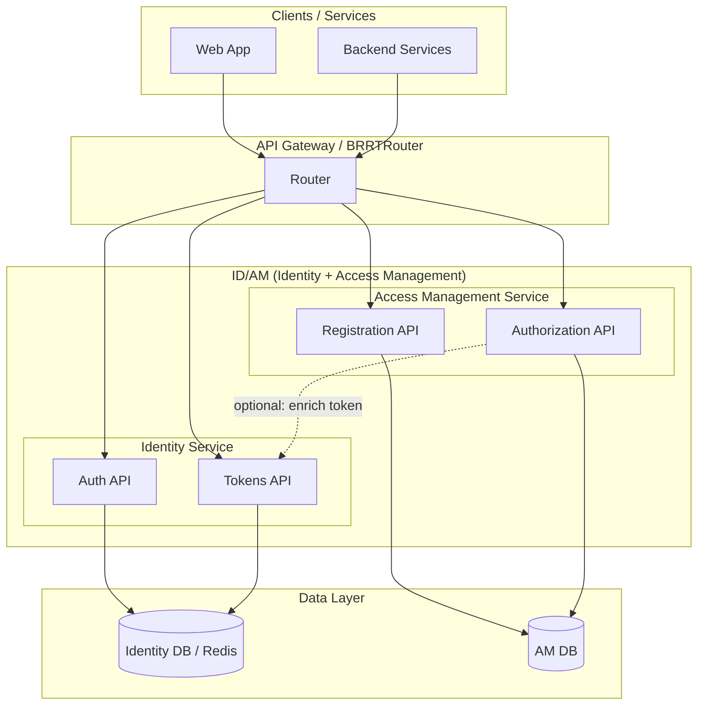
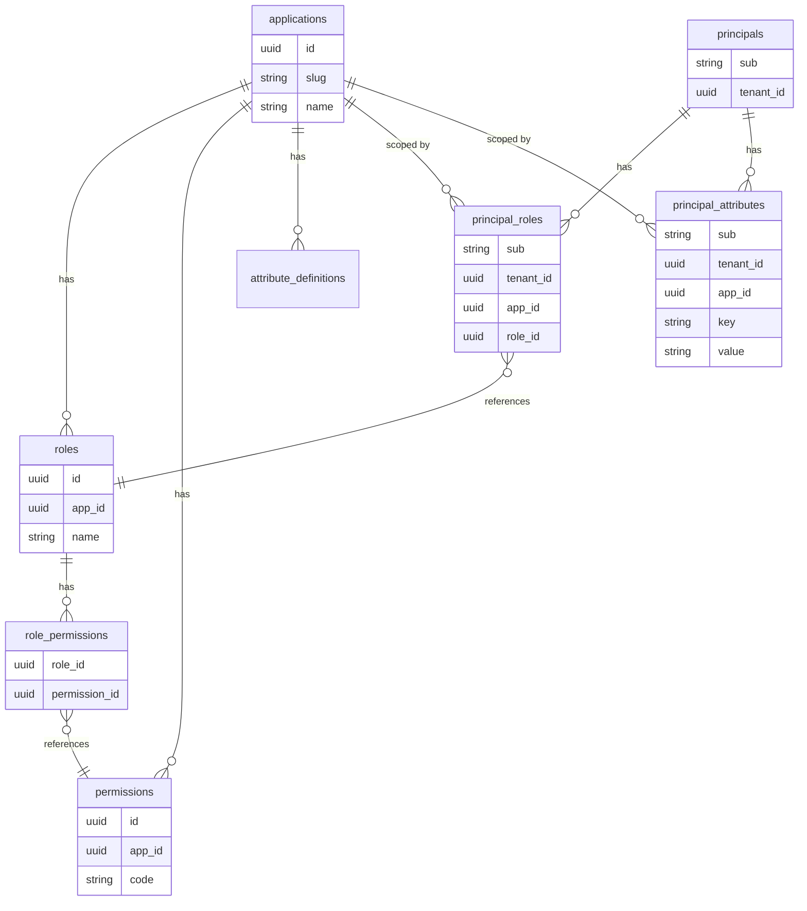
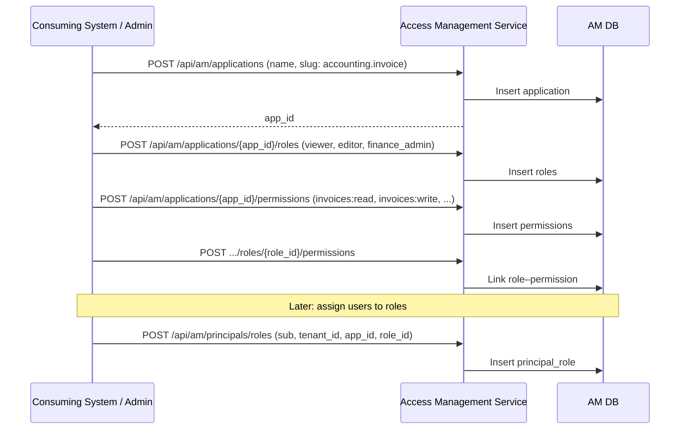
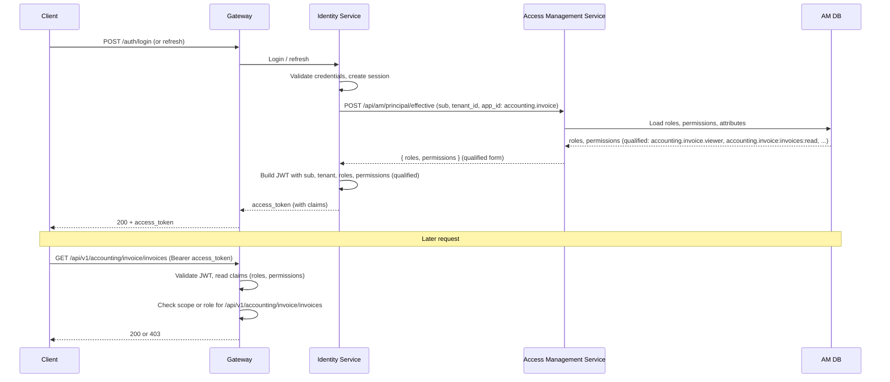

# Generic Access Management (AM) Service Design

**Status:** Draft  
**Last Updated:** 2025-02-02  
**Related:** Generic_Identity_Service_IDAM_Design.md, PRD_SPIFFE_mTLS_Multi-Tenant_Security.md  

---

## 1. Purpose

This document defines a **generic Access Management (AM) service** that sits as a **companion microservice** to the Identity service. Together they form **ID/AM** (Identity + Access Management):

- **Identity service** — affirms *who* the principal is (authenticate, issue JWT with `sub`, `tenant`).
- **Access Management service** — affirms *what* the principal may do (roles, attributes, permissions; RBAC/ABAC/claims; stored and evaluated in a DB).

The AM service is **one-fits-all**: each consuming system (e.g. RERP Accounting Invoice, PriceWhisperer Trader) **registers** its own roles, attributes, and optionally policies against the AM service. The AM service stores these in a database and answers authorization questions (e.g. “can principal X do action Y on resource Z?”) using that registered data. This design aligns with the PRD’s EPIC 1.6 (hybrid RBAC/ABAC/ACL) and EPIC 2 (DB-level authorization and RLS) by providing a central place where **access rights** are defined and evaluated, and where claims can be sourced for JWTs and for RLS.

---

## 2. Principles

1. **Identity first, then access** — AM assumes the principal is already identified (e.g. by the Identity service). AM does not authenticate; it authorizes using `sub` (and optionally `tenant`, `act`).
2. **Registration, not hard-coding** — Consuming systems **register** their applications, roles, attributes, and (optionally) policies with the AM service. AM does not ship with a fixed role set; each product defines its own.
3. **Tenant- and application-scoped** — All registered data is scoped by tenant (or “platform” for cross-tenant) and by application. Application slugs use **dot-notation namespaces** (e.g. `accounting.invoice`, `price_whisperer.trader`). Roles and permissions are scoped by app; when exposed in JWT or cross-app context they use **qualified form** (see §5.2.1). Authorization queries are evaluated in that context.
4. **RBAC + ABAC + claims** — AM supports role-based permissions (RBAC), attribute-based conditions (ABAC), and can expose results as **claims** (e.g. for JWT enrichment or for RLS). ACL-style, object-specific permissions can be represented as attributes or as explicit resource-permission entries if needed.
5. **Database as source of truth** — Roles, attributes, assignments, and policies are stored in a DB (e.g. Postgres). Evaluation can be done in-process (AM service queries DB) or cached (e.g. claims in JWT) for performance.
6. **No PII in URIs** — Same as Identity: no email, phone, or other PII in paths or query strings; use POST + body for lookups by sensitive identifiers.

---

## 3. High-Level Architecture



- **Identity service**: login, refresh, JWT issuance (`sub`, `tenant`, `scope`). Optionally calls AM to **enrich** JWT with roles/permissions (e.g. `roles`, `permissions` claims).
- **AM service**: **Registration API** — register apps, roles, attributes, assign to principals; **Authorization API** — “can principal do X on Y?”, “what roles/permissions for principal in app Z?”.
- **AM DB**: applications, roles, attributes, role–permission mappings, principal–role and principal–attribute assignments, optional policy definitions.

---

## 4. Registration Model: “System Registers Against AM”

Each **consuming system** (application) that has its own roles/attributes **registers** them with the AM service. AM treats everything as tenant- and application-scoped.

### 4.1 Core Entities (Stored in AM DB)

| Entity | Description | Scope |
|--------|-------------|--------|
| **Application** | A registered product or API. Use **dot-notation slugs** for suites (e.g. `accounting.invoice`, `accounting.general_ledger`). | Platform or tenant |
| **Role** | A named role defined by the application. Stored per app with local id (e.g. `viewer`); **qualified form** when exposed: `app_slug.role_id` (e.g. `accounting.invoice.viewer`). | Per application (and optionally per tenant) |
| **Permission** | A capability. Stored per app with local code (e.g. `invoices:read`); **qualified form** when exposed: `app_slug:permission_code` (e.g. `accounting.invoice:invoices:read`). | Per application |
| **Attribute** | A key-value or typed attribute for ABAC (e.g. `department=Finance`, `clearance=high`, `region=EU`). | Per principal or per resource (see below) |
| **Policy** (optional) | An ABAC-style rule: “allow if &lt;condition on attributes&gt;”. | Per application / tenant |

### 4.2 Assignments

| Assignment | Description |
|------------|-------------|
| **Role → Permission** | Which permissions a role has (RBAC). |
| **Principal → Role** | Principal (`sub` + `tenant`) is assigned a role for an application. |
| **Principal → Attribute** | Principal has an attribute (for ABAC). |
| **Resource → ACL** (optional) | Per-resource allow/deny (e.g. document X shared with user Y). |

Principals are identified by **subject** (`sub`, from Identity) and **tenant** (`tenant_id`). Optionally **service/subject type** (user vs service account) can be stored. No PII (email, etc.) is required in AM; Identity owns that.

### 4.3 Registration API (Logical)

Consuming systems (or platform admins) use these to bootstrap and maintain AM data. All mutable operations should be protected (e.g. admin JWT or service-to-service auth).

| Area | Purpose | Examples |
|------|---------|----------|
| **Applications** | Register an application namespace (slug = `suite.microservice`, e.g. `accounting.invoice`). | `POST /api/am/applications` — create app; `GET /api/am/applications/{app_id}` |
| **Roles** | Define roles for an application. | `POST /api/am/applications/{app_id}/roles` — create role; `GET /api/am/applications/{app_id}/roles` |
| **Permissions** | Define permissions for an application. | `POST /api/am/applications/{app_id}/permissions` — create permission |
| **Role–Permission** | Attach permissions to roles. | `POST /api/am/applications/{app_id}/roles/{role_id}/permissions` |
| **Attributes (schema)** | Optionally declare attribute keys and types for an app. | `POST /api/am/applications/{app_id}/attribute-definitions` |
| **Principal–Role** | Assign a principal (sub + tenant) to a role for an app. | `POST /api/am/principals/roles` (body: sub, tenant_id, app_id, role_id) |
| **Principal–Attribute** | Set attribute for a principal (ABAC). | `POST /api/am/principals/attributes` (body: sub, tenant_id, app_id, key, value) |
| **Policies** (optional) | Create/update ABAC policies. | `POST /api/am/applications/{app_id}/policies` — policy definition (e.g. Rego snippet or structured rule) |

Sensitive lookups (e.g. “find principal by email”) must use POST + body; AM can resolve `email → sub` via a call to Identity if needed, rather than storing PII itself.

---

## 5. Registration Mechanics: DSL, Shared Tables, and How Services Register

This section answers the critical question: **how does a service register its roles/permissions/attributes with the AM service?** In a suite of microservices (e.g. RERP has many under accounting alone: invoice, general-ledger, accounts-payable, accounts-receivable, budget, bank-sync, asset, etc.), each service may have different roles/permissions/attributes. We need a single, consistent contract so any service that needs Access Management can participate, and a **dot-notation namespace** for application slugs so suites and microservices are clearly grouped and collisions avoided.

### 5.1 Shared Tables (No Per-Service Tables)

We use **one AM database schema** — **shared tables** — with **application scoping** (`app_id`, and optionally `tenant_id`). We do **not** use:

- **Per-service tables** (e.g. `invoice_roles`, `price_whisperer_roles`) — that would fragment the schema and make cross-app tooling and reporting harder.
- **Service-specific migrations** in the AM DB — the AM service owns one set of migrations; applications only **insert/update rows** in those tables, scoped by `app_id`.

All services' roles, permissions, and attribute definitions live in the **same tables**; every query filters by `app_id` (and tenant when relevant). So:

- **One schema** — `applications`, `roles`, `permissions`, `role_permissions`, `principal_roles`, `principal_attributes`, etc.
- **Queries are always app-scoped** — e.g. "roles for app_id = accounting.invoice", "permissions for app_id = accounting.general_ledger". The AM service treats the application slug (and thus app_id) as an opaque unique identifier; dot notation is a **convention** for grouping (suite.microservice) and avoiding collisions across suites.

This aligns with the docs in `./docs/SPIFFY_mTLS` and ERP-style discussions: different microservices have **different** roles/permissions/attributes, but they all **register** into the **same** AM store (shared tables), distinguished by **application id**.

### 5.2 Registration DSL: Manifest Schema (Expectation for All Services)

We define a **registration manifest** — a **declarative DSL** — that any service needing Access Management **must** adhere to. The "DSL" is the **schema of that manifest** (structure and allowed fields), not a database DDL. Services that want AM:

1. **Define** their roles, permissions, and (optionally) attribute definitions in a **single manifest file** that conforms to the **AM Registration Schema**.
2. **Load** that manifest into the AM service at deploy/build time (see §5.3).
3. **Use** the same **app_id** (e.g. `accounting.invoice`) at runtime when calling AM for authorization or JWT enrichment.

**Dot-notation namespaces:** For suites with multiple microservices (e.g. RERP accounting: invoice, general-ledger, accounts-payable, accounts-receivable, budget, bank-sync, asset), application slugs **SHOULD** use dot notation: `suite.microservice`. Examples: `accounting.invoice`, `accounting.general_ledger`, `sales.order`, `price_whisperer.trader`. See §5.2.1 for full namespacing rules (application, role, permission).

### 5.2.1 Namespacing (application, role, permission)

To support multiple microservices per suite (e.g. RERP accounting: invoice, general-ledger, accounts-payable, etc.) and unambiguous JWT/cross-app exposure, the following **namespacing** applies:

| Scope | In manifest / storage | Qualified form when exposed (effective response, JWT claims, authorize) |
|-------|------------------------|----------------------------------------------------------------------------|
| **Application** | Slug = `suite.microservice` (e.g. `accounting.invoice`, `accounting.general_ledger`, `sales.order`). Stored as unique `app_id`. | Same; used as namespace prefix for roles and permissions. |
| **Role** | Local id per app (e.g. `viewer`, `editor`, `finance_admin`). Stored with `app_id`; effective key is `(app_id, role_id)`. | **`app_slug.role_id`** — e.g. `accounting.invoice.viewer`, `accounting.invoice.finance_admin`. Unambiguous across apps. |
| **Permission** | Local code per app (e.g. `invoices:read`, `invoices:approve`). Stored with `app_id`; effective key is `(app_id, code)`. | **`app_slug:permission_code`** — e.g. `accounting.invoice:invoices:read`, `accounting.invoice:invoices:approve`. Colon separates namespace from resource:action. Unambiguous across apps. |
| **Attribute key** (optional) | Local key per app (e.g. `department`, `region`). | Optional: **`app_slug.key`** (e.g. `accounting.invoice.department`) when returned in cross-app or JWT context. |

**Rules:**

- **Manifest:** Role ids and permission codes are **local** to the application (no need to repeat the app slug in every line); the manifest’s `application.slug` defines the namespace.
- **Storage:** AM stores roles and permissions scoped by `app_id` (and tenant where relevant). Local ids/codes are sufficient for uniqueness within the app.
- **Exposure:** When AM returns roles or permissions (e.g. `POST /api/am/principal/effective`, JWT enrichment), it **MUST** use **qualified form** so that gateways and services can distinguish `accounting.invoice.viewer` from `accounting.general_ledger.viewer` and `accounting.invoice:invoices:read` from `sales.order:orders:read`.
- **Authorize request:** The `action` parameter may be either a local permission code (e.g. `invoices:read`) when the caller has already scoped the request to one app, or a qualified permission (e.g. `accounting.invoice:invoices:read`) when the caller needs to specify app and permission in one string.

The manifest is **granular** in the sense that it explicitly lists roles, permissions, and role→permission mappings; it is **not** a free-form script. The AM service (or a validator) **validates** incoming manifests against the schema and rejects invalid or unknown fields.

**Manifest format:** YAML or JSON. Role ids and permission codes in the manifest are **local** to this application (namespace is implicit from `application.slug`). When AM returns roles/permissions (e.g. effective response, JWT claims), it uses **qualified form** per §5.2.1. Example shape (illustrative; exact schema TBD in OpenAPI or JSON Schema):

```yaml
# am-registration.yaml (one file per microservice; namespace = application.slug)
# Qualified form when exposed by AM: roles as app_slug.role_id (e.g. accounting.invoice.viewer), permissions as app_slug:code (e.g. accounting.invoice:invoices:read)
version: "1.0"
application:
  slug: accounting.invoice   # suite.microservice; unique across platform
  name: Invoice Management API
  description: Invoice creation, approval, and line-item management (RERP Accounting suite)

roles:                       # ids local to this app; qualified when exposed: accounting.invoice.viewer
  - id: viewer
    name: Viewer
    description: Read-only access to invoices
  - id: editor
    name: Editor
    description: Create and update invoices (draft)
  - id: finance_admin
    name: Finance Admin
    description: Post, approve, and manage invoice lifecycle

permissions:                 # codes local to this app; qualified when exposed: accounting.invoice:invoices:read
  - code: invoices:read
    name: Read invoices
  - code: invoices:write
    name: Create/update invoices
  - code: invoices:post
    name: Post invoices
  - code: invoices:approve
    name: Approve invoices
  - code: invoice_lines:read
    name: Read invoice lines
  - code: invoice_lines:write
    name: Create/update invoice lines

role_permissions:           # local role id -> local permission codes
  viewer:        [ invoices:read, invoice_lines:read ]
  editor:        [ invoices:read, invoices:write, invoice_lines:read, invoice_lines:write ]
  finance_admin: [ invoices:read, invoices:write, invoices:post, invoices:approve, invoice_lines:read, invoice_lines:write ]

attribute_definitions:      # optional; for ABAC; keys may be local (app-scoped) or namespaced (dot-notation)
  - key: accounting.invoice.department
    type: string
  - key: accounting.invoice.region
    type: string
  # local keys (e.g. department, region) are also allowed; AM qualifies them by app when stored or exposed
```

**Expectation:** Any microservice in the suite that needs Access Management **must**:

- Produce a **registration manifest** that conforms to the **AM Registration Schema** (this DSL).
- Ensure that manifest is **loaded into AM** at deploy time (see §5.3).
- Use the same **app_id** (e.g. `accounting.invoice`) at runtime when calling AM (e.g. `/api/am/principal/effective`, `/api/am/authorize`) so AM can resolve roles/permissions from the shared tables.

No separate "DSL for each service" — there is **one** DSL (the manifest schema) that **every** service must use when it wants to register.

### 5.3 How Registration Happens (Load Path vs API-Only)

| Mechanism | Use case | How it works |
|-----------|----------|--------------|
| **Manifest load (DSL)** | Preferred for **schema** (roles, permissions, role→permission). | At deploy/build, a tool (e.g. `am-load` or CI step) reads the service's `am-registration.yaml` (or equivalent), validates it against the AM Registration Schema, and either (a) calls the AM Registration API to create/update application, roles, permissions, and role_permissions, or (b) runs a loader that writes directly to AM DB (e.g. in platform-controlled deployments). All data lands in **shared tables** with the service's `app_id`. |
| **Registration API** | **Assignments** (principal→role, principal→attribute) and optional ad hoc bootstrap. | Services or admins call `POST /api/am/principals/roles`, `POST /api/am/principals/attributes`, etc. For **defining** roles/permissions, the API is still available (e.g. for one-off setups), but we **expect** schema to be driven by the manifest for consistency and version control. |

So:

- **Schema (what roles/permissions this app has):** Defined by the **DSL manifest**; loaded at deploy. One manifest per service/app; all stored in **shared tables** keyed by `app_id`.
- **Assignments (who has what):** Via **Registration API** (or admin UI that calls it). No DSL for assignments; they are dynamic data.

### 5.4 Summary: DSL and Shared Tables

| Question | Answer |
|----------|--------|
| **DSL?** | Yes — a **registration manifest schema** (YAML/JSON). Any service needing AM must produce a manifest that conforms to it. |
| **Table/migration per service?** | No — **shared tables** only. One AM schema; all apps use the same tables, scoped by `app_id`. Queries are always app-specific. |
| **Shared tables?** | Yes — one set of tables (applications, roles, permissions, role_permissions, principal_roles, principal_attributes, etc.); `app_id` (and optionally tenant_id) scope. |
| **Granular DSL expectation?** | Yes — we define **one** granular DSL (the manifest schema) and expect **any** service needing Access Management to adhere to it. |
| **Where does the manifest live?** | In the service's repo (e.g. `am-registration.yaml` or under `openapi/` with an `x-am-registration` block). Loaded at deploy by a standard tool or pipeline. |
| **Dot-notation namespaces?** | **Yes** — application slugs **SHOULD** use `suite.microservice` (e.g. `accounting.invoice`, `accounting.general_ledger`, `sales.order`). Roles and permissions are **qualified** when exposed: roles as `app_slug.role_id`, permissions as `app_slug:permission_code` (see §5.2.1). AM treats the slug as a unique opaque identifier; parsing the prefix is optional for UI/grouping. |

---

## 6. Authorization API: "Can Principal Do X?"

Two main patterns:

1. **Query: “Is this principal allowed to do action A on resource R in app Z?”**  
   AM evaluates RBAC (roles → permissions) and optionally ABAC (attributes + policies) and returns allow/deny (+ optional reason).

2. **Enumerate: “What roles and permissions does this principal have for app Z?”**  
   Used to **enrich JWTs** (e.g. put `roles` and `permissions` in token) or to feed RLS (e.g. set session variables from AM response).

### 6.1 Authorization Query (Logical)

| Endpoint / usage | Purpose |
|------------------|----------|
| `POST /api/am/authorize` | Request: `{ "sub", "tenant_id", "app_id", "action", "resource" }`. Response: `{ "allowed": true|false, "reason"?: "..." }`. |
| `POST /api/am/principal/effective` | Request: `{ "sub", "tenant_id", "app_id" }`. Response: `{ "roles": [...], "permissions": [...], "attributes": {...} }`. Roles and permissions are in **qualified form** (see §5.2.1). |

- **action** can be a local permission code (e.g. `invoices:read`) when scoped to one app, or a **qualified** permission (e.g. `accounting.invoice:invoices:approve`) when specifying app and permission in one string.
- **resource** is optional; if present, AM can apply resource-level ACL or ABAC (e.g. “resource.owner == sub”).

### 6.2 How Evaluation Works (RBAC + ABAC)

1. **Load principal’s roles** for (sub, tenant_id, app_id) from DB.
2. **Resolve permissions** from those roles (role → permission mappings).
3. If **action** is a permission, check if it is in the resolved set → RBAC result.
4. If **ABAC policies** exist, evaluate them with: principal attributes, optional resource attributes, optional context (time, IP). Combine with RBAC (e.g. allow if (RBAC allows OR ABAC allows) and no explicit deny).
5. **ACL**: if resource is specified and there is an ACL entry for (resource, principal), use it (allow/deny) and combine with role/permission result as designed (e.g. ACL deny overrides).

All of this can be implemented in the AM service with SQL + optional policy engine (e.g. Rego); results can be cached or written into JWT claims to avoid calling AM on every request.

---

## 7. Integration with Identity Service (ID + AM = ID/AM)

- **Identity** issues JWT with at least `sub`, `tenant`, `aud`, `scope`. It does **not** need to know about app-specific roles unless we enrich the token.
- **Option A — Enrich JWT at token issue**: When Identity issues an access token (login or refresh), it can call AM’s “effective” API with (sub, tenant_id, app_id). AM returns roles and permissions; Identity (or a small token-enrichment step) adds them as claims (e.g. `roles`, `permissions`). Then gateway and services only need to validate JWT and read claims; no AM call per request.
- **Option B — Per-request authorization**: Gateway or service calls AM `POST /api/am/authorize` with (sub, tenant, app_id, action, resource) and enforces the result. More up-to-date (e.g. role revoked immediately) but adds latency and dependency.
- **Hybrid**: Enrich JWT with coarse-grained roles/permissions; for sensitive operations, optionally call AM again for a fresh authorize check.

Claims that AM can supply for JWTs or for RLS session context (in **qualified form** per §5.2.1):

- `roles` — list of **qualified** role identifiers: `app_slug.role_id` (e.g. `accounting.invoice.viewer`, `accounting.invoice.finance_admin`).
- `permissions` — list of **qualified** permission identifiers: `app_slug:permission_code` (e.g. `accounting.invoice:invoices:read`, `accounting.invoice:invoices:approve`).
- `attributes` — optional key-value map for ABAC; keys may be qualified (e.g. `accounting.invoice.department`, `region`).

---

## 8. How This Fits in the DB (RLS) and PRD

### 8.1 RLS and JWT Claims

- **EPIC 2** (Database-Level Authorization & RLS) requires the DB to see tenant and principal. That is done by mapping the **JWT** into the Postgres session (`request.jwt.claims`, `auth.uid()`, etc.).
- If the JWT is **enriched with roles/permissions** from AM (in **qualified form**, e.g. `accounting.invoice.viewer`, `accounting.invoice:invoices:read`), then RLS policies can use them: e.g. `auth.jwt() ->> 'roles'` or a helper like `current_user_has_role('accounting.invoice.finance_admin')` that reads from JWT or from a session variable set from AM response.
- Alternatively, RLS can call a **security definer function** that queries a **local** copy of AM data (e.g. a table or view synced from AM, or a direct call to AM service from a backend only). That way the DB never trusts the client; it trusts the app server that sets the session and, if needed, the AM service.

### 8.2 Mapping to PRD EPICs

| PRD | AM design |
|-----|-----------|
| **EPIC 1.6** (RBAC/ABAC/ACL) | AM is the place where roles, attributes, and (optionally) ACLs are **registered** and **evaluated**. Gateway and services enforce using AM responses or JWT claims sourced from AM. |
| **EPIC 2** (RLS) | RLS uses JWT claims (tenant, sub, and optionally roles/permissions from AM). Optionally, RLS uses security definer functions that consult AM-backed data (synced or via trusted backend call). |

---

## 9. Data Model (Conceptual, for AM DB)



- **Principal** is (sub, tenant_id); no PII. Optional: sync from Identity on first use or resolve via Identity when needed.
- **Application** slug uses dot notation (e.g. `accounting.invoice`); stored as unique `app_id`. **Roles** and **permissions** are stored with local ids/codes per app; when returned by AM (effective, JWT) they are in **qualified form** (`app_slug.role_id`, `app_slug:permission_code`) per §5.2.1.
- **Policies** (ABAC) can be stored as rows (e.g. app_id, name, condition_expression or policy_document) and evaluated by AM when answering `authorize` or `effective`.

---

## 10. Sequence: Registration and Authorization

### 10.1 Onboarding an Application (Registration)



### 10.2 Authorization at Request Time (with JWT Enrichment)



---

## 11. Summary: “One-Fits-All” AM

| Aspect | Design choice |
|--------|----------------|
| **Who defines roles?** | Each consuming system **registers** its application and its roles/permissions/attributes with the AM service. |
| **Where are they stored?** | In the **AM DB**, scoped by application and tenant. |
| **How is authorization done?** | AM evaluates RBAC (role → permission) and optionally ABAC (attributes + policies), and optionally ACL per resource. |
| **How does Identity fit?** | Identity affirms **who** (sub, tenant); AM affirms **what** (roles, permissions, attributes). Identity can call AM to **enrich** JWT with claims. |
| **How does RLS fit?** | RLS uses JWT claims (tenant, sub, roles/permissions from AM). Optionally, RLS uses security definer functions that read from AM-backed data. |
| **One-fits-all?** | Yes: any system that has its own roles/attributes **registers** them with the same AM service; authorization is always (sub, tenant, app_id, action, resource) → allow/deny. Application and permission/role **namespacing** (dot notation for apps, qualified form when exposed) ensures unambiguous identity across suites and microservices. |

---

## 12. Recommended Next Steps

1. **AM Registration Schema (DSL)** — Define the manifest schema (JSON Schema or YAML schema) for `am-registration.yaml`; document it as the contract any service must adhere to when registering with AM. Include **namespacing** rules: application slug = `suite.microservice`; role/permission ids local in manifest; qualified form when exposed (see §5.2.1). Optionally extend OpenAPI with `x-am-registration` for co-location with API specs.
2. **Load tool** — Implement `am-load` (or equivalent) that reads a service's manifest, validates it against the schema, and calls the AM Registration API (or writes to AM DB) so deploy pipelines can register schema at deploy time.
3. **OpenAPI for AM** — Define Registration API and Authorization API (paths, request/response bodies); align with existing Identity API style (tenant in header/body, no PII in URI).
4. **AM DB schema** — Implement shared tables for applications, roles, permissions, role_permissions, principal_roles, principal_attributes, optional policies; add migrations (one schema, app_id-scoped).
5. **Identity ↔ AM** — Implement “effective” call from Identity (or token pipeline) to AM and JWT claim enrichment; document app_id and audience.
6. **Gateway** — Enforce authorization using JWT claims (and optionally call AM for sensitive paths).
7. **RLS** — Document pattern: set Postgres session from JWT (tenant, sub, roles); optionally add security definer that consults AM or AM-synced data for role checks.

---

## 13. References

- Generic Identity Service design: `./Generic_Identity_Service_IDAM_Design.md`
- PRD: `./PRD_SPIFFE_mTLS_Multi-Tenant_Security.md` (EPIC 1.6, EPIC 2)
- Part 1 (RBAC/ABAC/ACL): `./01_High-Assurance Multi-Tenant Identity and Access Control Architecture-Part1.md`
- Part 3 (RLS): `./03_Database-Level Authorization with Supabase_ RLS and Multi-Tenant Security-Part3.md`
