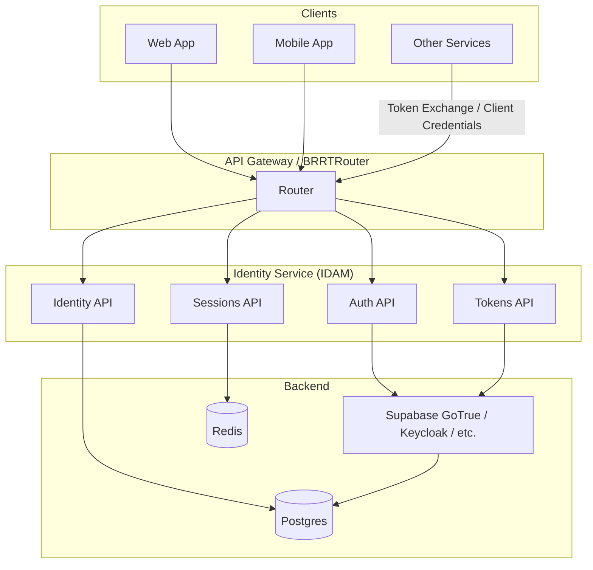
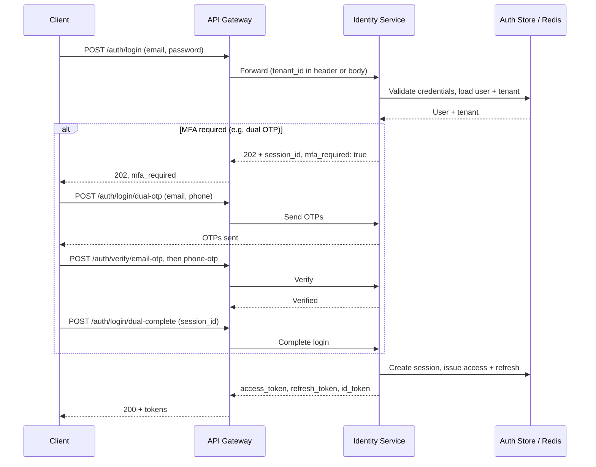
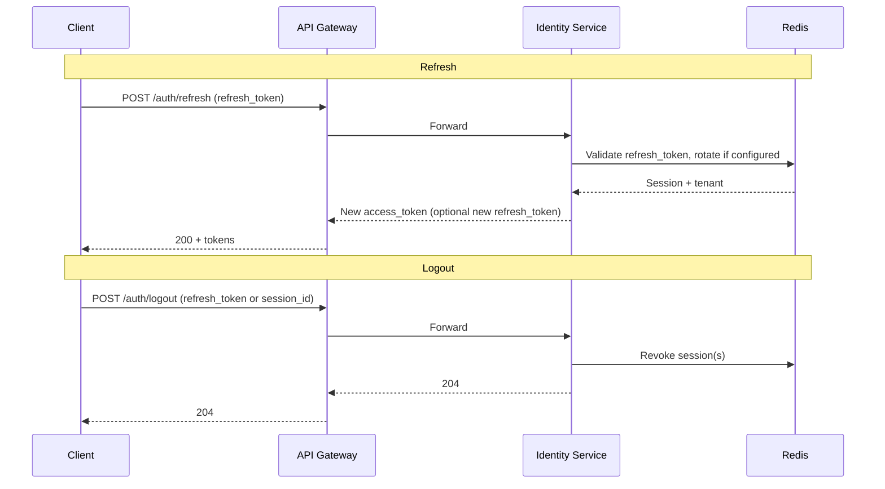

# Generic Identity Service (IDAM) Design

**Status:** Draft  
**Last Updated:** 2025-02-02  
**Related:** PRD_SPIFFE_mTLS_Multi-Tenant_Security.md, PriceWhisperer IDAM OpenAPI, Generic_Access_Management_Service_Design.md  

---

## 1. Purpose

This document defines what a **generic Identity and Access Management (IDAM) service** should look like so it can be **bolted onto any future system** (e.g. BRRTRouter-based APIs, PriceWhisperer, other microscaler products). The service may be implemented as a separate microservice; BRRTRouter (or another gateway) will expose its OpenAPI and route to it. The design is informed by:

- The **PriceWhisperer IDAM** OpenAPI (`../PriceWhisperer/microservices/openapi/trader/idam/openapi.yaml`), which provides identity, auth, MFA-style flows (dual OTP), OAuth, SAML, and API keys.
- The **PRD** (EPIC 1: Multi-Tenant Identity & Auth), which requires tenant-scoped identity, OAuth 2.1/OIDC, JWT design, and optional Token Exchange.

---

## 2. What the PriceWhisperer IDAM Spec Provides

### 2.1 Capability Summary

| Area | Endpoints / behaviour | Notes |
|------|------------------------|--------|
| **Identity (email)** | `POST /api/identity/email/upsert`, `POST /api/identity/email/lookup` (body: `email`), `GET /api/identity/email/{email_address_id}` | Single source of truth; **lookup by email in body only** (no PII in URI). By-ID uses opaque UUID. |
| **Identity (user)** | `GET /api/identity/user/{human_name_id}`, `GET /api/identity/users/me` | User profile (human_name, email, mobile, verification_status). |
| **Verification** | `GET /api/identity/verification-status/{human_name_id}`, `GET /api/identity/users/me/verification-status` | Email/phone verified flags. |
| **Auth – password** | `POST /api/identity/auth/login` (email + password), `POST /api/identity/auth/update-password` | Short-lived access JWT, long-lived refresh in Redis. |
| **Auth – MFA-style (dual OTP)** | `POST /auth/login/dual-otp`, `POST /auth/verify/email-otp`, `POST /auth/verify/phone-otp`, `POST /auth/login/dual-complete` | Email + phone OTP for dual-channel verification. |
| **Auth – phone OTP** | `POST /auth/login/phone-otp` | Phone-only OTP. |
| **Auth – OAuth** | `POST /auth/login/google`, `POST /auth/login/github`, `POST /auth/callback/github` | Initiate Google/GitHub; callback only for GitHub. |
| **Auth – SAML** | `POST /auth/login/saml` | Enterprise SSO; domain-based. |
| **Sessions** | Access token (15–60 min), refresh token (7–30 days in Redis), revocation implied | No explicit refresh or logout in paths listed. |
| **API keys** | Create, list, revoke (paths under `/api/identity/api-keys`) | Programmatic access. |
| **Preferences** | Theme, timezone, currency, risk-mode, layout | App-specific; optional in a generic IDAM. |

### 2.2 Gaps for a Generic, Multi-Tenant IDAM

- **PII in URIs:** PriceWhisperer uses `GET /api/identity/email/{email}` (email in path). This is an anti-pattern: email in URLs is logged, cached, and can leak via referrer. The generic IDAM must use `POST /api/identity/email/lookup` with email in the JSON body only (§3.3.1).
- **Tenant context:** No `tenant_id` or tenant-scoped identity in the current spec; required for PRD G1.
- **Refresh & logout:** No `POST /auth/refresh` or `POST /auth/logout` (revoke session) in the path list.
- **Registration:** No explicit signup/register (may be implied via OAuth or magic link).
- **Password recovery:** No forgot-password / reset-password flow.
- **OAuth callbacks:** Google callback not present (only GitHub); generic IDAM should support all configured providers.
- **OAuth 2.1 / PKCE:** Not explicitly called out in the spec; generic IDAM should document Auth Code + PKCE for public clients.
- **Token Exchange (RFC 8693):** Not present; needed for service-to-service delegation (PRD EPIC 1).
- **JWKS / OIDC discovery:** Not in the OpenAPI (often implemented at well-known URLs); required for JWT verification by gateways and services.
- **TOTP / WebAuthn:** Dual OTP is email+phone; no TOTP app or WebAuthn for stronger MFA (optional for generic).

---

## 3. Generic Identity Service: Proposed Shape

### 3.1 Principles

1. **Backend-only API** — UIs (SolidJS, etc.) call a BFF or gateway; the BFF calls the Identity Service. Apps never call the Identity Service directly from the browser unless it is a public OAuth redirect/callback.
2. **Tenant-aware** — Every identity and session is scoped to a tenant (or “global” for platform). JWT claims include `tenant_id` (or equivalent).
3. **Standards-aligned** — OAuth 2.1, OIDC, RFC 8693 (Token Exchange) where applicable; JWTs with standard + custom claims.
4. **Pluggable backends** — The Identity Service may wrap Supabase GoTrue, Keycloak, Auth0, or a custom store; the API contract is stable.
5. **Multi-factor options** — Support at least one strong MFA path (e.g. dual OTP like PriceWhisperer, and optionally TOTP/WebAuthn later).
6. **No PII in URIs** — Email addresses, phone numbers, and other sensitive identifiers must **not** appear in URL paths or query strings. Use **POST with a JSON body** for lookups by email/phone so sensitive data is not logged in access logs, proxy logs, referrer headers, or browser history (see §3.3.1).

### 3.2 High-Level Architecture

### 3.3 API Surface (Logical Groupings)

These are the **logical areas** a generic Identity Service should expose. Path prefixes are illustrative; actual paths can be normalized (e.g. `/api/v1/identity/...`, `/api/v1/auth/...`).

#### 3.3.1 PII and sensitive data in requests

**Do not put sensitive identifiers in URL paths or query strings.** Email addresses, phone numbers, and similar PII must be sent only in **request bodies** (e.g. JSON). This avoids:

**Can POST be used to return data (e.g. lookup results)?** Yes. RFC 7231 allows it. POST requests the server to "process the representation enclosed in the request according to the resource's own specific semantics" (RFC 7231 §4.3.3). The response payload "might represent either the processing result or the new state of the target resource" (§3.3). A 200 (OK) response to POST may contain the result in the body; the spec also allows the server to send 200 OK with the result and a Content-Location header so the response can be cached. So using **POST with a JSON body for lookup criteria and returning the looked-up data in the response body** is valid HTTP and common (e.g. search APIs, GraphQL). The only downside is that POST is not cacheable by default (unlike GET), which is often desirable for PII lookups anyway.

- **Access/proxy logs** — Many servers log full URLs; path and query would expose PII.
- **Referrer headers** — A link to a page with email in the URL can leak it to the next site.
- **Browser history and bookmarks** — Path/query are stored and can be synced or shared.
- **Compliance** — GDPR and similar regimes treat such exposure as a data handling concern.

**Conventions:**

| Intent | Avoid | Use instead |
|--------|--------|-------------|
| Lookup by email | `GET /api/identity/email/{email}` or `?email=...` | `POST /api/identity/email/lookup` with body `{ "email": "..." }` |
| Lookup by phone | `GET /api/identity/phone/{phone}` or `?phone=...` | `POST /api/identity/phone/lookup` with body `{ "phone": "..." }` |
| Get by opaque ID | — | `GET /api/identity/email/{email_address_id}` (UUID in path is acceptable; it is not PII) |

Use **opaque IDs** (UUIDs, etc.) in paths when the resource is identified by a server-issued identifier. Use **POST + body** for any operation that takes an email, phone, or other sensitive identifier as input.

---

| Group | Purpose | Examples (aligned with PriceWhisperer where useful) |
|-------|---------|------------------------------------------------------|
| **Identity – contact** | Single source of truth for email/phone | `POST /api/identity/email/upsert` (body: email), `POST /api/identity/email/lookup` (body: email), `GET /api/identity/email/{email_address_id}` (opaque ID only). Phone equivalent: lookup by phone in body only. |
| **Identity – user** | User profile and verification status | `GET /api/identity/user/{id}`, `GET /api/identity/users/me`, `PATCH /api/identity/users/me` |
| **Auth – login** | Password, OTP, OAuth, SAML | `POST /auth/login` (password), `POST /auth/login/dual-otp`, `POST /auth/login/phone-otp`, `POST /auth/login/google`, `POST /auth/login/github`, `POST /auth/login/saml` |
| **Auth – verify** | OTP and MFA completion | `POST /auth/verify/email-otp`, `POST /auth/verify/phone-otp`, `POST /auth/login/dual-complete` |
| **Auth – callbacks** | OAuth/SAML callbacks | `POST /auth/callback/google`, `POST /auth/callback/github`, `POST /auth/callback/saml` |
| **Auth – refresh & logout** | Session lifecycle | `POST /auth/refresh`, `POST /auth/logout` (and optionally `POST /auth/logout-all`) |
| **Auth – password** | Change and recover | `POST /api/identity/auth/update-password`, `POST /auth/forgot-password`, `POST /auth/reset-password` |
| **Auth – registration** | Signup (if not OAuth-only) | `POST /auth/register` (email/password or magic link) |
| **Tokens** | For services and delegation | `POST /auth/token` (refresh, client_credentials, token_exchange per RFC 8693) |
| **Discovery** | OIDC/JWKS for verifiers | `GET /.well-known/openid-configuration`, `GET /.well-known/jwks.json` |
| **Sessions** | List/revoke (optional) | `GET /api/identity/sessions`, `DELETE /api/identity/sessions/{id}` |
| **API keys** | Programmatic access | `POST /api/identity/api-keys`, `GET /api/identity/api-keys`, `DELETE /api/identity/api-keys/{id}` |
| **Preferences** | Optional, app-specific | Can remain in app BFF or a small subset in IDAM (e.g. default tenant, MFA preference) |

### 3.4 JWT and Tenant Design (PRD-Aligned)

- **Claims:** `iss`, `sub`, `aud`, `iat`, `exp`, `tenant` (or `tenant_id`), `scope` (or `permissions`), optional `act` for delegation.
- **Short-lived access:** e.g. 5–15 minutes; refresh token stored server-side (e.g. Redis) with rotation and optional revocation list.
- **Tenant:** Every user session and JWT has a tenant context (or “platform” for cross-tenant admin). Enforced at login and token issue.

### 3.5 MFA and Strong Auth

- **Dual OTP (email + phone):** As in PriceWhisperer — send OTP to both, verify both, then complete login. Good for “something you have” on two channels.
- **Optional later:** TOTP (authenticator app), WebAuthn (passkey), or “step-up” MFA for sensitive actions. These can be added as extra endpoints and challenge flows without changing the core login contract.

### 3.6 Sequence: Generic Login with Optional MFA

### 3.7 Token Refresh and Logout

---

## 4. How This Bolts Onto BRRTRouter and Other Systems

### 4.1 Deployment Options

1. **IDAM as a separate service** — Implemented once (e.g. Rust or Node behind BRRTRouter). BRRTRouter exposes the IDAM OpenAPI and routes `/api/v1/identity/*`, `/auth/*`, `/.well-known/*` to the IDAM service. Other products (PriceWhisperer, future apps) use the same IDAM or a tenant-specific instance.
2. **OpenAPI-first** — The generic Identity Service is defined by a single OpenAPI spec (this design + PriceWhisperer-derived paths). BRRTRouter (or any gateway) can codegen routes and proxy to the implementation. The implementation may be shared (one repo) or per-product with the same contract.
3. **Tenant in routing** — Gateway resolves tenant from subdomain, header, or first path segment and passes it to IDAM; IDAM issues tenant-scoped JWTs so downstream APIs and RLS see the same tenant.

### 4.2 BRRTRouter’s Role

- **Serve OpenAPI** for the Identity Service (and other domains) so clients and docs see one coherent surface.
- **Route** requests to the Identity Service (or BFF that calls IDAM).
- **Validate JWTs** issued by IDAM (via JWKS) for protected routes; enforce tenant and scope.
- **Do not** implement auth logic itself; it delegates to the Identity Service.

### 4.3 Mapping PRD EPIC 1 to the Generic IDAM

| PRD Story | Generic IDAM capability |
|-----------|-------------------------|
| 1.1 Tenant-scoped identity | All auth and identity APIs accept/return tenant; JWT has `tenant` claim. |
| 1.2 OAuth 2.1 Auth Code + PKCE | Login flows support PKCE; callbacks return tokens; document in OpenAPI and docs. |
| 1.3 Client Credentials | `POST /auth/token` with `grant_type=client_credentials` for service clients. |
| 1.4 JWT claims (tenant, aud, scope, act) | Issued by IDAM; JWKS and OIDC discovery for verification. |
| 1.5 Token Exchange (RFC 8693) | `POST /auth/token` with `grant_type=urn:ietf:params:oauth:grant-type:token-exchange` and subject_token; IDAM returns down-scoped token with optional `act` claim. |
| 1.6 RBAC/ABAC/ACL | Identity issues scopes/roles in JWT; a companion **Access Management (AM)** service holds registered roles/attributes and can enrich JWTs or answer authorize queries. See [Generic_Access_Management_Service_Design.md](./Generic_Access_Management_Service_Design.md). |

---

## 5. Recommended Next Steps

1. **Extract a single “Generic IDAM” OpenAPI** — Start from the PriceWhisperer IDAM spec; **replace `GET /api/identity/email/{email}` with `POST /api/identity/email/lookup`** (email in body only; see §3.3.1). Add tenant (e.g. `x-tenant-id` or body/header), `POST /auth/refresh`, `POST /auth/logout`, `POST /auth/forgot-password`, `POST /auth/reset-password`, OAuth callbacks for all providers, and a `POST /auth/token` for refresh + client_credentials + token_exchange. Add `/.well-known/openid-configuration` and `/.well-known/jwks.json` in docs or as extension.
2. **Implement or adopt one backend** — e.g. keep Supabase GoTrue behind the API, or introduce Keycloak; ensure tenant is stored and injected into JWTs.
3. **Wire BRRTRouter to IDAM** — Mount the Generic IDAM OpenAPI in BRRTRouter; proxy `/api/v1/identity`, `/auth`, `/.well-known` to the Identity Service; configure JWT validation (JWKS URL, trust domain, audience).
4. **Add MFA and recovery** — Implement dual OTP (or reuse PriceWhisperer flow); add forgot-password/reset-password; optionally add TOTP/WebAuthn later.

---

## 6. References

- PriceWhisperer IDAM OpenAPI: `../PriceWhisperer/microservices/openapi/trader/idam/openapi.yaml`
- PRD: `./PRD_SPIFFE_mTLS_Multi-Tenant_Security.md` (EPIC 1: Multi-Tenant Identity & Auth)
- Generic Access Management (AM) design: `./Generic_Access_Management_Service_Design.md` (companion service for roles/attributes/permissions; ID + AM = ID/AM)
- OAuth 2.1: PKCE, refresh token rotation, no implicit/password in public clients
- RFC 8693: Token Exchange
- OIDC: Discovery, JWKS, id_token, standard claims
