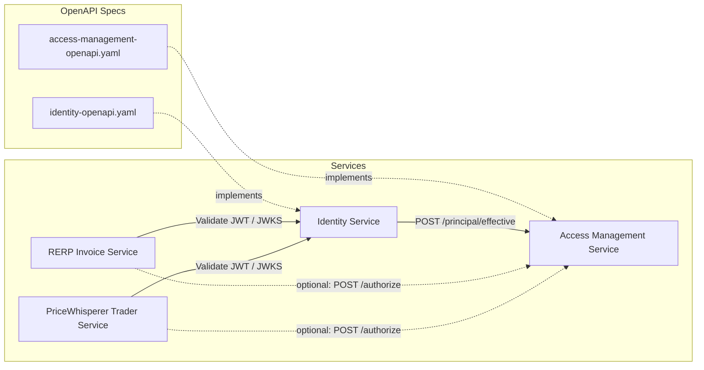
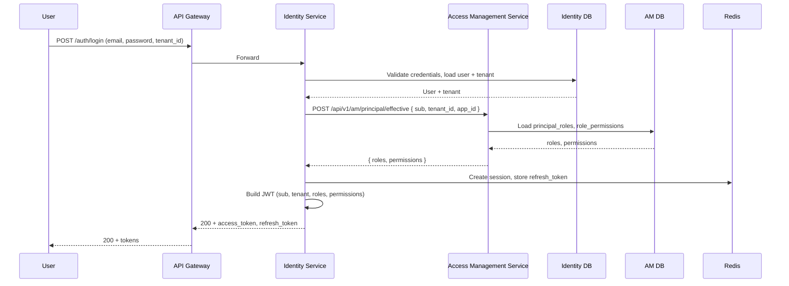
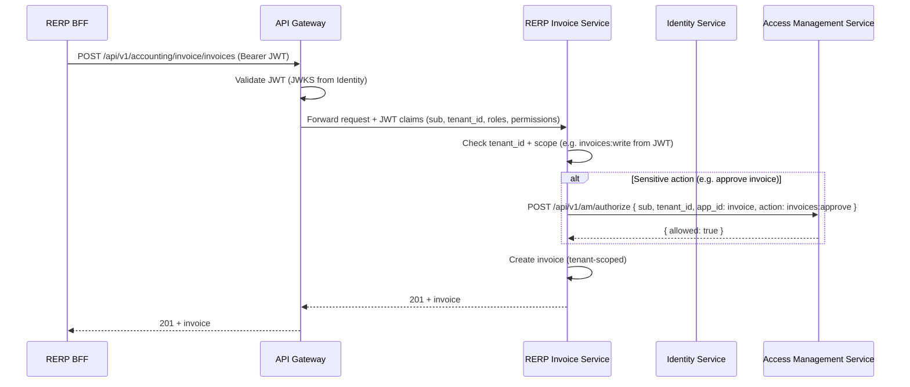
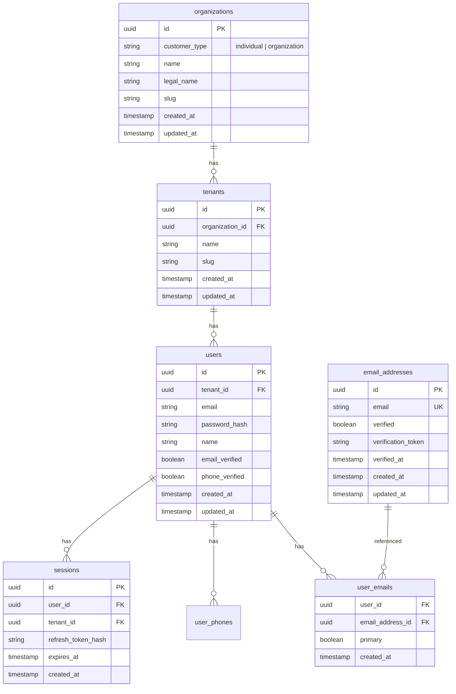
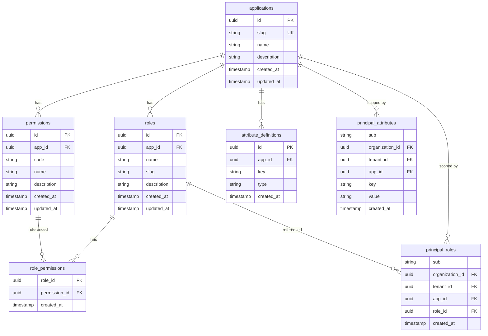

# Identity & Access Management: OpenAPI Specs and Integration

**Status:** Draft  
**Last Updated:** 2025-02-02  
**Related:** Generic_Identity_Service_IDAM_Design.md, Generic_Access_Management_Service_Design.md, ../lifeguard  

This document ties together the **Identity Service** and **Access Management (AM) Service** OpenAPI specs, shows how they integrate with each other and with significant components from **RERP** (e.g. Accounting Invoice) and **PriceWhisperer** (Trader), and provides **entity-relationship diagrams and table definitions** suitable for use by **lifeguard** (entity-driven migrations).

---

## 1. OpenAPI Specs

| Service | Spec | Description |
|--------|------|-------------|
| **Identity (IDAM)** | [openapi/identity-openapi.yaml](./openapi/identity-openapi.yaml) | Auth (login, refresh, logout, token, register), identity (email lookup/upsert, users/me), discovery (OIDC, JWKS). No PII in URIs. |
| **Access Management (AM)** | [openapi/access-management-openapi.yaml](./openapi/access-management-openapi.yaml) | Applications, roles, permissions, role–permission links, principal–role/attribute assignments, `principal/effective`, `authorize`. |

Both specs are designed so that:
- **Identity** can call **AM** (`POST /api/v1/am/principal/effective`) to enrich JWTs with roles/permissions.
- **Other microservices** (e.g. RERP Invoice, PriceWhisperer) call **Identity** for token validation (via JWKS) and optionally **AM** for per-request authorization or use JWT claims from Identity (enriched by AM).

### 1.1 SaaS customer model: Organisation and tenant demarcation

The specs model **individual** and **organisational** customers and clear **demarcation between tenants beneath a single organisation**:

- **Individual customers** — Natural persons; typically one organisation of type `individual` with one tenant.
- **Organisational customers** — Legal entities; one **organisation** (e.g. company) may have **multiple tenants** (e.g. divisions, regions, subsidiaries). Tenants are always scoped under an organisation; there is explicit demarcation between tenants beneath one org.
- **Identity:** `Organization` (customer_type: individual | organization), `Tenant` (under organisation). Login/register and JWT include `organization_id` and `tenant_id`.
- **AM:** Principal assignments and authorization use `organization_id` + `tenant_id` so access respects tenant-under-organisation demarcation.

---

## 2. How the Components Fit Together

### 2.1 Component Relationship Diagram

```mermaid
flowchart TB
    subgraph Clients["Clients"]
        WebRERP[RERP Web / BFF]
        WebPW[PriceWhisperer Web / BFF]
        SvcInvoice[RERP Invoice Service]
        SvcTrader[PriceWhisperer Trader Service]
    end

    subgraph Gateway["API Gateway / BRRTRouter"]
        GW[Router]
    end

    subgraph IDAM["Identity + Access Management"]
        Identity[Identity Service]
        AM[Access Management Service]
    end

    subgraph Data["Data"]
        IDB[(Identity DB)]
        Redis[(Redis)]
        AMDB[(AM DB)]
    end

    WebRERP --> GW
    WebPW --> GW
    GW --> Identity
    GW --> AM
    GW --> SvcInvoice
    GW --> SvcTrader

    Identity -->|Validate session, issue JWT| IDB
    Identity -->|Sessions, refresh| Redis
    Identity -->|Enrich JWT with roles/permissions| AM
    AM --> AMDB

    SvcInvoice -->|Validate JWT (JWKS)| Identity
    SvcInvoice -->|Optional: authorize(action)| AM
    SvcTrader -->|Validate JWT (JWKS)| Identity
    SvcTrader -->|Optional: authorize(action)| AM
```

- **RERP Invoice** and **PriceWhisperer Trader** are significant domain services (not demo toys). Both rely on Identity for authentication and optionally on AM for authorization.
- **Identity** calls **AM** at token issue time to get effective roles/permissions and embed them in the JWT (or services call AM per-request if fresh checks are needed).

### 2.2 API Relationship Graph (Who Calls Whom)



### 2.3 Call Direction Summary

| Caller | Callee | Purpose |
|--------|--------|---------|
| Identity | AM | `POST /api/v1/am/principal/effective` — get roles/permissions for JWT enrichment |
| Gateway | Identity | Login, refresh, logout, token; validate JWT via JWKS |
| Gateway | AM | Register apps/roles/permissions; assign principal roles; optional per-request authorize |
| RERP Invoice Service | Identity | Validate JWT (JWKS or introspection); resolve user/tenant |
| RERP Invoice Service | AM | Optional: `POST /api/v1/am/authorize` for sensitive operations (e.g. approve invoice) |
| PriceWhisperer Trader Service | Identity | Validate JWT; resolve user/tenant |
| PriceWhisperer Trader Service | AM | Optional: authorize for trading or admin actions |

---

## 3. Sequence Diagrams

### 3.1 Login with JWT Enrichment (Identity → AM)

User logs in; Identity validates credentials, then calls AM to get effective roles/permissions for the user in the requested app (e.g. `invoice` or `price_whisperer`), and issues a JWT that includes those claims.



### 3.2 RERP Invoice Service: Create Invoice (with JWT and optional AM)

Client (e.g. RERP BFF) has already obtained a JWT from Identity (with roles/permissions from AM). It calls the Invoice service to create an invoice. Gateway validates JWT; Invoice service may optionally call AM for a fresh authorize check on a sensitive action.



### 3.3 PriceWhisperer Trader: Authenticated API Call

Trader UI has logged in via Identity and holds a JWT. It calls Trader backend (e.g. place order or get portfolio). Gateway validates JWT; Trader service uses JWT claims (and optionally AM) for authorization.

```mermaid
sequenceDiagram
    participant TraderUI as PriceWhisperer Trader UI
    participant Gateway as API Gateway
    participant Trader as PriceWhisperer Trader Service
    participant Identity as Identity Service
    participant AM as Access Management Service

    TraderUI->>Gateway: GET /api/trader/portfolio (Bearer JWT)
    Gateway->>Gateway: Validate JWT (JWKS from Identity)
    Gateway->>Trader: Forward + JWT claims (sub, tenant_id, roles, permissions)
    Trader->>Trader: Resolve user/tenant from JWT; check permissions (e.g. portfolio:read)
    Trader->>Trader: Load portfolio (tenant-scoped)
    Trader-->>Gateway: 200 + portfolio
    Gateway-->>TraderUI: 200 + portfolio
```

---

## 4. Entity-Relationship Diagrams and Tables for Lifeguard

The following ER diagrams and table definitions are intended for use by **lifeguard**: entities can be defined with `LifeModel` and migrations generated (e.g. `lifeguard-migrate generate-from-entities` or equivalent). See [../lifeguard/migrations/README.md](../../lifeguard/migrations/README.md).

### 4.1 Identity Service Database

Identity stores users, email/phone identities, sessions (or session references), and refresh token metadata. Actual refresh tokens may be in Redis; Identity DB holds user and identity records.



**Tables for lifeguard (Identity DB):**

| Table | Purpose | Key columns / notes |
|-------|---------|----------------------|
| `organizations` | Legal-entity customer (individual or organisational) | id (UUID PK), customer_type (individual \| organization), name, legal_name, slug (unique), created_at, updated_at |
| `tenants` | Tenant under organisation (demarcation beneath one org) | id (UUID PK), organization_id (FK → organizations), name, slug (unique per org), created_at, updated_at. Index on organization_id |
| `users` | User accounts | id (UUID PK), tenant_id (FK → tenants), email, password_hash, name, email_verified, phone_verified, created_at, updated_at |
| `email_addresses` | Single source of truth for email | id (UUID PK), email (unique, normalized), verified, verification_token, verified_at, created_at, updated_at |
| `user_emails` | Link user to email(s) | user_id (FK → users), email_address_id (FK → email_addresses), primary (bool), created_at. Composite PK or unique (user_id, email_address_id) |
| `sessions` | Session / refresh token metadata | id (UUID PK), user_id (FK → users), tenant_id (FK → tenants), refresh_token_hash, expires_at, created_at. Index on refresh_token_hash, user_id |

Optional: `user_phones`, `phone_addresses` if phone is first-class like email; `api_keys` if stored in DB.

---

### 4.2 Access Management Service Database

AM uses **shared tables** scoped by `app_id`. All applications (e.g. RERP Invoice, PriceWhisperer) store roles and permissions in the same tables.



**Tables for lifeguard (AM DB):**

| Table | Purpose | Key columns / notes |
|-------|---------|----------------------|
| `applications` | Registered apps (e.g. invoice, price_whisperer) | id (UUID PK), slug (unique), name, description, created_at, updated_at |
| `roles` | Roles per application | id (UUID PK), app_id (FK → applications), name, slug, description, created_at, updated_at. Index on app_id |
| `permissions` | Permissions per application | id (UUID PK), app_id (FK → applications), code (e.g. invoices:read), name, description, created_at, updated_at. Unique (app_id, code) |
| `role_permissions` | Role → Permission (RBAC) | role_id (FK → roles), permission_id (FK → permissions), created_at. Composite PK (role_id, permission_id) |
| `principal_roles` | Principal (sub + org + tenant) → Role | sub, organization_id (FK), tenant_id (UUID), app_id (FK), role_id (FK), created_at. Composite PK (sub, organization_id, tenant_id, app_id, role_id). Index on (sub, organization_id, tenant_id, app_id) for effective lookup. Respects tenant-under-org demarcation. |
| `principal_attributes` | Principal attributes (ABAC) | sub, organization_id (FK), tenant_id, app_id (FK), key, value, created_at. Composite PK or unique (sub, organization_id, tenant_id, app_id, key) |
| `attribute_definitions` | Optional: attribute schema per app | id (UUID PK), app_id (FK), key, type, created_at |

Principals are identified by `sub` (from Identity) and `tenant_id`; no PII in AM DB.

---

## 5. Lifeguard Usage

- **Identity DB:** Define Lifeguard entities (e.g. `Tenant`, `User`, `EmailAddress`, `UserEmail`, `Session`) in a crate or under `lifeguard/examples/entities/src/identity/` (or in the Identity service repo). Use `#[derive(LifeModel)]`, `#[table_name = "..." ]`, `#[foreign_key = "..."]`, `#[index = "..."]` as in [../lifeguard/examples/entities/src/inventory/](../../lifeguard/examples/entities/src/inventory/). Generate SQL with `cargo run --bin generate-migrations` or `lifeguard-migrate generate-from-entities`.
- **AM DB:** Define entities for `applications`, `roles`, `permissions`, `role_permissions`, `principal_roles`, `principal_attributes` (and optionally `attribute_definitions`). Same pattern: one schema, app_id-scoped tables; generate migrations from entities.
- **Migration layout:** For example, `migrations/generated/identity/` and `migrations/generated/am/` under lifeguard or under each service repo, depending on where migrations are run.

---

## 6. References

- [Generic_Identity_Service_IDAM_Design.md](./Generic_Identity_Service_IDAM_Design.md)
- [Generic_Access_Management_Service_Design.md](./Generic_Access_Management_Service_Design.md)
- [openapi/identity-openapi.yaml](./openapi/identity-openapi.yaml)
- [openapi/access-management-openapi.yaml](./openapi/access-management-openapi.yaml)
- [../lifeguard/migrations/README.md](../../lifeguard/migrations/README.md)
- RERP: [../rerp/openapi/auth/idam/openapi.yaml](../../rerp/openapi/auth/idam/openapi.yaml), [../rerp/openapi/auth/rbac/openapi.yaml](../../rerp/openapi/auth/rbac/openapi.yaml), [../rerp/openapi/accounting/invoice/openapi.yaml](../../rerp/openapi/accounting/invoice/openapi.yaml)
- PriceWhisperer: [../PriceWhisperer/microservices/openapi/trader/idam/openapi.yaml](../../PriceWhisperer/microservices/openapi/trader/idam/openapi.yaml)
