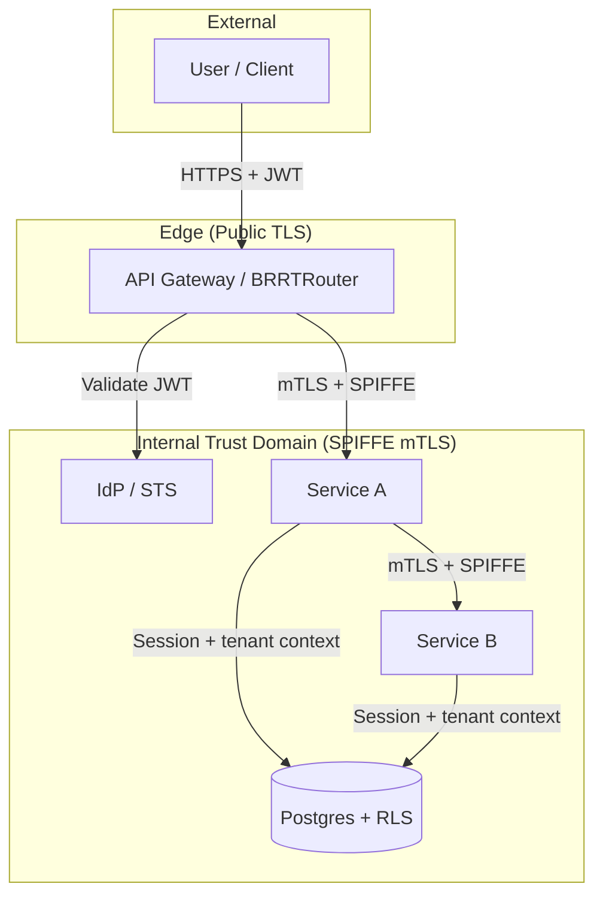
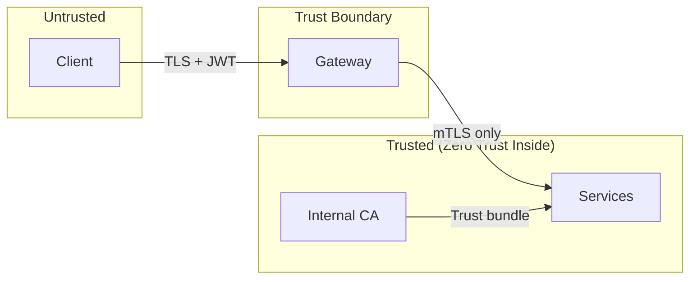
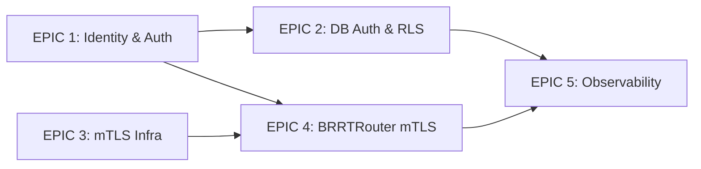
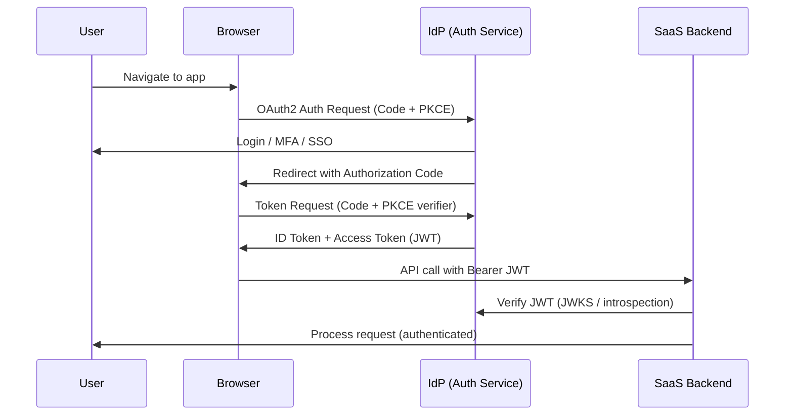
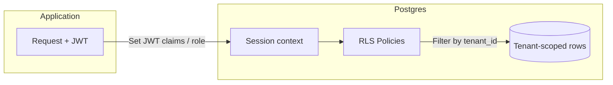
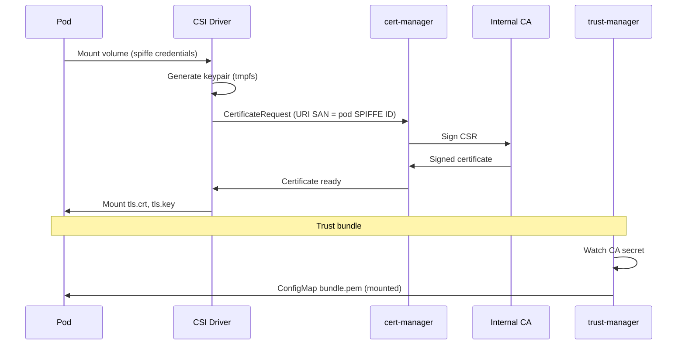
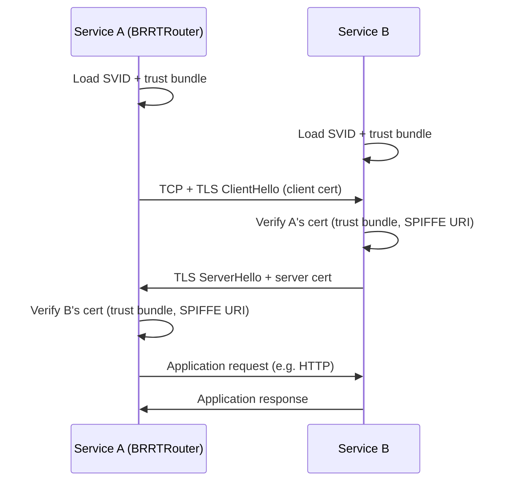
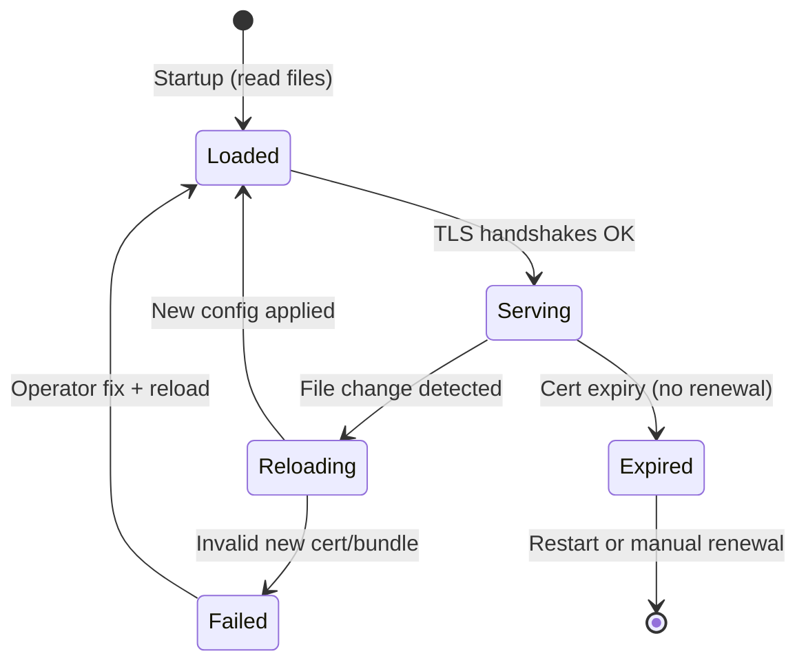

# Product Requirements Document: SPIFFE-Based mTLS & Multi-Tenant Security

**Document ID:** PRD-SPIFFE-mTLS-001  
**Version:** 1.0  
**Status:** Draft  
**Last Updated:** 2025-02-02  
**Owner:** Platform / Security  

---

## Table of Contents

1. [Overview](#1-overview)
2. [Context & Reference Architecture](#2-context--reference-architecture)
3. [Stakeholders & Assumptions](#3-stakeholders--assumptions)
4. [EPICs and Stories](#4-epics-and-stories)
5. [Diagram Index](#5-diagram-index)
6. [Definition of Done](#6-definition-of-done-per-story)
7. [Out of Scope](#7-out-of-scope-explicit)
8. [References](#8-references)

---

## 1. Overview

### 1.1 Purpose

This PRD defines the product requirements to deliver **high-assurance multi-tenant identity, authentication, authorization, and SPIFFE-based mutual TLS** for BRRTRouter and associated services (ERP/finance SaaS). It turns the existing design documents in `./docs/SPIFFY_mTLS/` into a deliverable roadmap with EPICs and Stories.

### 1.2 Scope

- **In scope:** Multi-tenant identity model; OAuth 2.1/OIDC and JWT design; database-level authorization (RLS); SPIFFE-based workload identity and mTLS (cert-manager path); BRRTRouter X.509/mTLS implementation; trust bundle and cert lifecycle; observability and runbooks.
- **Out of scope:** Full SPIRE deployment (Option 1) as first phase; service mesh (Istio/Linkerd) for mTLS; Let’s Encrypt for internal service-to-service mTLS; application-level business logic beyond security.

### 1.3 Goals

| Goal | Description |
|------|-------------|
| **G1** | Enforce tenant-scoped identity and auth at all layers (edge → API → service → DB). |
| **G2** | Provide DB-level authorization (RLS) as mandatory last line of defense for tenant isolation. |
| **G3** | Establish zero-trust service-to-service auth via SPIFFE IDs and X.509 mTLS. |
| **G4** | Implement BRRTRouter-native mTLS (X.509 SVID, trust bundle, SPIFFE validation, hot reload). |
| **G5** | Operate cert lifecycle and observability so rotation is safe and failures are detectable. |

### 1.4 Success Criteria

- All internal service-to-service calls use mTLS with SPIFFE IDs; no plaintext on internal ports when mTLS is enabled.
- BRRTRouter accepts and validates client X.509 SVIDs and rejects untrusted/expired/invalid SPIFFE IDs.
- Certificates rotate without service restart (hot reload); trust bundle updates propagate.
- RLS (or equivalent) enforces tenant isolation on all tenant-scoped tables; no single-layer reliance.
- Metrics and runbooks exist for handshake failures, cert expiry, and incident response.

---

## 2. Context & Reference Architecture

### 2.1 Source Documents

This PRD is derived from:

- `01_High-Assurance Multi-Tenant Identity and Access Control Architecture-Part1.md` — Identity, RBAC/ABAC/ACL, tenancy models.
- `02_High-Security Multi-Tenant Auth & AuthZ Architecture-Part2.md` — OAuth 2.1/OIDC, JWT, SPIFFE/SPIRE for workloads.
- `03_Database-Level Authorization with Supabase_ RLS and Multi-Tenant Security-Part3.md` — RLS, Supabase Auth, threat model.
- `04_Design Plan_ SPIFFE-Based mTLS for BRRTRouter Services.md` — Options 1/2/3, cert-manager, BRRTRouter gaps, implementation plan.
- `SPIFFE_SPIRE Mutual TLS Architecture for BRRTRouter Services.md` — SPIFFE primer, cert lifecycle, BRRTRouter implementation.

### 2.2 High-Level Architecture

### 2.3 Trust Boundaries

---

## 3. Stakeholders & Assumptions

### 3.1 Stakeholders

| Role | Responsibility |
|------|----------------|
| Platform / Security | PRD owner; mTLS and identity design; BRRTRouter security code. |
| Backend / Services | Integration with IdP; tenant context propagation; RLS policies. |
| SRE / DevOps | cert-manager, CSI driver, trust-manager; K8s manifests; runbooks. |
| Product | Multi-tenant and compliance requirements; acceptance sign-off. |

### 3.2 Assumptions

- Kubernetes (or compatible) is the primary deployment environment for BRRTRouter-based services.
- An IdP (Keycloak, Auth0, Okta, or equivalent) exists or will be introduced for OAuth 2.1/OIDC and JWT issuance.
- PostgreSQL (or Supabase) is the primary data store; RLS is acceptable for tenant isolation.
- Option 2 (cert-manager + CSI driver + trust-manager) is the chosen path for SPIFFE-like mTLS in phase one.
- Let’s Encrypt is used only for public ingress; internal mTLS uses an internal CA only.

---

## 4. EPICs and Stories

### 4.1 EPIC Dependency Overview

---

### EPIC 1: Multi-Tenant Identity & Auth Foundation

**Goal:** Establish tenant-scoped identity, OAuth 2.1/OIDC flows, and JWT design so all downstream layers can rely on a consistent principal (identity + tenant + scopes).

**Identity Service (IDAM):** Identity and auth may be delivered by a **separate Identity Service** (IDAM) that BRRTRouter exposes via OpenAPI and routes to. A generic IDAM design—reusable across BRRTRouter, PriceWhisperer, and future systems—is described in [Generic_Identity_Service_IDAM_Design.md](./Generic_Identity_Service_IDAM_Design.md). That design is informed by the PriceWhisperer IDAM OpenAPI (dual OTP, OAuth, SAML, API keys) and extends it with tenant context, refresh/logout, token exchange, and discovery (JWKS/OIDC). A companion **Access Management (AM)** service—where consuming systems register roles/attributes and AM evaluates RBAC/ABAC/claims—is described in [Generic_Access_Management_Service_Design.md](./Generic_Access_Management_Service_Design.md); together Identity + AM form ID/AM.

**Stories:**

| ID | Story | Acceptance Criteria | Priority |
|----|--------|----------------------|----------|
| **1.1** | **Document and implement tenant-scoped identity model** | Identity is defined as (user/service + tenant); principal includes tenant context; documented in ADR or design doc. | P0 |
| **1.2** | **Implement or integrate OAuth 2.1 Auth Code + PKCE for user login** | Users authenticate via Auth Code + PKCE; redirect URI and refresh token behaviour align with OAuth 2.1; IdP configured. | P0 |
| **1.3** | **Implement or integrate Client Credentials grant for service-to-service** | Non-human clients obtain tokens via Client Credentials; tokens are audience-scoped; no “god-mode” tokens. | P0 |
| **1.4** | **Define and implement JWT claim set (tenant, aud, scope, act)** | JWTs include iss, sub, tenant, aud, iat, exp, scope (or permissions); act claim used for delegation; short-lived access tokens (e.g. 5–15 min). | P0 |
| **1.5** | **Implement OAuth 2.0 Token Exchange (RFC 8693) for delegation** | Services can exchange user token for down-scoped token for a specific audience; act claim present when delegated. | P1 |
| **1.6** | **Document hybrid RBAC/ABAC/ACL model and map to layers** | Document which layer enforces RBAC vs ABAC vs ACL; API gateway enforces tenant + role; service layer enforces ABAC where needed. Use companion AM service for registered roles/attributes and JWT/RLS claims (see [Generic_Access_Management_Service_Design.md](./Generic_Access_Management_Service_Design.md)). | P1 |

**User Authentication Flow (Sequence)**

---

### EPIC 2: Database-Level Authorization & RLS

**Goal:** Enforce tenant isolation and row-level authorization in the database so that a single missed check in application code cannot leak another tenant’s data.

**Stories:**

| ID | Story | Acceptance Criteria | Priority |
|----|--------|----------------------|----------|
| **2.1** | **Define RLS policy standard for tenant isolation** | Every tenant-scoped table has tenant_id (or equivalent); RLS policy ensures row visibility only when tenant matches session context; policy pattern documented. | P0 |
| **2.2** | **Implement JWT → session context mapping for Postgres** | Request JWT is mapped to Postgres session (e.g. request.jwt.claims or role); auth.uid() / auth.jwt() (or equivalent) available in RLS. | P0 |
| **2.3** | **Apply RLS to all tenant-scoped tables** | RLS enabled on all target tables; tenant isolation policy applied; no table without RLS that holds tenant data. | P0 |
| **2.4** | **Implement user-owned and role-based RLS policies** | Policies for “owner only” and “role can do X” where needed; security definer helpers used if required for performance. | P1 |
| **2.5** | **Define and enforce service role vs authenticated role usage** | Service role used only for admin/cross-tenant jobs; never exposed to client; documented and audited. | P1 |
| **2.6** | **Add RLS policy tests and migration checklist** | Tests verify cross-tenant access is denied; migration checklist requires RLS for new tenant tables. | P1 |

**Data Layer Authorization Flow**

---

### EPIC 3: SPIFFE/mTLS Infrastructure (cert-manager Path)

**Goal:** Provide SPIFFE-like workload identity and mTLS using cert-manager, CSI driver, and trust-manager so every pod has a short-lived X.509 SVID and a shared trust bundle.

**Stories:**

| ID | Story | Acceptance Criteria | Priority |
|----|--------|----------------------|----------|
| **3.1** | **Deploy internal CA and cert-manager ClusterIssuer** | Internal CA (e.g. CA Issuer or Vault) created; ClusterIssuer configured; CA secret secured (RBAC/KMS as applicable). | P0 |
| **3.2** | **Deploy csi-driver-spiffe and approver-spiffe** | CSI driver and approver installed; pods can request certs with URI SAN spiffe://&lt;trust-domain&gt;/ns/&lt;ns&gt;/sa/&lt;sa&gt;; certs have clientAuth + serverAuth EKU. | P0 |
| **3.3** | **Configure trust-manager Bundle for CA distribution** | Bundle CR sources CA secret; ConfigMap (or equivalent) with bundle.pem created and target namespaces defined; all mTLS pods can mount bundle. | P0 |
| **3.4** | **Define standard volume mounts for cert and bundle** | Convention: cert/key at /var/run/secrets/spiffe.io (tls.crt, tls.key); bundle at /etc/spiffe/bundle.pem; documented in runbook. | P0 |
| **3.5** | **Document and validate cert lifetime and renewal** | Default lifetime ≤ 1h (or 24h if justified); renewBefore configured; renewal tested (e.g. no downtime when CSI refreshes). | P1 |
| **3.6** | **Document Let’s Encrypt boundary (ingress only)** | LE/ACME used only for public ingress; internal mTLS never uses LE; documented in architecture and ops docs. | P1 |

**Certificate Issuance Lifecycle (Option 2)**

---

### EPIC 4: BRRTRouter X.509 mTLS Implementation

**Goal:** Add native X.509 SVID and mTLS support to BRRTRouter so it can terminate TLS with client cert verification, validate SPIFFE IDs, and optionally enforce allowlists.

**Stories:**

| ID | Story | Acceptance Criteria | Priority |
|----|--------|----------------------|----------|
| **4.1** | **Add mTLS configuration schema** | Config includes security.mtls.enabled, cert_file, key_file, ca_bundle_file, trust_domain, optional allowed_spiffe_ids; validation fails startup if mTLS enabled but CA/cert missing. | P0 |
| **4.2** | **Implement TLS acceptor with rustls** | Server accepts TCP; performs TLS handshake with rustls; requires client certificate; uses only configured trust bundle (no system CAs for internal). | P0 |
| **4.3** | **Implement SPIFFE URI SAN extraction and validation** | Parse peer certificate URI SAN; validate format spiffe://&lt;trust-domain&gt;/&lt;path&gt;; enforce trust_domain; reject if missing or invalid. | P0 |
| **4.4** | **Integrate TLS with HTTP handling (may_minihttp or equivalent)** | After handshake, decrypted stream is passed to HTTP layer; existing router and handlers work unchanged; single listen path (mTLS on or off per port). | P0 |
| **4.5** | **Add SpiffeMTLSProvider implementing SecurityProvider** | New provider for mutualTLS scheme; validate() uses connection’s peer SPIFFE ID; optional allowlist (allowed_spiffe_ids or prefix match). | P0 |
| **4.6** | **Support OpenAPI mutualTLS security scheme** | Generator and router support security scheme type mutualTLS; when present, server runs in mTLS mode for that port or globally as documented. | P1 |
| **4.7** | **Implement hot reload of cert, key, and CA bundle** | File watch (e.g. notify) on cert, key, and bundle paths; reload rustls ServerConfig/ClientConfig on change; no restart required for rotation. | P1 |
| **4.8** | **Implement TLS client for outbound calls** | BRRTRouter (or shared lib) can create HTTP/gRPC client with same cert/key/bundle; server cert verified by SPIFFE URI (trust domain or expected ID). | P1 |
| **4.9** | **Enforce fail-secure defaults** | mTLS mode requires explicit trust anchor; empty RootCertStore if misconfigured; TLS 1.2+ and strong ciphers only; document plaintext vs mTLS ports. | P1 |

**Service-to-Service mTLS Sequence**

---

### EPIC 5: Observability, Rotation & Operations

**Goal:** Make mTLS and identity observable and operable: metrics, alerts, runbooks, and documentation so rotation is safe and incidents are diagnosable.

**Stories:**

| ID | Story | Acceptance Criteria | Priority |
|----|--------|----------------------|----------|
| **5.1** | **Add mTLS handshake failure metrics** | Counters for handshake failures by reason (untrusted_issuer, expired_cert, invalid_spiffe_uri, no_client_cert); exported (e.g. Prometheus). | P0 |
| **5.2** | **Add cert expiry gauge** | Gauge (or metric) for “time until current cert expires”; alert when below threshold (e.g. 15 min) without renewal. | P1 |
| **5.3** | **Add authz denial metric for SPIFFE ID** | Counter for rejected peer SPIFFE ID (not in allowlist or wrong trust domain); label with reason. | P1 |
| **5.4** | **Write runbook for cert rotation failure** | Steps when certs expire (e.g. restart pod, check CSI/cert-manager, check trust-manager); escalation path. | P1 |
| **5.5** | **Write runbook for mTLS handshake failures** | Diagnose untrusted issuer, wrong trust domain, expired cert, missing client cert; link to config and bundle paths. | P1 |
| **5.6** | **Document end-to-end security architecture** | Single doc (or set) describing identity → auth → authZ → mTLS → RLS; diagrams; references to PRD and design docs. | P1 |

**Certificate and Trust Bundle State Machine**

---

## 5. Diagram Index

| Diagram | Type | Section |
|---------|------|---------|
| High-level architecture | Flowchart | 2.2 |
| Trust boundaries | Flowchart | 2.3 |
| EPIC dependencies | Flowchart | 4.1 |
| User authentication flow | Sequence | EPIC 1 |
| Data layer authorization | Flowchart | EPIC 2 |
| Certificate issuance lifecycle | Sequence | EPIC 3 |
| Service-to-service mTLS | Sequence | EPIC 4 |
| Cert/bundle state machine | State | EPIC 5 |

---

## 6. Definition of Done (per Story)

- Implementation complete and merged to main (or feature branch as agreed).
- Unit and/or integration tests added or updated; tests pass in CI.
- Security-sensitive paths (TLS config, RLS, allowlists) reviewed.
- Config and behaviour documented (inline, runbook, or architecture doc).
- No P0/P1 linter or security findings outstanding for changed code.

---

## 7. Out of Scope (Explicit)

- **SPIRE (Option 1)** as first-phase implementation; may be a later EPIC.
- **Service mesh (Istio/Linkerd)** for mTLS; no requirement to adopt mesh for this PRD.
- **Let’s Encrypt for internal mTLS**; internal CA only.
- **CRL/OCSP** for X.509 revocation in phase one; reliance on short TTL and optional future work.
- **Application feature logic** beyond identity, auth, authZ, and mTLS (e.g. business rules for invoices).

---

## 8. References

- `./Generic_Identity_Service_IDAM_Design.md` — Generic Identity Service (IDAM) design; reusable across BRRTRouter and other systems; informed by PriceWhisperer IDAM.
- `./Generic_Access_Management_Service_Design.md` — Generic Access Management (AM) service; companion to Identity; consuming systems register roles/attributes; RBAC/ABAC/claims and DB-backed evaluation; ID + AM = ID/AM.
- `./01_High-Assurance Multi-Tenant Identity and Access Control Architecture-Part1.md`
- `./docs/SPIFFY_mTLS/02_High-Security Multi-Tenant Auth & AuthZ Architecture-Part2.md`
- `./docs/SPIFFY_mTLS/03_Database-Level Authorization with Supabase_ RLS and Multi-Tenant Security-Part3.md`
- `./docs/SPIFFY_mTLS/04_Design Plan_ SPIFFE-Based mTLS for BRRTRouter Services.md`
- `./docs/SPIFFY_mTLS/SPIFFE_SPIRE Mutual TLS Architecture for BRRTRouter Services.md`

---

*End of PRD*
