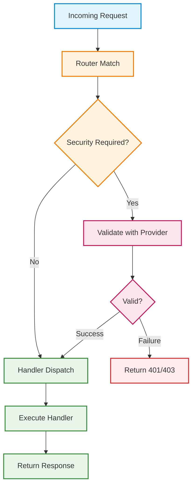

# 🔐 Security & Authentication

## Overview

BRRTRouter implements a comprehensive, **OpenAPI-driven security architecture** that automatically registers and enforces authentication schemes defined in your API specification. This design ensures that security is declarative, type-safe, and tightly coupled to your API contract.

**Key Principles:**

- **📜 OpenAPI-First**: Security schemes are defined once in `components.securitySchemes` and automatically wired
- **🔌 Pluggable**: Implement the `SecurityProvider` trait for custom authentication logic
- **🎯 Route-Level Enforcement**: Each endpoint's `security` requirements are enforced automatically
- **📊 Observable**: Authentication failures tracked by `MetricsMiddleware` for monitoring
- **⚡ High Performance**: Caching support reduces validation overhead

---

## OpenAPI-Driven Security Design

### How Security Schemes Map to Providers

BRRTRouter automatically registers security providers based on your OpenAPI specification:

```yaml
# openapi.yaml
components:
  securitySchemes:
    ApiKeyHeader:
      type: apiKey
      in: header
      name: X-API-Key
    BearerAuth:
      type: http
      scheme: bearer
      bearerFormat: JWT
    OAuth2:
      type: oauth2
      flows:
        authorizationCode:
          authorizationUrl: https://example.com/auth
          tokenUrl: https://example.com/token
          scopes:
            read: Read access
            write: Write access

paths:
  /pets:
    get:
      security:
        - ApiKeyHeader: []
        - BearerAuth: [read]
      ...
  /pets/{id}:
    delete:
      security:
        - BearerAuth: [write]
      ...
```

**What happens at startup:**

1. **Spec Parsing**: `components.securitySchemes` are extracted from OpenAPI spec
2. **Provider Auto-Registration**: Each scheme is mapped to a provider implementation:
   - `apiKey` → `ApiKeyProvider` or `RemoteApiKeyProvider`
   - `http` (bearer) → `BearerJwtProvider` or `JwksBearerProvider`
   - `oauth2` → `OAuth2Provider` or `JwksBearerProvider`
3. **Configuration Overlay**: `config/config.yaml` can override/enhance provider behavior
4. **Route Association**: Each path's `security` requirements are stored in the routing table

**Runtime Flow:**



### Supported OpenAPI Security Scheme Types

| Type | OpenAPI Scheme | Provider | Status |
|------|----------------|----------|--------|
| **API Key** | `apiKey` (header/query/cookie) | `ApiKeyProvider`, `RemoteApiKeyProvider` | ✅ Production |
| **HTTP Bearer** | `http` (scheme: bearer) | `BearerJwtProvider`, `JwksBearerProvider` | ✅ Production |
| **OAuth2** | `oauth2` (all flows) | `OAuth2Provider`, `JwksBearerProvider` | ✅ Production |
| **OpenID Connect** | `openIdConnect` | Planned (`JwksBearerProvider` compatible) | 🚧 Roadmap |
| **Mutual TLS** | N/A | Custom `SecurityProvider` | 🔧 DIY |

---

## Security Providers

### 1. API Key Provider

**Use Cases:**
- Internal microservices with pre-shared keys
- Development/testing environments
- Simple service-to-service authentication

**OpenAPI Configuration:**

```yaml
components:
  securitySchemes:
    ApiKeyHeader:
      type: apiKey
      in: header
      name: X-API-Key
    ApiKeyQuery:
      type: apiKey
      in: query
      name: api_key
    ApiKeyCookie:
      type: apiKey
      in: cookie
      name: session
```

**Environment Variable Configuration:**

```bash
# Global default (fallback for all schemes)
export BRRTR_API_KEY="secret123"

# Per-scheme override (scheme name: ApiKeyHeader)
export BRRTR_API_KEY__APIKEYHEADER="specific_secret"

# Non-alphanumeric chars in scheme name become underscores
# Example: "My-API-Key" → "BRRTR_API_KEY__MY_API_KEY"
```

**Validation:**
- Simple string comparison: `provided_key == configured_key`
- No expiration, no scopes
- Fast: ~100ns per check

---

### 2. Bearer JWT Provider (Development)

**Use Cases:**
- ✅ Testing and development
- ✅ Internal APIs with pre-shared secrets
- ❌ **NOT for production** (use `JwksBearerProvider` instead)

**OpenAPI Configuration:**

```yaml
components:
  securitySchemes:
    BearerAuth:
      type: http
      scheme: bearer
      bearerFormat: JWT
```

**Config File Setup:**

```yaml
security:
  bearer:
    signature: "my-dev-signature"  # JWT 3rd part must match this
    cookie_name: "auth_token"      # Optional: read from cookie
```

**JWT Format:**

```
header.payload.signature
  ↓      ↓        ↓
base64 base64   plain-text (must match config)
```

**Payload Example:**

```json
{
  "sub": "user123",
  "scope": "read write admin",
  "exp": 1698765432
}
```

**Validation:**
1. Extract token from `Authorization: Bearer <token>` or cookie
2. Split JWT: `header.payload.signature`
3. Check signature matches configured value
4. Base64-decode payload
5. Parse JSON
6. Check `scope` contains all required scopes (space-separated)

**Performance:**
- ~1-2µs per validation (in-memory)
- No external calls
- No crypto (just string comparison)

---

### 3. JWKS Bearer Provider (Production)

**Use Cases:**
- ✅ Production APIs with external clients
- ✅ Auth0, PropelAuth, Keycloak, AWS Cognito
- ✅ Proper key rotation support

**OpenAPI Configuration:**

```yaml
components:
  securitySchemes:
    BearerAuth:
      type: http
      scheme: bearer
      bearerFormat: JWT
```

**Config File Setup:**

```yaml
security:
  # Option 1: PropelAuth (auto-derives JWKS URL)
  propelauth:
    auth_url: "https://12345.propelauthtest.com"
    audience: "my-api"
    issuer: "https://12345.propelauthtest.com"  # Optional
    leeway_secs: 30                              # Clock skew tolerance
    cache_ttl_secs: 3600                         # JWKS cache duration

  # Option 2: Per-scheme JWKS
  jwks:
    BearerAuth:
      jwks_url: "https://auth.example.com/.well-known/jwks.json"
      iss: "https://auth.example.com/"
      aud: "my-audience"
      leeway_secs: 30
      cache_ttl_secs: 300
```

**Supported Algorithms:**

| Algorithm | Type | Status |
|-----------|------|--------|
| HS256 | HMAC SHA-256 | ✅ |
| HS384 | HMAC SHA-384 | ✅ |
| HS512 | HMAC SHA-512 | ✅ |
| RS256 | RSA SHA-256 | ✅ |
| RS384 | RSA SHA-384 | ✅ |
| RS512 | RSA SHA-512 | ✅ |
| ES256 | ECDSA SHA-256 | 🚧 Planned |
| ES384 | ECDSA SHA-384 | 🚧 Planned |

**Validation Flow:**

1. Extract token from `Authorization: Bearer <token>`
2. Parse JWT header to get `kid` (key ID) and `alg` (algorithm)
3. Fetch decoding key from JWKS cache (auto-refresh if expired)
4. Validate signature using `jsonwebtoken` crate
5. Verify claims:
   - `exp` (expiration) with leeway
   - `iss` (issuer) if configured
   - `aud` (audience) if configured
   - `nbf` (not before) if present
6. Check `scope` claim contains required scopes

**JWKS Caching:**

- **Cache key**: Key ID (`kid`)
- **Cache value**: `DecodingKey` (pre-parsed RSA/HMAC key)
- **TTL**: Configurable (default: 300 seconds)
- **Refresh**: Automatic when cache expires
- **Thread-safe**: Uses `Mutex`
- **Retry logic**: 3 attempts with 500ms timeout

**Performance:**

- **Cache hit**: ~5-10µs (RSA signature verification + JSON parse)
- **Cache miss**: ~50-200ms (JWKS fetch + parse + validation)
- **Recommendation**: Set `cache_ttl_secs` to match your key rotation frequency

---

### 4. OAuth2 Provider

**Use Cases:**
- OAuth2 authorization code flow
- Token introspection
- Scope-based access control

**OpenAPI Configuration:**

```yaml
components:
  securitySchemes:
    OAuth2:
      type: oauth2
      flows:
        authorizationCode:
          authorizationUrl: https://example.com/auth
          tokenUrl: https://example.com/token
          scopes:
            read: Read access
            write: Write access
            admin: Admin access
```

**Config File Setup:**

```yaml
security:
  # Option 1: Simple mock OAuth2 (development)
  oauth2:
    signature: "oauth-sig"
    cookie_name: "oauth_token"  # Optional

  # Option 2: JWKS-based (production)
  jwks:
    OAuth2:
      jwks_url: "https://auth.example.com/.well-known/jwks.json"
      iss: "https://auth.example.com/"
      aud: "my-api"
```

**Token Sources (Priority Order):**

1. **Cookie**: If `cookie_name` configured, reads from cookie first
2. **Authorization Header**: Falls back to `Authorization: Bearer <token>`

**Scope Validation:**

- Required scopes come from OpenAPI `security` field
- Token must contain ALL required scopes
- Scopes in JWT payload: space-separated string

```json
{
  "scope": "read write admin",
  "sub": "user123"
}
```

**Validation:** Same as `BearerJwtProvider` or `JwksBearerProvider`

---

### 5. Remote API Key Provider

**Use Cases:**
- Centralized API key management service
- Database-backed key validation
- Rate limiting per key
- Revocation support

**OpenAPI Configuration:**

```yaml
components:
  securitySchemes:
    ApiKeyAuth:
      type: apiKey
      in: header
      name: X-API-Key
```

**Config File Setup:**

```yaml
security:
  remote_api_keys:
    ApiKeyAuth:  # Must match scheme name
      verify_url: "https://auth.example.com/verify"
      header_name: "X-API-Key"        # Header to read key from
      timeout_ms: 500                 # Verification request timeout
      cache_ttl_secs: 60              # Cache TTL for validation results
```

**Verification Request:**

```http
GET /verify HTTP/1.1
Host: auth.example.com
X-API-Key: user_provided_key_here
```

**Response:**
- **2xx**: Valid key → cache success for TTL
- **4xx/5xx**: Invalid key → cache failure for TTL
- **Timeout**: Invalid → do NOT cache

**Key Extraction Priority:**

1. Custom header (configured via `header_name`)
2. OpenAPI spec header (`securityScheme.name`)
3. `Authorization: Bearer <key>` (fallback)

**Caching:**

- **Cache key**: API key string
- **Cache value**: `(timestamp, valid: bool)`
- **TTL**: Configurable (default: 60 seconds)
- **Storage**: In-memory `HashMap<String, (Instant, bool)>`
- **Eviction**: Lazy (checks on read)

**Performance:**

- **Cache hit**: ~1µs (HashMap lookup)
- **Cache miss**: ~50-500ms (HTTP request)
- **Recommendation**: Use longer TTL (300-900s) for trusted environments

**Security Considerations:**

- ⚠️ **Cache poisoning**: Negative results are cached (prevents brute force)
- ⚠️ **Timeout attacks**: Timeouts treated as invalid (fail-closed)
- ✅ **Revocation delay**: Limited by cache TTL (max 60s default)

---

## Configuration

### Configuration File Structure

Generated projects include a `config/config.yaml` file:

```yaml
security:
  # Global PropelAuth configuration (preferred for SaaS)
  propelauth:
    auth_url: "https://12345.propelauthtest.com"
    audience: "my-api"
    issuer: "https://12345.propelauthtest.com"
    leeway_secs: 30
    cache_ttl_secs: 3600

  # Per-scheme JWKS configuration
  jwks:
    BearerAuth:
      jwks_url: "https://auth.example.com/.well-known/jwks.json"
      iss: "https://auth.example.com/"
      aud: "my-audience"
      leeway_secs: 30
      cache_ttl_secs: 300

  # Remote API key verification
  remote_api_keys:
    ApiKeyAuth:
      verify_url: "https://auth.example.com/verify"
      header_name: "X-API-Key"
      timeout_ms: 500
      cache_ttl_secs: 60

  # Simple bearer/OAuth2 (development)
  bearer:
    signature: "dev-signature"
    cookie_name: "auth_token"
  
  oauth2:
    signature: "oauth-sig"
    cookie_name: "oauth_token"
```

### Configuration Priority

1. **Config file** (`config/config.yaml`) - highest priority
2. **Environment variables** - fallback
3. **OpenAPI defaults** - lowest priority

**Example:** API Key resolution for scheme `ApiKeyAuth`:

1. Check `security.remote_api_keys.ApiKeyAuth` in config
2. If not found, check `BRRTR_API_KEY__APIKEYAUTH` env var
3. If not found, check `BRRTR_API_KEY` env var
4. If not found, use default: `"test123"`

---

## Auto-Registration Mechanism

### Registration Flow

BRRTRouter automatically registers security providers at application startup:

```rust
// Simplified from templates/main.rs.txt and src/server/service.rs

// 1. Load OpenAPI spec
let spec = brrtrouter::spec::load_spec("openapi.yaml")?;

// 2. Extract security schemes
let schemes = spec.components.security_schemes;

// 3. Load config
let config = load_config("config/config.yaml")?;

// 4. Auto-register providers
for (scheme_name, scheme) in schemes {
    match scheme {
        SecurityScheme::ApiKey { .. } => {
            // Check for remote API key config
            if let Some(cfg) = config.security.remote_api_keys.get(&scheme_name) {
                let provider = RemoteApiKeyProvider::new(&cfg.verify_url)
                    .timeout_ms(cfg.timeout_ms.unwrap_or(500))
                    .header_name(cfg.header_name.as_ref().unwrap_or("X-API-Key"))
                    .cache_ttl(Duration::from_secs(cfg.cache_ttl_secs.unwrap_or(60)));
                service.register_security_provider(&scheme_name, Arc::new(provider));
            } else {
                // Fallback to simple API key
                let key = get_api_key_from_env(&scheme_name);
                service.register_security_provider(&scheme_name, Arc::new(ApiKeyProvider { key }));
            }
        }
        SecurityScheme::Http { scheme, .. } if scheme == "bearer" => {
            // Check for PropelAuth global config
            if let Some(propel) = config.security.propelauth.as_ref() {
                let provider = JwksBearerProvider::new(&propel.derive_jwks_url())
                    .issuer(&propel.issuer)
                    .audience(&propel.audience)
                    .leeway(propel.leeway_secs.unwrap_or(30));
                service.register_security_provider(&scheme_name, Arc::new(provider));
            }
            // Check for per-scheme JWKS
            else if let Some(jwks) = config.security.jwks.get(&scheme_name) {
                let provider = JwksBearerProvider::new(&jwks.jwks_url)
                    .issuer(jwks.iss.as_deref().unwrap_or(""))
                    .audience(jwks.aud.as_deref().unwrap_or(""))
                    .leeway(jwks.leeway_secs.unwrap_or(30));
                service.register_security_provider(&scheme_name, Arc::new(provider));
            }
            // Fallback to simple bearer
            else {
                let sig = env::var("BRRTR_BEARER_SIGNATURE").unwrap_or("sig".into());
                service.register_security_provider(&scheme_name, Arc::new(BearerJwtProvider::new(sig)));
            }
        }
        SecurityScheme::OAuth2 { .. } => {
            // Similar to bearer, with OAuth2Provider fallback
            // ...
        }
        _ => {}
    }
}
```

### Custom Provider Registration

You can override auto-registration by manually registering providers:

```rust
use brrtrouter::security::{SecurityProvider, SecurityRequest};
use brrtrouter::spec::SecurityScheme;
use std::sync::Arc;

struct CustomProvider {
    // Your custom fields
}

impl SecurityProvider for CustomProvider {
    fn validate(&self, scheme: &SecurityScheme, scopes: &[String], req: &SecurityRequest) -> bool {
        // Your custom validation logic
        true
    }
}

// Register custom provider (overrides auto-registration)
service.register_security_provider("MyScheme", Arc::new(CustomProvider { /* ... */ }));
```

---

## Per-Route Security Enforcement

### OpenAPI Security Configuration

```yaml
paths:
  /public:
    get:
      # No security - public endpoint
      responses:
        200:
          description: OK

  /authenticated:
    get:
      security:
        - ApiKeyAuth: []  # Requires ApiKeyAuth (no scopes)
      responses:
        200:
          description: OK

  /protected:
    get:
      security:
        - BearerAuth: [read]  # Requires BearerAuth with 'read' scope
      responses:
        200:
          description: OK

  /admin:
    post:
      security:
        - BearerAuth: [admin, write]  # Requires 'admin' AND 'write' scopes
      responses:
        201:
          description: Created

  /multi-auth:
    get:
      security:
        - ApiKeyAuth: []     # Option 1: API Key
        - BearerAuth: []     # Option 2: Bearer Token
      # ANY of the schemes must pass
      responses:
        200:
          description: OK
```

### Validation Logic

**Single Scheme:**

```yaml
security:
  - BearerAuth: [read, write]
```

→ Must pass `BearerAuth` provider with both `read` AND `write` scopes

**Multiple Schemes (OR logic):**

```yaml
security:
  - ApiKeyAuth: []
  - BearerAuth: []
```

→ Must pass EITHER `ApiKeyAuth` OR `BearerAuth`

**Global Security (applied to all endpoints):**

```yaml
security:
  - BearerAuth: []

paths:
  /pets:
    get:
      # Inherits global security
  /public:
    get:
      security: []  # Override: no security required
```

---

## Observability

### Metrics Collection

BRRTRouter's `MetricsMiddleware` tracks authentication events:

**Counters:**

- `brrtrouter_auth_failures_total{scheme="BearerAuth"}` - Failed auth attempts
- `brrtrouter_requests_total{method="GET", path="/pets", status="401"}` - Unauthorized requests

**Prometheus Query Examples:**

```promql
# Auth failure rate by scheme
rate(brrtrouter_auth_failures_total[5m])

# % of requests failing auth
rate(brrtrouter_requests_total{status="401"}[5m]) 
  / 
rate(brrtrouter_requests_total[5m]) 
  * 100

# Top failed endpoints
topk(5, sum by (path) (
  rate(brrtrouter_requests_total{status=~"401|403"}[5m])
))
```

### Tracing

Security validation is traced via OpenTelemetry:

```
Span: handle_request
  ├─ Span: route_match
  ├─ Span: security_validation
  │   ├─ scheme: BearerAuth
  │   ├─ scopes: [read, write]
  │   └─ result: success
  └─ Span: handler_dispatch
```

**Jaeger Query:**
- Service: `brrtrouter`
- Operation: `security_validation`
- Tags: `scheme`, `result`

### Logging

```rust
// Auto-logged at startup
[auth] register JwksBearerProvider scheme=BearerAuth source=propelauth jwks_url=https://...
[auth] register RemoteApiKeyProvider scheme=ApiKeyAuth url=https://... timeout_ms=500 ttl_s=60

// Request-time logs (debug level)
[security] validating scheme=BearerAuth scopes=[read]
[security] validation failed: token expired
```

---

## Testing

### Unit Tests

```rust
#[cfg(test)]
mod tests {
    use super::*;

    #[test]
    fn test_bearer_jwt_validation() {
        let provider = BearerJwtProvider::new("test-sig");
        let scheme = SecurityScheme::Http {
            scheme: "bearer".into(),
            bearer_format: Some("JWT".into()),
        };
        
        let mut headers = HashMap::new();
        headers.insert("authorization".into(), "Bearer header.payload.test-sig".into());
        
        let req = SecurityRequest {
            headers: &headers,
            query: &HashMap::new(),
            cookies: &HashMap::new(),
        };
        
        assert!(provider.validate(&scheme, &[], &req));
    }
}
```

### Integration Tests

See `tests/security_tests.rs` for comprehensive test suite:

- API Key validation (header, query, cookie)
- Bearer JWT with scopes
- OAuth2 with cookie fallback
- JWKS provider with key rotation
- Remote API key verification with caching
- Multi-scheme authentication (OR logic)
- Per-route security enforcement

### Load Testing

Goose load tests (`examples/api_load_test.rs`) test authenticated endpoints:

```bash
cargo run --release --example api_load_test -- \
  --host http://localhost:8080 \
  --header "X-API-Key: test123" \
  -u20 -r5 -t2m
```

---

## Security Best Practices

### 1. Use Production Providers in Production

| Environment | API Key | JWT | OAuth2 |
|-------------|---------|-----|--------|
| **Development** | `ApiKeyProvider` (env var) | `BearerJwtProvider` (simple) | `OAuth2Provider` (simple) |
| **Production** | `RemoteApiKeyProvider` (centralized) | `JwksBearerProvider` (JWKS) | `JwksBearerProvider` (JWKS) |

### 2. Configure Appropriate Cache TTLs

| Provider | Recommended TTL | Rationale |
|----------|-----------------|-----------|
| `JwksBearerProvider` | 300-3600s | Match key rotation frequency |
| `RemoteApiKeyProvider` | 60-300s | Balance performance vs. revocation delay |

### 3. Use Leeway for JWT Expiration

- **Development**: `leeway_secs: 60` (generous for clock skew)
- **Production**: `leeway_secs: 30` (tight for security)

### 4. Monitor Authentication Failures

Set alerts for:
- Spike in `brrtrouter_auth_failures_total` (brute force attack?)
- High `401` rate for specific endpoints (misconfiguration?)
- JWKS fetch failures (upstream auth service down?)

### 5. Rotate Keys Regularly

- **JWKS**: Key rotation handled automatically (cache refresh)
- **API Keys**: Implement rotation via `RemoteApiKeyProvider`
- **Bearer Signatures**: Only for development (use JWKS in prod)

### 6. Fail Closed

All security providers fail closed (return `false`) on errors:
- Timeout → Invalid
- Parse error → Invalid
- Network error → Invalid

### 7. Scope Minimization

Use fine-grained scopes:

```yaml
security:
  - BearerAuth: [read:pets]  # Specific resource access

# Not:
security:
  - BearerAuth: [admin]  # Overly broad
```

---

## Common Patterns

### Pattern 1: PropelAuth Integration

```yaml
security:
  propelauth:
    auth_url: "https://12345.propelauthtest.com"
    audience: "my-api"

# Auto-derives:
# - issuer: https://12345.propelauthtest.com
# - jwks_url: https://12345.propelauthtest.com/.well-known/jwks.json
```

### Pattern 2: Multi-Tenant API Keys

```yaml
components:
  securitySchemes:
    TenantApiKey:
      type: apiKey
      in: header
      name: X-Tenant-Key

security:
  remote_api_keys:
    TenantApiKey:
      verify_url: "https://auth.example.com/verify-tenant"
      cache_ttl_secs: 300
```

### Pattern 3: Service-to-Service Auth

```yaml
components:
  securitySchemes:
    ServiceAuth:
      type: http
      scheme: bearer

# Simple pre-shared secret (not JWKS)
security:
  bearer:
    signature: "${SERVICE_SECRET}"  # Env var substitution
```

### Pattern 4: Public + Protected Endpoints

```yaml
paths:
  /health:
    get:
      security: []  # Public

  /docs:
    get:
      security: []  # Public

  /api/pets:
    get:
      security:
        - BearerAuth: [read]  # Protected
```

---

## Troubleshooting

### Issue: 401 Unauthorized on Valid Token

**Symptoms:**
- Token works in JWT debugger
- Returns 401 from BRRTRouter

**Checks:**

1. **Issuer mismatch**:
   ```bash
   # Decode token (payload)
   echo "<token-payload>" | base64 -d | jq .iss
   # Compare with config
   grep issuer config/config.yaml
   ```

2. **Audience mismatch**:
   ```bash
   echo "<token-payload>" | base64 -d | jq .aud
   grep audience config/config.yaml
   ```

3. **Expired token**:
   ```bash
   echo "<token-payload>" | base64 -d | jq .exp
   date +%s  # Compare with current timestamp
   ```

4. **Missing scope**:
   ```bash
   echo "<token-payload>" | base64 -d | jq .scope
   # Check OpenAPI security requirement
   ```

5. **JWKS fetch failure**:
   ```bash
   curl https://your-auth-url/.well-known/jwks.json
   # Check network, CORS, TLS
   ```

### Issue: Performance Degradation

**Symptoms:**
- Slow request latency
- High CPU usage

**Checks:**

1. **JWKS cache disabled**:
   ```yaml
   cache_ttl_secs: 0  # ❌ DON'T DO THIS
   cache_ttl_secs: 300  # ✅ Enable caching
   ```

2. **Remote API key verification too slow**:
   ```yaml
   timeout_ms: 5000  # ❌ Too long
   timeout_ms: 500   # ✅ Reasonable
   cache_ttl_secs: 60  # ✅ Add caching
   ```

3. **Token validation in hot path**:
   - Use `MetricsMiddleware` to identify slow providers
   - Profile with `flamegraph` (see `docs/flamegraph.md`)

### Issue: Security Provider Not Registered

**Symptoms:**
- 500 Internal Server Error
- Log: `security provider not found: BearerAuth`

**Checks:**

1. **Scheme name mismatch**:
   ```yaml
   # OpenAPI
   securitySchemes:
     BearerAuth:  # ← Name here
   
   # Config
   jwks:
     BearerAuth:  # ← Must match exactly (case-sensitive)
   ```

2. **Config file not loaded**:
   ```bash
   # Check file exists
   ls -la config/config.yaml
   # Check loading in logs
   grep "Loaded config" logs/
   ```

3. **Environment variable not set**:
   ```bash
   # For simple API key
   echo $BRRTR_API_KEY
   # For scheme-specific
   echo $BRRTR_API_KEY__APIKEYAUTH
   ```

---

## References

### Related Documentation

- [OpenAPI 3.1.0 Security Schemes](https://spec.openapis.org/oas/v3.1.0#security-scheme-object)
- [JWT RFC 7519](https://tools.ietf.org/html/rfc7519)
- [JWKS RFC 7517](https://tools.ietf.org/html/rfc7517)
- [OAuth2 RFC 6749](https://tools.ietf.org/html/rfc6749)

### Code References

- **Security Providers**: `src/security.rs`
- **Auto-Registration**: `templates/main.rs.txt` (lines 230-352)
- **Route Enforcement**: `src/server/service.rs`
- **Test Suite**: `tests/security_tests.rs`

### Configuration Templates

- **Generated Config**: `templates/config.yaml`
- **Example OpenAPI**: `examples/openapi.yaml` (lines 674-685)

---

## Summary

BRRTRouter's OpenAPI-driven security architecture provides:

- ✅ **Zero Configuration**: Auto-registration from OpenAPI spec
- ✅ **Production-Ready**: JWKS, remote verification, caching
- ✅ **Type-Safe**: Compile-time checks for security requirements
- ✅ **Observable**: Metrics and tracing for auth failures
- ✅ **Flexible**: Custom providers via `SecurityProvider` trait
- ✅ **Performant**: Sub-10µs validation with caching

**Next Steps:**

1. Define `securitySchemes` in your OpenAPI spec
2. Add `security` requirements to protected endpoints
3. Configure providers in `config/config.yaml`
4. Test with `just curls` or the Interactive Dashboard
5. Monitor auth metrics in Grafana

