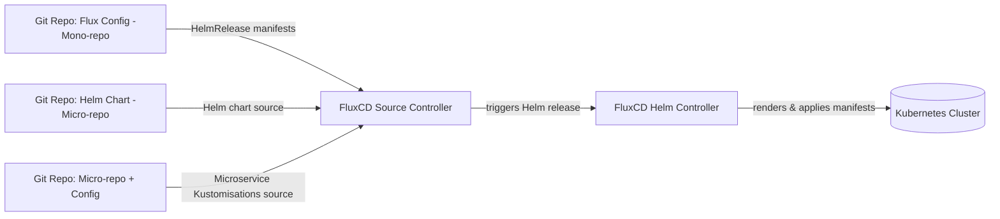
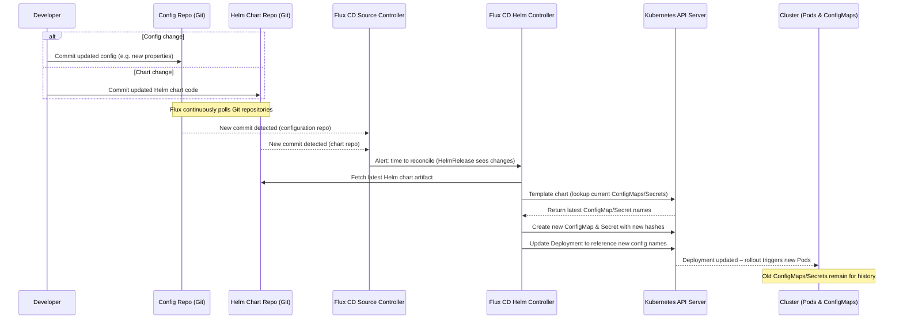

Hash-Suffixed ConfigMaps, Secrets, and Helm: A Practical Guide with Flux CD

Introduction
When you weave together Kustomize, Helm, and Flux CD, a deceptively simple requirement – “roll my Pods when the application config changes, but keep the old config around for debugging” – turns into an architectural puzzle. In a GitOps workflow with Flux, we wanted to ensure that any change to application configuration would automatically trigger a new rollout, while still preserving every past version of that config. Achieving this required balancing three key constraints in our Kubernetes deployment process:
1.	**Immutable artifacts**: We use Kustomize configMapGenerator and secretGenerator with disableNameSuffixHash: false. This means every ConfigMap or Secret gets a unique name (a suffix hash) based on its content, for example my-example-d4d25cg445 or my-example-sops-secrets-2tbdd95dkh. We wanted to keep this behavior to treat configs as immutable snapshots.

3. **Zero-touch rollouts**: Any configuration content change should automatically tweak the Pod template in the Deployment so that Kubernetes notices and triggers a rolling update. We wanted this to happen without manual intervention (no manual kubectl rollout restart or version bump). In other words, config changes themselves should propagate to pods seamlessly via GitOps.

4. **Historical snapshots**: Old hash-suffixed ConfigMaps/Secrets should not be pruned immediately. They must remain in the cluster so that an on-call engineer can inspect or describe any previous revision of config if needed for debugging or rollback analysis.

Meeting all three simultaneously is tricky. By default, Helm doesn’t automatically roll deployments on ConfigMap changes, and Kustomize’s hashed configmaps can conflict with Flux’s tracking. 

Below, we’ll walk through our attempts to solve this and the final pattern that emerged. We’ll also illustrate how our GitOps setup is structured with Flux CD, and provide sequence diagrams to show how the pieces work together.

Our GitOps Setup: **Flux, Helm, and Two smoking repositories Repositories** :)

In our scenario, we manage a fleet of microservices using Flux CD and a shared Helm chart. We maintain two types of Git repositories in this setup: a Flux config repository and a service Helm chart repository. The Flux config repo (a “mono-repo” for the cluster) holds the desired state for our cluster – for example, Kustomize overlays, HelmRelease manifests, and configuration values for all services. Each microservice, on the other hand, has its own “micro-repo” containing its Helm chart (and possibly application code). Flux’s controllers continuously watch both repositories. When changes occur in either, Flux fetches the updates and reconciles the cluster state accordingly.

For clarity, the diagram below illustrates this architecture at a high level:



Figure 1: Flux CD monitors an environment config repo and a service’s chart repo. The Source Controller detects changes and notifies the Helm Controller, which renders the Helm chart with the latest config and applies it to the cluster. In our case, we use Kustomize generators in the config repo to produce ConfigMaps/Secrets (with hashed names) from application configuration data. The Flux HelmRelease then deploys the app using those generated config resources.

With this setup in mind, let’s examine the challenge we faced and the iterative attempts to fulfill the three requirements mentioned above.

#### First Attempts and Why They Fell Short

We tried a few approaches to get automatic pod restarts on config changes while preserving old configs. Each seemed promising but had shortcomings:

•	Disabling the hash on the Helm values ConfigMap: Initially, we attempted to turn off the name hash for the ConfigMap that held our Helm chart values (by setting disableNameSuffixHash: true for that generator). This stopped Flux from complaining about missing references (since the name stayed constant), but it introduced a new problem: the ConfigMap was now mutated in place on each update, using the same name. That meant we lost the immutable history of past configurations – every change overwrote the previous data. This violated our requirement for historical snapshots, and any debugging of old configs would be impossible because the old revision was gone.

•	Using Flux v2.7’s watch feature on ConfigMaps/Secrets: Flux 2.7 introduced the ability for the Helm controller to watch referenced ConfigMaps/Secrets for changes (via a label like helm.toolkit.fluxcd.io/watch: "true" on those resources). We tried enabling this so that when our config ConfigMap changed, Flux would automatically re-run the Helm release. Indeed, Flux stopped flagging the resource, and it did trigger reconciliations on changes. However, the deployment’s PodSpec still referenced a generic name (since we weren’t using a hash in the name at that point). The hash never appeared in the Deployment spec, so it was hard to tell at a glance which config version a given Pod was using. In other words, while the controller reacted to changes, the actual Pod template did not include a unique identifier of the config version. This meant if someone looked at the Deployment or ReplicaSet, they couldn’t easily correlate a Pod to a specific config ConfigMap without digging through logs or events. We wanted the deployed manifests themselves to reflect the config revision for clarity and traceability.

•	Using a post-render overlay in a separate Git repo: In this approach, we rendered the Helm chart and then applied a Kustomize overlay (stored in another repository) to patch the Deployment with the current ConfigMap’s hash. This gave us the desired rollout behavior and preserved history (since the overlay could inject the correct hashed name each time). It worked in a limited scenario, but it introduced fragile complexity. Specifically, once we separated the chart source from application config (i.e., having one repo for the Helm chart and another for config), the Helm controller could no longer easily access the overlay patch file. Essentially, Helm (or Flux’s Helm controller) would need to pull in that extra repo to apply the patch, which wasn’t straightforward. The split-brain approach of an external post-render step proved unwieldy and hard to maintain as our tooling and repositories scaled.

After these false starts, it became clear we needed a solution that operates within the Helm chart rendering itself – something that could dynamically pick up the latest hashed ConfigMap/Secret and plug it into the Deployment manifest. This way, we wouldn’t rely on external scripts or manual version bumps, and the Deployment spec would always include the unique config version. Enter Helm’s templating magic.

#### The Helpers That Fixed It

To solve the problem, we wrote a Helm chart helper function that discovers, at template render time, the newest hash-suffixed ConfigMap or Secret in the cluster matching a base name. This leverages Helm’s lookup function to query the Kubernetes API for existing resources. Here’s the core helper:

```gotemplate
{{/*
latestOrBase
------------
Returns the newest hash-suffixed name found by
findLatestWithHashSuffix, or the unsuffixed base name when lookup
returns empty (e.g. during offline helm template).
*/}}
{{- define "helmchart.latestOrBase" -}}
{{- $name := include "helmchart.findLatestWithHashSuffix" . }}
{{- if $name }}{{ $name }}{{ else }}{{ .base }}-HashSuffixPlaceHolder{{ end }}
{{- end }}

{{/*
  findLatestWithHashSuffix
  ------------------------
  Returns the newest Secret or ConfigMap whose name matches
  <base>-<hash> where <hash> is 10 chars [a-z0-9].

  Inputs:
    kind:      "Secret" or "ConfigMap"
    base:      base name before the dash
    namespace: target namespace
*/}}
{{- define "helmchart.findLatestWithHashSuffix" -}}
{{- $kind := .kind | default "Secret" }}
{{- $ns   := .namespace }}
{{- $base := .base }}
{{- $pattern := printf "^%s-[a-z0-9]{10}$" $base }}
{{- $list := lookup "v1" $kind $ns "" }}
{{- $latestTS := "" }}
{{- $latestName := "" }}

{{- range $list.items }}
  {{- $name := .metadata.name }}
  {{- if regexMatch $pattern $name }}
    {{- $ts := .metadata.creationTimestamp }}
    {{- if gt $ts $latestTS }}
      {{- $latestTS = $ts }}
      {{- $latestName = $name }}
    {{- end }}
  {{- end }}
{{- end }}
{{- $latestName }}
{{- end }}

```

This helper function, `helmchart.findLatestWithHashSuffix`, takes a dictionary with context (the .kind of resource to look up, the base name .base to match, and the .namespace). It lists all existing objects of that kind in the namespace, filters those whose names match the pattern “<base>-<10-character hash>”, and then picks the one with the most recent creation timestamp. The name of that latest ConfigMap/Secret is returned as the template output.

#### However, we have to consider a scenario: 

What about rendering the chart outside of a cluster (for example, in CI pipelines or when running helm template locally)? In such cases, the lookup function won’t find any in-cluster resources (because you’re not connected to a cluster, or it’s a fresh install with none created yet). We needed our templates to still render valid YAML in those contexts (perhaps using the base name as a fallback). To handle this, we wrapped the above helper with a second helper that provides a safe default:

```gotemplate
{{- define "helmchart.latestOrBase" -}}
{{- $n := include "helmchart.findLatestWithHashSuffix" . -}}
{{- if $n }}{{ $n }}{{ else }}{{ .base }}{{ end }}-HashSuffix
{{- end }}
```

This latestOrBase helper tries to get a name via findLatestWithHashSuffix. If it finds one ($n is not empty), it returns that name. If nothing is found (e.g., no existing resource yet), it falls back to just the provided base name (unsuffixed).

Now we incorporate this into our Deployment spec. In the Helm chart’s Deployment template, instead of hardcoding the ConfigMap name, we use the helper to substitute the correct name at render time:

### Deployment (excerpt)
```yaml
envFrom:
- configMapRef:
  name: {{ include "helmchart.latestOrBase" (dict
          "kind" "ConfigMap"
          "base" .Values.appName
          "namespace" .Release.Namespace) }}

- secretRef:
  name: {{ include "helmchart.latestOrBase" (dict
          "kind" "Secret"
          "base" (printf "%s-sops-secrets" .Values.appName)
          "namespace" .Release.Namespace) }}
```

In the above snippet, .Values.appName is the base name of our ConfigMap (e.g. my-example), and we append “-sops-secrets” for the Secret base name. The helpers will resolve the latest my-example-<hash> ConfigMap and the latest my-example-sops-secrets-<hash> Secret at the time of rendering:

> In-cluster (Flux applying the Helm chart):
> 
> The lookup calls run on the cluster’s live state. The helper finds the newest hash-suffixed ConfigMap and Secret that match the base names and returns those full names. The Deployment’s envFrom will thus reference, say, my-example-d4d25cg445. Because this name includes a content-derived hash, any change to the ConfigMap/Secret content results in a new resource with a different name. The next time Flux renders the chart, the helper will pick up that new name, and the Deployment spec will change accordingly. A change in the Deployment’s pod template (even just the referenced ConfigMap name) triggers Kubernetes to perform a rolling update of the Pods. All of this happens automatically during reconciliation – no human intervention needed. We’ve achieved the “zero-touch rollout” requirement, and we always know exactly which config version a Pod is using by looking at its spec.

and

> Offline or CI rendering (helm template):
>
> When rendering the Helm chart outside of a cluster (for example, in CI to generate manifests for review), the lookup function won’t find any existing resources. In this case, our latestOrBase wrapper will safely fall back to the unsuffixed base name (e.g., my-example). The rendered YAML will refer to name: my-example. This ensures that even on a fresh installation or in a context with no cluster connection, the templates render without error (they’ll point to the base name, which on initial install will correspond to the first ConfigMap that gets created). Once applied to a cluster, subsequent renders will start substituting the hashed names as those appear. The key point is that our manifests are renderable in any context – the lack of existing config objects doesn’t break the output.

At this stage, we have a mechanism that ensures every config change produces a new ConfigMap/Secret (thanks to Kustomize) and that our Deployment automatically picks up the new name (thanks to the Helm helper), causing a rollout. We also intentionally do not delete the old config objects, so they remain in the cluster as historical snapshots. An engineer can run kubectl get configmap or describe on an older config by its name if needed.

*The Checksum Annotations — Belt or Suspenders?*

With the hashed names in use, one might ask: do we also need the old Kubernetes trick of adding checksum annotations to the PodSpec? In Kubernetes, a common pattern to force rollout on config change is to compute a hash of config data and put it in the Deployment’s pod template annotations (e.g., checksum/config: "abc123..."). 

This dummy annotation changes whenever the config does, thus bumping the PodSpec and triggering a rollout. We had already effectively achieved that outcome via the name change, but we decided to implement checksum annotations as an extra safety net. Think of it as a “belt and suspenders” approach – redundant, but reassuring during a transition period.

We calculated a SHA-256 checksum of the ConfigMap data and Secret data, and added those as annotations on the Deployment. For example:

```yaml
spec:
  template:
    metadata:
      annotations:
        checksum/app-config: "{{ $cmChecksum }}"
        checksum/sops-secret: "{{ $secretChecksum }}"
```

Where `$cmChecksum` and `$secretChecksum` are computed in the Helm chart (e.g., by hashing the .Values or the files that populate the ConfigMap/Secret). We then examined how the system would behave in various scenarios, with just the hash-suffix helper vs. helper + checksum annotations:

| Scenario                                         | *Hash-suffix helper only*         | *Helper + checksum annotations*                    |
| ------------------------------------------------ | --------------------------------- | -------------------------------------------------- |
| **Content change generates a new hashed object** | Pod rolls (name changes in spec). | Pod rolls (name changes **and** checksum changes). |
| **Content mutated in place inside same object**  | *No roll* (name unchanged).       | Pod rolls (checksum changes).                      |
| **Immutable generators** (`immutable: true`)     | Fully covered by new name.        | Redundant but harmless.                            |
| **Pod spec verbosity**                           | Cleaner (no extra annotations).   | More verbose (additional annotation lines).        |


Analysis: If you’re strictly using immutable ConfigMap/Secret generation (Kustomize now supports an immutable: true flag on generators, which we enabled), then the scenario of “content mutated in place” shouldn’t happen – you’d always get a new object on change. In that ideal case, the checksum annotations don’t provide any extra rollout triggers because the name change is enough. However, during development or in less controlled workflows, it’s possible someone could manually edit a ConfigMap (or a CI job might patch it) without changing the name. In such an edge case, the name-based approach alone wouldn’t roll the pods (since the Deployment still points at the same name), but the checksum annotations would detect a content change and force a rollout. In our comparison above, the helper alone handles the normal immutable workflow, but the checksums cover the corner cases. The trade-off is a slightly more cluttered Deployment spec with those extra annotation lines.

Our recommendation: Keep both mechanisms until you are 100% confident that all config changes result in new, immutable resources. They cost almost nothing in terms of performance or complexity, and they protect against accidental config mutations that might otherwise slip through. Once your workflow is strictly immutable (every config change creates a new ConfigMap/Secret and nobody is manually patching them in place), you can choose to remove the checksum annotations to streamline your manifests. At that point the hash suffix in the resource name is sufficient to guarantee rollouts. Until then, the belt-and-suspenders approach ensures no config update goes unnoticed by the deployment controller.

Putting It All Together

To recap, here’s the complete pattern and workflow we ended up with:
1.	Use immutable, hashed config generators: Define your ConfigMaps/Secrets via Kustomize (or other generators) with disableNameSuffixHash: false (the default) and immutable: true. This ensures that each change produces a new resource with a unique name and that the old ones aren’t overwritten or mutated. For example, you might have in your kustomization YAML:

configMapGenerator:
- name: my-example
  files: [... files or literals ...]
  behavior: create
  immutable: true

The above will generate a ConfigMap named my-example-<hash> that is immutable (Kubernetes will refuse any later update to that same object).

2.	**In-Helm helper to resolve latest names**: Add the Helm template helper (as shown above) to your chart. This helper dynamically looks up the latest existing ConfigMap/Secret by base name. Also include the wrapper that falls back to the base name for offline rendering. This logic lets the Helm chart “find” the right config resource at render time without any manual input.

3.	**Reference config by helper output in the Deployment**: Modify your Deployment (and any other workload manifests) to reference the ConfigMap/Secret via the helper. For instance, use envFrom with configMapRef.name: {{ include "helmchart.latestOrBase" ... }} instead of a fixed name. You can do the same for volume mounts (configMap.name in volumes, etc.). The key is that the Deployment’s Pod spec now always points to the latest-hash name that the helper provides. As a result, any time a new ConfigMap/Secret is introduced, that name changes and the Deployment’s spec changes, triggering a rollout.

5. **(Optional) Add checksum annotations**: For extra safety, compute a hash of the config data and add it as an annotation on the Pod template (e.g., checksum/config: "..."). This will force a pod restart even if someone manages to update a ConfigMap in place (which shouldn’t happen if you’ve made them immutable, but this guards against human error or non-immutable resources). This step is optional but recommended during the transition to fully immutable configs.

6. **Retain old config objects in the cluster**: Do not automatically prune the old ConfigMaps and Secrets. By leaving the historical config objects in the namespace, you maintain a trail of past configurations. This is invaluable for debugging – if a new release breaks something, you can quickly diff the new ConfigMap against the last working one, or even point a Pod manually to the old config if you need to test a hunch. Flux (and Kubernetes in general) will ignore those unused ConfigMaps/Secrets, but they’re available whenever you need to inspect prior states. Just be mindful of cleaning them up eventually if they grow too numerous, or use labels/automation to purge ones older than X days as appropriate for your environment.

With all these pieces in place, let’s walk through how a typical config change flows through the system:



Figure 2: Sequence of events when a change is made. A commit to either the config repo or chart repo is picked up by Flux. The Helm controller renders the release, using the helper to get current config names via the Kubernetes API. A new ConfigMap/Secret is created and the Deployment’s Pod template is updated to refer to it, causing Kubernetes to roll out pods with the new config. Older config objects stay in the cluster for debugging.

# Conclusion

This pattern allowed our platform team to ship dozens of microservices with a single shared Helm chart, confident that every configuration change is automatically deployed and traceable. We no longer fear config drifts or mysterious stale values – any change in a config file in Git results in a new ConfigMap/Secret, a new Deployment revision, and new Pods picking it up, all without manual intervention. At the same time, if an issue arises, we can easily identify exactly which config version each Pod is running (the hash in the name makes it obvious) and even inspect old config versions since they remain in the cluster.

By leveraging Kustomize’s hashed resource generation, Helm’s templating and lookup capabilities, and Flux’s GitOps automation, we achieved immutable, traceable config rollouts with zero touch. Once your workflows are fully immutable and proven, you can simplify by dropping the extra checksum annotations, but until then, a dual approach ensures that belt or suspenders, your Pods will always catch your config changes. This solution strikes a balance between automation and control, giving you robust deployments that are both self-updating and debug-friendly. Enjoy a good night’s sleep knowing your apps will faithfully reload their configs and you’ll have the audit trail when you need it.