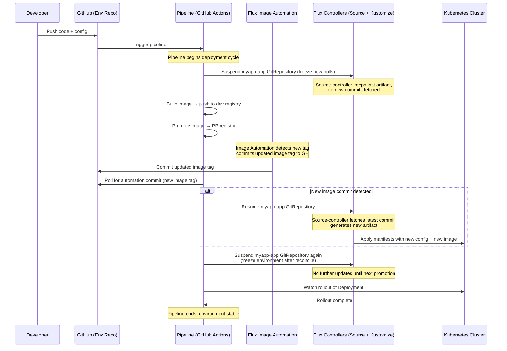

```mermaid
sequenceDiagram
    participant Dev as Developer
    participant GH as GitHub (Env Repo)
    participant CI as Pipeline (GitHub Actions)
    participant ImgAuto as Flux Image Automation
    participant Flux as Flux Controllers (Source + Kustomize)
    participant K8s as Kubernetes Cluster

    Dev->>GH: Push code + config
    GH->>CI: Trigger pipeline

    Note over CI: Pipeline begins deployment cycle

    CI->>Flux: Suspend myapp-app GitRepository (freeze new pulls)
    Note over Flux: Source-controller keeps last artifact,<br>no new commits fetched

    CI->>CI: Build image → push to dev registry
    CI->>CI: Promote image → PP registry

    Note over ImgAuto: Image Automation detects new tag<br>commits updated image tag to GH

    ImgAuto->>GH: Commit updated image tag
    CI->>GH: Poll for automation commit (new image tag)

    alt New image commit detected
      CI->>Flux: Resume myapp-app GitRepository
      Note over Flux: Source-controller fetches latest commit,<br>generates new artifact
      Flux->>K8s: Apply manifests with new config + new image
    end

    CI->>Flux: Suspend myapp-app GitRepository again<br>(freeze environment after reconcile)
    Note over Flux: No further updates until next promotion

    CI->>K8s: Watch rollout of Deployment
    K8s-->>CI: Rollout complete
    Note over CI: Pipeline ends, environment stable

```