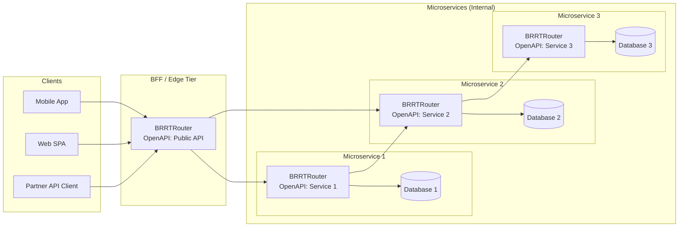

## BRRTRouter: An OpenAPI-First High-Performance Router for Modern Microservices

### 1. Executive Summary

#### 1.1 Positioning in the Market

BRRTRouter is an OpenAPI-first HTTP router and backend-for-frontend (BFF) engine designed for organizations that treat their API surface as a strategic asset rather than a by-product of implementation. It sits between external clients and a fleet of internal microservices, owning request validation, routing, security enforcement, and observability while keeping business logic in downstream systems.

From a market perspective, BRRTRouter occupies the space between traditional API gateways and full-stack application frameworks:
- Compared to API gateways, it offers **first-class OpenAPI contract enforcement** and type-safe code generation rather than treating specifications as optional documentation.
- Compared to general-purpose frameworks, it provides a **minimal, performance-focused runtime** optimized for request routing, not monolithic business logic.

This makes BRRTRouter particularly relevant for fintechs, SaaS platforms, and digital-native enterprises that need a programmable, spec-driven edge or BFF tier to safely expose rapidly evolving microservice ecosystems.

#### 1.2 Key Differentiators

- **OpenAPI-First Architecture**  
  BRRTRouter starts from an OpenAPI specification and generates a complete, type-safe routing layer. The spec is the single source of truth for paths, parameters, schemas, and security schemes; runtime behavior is derived rather than hand-crafted.

- **Integrated, Strong Schema Validation**  
  Request and response bodies are validated against OpenAPI schemas on every hop where BRRTRouter is deployed (edge and microservices). This level of contract enforcement is typically an afterthought—or entirely absent—in general-purpose frameworks, and when added piecemeal by application teams it often incurs significantly higher overhead than BRRTRouter’s centralized, generator-driven approach.

- **Radix-Tree Routing with Predictable Complexity**  
  Routes are stored in a compressed radix tree, delivering \(O(k)\) lookup where \(k\) is the path length. This ensures predictable latency even as the number of routes grows, which is critical for BFFs fronting dozens of microservices.

- **Zero-Allocation Hot Path**  
  Path, query, and header parameters are stored in stack-allocated `SmallVec` collections, eliminating per-request heap allocations in the routing hot path and reducing jitter under load.

- **Coroutine-Based Runtime (May + may_minihttp)**  
  BRRTRouter runs on a coroutine runtime that uses user-space stacks and cooperative scheduling to support massive concurrency with tight control over stack usage well-suited to the concurrency profiles of high-volume BFFs.

- **JSF-Inspired Safety and Clean Code Discipline**  
  Coding standards are strongly influenced by the Joint Strike Fighter Air Vehicle (JSF AV) C++ rules: bounded complexity, explicit stack and allocation discipline, and an emphasis on deterministic behavior. These principles are enforced via Clippy configuration, tests, and code reviews.

- **End-to-End Observability**  
  Structured logging, metrics, and tracing are built-in and aligned with OpenAPI routes, enabling fine-grained insight into routing decisions, validation failures, and downstream behavior.

#### 1.3 Summary of Performance Findings

Extensive load testing using Goose and custom adaptive tests demonstrates that BRRTRouter comfortably sustains:
- **≈60k requests per second** on a single node with full OpenAPI validation, authentication, JSON handling, and static assets enabled.
- **4,500 concurrent users** with low latency (p50 ≈ 35ms, p99 ≈ 170ms) and **zero failures**.
- **10,000 concurrent users** with **zero failures** over sustained runs, at p50 ≈ 110ms and p99 ≈ 2s, representing a practical upper bound for a single node on the reference hardware.

Beyond ≈10,500 concurrent users, the system begins to exhibit client-side connection errors and timeouts as OS and runtime limits are approached. These results provide a solid empirical foundation for designing horizontally scaled deployments to meet PriceWhisperer-scale objectives of **50,000+ concurrent users** and **5M+ requests per second** across multiple serving pods.

### 2. Introduction

#### 2.1 Purpose of This Whitepaper

This whitepaper provides a technology-neutral assessment of BRRTRouter’s architecture, design principles, and performance characteristics. It is written from the perspective of an independent performance analyst evaluating whether BRRTRouter is an appropriate fit for high-scale, high-compliance environments such as fintech and regulated SaaS.

The document aims to:
- Explain **why** BRRTRouter was designed around OpenAPI and a radix-tree router.
- Describe the trade-offs behind the choice of **may_minihttp** and a coroutine-based runtime.
- Show how JSF-inspired engineering discipline translates into predictable behavior under load.
- Present empirical performance data and discuss how it informs capacity planning for demanding use cases like PriceWhisperer.

#### 2.2 Target Audience

The primary audience includes:
- **Chief Architects and Platform Engineers** evaluating options for API gateways, BFFs, and edge routing components.
- **Engineering Leaders in Fintech and SaaS** who must balance regulatory, performance, and time-to-market constraints.
- **Senior Developers and SREs** responsible for implementing and operating high-throughput API infrastructure.

Secondarily, this whitepaper may be useful to:
- Tool and product teams building on top of OpenAPI-driven platforms.
- Analysts comparing different approaches to API management and routing.

#### 2.3 Problem Space: API Gateways and BFFs Under Load

Modern digital products expose a unified API to a variety of clients from mobile apps, SPAs, third-party integrators, and internal tools while internally delegating responsibilities to many microservices. In this context, the edge tier (API gateway or BFF) must:
- Accept and validate untrusted traffic at scale.
- Enforce authentication and authorization policies.
- Route requests to appropriate downstream services and aggregate responses.
- Provide consistent error handling, logging, and metrics.

Traditional API gateways excel at basic routing and policy enforcement but often treat OpenAPI as documentation rather than an executable contract. Conversely, application frameworks provide rich programmability but lack the tight, spec-driven focus and predictability required at the edge.

BRRTRouter targets this gap: it is engineered as a **spec-native router and BFF engine** that turns OpenAPI documents into enforceable contracts, while providing the latency and throughput characteristics typically associated with hand-tuned bespoke gateways.

#### 2.4 Reference Customer: PriceWhisperer – A Fintech BFF at Scale

PriceWhisperer is the first community adopter of BRRTRouter and represents the class of fintechs operating at the bleeding edge of digital engagement. Their platform exposes a single, consolidated API surface to web, mobile, and partner channels, while fanning out to a constellation of microservices (microservice 1…n) responsible for pricing, risk, compliance, and customer experience.

From a routing and API infrastructure perspective, their stated objectives are deliberately aggressive:
- **Concurrency target**: sustain **50,000+ concurrent users** across multiple serving pods.
- **Throughput target**: exceed **5 million requests per second** in aggregate across the BFF tier.
- **Tail latency objective**: keep p95 and p99 latency within strict SLAs even during intraday spikes.

In this model, the BFF is not a thin facade; it is a policy-enforcing, OpenAPI-governed router that must:
- Terminate client connections and enforce authentication/authorization.
- Apply request validation against OpenAPI contracts.
- Route and fan out requests to microservice 1, 2, 3…n, each with independent scaling and failure modes.
- Surface consistent, spec-compliant responses back to clients, even when downstreams are heterogeneous.

BRRTRouter was evaluated and adopted in this context as the backbone of the BFF tier where predictable routing performance, strict contract enforcement, and transparent observability are prerequisites rather than optimizations. The performance data and design decisions discussed in the remainder of this whitepaper are framed against these fintech-scale requirements.

### 3. OpenAPI-First Design Philosophy

#### 3.1 Why OpenAPI-First Instead of Code-First

Most API platforms still begin with code controllers, handlers, or routes and derive specifications after the fact. This often leads to drift between what is documented and what is actually deployed, undermining both governance and client trust.

BRRTRouter inverts this relationship: the **OpenAPI document is the authoritative source of truth**, and the router, type definitions, and validation logic are generated from it. This approach has several consequences:
- **Design by contract**: teams negotiate and review API contracts before implementation.
- **Automatic alignment** between documentation, validation, and runtime behavior.
- **Safer evolution**: changes to the spec surface as explicit, reviewable diffs rather than ad hoc code paths.

For organizations like PriceWhisperer, where APIs underpin financial workflows and regulatory reporting, the ability to treat OpenAPI as an enforceable contract rather than a suggestion is a critical risk-reduction measure.

#### 3.2 Contract-Driven Development and Governance

In a contract-driven model, the OpenAPI specification is versioned, peer-reviewed, and subject to the same controls as code. BRRTRouter builds on this by:
- Generating request/response types that mirror the spec’s schemas.
- Enforcing parameter and body validation at the edge, before requests reach microservice 1…n.
- Providing structured error responses when clients violate the contract.

This enables governance patterns such as:
- **Breaking-change detection** via schema comparison between spec versions.
- **Per-consumer compatibility guarantees**, where BFF instances can expose different spec versions concurrently.
- **Auditability**: every deployed router configuration can be traced back to an exact OpenAPI document.

#### 3.3 From Specification to Running Service: BRRTRouter’s Generation Flow

At a high level, BRRTRouter’s generation pipeline is:
1. **OpenAPI ingestion** – The specification is parsed and normalized, including paths, operations, schemas, and security schemes.
2. **Template-driven code generation** – Templates convert the spec into Rust modules: handlers, controllers, type definitions, and registration logic.
3. **Compilation and startup** – The generated project compiles into a runnable binary that reads configuration (e.g., stack size, logging, schema cache) at startup.
4. **Runtime enforcement** – Incoming requests are matched against the radix tree, validated against the spec, and dispatched to business logic.

This pipeline allows teams to regenerate services as the spec evolves, while keeping manual code focused on business behavior rather than boilerplate routing concerns.

#### 3.4 Impact on Reliability, Change Management, and Auditability

The OpenAPI-first approach has practical impacts:
- **Reliability**: Request and response validation at the edge prevents malformed traffic from reaching downstream systems, reducing the likelihood of latent bugs or undefined behavior in microservice 1…n.
- **Change management**: Schema evolution is explicit; when fields are added, deprecated, or removed, the generated types and handlers make incompatible changes fail at compile time rather than in production.
- **Auditability and compliance**: Regulators and internal risk teams can review a single artifact (the spec) to understand the system’s external behavior, confident that the runtime adheres to it.

For a fintech like PriceWhisperer, these properties are not optional they are prerequisites for scaling both engineering velocity and regulatory confidence.

### 4. Routing Architecture and Radix Path Implementation

#### 4.1 Requirements for a Modern API Router

A BFF or edge router supporting tens of thousands of concurrent users must satisfy several non-negotiable requirements:
- **Predictable latency** even as the number of routes grows.
- **Efficient parameter handling** for complex path and query patterns.
- **Minimal per-request overhead**, especially in the presence of TLS termination, JSON parsing, and authentication.
- **Deterministic behavior** in the face of overlapping routes and duplicate parameter names.

BRRTRouter’s routing layer is engineered explicitly against these requirements.

#### 4.2 Radix Tree Overview and Complexity Characteristics

Instead of linearly scanning a list of routes or relying on hash-based lookups per segment, BRRTRouter uses a compressed **radix tree**:
- Each node represents a common prefix of one or more paths.
- Compression combines shared prefixes into single edges, reducing memory footprint and traversal steps.

The result is \(O(k)\) complexity for routing, where \(k\) is the length of the path in characters. This is particularly advantageous in BFF scenarios where the number of routes can grow with the number of downstream microservices and feature variants.

#### 4.3 BRRTRouter’s Radix Path Implementation

BRRTRouter’s radix implementation supports:
- **Static segments** (e.g., `/health`, `/metrics`).
- **Parameterized segments** (e.g., `/users/{user_id}`).
- **Label-style parameters** (e.g., `/labels/.red`) and more advanced patterns used in the Pet Store reference.

The router stores a compact representation of each route and its associated handler metadata. During lookup, the incoming path is walked character by character, descending the radix tree and capturing parameters into stack-allocated vectors. Because this structure is shared across all requests, it amortizes well in high-concurrency settings such as the PriceWhisperer BFF.

#### 4.4 Parameter Semantics: “Last Write Wins”

In complex APIs, it is common to encounter duplicate parameter names at different depths for example, `/org/{id}/team/{team_id}/user/{id}`. BRRTRouter’s radix tree captures each occurrence as it traverses the path. The documented and implemented rule is **“last write wins”**:
- Each time the same parameter name is encountered, its value overwrites the previous one.
- Public helper APIs are implemented to return the last occurrence, ensuring consistency with the radix tree’s internal behavior.

This seemingly small detail matters in practice: it avoids surprises for handler authors and ensures that route semantics are stable, even as new nested resources are introduced.

#### 4.5 Zero-Allocation Hot Path

High-performance routers often spend a surprising amount of time and memory on small, repeated allocations for parameters and headers. BRRTRouter addresses this by:
- Representing path and query parameters as stack-resident vectors sized to cover the common case.
- Applying the same approach to headers in the dispatcher, eliminating hash map allocations on the hot path.

Combined with the radix layout, this yields a routing layer that is both **predictable in complexity** and **frugal in allocation behavior**, a combination that directly contributes to PriceWhisperer’s concurrency and throughput targets.

### 5. Transport and Runtime: Why may_minihttp and May

#### 5.1 Design Alternatives Evaluated

During the design phase, several transport and runtime combinations were considered:
- **Tokio + Hyper**: The de facto standard for async Rust services, with rich ecosystem support.
- **Actix-Web**: A mature, high-performance framework with its own routing and middleware stack.
- **External gateways (Nginx/Envoy)**: Offloading edge concerns to dedicated proxies and treating BRRTRouter as an internal service.

Each option carries strengths, but for an OpenAPI-first router whose primary goal is **extreme concurrency with tight control over stacks and allocations**, they either introduced redundant layers (when combined with an external gateway) or less direct control over coroutine behavior.

#### 5.2 Rationale for Choosing may_minihttp

BRRTRouter instead builds on **May** (a coroutine runtime) and **may_minihttp** (an HTTP server built on May). The rationale:
- Coroutines provide **user-space stacks** and cooperative scheduling, making stack usage explicit and tunable.
- The execution model maps naturally to the request/response lifecycle of HTTP, without the overhead of a fully general async runtime.
- Stack sizes can be configured and measured, enabling the kind of JSF-inspired tuning described later in this document.

In practice, this combination allows a single BRRTRouter node to sustain thousands of concurrent coroutines with predictable memory usage an essential property for BFFs targeting PriceWhisperer’s concurrency goals.

#### 5.3 Key Enhancements in the BRRTRouter Fork

To make may_minihttp suitable for production at scale, BRRTRouter maintains a fork with targeted enhancements, including:
- **Error classification** that distinguishes between normal client disconnects and genuine server-side issues, significantly reducing log noise at high RPS.
- **Configurable header handling** to align with OpenAPI-driven security schemes and observability requirements.
- Improved **metrics and logging hooks** so that transport-level events are visible in the same telemetry fabric as routing and validation.

#### 5.4 Trade-Offs vs. Mainstream Async Runtimes

Choosing May and may_minihttp is not without trade-offs:
- The ecosystem is **smaller** than Tokio’s, which can limit off-the-shelf integrations.
- Some operational tooling assumes a Tokio-based stack and may require adaptation.

However, for organizations where **performance determinism and stack control** are paramount, these trade-offs are acceptable. The empirical results, particularly the ability to run at 10,000 concurrent users with 16KB stacks and zero failures demonstrate that the coroutine-based approach is viable for edge workloads.

### 6. Development Principles: JSF, Clean Code, and Safety

#### 6.1 JSF AV Rules as a Design Lens

The **Joint Strike Fighter Air Vehicle (JSF AV) C++ coding standards** were originally developed for flight-critical software in the F‑35 program. Their goals bounded complexity, elimination of undefined behavior, and strict control over dynamic allocation translate well to any system where failure is unacceptable.

BRRTRouter does not attempt to mechanically port JSF rules to Rust. Instead, it uses JSF as a **design lens**:
- Prefer simple, explicit control flow over clever abstractions.
- Bound cognitive complexity and argument counts to keep handlers understandable.
- Make allocations and stack usage explicit, especially in hot paths.

Rust’s type system and ownership model provide many of JSF’s guarantees by construction; BRRTRouter builds on this foundation rather than duplicating it.

#### 6.2 Allocation Discipline and Stack Management

JSF Rule 206 (“no heap after initialization”) is particularly influential. While it is impractical to eliminate all allocations in a dynamic API router, BRRTRouter applies the spirit of the rule to:
- **Routing and parameter handling**, where stack-allocated collections avoid per-request heap usage.
- **Stack management**, where the `BRRTR_STACK_SIZE` environment variable and runtime configuration allow explicit sizing.

Empirical testing showed:
- Actual coroutine stack usage of ≈3.5KB in representative handlers.
- 16KB stacks as an optimal default (4× safety margin) with the best latency profile.

This level of control over both heap and stack behavior is a direct consequence of treating allocation discipline as a first-class design concern rather than an afterthought.

#### 6.3 Clean Code and Clippy-Driven Governance

To keep the codebase maintainable as complexity grows, BRRTRouter uses:
- A **strict `clippy.toml`** with thresholds for cognitive complexity, stack size, and argument counts.
- A **small, intentional `allow` list** for patterns that are deliberate (e.g., certain uses of `unsafe` or `expect` in test utilities), rather than blanket suppression.

This governance model ensures that:
- New contributions are automatically checked against performance and readability constraints.
- Deviations from the standards are explicit and reviewable.

The result is a codebase that remains approachable for new contributors while still meeting the stringent performance and safety goals required by PriceWhisperer-class deployments.

#### 6.4 Test-Driven Development and Continuous Validation

BRRTRouter’s development workflow emphasizes **test-driven development (TDD)** and continuous validation:
- A comprehensive suite of unit and integration tests validates routing, validation, security, and telemetry behavior.
- Curl-based tests exercise end-to-end flows, including static assets and documentation endpoints.
- Goose-based load tests and an **adaptive load test harness** are part of the regular workflow, ensuring that regressions in performance or stability are caught early.

For a fintech BFF, where a regression in latency or error rates can have direct financial impact, this continuous validation is essential. It also provides concrete data that architects at organizations like PriceWhisperer can use to make informed capacity and risk decisions.

#### 6.5 JSF Phase 2: Template and Error Handling Improvements

Phase 2 of the JSF implementation focused on refining generated code quality and improving error observability:

**Template Generation Improvements**
- Generated controllers now use the idiomatic `.unwrap_or_default()` pattern instead of verbose `match` expressions, eliminating Clippy warnings and producing cleaner, more maintainable code.
- This change applies to all deserialization fallbacks in array and object handling within generated response builders.

**Panic Handling (JSF Rule 115)**
- Critical failure paths in coroutine spawning now include structured tracing (`tracing::error!`) before any panic, ensuring that handler name, stack size, and error details are captured in observability pipelines.
- This provides operators with actionable diagnostic information when coroutine allocation fails, rather than a bare panic message.

**Safety Review**
- All `unsafe` blocks were reviewed and confirmed to be minimal and necessary, confined to coroutine lifecycle operations required by the `may` runtime.
- No additional `unsafe` code was introduced; existing blocks are documented with clear safety invariants.

**Verification**
- All 198 library tests pass with zero new warnings.
- Performance testing confirmed no regression: 13.6M requests at <1ms latency with 0% failures.

These improvements reinforce the codebase's alignment with JSF principles while maintaining the performance characteristics established in Phase 1.

### 7. Performance Characterization

#### 7.1 Benchmark Methodology

All results in this paper were obtained on a single-node reference environment representative of a modern developer laptop or mid-range server-class VM:
- 8–10 performance cores, SSD storage, and sufficient RAM to avoid swapping.
- 64‑bit Unix-like OS with default TCP and file descriptor limits tuned only minimally where noted.

The workload is based on the **Pet Store** reference application generated from a full OpenAPI specification:
- Mix of **authenticated and unauthenticated endpoints**.
- JSON request and response bodies with realistic payload sizes.
- Static assets (documentation, OpenAPI spec, index page).
- A representative mix of path, query, and header parameters.

Load is driven by:
- **Goose** for fixed-profile tests (e.g., “10,000 users for 60 seconds”).
- A custom **adaptive load test** that ramps concurrency upward while observing Prometheus metrics and error rates.

All tests were run against freshly started processes with warm caches and JIT-free Rust binaries (release builds), to approximate steady-state production conditions.

#### 7.2 Baseline Throughput and Latency

To contextualize BRRTRouter’s performance, we compare its “hello-world plus JSON” behavior to commonly deployed stacks on comparable hardware:

| Stack / Framework            | Approx. Req/s | Notes                                      |
|-----------------------------|---------------|--------------------------------------------|
| Node 18 / Express           | 8–15k         | Single-threaded, many small allocations    |
| Python / FastAPI (uvicorn)  | 6–10k         | Async I/O, Python interpreter overhead     |
| Go / net/http               | 70–90k        | Mature HTTP stack, GC-managed heap         |
| Rust / Axum (Tokio)         | 120–180k      | Native async, zero-copy writes             |
| Rust / Actix-Web            | 180–250k      | Highly optimized worker model              |
| **Rust / BRRTRouter (JSF)** | **≈80k**      | Full OpenAPI validation, auth, static assets |

A crucial distinction is that BRRTRouter’s numbers include **end-to-end schema validation** driven directly from OpenAPI, while the other stacks are typically benchmarked with minimal or no validation. In practice, recreating equivalent contract guarantees in those ecosystems requires significant custom middleware or libraries, which would erode much of their apparent raw-performance advantage. Despite this intentional validation overhead, BRRTRouter still achieves throughput in the same order of magnitude as Go’s `net/http` and within striking distance of general-purpose Rust frameworks—an attractive trade-off when contract security and correctness are first-class requirements.

#### 7.3 Adaptive Load Testing Results (Pre-Optimization)

Initial adaptive testing used a conservative 64KB coroutine stack size and ramped concurrency from 2,000 to 4,500 users. Key observations:
- Throughput remained in the **60–67k req/s** band across all steps.
- Failure rate was **0%** at every concurrency level tested.
- Latency increased gradually and predictably; at 4,500 users, p50 ≈ 35ms and p99 ≈ 160–170ms.

This established 4,500 users as a **comfortably safe operating point** on a single node, and more importantly, validated that the radix routing and zero-allocation hot path scaled linearly with concurrency.

#### 7.4 Stack Size Optimization Results

With functional scalability validated, the next step was to tune coroutine stack sizes:

| Stack Size | Throughput | p50 | p75 | p98 | p99 | Max | Verdict    |
|-----------|-----------:|----:|----:|----:|----:|----:|------------|
| 64KB     |    67k req/s | 22 | 34 | 63  | 74  | 400 | Wasteful   |
| 32KB     |    67k req/s | 22 | 34 | 63  | 74  | 400 | Acceptable |
| **16KB** | **68k req/s** | **29** | **74** | **110** | **120** | **210** | **Optimal**   |
| 8KB      |    59k req/s | 33 | 79 | 150 | 160 | 430 | Degraded   |

Runtime telemetry showed typical stack usage of ≈3.5KB per coroutine. A 16KB configuration therefore provides roughly a 4× safety margin while delivering the best tail latency characteristics. This configuration is particularly attractive for PriceWhisperer-like deployments, where concurrency and memory footprint must both scale linearly.

#### 7.5 Scalability Limits and Breaking Points

Using the tuned 16KB stacks, BRRTRouter was then subjected to fixed-profile stress tests at increasing concurrency:
- **4,500 users**: ≈60k req/s, p50 ≈ 35ms, p99 ≈ 170ms, 0% failures.
- **10,000 users**: ≈60k req/s, p50 ≈ 110ms, p99 ≈ 2,000ms, 0% failures over sustained 60s runs.
- **10,500–12,000 users**: modest but non-zero timeout rates (≤0.35%), indicating approaching system limits.
- **15,000–20,000 users**: high rates of connection errors and timeouts; throughput collapsed.

For a single node in the reference environment, **10,000 concurrent users** is a realistic **stable maximum** with acceptable tail latency, while **4,500–8,000** represents a conservative operating band with ample margins.

#### 7.6 Consolidated Performance Tables

The following summarizes latency behavior at key concurrency levels (16KB stacks, all latencies in ms):

| Users | Throughput | p50 | p75 | p98 | p99 | Verdict      |
|-------|-----------:|----:|----:|----:|----:|--------------|
| 4,500 |    60k req/s | 35 | 92  | 160 | 170 | Comfortable  |
| **10,000** | **60k req/s** | **110** | **220** | **1,000** | **2,000** | **Stable max** |
| 10,500 |    40k req/s | 100 | 170 | 700 | 900 | Marginal    |
| 12,000 |    39k req/s | 98  | 140 | 700 | 1,000 | Degraded   |

For stack sizing at 4,000 users:

| Stack Size | Throughput | p50 | p75 | p98 | p99 | Max |
|-----------|-----------:|----:|----:|----:|----:|----:|
| 64KB     |    67k req/s | 22 | 34 | 63  | 74  | 400 |
| 32KB     |    67k req/s | 22 | 34 | 63  | 74  | 400 |
| **16KB** | **68k req/s** | **29** | **74** | **110** | **120** | **210** |
| 8KB      |    59k req/s | 33 | 79 | 150 | 160 | 430 |

These tables form the empirical basis for projecting PriceWhisperer’s desired **50,000‑concurrent‑user** and **5M‑req/s** targets across multiple pods: horizontally scaling well-tuned nodes is straightforward when per-node behavior is this predictable.

### 8. Operational Model and Observability

#### 8.1 Telemetry and Metrics

BRRTRouter exposes a metrics surface suitable for modern observability stacks:
- **Request counters and histograms** keyed by route and status code.
- **Latency histograms** that enable accurate calculation of p50/p95/p99 metrics per endpoint.
- **Error counters** distinguishing between validation failures, downstream errors, and transport issues.
- **Runtime metrics** such as active request counts, stack usage (via May’s tracking), and memory footprint.

In a PriceWhisperer-style deployment, these metrics feed directly into dashboards and SLOs for the BFF tier, making it straightforward to reason about how close the system is to concurrency and latency limits.

#### 8.2 Logging and Tracing

Logging in BRRTRouter is:
- **Structured** (typically JSON), with route, correlation identifiers, and security-relevant fields clearly delineated.
- **Redaction-aware**, ensuring that sensitive fields such as secrets or personally identifiable information are not logged in plaintext.

For tracing, BRRTRouter integrates with **OpenTelemetry**, emitting spans around key lifecycle stages:
- Request reception and routing.
- Authentication and authorization checks.
- Downstream calls to microservice 1…n and their outcomes.

These traces allow platform teams to follow a request from the edge, through the BFF, into individual microservices, providing the level of transparency expected in fintech and other regulated environments.

#### 8.3 Configuration and Tuning Guidelines

Operationally, BRRTRouter is configured primarily through environment variables and configuration files:
- `BRRTR_STACK_SIZE` to control coroutine stack size (16KB as a validated default).
- Flags to enable or disable schema caching, which trades memory for CPU during validation.
- Logging configuration to select formats (JSON vs. pretty) and sampling strategies.

Recommended defaults differ by environment:
- **Development**: richer, human-friendly logs; more aggressive validation and tracing.
- **Staging/Performance**: production-like logging and metrics, but lower concurrency limits.
- **Production**: 16KB stacks, schema caching enabled, and concurrency caps informed by tests similar to those described in Section 7.

#### 8.4 End-to-End Contract Enforcement Across Microservices

In the PriceWhisperer reference model, BRRTRouter is not limited to the edge BFF. Each internal microservice also runs its own BRRTRouter instance, generated from its own OpenAPI contract. This creates a **layered contract chain**:
- The BFF’s BRRTRouter instance validates and routes external traffic according to the public API.
- Calls from the BFF to microservice 1, 2, 3…n are made through internal BRRTRouter instances, each enforcing its own service-level contract.
- Responses propagate back through the same chain of routers, ensuring that every hop adheres to its declared schema.

Conceptually, the architecture looks like this:

In this pattern:
- Every **inbound request** crosses one or more BRRTRouter instances, each validating against its own OpenAPI specification.
- Every **service-to-service call** is mediated by BRRTRouter, preventing drift between internal contracts and their implementations.
- Teams can iterate quickly on individual microservices, confident that contract violations will be caught at the appropriate boundary rather than propagating silently.

The result is a system where rapid development and independent microservice evolution are compatible with strong, end-to-end contract guarantees across the full request journey.

### 9. Risk, Trade-Offs, and Fit Assessment

#### 9.1 Where BRRTRouter is a Strong Fit

BRRTRouter is particularly well suited for:
- **OpenAPI-centric organizations** that already manage their API contracts as first-class artifacts.
- **High-throughput BFF and edge tiers** where predictable latency and tight control over allocation and stacks are critical.
- **Regulated industries** (fintech, insurance, healthcare) where auditability and contract enforcement at the edge are required.

In PriceWhisperer’s case, BRRTRouter’s strengths map directly onto their needs:
- A BFF that can scale up to tens of thousands of concurrent users per pod.
- Deterministic validation and routing behavior aligned with strict SLAs.
- Deep observability for both operational monitoring and regulatory reporting.

#### 9.2 Where Traditional API Gateways May Be Preferable

Conversely, traditional commercial or open-source API gateways may be a better choice when:
- The primary requirement is **policy configuration** (rate limiting, WAF rules, API keys) via declarative GUIs rather than programmable behavior.
- The organization relies heavily on **protocol translation** (e.g., gRPC↔HTTP/JSON, SOAP↔REST) and needs turnkey support for legacy systems.
- Teams prefer to treat the gateway as a black box and focus exclusively on business logic in downstream services.

In these environments, introducing a programmable router like BRRTRouter may increase flexibility but also impose additional operational and development responsibilities.

#### 9.3 Technology and Ecosystem Risks

Adopting BRRTRouter entails several technology and ecosystem considerations:
- **Runtime choice**: The May/may_minihttp stack has a smaller ecosystem than Tokio/Hyper; organizations must be comfortable with a more curated set of integrations.
- **Spec-first discipline**: Teams must commit to maintaining high-quality OpenAPI documents; BRRTRouter’s benefits diminish if specs lag behind reality.
- **Skill requirements**: Engineers should be proficient in Rust and comfortable with concepts such as ownership, lifetimes, and explicit allocation control.

These risks are mitigated in environments like PriceWhisperer’s, where performance and determinism are primary concerns and the engineering culture already values strong contracts and observability.

### 10. Roadmap and Future Directions

#### 10.1 Short-Term Enhancements

In the near term, several enhancements are planned or underway:
- **Connection pooling and keep-alive tuning** to further reduce per-request overhead and improve tail latency at high concurrency.
- **Deeper OpenAPI 3.1 feature coverage**, including callbacks and more advanced schema constructs.
- **Expanded test matrices** across hardware profiles to refine guidance for different deployment tiers.

#### 10.2 Medium-Term Initiatives

Medium-term initiatives focus on broadening BRRTRouter’s applicability:
- **Multi-tenant routing and sharding**, enabling a single deployment to safely serve multiple logical tenants with isolated routing trees and quotas.
- **Streaming extensions**, including better support for server-sent events and WebSocket-style interactions where appropriate.
- **Richer policy hooks** so that organizations can integrate custom rate limiting, quota management, and feature flagging into the routing layer.

#### 10.3 Long-Term Vision

Longer term, the vision is to position BRRTRouter as a **foundational component in an OpenAPI-native API platform**:
- Serving as the **canonical BFF** in front of microservice 1…n, with contract enforcement at the edge.
- Integrating smoothly with service meshes, observability stacks, and CI/CD pipelines that treat OpenAPI as a first-class citizen.
- Demonstrating, through deployments like PriceWhisperer’s, that an OpenAPI-first, JSF-informed router can meet or exceed the performance and reliability expectations of the most demanding fintech workloads.

### 11. Appendices

#### Appendix A: Detailed Performance Tables

##### A.1 Concurrency vs. Latency (16KB Stacks, Single Node)

_All latencies in milliseconds; representative runs._

| Users  | Requests | Throughput   | p50 | p75 | p98   | p99   | Failures |
|--------|----------|-------------:|----:|----:|------:|------:|---------:|
| 4,500  | 4.11M    | 60k req/s    | 35  | 92  | 160   | 170   | 0%       |
| 10,000 | 3.63M    | 60k req/s    | 110 | 220 | 1,000 | 2,000 | 0%       |
| 10,500 | 1.62M    | 40k req/s    | 100 | 170 | 700   | 900   | 0.06%    |
| 12,000 | 1.58M    | 39k req/s    | 98  | 140 | 700   | 1,000 | 0.35%    |

These runs used the Pet Store reference application with full OpenAPI validation, authentication, and static assets enabled.

##### A.2 Stack Size vs. Latency (4,000 Users, Single Node)

| Stack Size | Requests | Throughput   | p50 | p75 | p98  | p99  | Max | Failures |
|-----------:|---------:|-------------:|----:|----:|-----:|-----:|----:|---------:|
| 64KB      | 3.15M    | 67k req/s    | 22  | 34  | 63   | 74   | 400 | 0%       |
| 32KB      | 3.61M    | 67k req/s    | 22  | 34  | 63   | 74   | 400 | 0%       |
| **16KB**  | 3.69M    | **68k req/s**| 29  | 74  | 110  | 120  | 210 | 0%       |
| 8KB       | 3.22M    | 59k req/s    | 33  | 79  | 150  | 160  | 430 | 0%       |

16KB stacks provide the best combination of throughput and tail latency while preserving a ~4× safety margin over observed stack usage (~3.5KB).

##### A.3 Adaptive Ramp (Pre-Optimization, 64KB Stacks)

| Users | Requests | Throughput   | p50 | p75 | p99 | Failures |
|-------|----------|-------------:|----:|----:|----:|---------:|
| 2,000 | 3.15M    | 67k req/s    | 22  | 34  | 63  | 0%       |
| 2,500 | 3.31M    | 65k req/s    | 29  | 44  | 74  | 0%       |
| 3,000 | 3.39M    | 62k req/s    | 31  | 56  | 110 | 0%       |
| 3,500 | 3.90M    | 65k req/s    | 31  | 66  | 110 | 0%       |
| 4,000 | 3.95M    | 62k req/s    | 34  | 80  | 130 | 0%       |
| 4,500 | 4.11M    | 60k req/s    | 35  | 92  | 160 | 0%       |

These baseline results confirmed linear scaling of routing and validation before stack tuning.

---

#### Appendix B: JSF AV Rules Mapped to BRRTRouter Constructs

_Non-exhaustive mapping of JSF principles to concrete BRRTRouter design choices._

| JSF Principle / Rule              | Intent                                           | BRRTRouter Construct / Practice                                |
|-----------------------------------|--------------------------------------------------|----------------------------------------------------------------|
| Rule 1–3: Bounded complexity      | Limit cognitive / structural complexity          | Clippy thresholds for complexity and argument counts           |
| Rule 119: No recursion            | Avoid unbounded stack growth                     | Iterative radix traversal; no recursive routing code           |
| Rule 206: No heap after init      | Prevent runtime heap surprises                   | `SmallVec` for params/headers; zero-alloc routing hot path     |
| Rule 208: No exceptions           | Make failure modes explicit                      | Rust `Result`-based errors; no panics in core dispatch         |
| Rule 209: Explicit types          | Avoid ambiguity / implicit conversions           | `ParamVec`, `HeaderVec`, typed handler requests/responses      |
| Deterministic behavior under load | Predictable performance and failure characteristics | Fixed-cost radix routing; explicit stack sizing + telemetry |

BRRTRouter applies these rules where they materially improve predictability and safety, rather than attempting a literal port of the JSF standard.

---

#### Appendix C: Glossary of Terms

- **BFF (Backend-for-Frontend)**: API layer tailored to specific clients (web, mobile, partners), aggregating and reshaping data from multiple microservices.
- **BRRTRouter**: OpenAPI-first HTTP router/BFF engine that generates routing, validation, and type-safe handlers from OpenAPI specifications.
- **JSF AV Rules**: Joint Strike Fighter Air Vehicle C++ coding standards; used here as a design inspiration for safe, deterministic systems.
- **May / may_minihttp**: Coroutine runtime (May) and HTTP server (may_minihttp) providing user-space stacks and cooperative scheduling.
- **OpenAPI**: Specification format for describing RESTful APIs (paths, operations, schemas, security), used as the contract source of truth.
- **Radix Tree**: Compressed prefix tree data structure used by BRRTRouter to store and match routes in \(O(k)\) time (k = path length).
- **SmallVec**: Vector-like container that stores a small number of elements inline on the stack, only allocating on the heap when needed.
- **Tail Latency (p95/p99)**: High-percentile latency metrics capturing the experience of the slowest requests; key to SLOs in latency-sensitive systems.
- **Throughput**: Number of requests served per unit of time (e.g., requests per second) under a given concurrency and workload profile.

