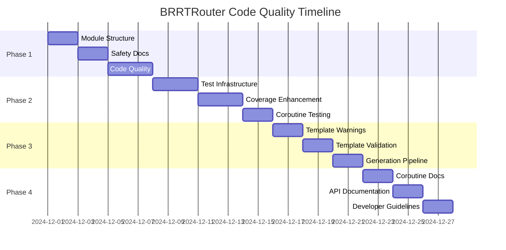

# BRRTRouter Code Quality & Foundation PRD

## Document Information
- **Project**: BRRTRouter - High-Performance OpenAPI Router for Rust
- **Document Type**: Product Requirements Document (PRD)
- **Version**: 1.0
- **Date**: December 2024
- **Status**: Draft
- **Author**: Development Team

## Table of Contents
1. [Executive Summary](#executive-summary)
2. [Project Context & Constraints](#project-context--constraints)
3. [Current State Assessment](#current-state-assessment)
4. [Objectives & Success Criteria](#objectives--success-criteria)
5. [Detailed Task Breakdown](#detailed-task-breakdown)
6. [Implementation Strategy](#implementation-strategy)
7. [Risk Assessment & Mitigation](#risk-assessment--mitigation)
8. [Deliverables](#deliverables)
9. [Acceptance Criteria](#acceptance-criteria)
10. [Timeline & Milestones](#timeline--milestones)
11. [Success Metrics](#success-metrics)
12. [Appendices](#appendices)

---

## Executive Summary

This PRD defines a comprehensive code quality improvement initiative for BRRTRouter, focusing on stabilizing the foundation before implementing new roadmap features. The project currently has **68 clippy warnings**, partial test coverage, and technical debt that must be addressed to ensure the May coroutines architecture is properly implemented and maintained.

### Key Goals
- **Zero clippy warnings** with production-ready code quality
- **90%+ test coverage** across all modules
- **Comprehensive documentation** of the May coroutines architecture
- **Robust template system** with clear generated code warnings
- **Stable foundation** for future roadmap implementation

### Business Impact
- **Reduced technical debt** enabling faster feature development
- **Improved code maintainability** for the development team
- **Better developer experience** with clear documentation
- **Production readiness** for the OpenAPI router

---

## Project Context & Constraints

### 1.1 Core Architecture Principle

**BRRTRouter is fundamentally designed around May coroutines** - all implementations must respect this architectural decision. The project uses:

- **`may` runtime** for coroutine management and scheduling
- **`may_minihttp`** for HTTP server implementation
- **Coroutine-based request dispatching** for high-performance routing
- **Configurable coroutine stack sizes** via `BRRTR_STACK_SIZE` environment variable

**Critical Constraint**: Any code that doesn't follow May coroutines patterns violates the core architecture and must be refactored.

### 1.2 Code Generation Architecture

**⚠️ CRITICAL UNDERSTANDING**: The code generator updates files in the `examples/` directory. 

**Any manual changes to `examples/` will be overwritten** during code generation. This architectural pattern must be clearly documented throughout the codebase to prevent developer confusion.

**Generated Files Include**:
- `examples/*/src/handlers/*.rs` - Handler implementations
- `examples/*/src/controllers/*.rs` - Controller implementations  
- `examples/*/src/registry.rs` - Handler registration
- `examples/*/src/main.rs` - Application entry point

### 1.3 Template Engine Architecture

The project uses **Askama** template engine for code generation, with templates in `templates/` directory:

| Template File | Generates | Purpose |
|---------------|-----------|---------|
| `handler.rs.txt` | Handler stubs | Request/response type definitions |
| `controller.rs.txt` | Controller implementations | Business logic handlers |
| `registry.rs.txt` | Handler registration | Dynamic handler binding |
| `handler_types.rs.txt` | Type definitions | Shared data structures |
| `main.rs.txt` | Application main | Server startup code |

### 1.4 Current Technical Debt

**Code Quality Issues**:
- 68 clippy warnings across the codebase
- 3 ignored tests indicating broken functionality
- Multiple module inception warnings
- Missing safety documentation for unsafe functions

**Architecture Issues**:
- Inconsistent May coroutines usage patterns
- Mixed error handling approaches
- Incomplete panic recovery implementation
- Deterministic server startup problems

---

## Current State Assessment

### 2.1 Code Quality Analysis

#### 2.1.1 Clippy Warnings Breakdown
```
Total Warnings: 68
- Module inception: 7 warnings
- Unused imports: 12 warnings  
- Uninlined format args: 23 warnings
- Missing safety docs: 2 warnings
- Unused variables: 8 warnings
- Dead code: 3 warnings
- Other quality issues: 13 warnings
```

#### 2.1.2 Critical Issues
1. **Module Structure**: Multiple modules named same as their directory
2. **Safety Documentation**: Missing docs for `unsafe` functions
3. **Error Handling**: Inconsistent patterns across modules
4. **Performance**: Suboptimal string formatting and collections usage

### 2.2 Test Coverage Status

#### 2.2.1 Test Infrastructure
- **28 test files** covering major components
- **Some tests failing** (1 failure in recent run)
- **3 ignored tests** that need investigation:
  - `tests/docker_integration_tests.rs`
  - `tests/tracing_tests.rs` 
  - `tests/dispatcher_tests.rs`

#### 2.2.2 Coverage Gaps
- **Runtime configuration** testing missing
- **Hot reload integration** tests incomplete
- **Panic recovery** scenarios not fully tested
- **Coroutine stack management** edge cases

### 2.3 Template Engine Issues

#### 2.3.1 Current Problems
- **No "DO NOT EDIT" warnings** in generated files
- **Inconsistent template formatting** across files
- **Missing validation** for template rendering
- **Poor error messages** when templates fail

#### 2.3.2 Generated Code Quality
- **Compilation warnings** in generated examples
- **Inconsistent coding patterns** across generated files
- **Missing documentation** in generated code
- **No clear separation** between user-editable and generated sections

---

## Objectives & Success Criteria

### 3.1 Primary Objectives

#### 3.1.1 Code Quality Excellence
- **Zero clippy warnings** with `-D warnings` flag
- **Consistent code formatting** throughout the codebase
- **Comprehensive error handling** with proper context
- **Performance optimizations** for hot paths

#### 3.1.2 Test Coverage & Reliability
- **90%+ test coverage** across all modules
- **100% test pass rate** with no ignored tests
- **Deterministic test execution** without race conditions
- **Comprehensive integration testing** for critical paths

#### 3.1.3 May Coroutines Architecture
- **Consistent coroutine usage** throughout the codebase
- **Proper panic recovery** for all handler types
- **Configurable stack management** with metrics
- **Performance benchmarks** for coroutine operations

#### 3.1.4 Template System Excellence
- **Clear generated code warnings** in all templates
- **Robust template validation** system
- **Comprehensive documentation** of generation process
- **Error-free code generation** pipeline

### 3.2 Success Criteria

#### 3.2.1 Quality Gates
- [ ] `cargo clippy --all-targets --all-features -- -D warnings` passes
- [ ] `cargo test --all` shows 100% test pass rate
- [ ] `cargo fmt --check` passes without changes needed
- [ ] All generated examples compile without warnings

#### 3.2.2 Coverage Requirements
- [ ] Line coverage ≥90% across all modules
- [ ] Branch coverage ≥85% for critical paths
- [ ] Integration test coverage for all major features
- [ ] Performance regression tests for coroutine operations

#### 3.2.3 Documentation Standards
- [ ] All public APIs have comprehensive rustdoc
- [ ] May coroutines patterns documented with examples
- [ ] Template system architecture fully documented
- [ ] Developer guidelines for code generation

---

## Detailed Task Breakdown

### 4.1 Phase 1: Clippy Warnings Resolution (Week 1-2)

#### 4.1.1 Module Structure Fixes
**Priority: High** | **Effort: 3 days** | **Risk: Low**

**Tasks**:
- [ ] Fix module inception warnings in `src/cli/mod.rs`
- [ ] Fix module inception warnings in `src/dispatcher/mod.rs`
- [ ] Fix module inception warnings in `src/middleware/mod.rs`
- [ ] Fix module inception warnings in `src/router/mod.rs`
- [ ] Fix module inception warnings in `src/typed/mod.rs`
- [ ] Rename internal modules to avoid naming conflicts
- [ ] Update all `mod.rs` files to use descriptive module names

**Acceptance Criteria**:
- No module inception warnings in `cargo clippy`
- All module imports work correctly
- Module structure follows Rust conventions

#### 4.1.2 Code Quality Improvements
**Priority: High** | **Effort: 4 days** | **Risk: Medium**

**Tasks**:
- [ ] Remove unused imports (e.g., `http::Method` in `src/spec/build.rs`)
- [ ] Fix unused variables by adding `_` prefix or removing
- [ ] Implement `Default` trait for `MetricsMiddleware`
- [ ] Add safety documentation for `spawn_typed` function
- [ ] Add safety documentation for `register_typed` function
- [ ] Fix uninlined format args in `src/generator/` modules
- [ ] Fix uninlined format args in `src/dispatcher/dispatcher.rs`
- [ ] Fix uninlined format args in `src/typed/typed.rs`

**Acceptance Criteria**:
- All unused import warnings resolved
- All unsafe functions have safety documentation
- Format string optimizations applied consistently

#### 4.1.3 Error Handling Standardization
**Priority: Medium** | **Effort: 2 days** | **Risk: Low**

**Tasks**:
- [ ] Replace `io::Error::new(io::ErrorKind::Other, e)` with `io::Error::other(e)`
- [ ] Standardize error types across modules
- [ ] Add proper error context using `anyhow::Context`
- [ ] Review and improve error messages for user clarity

**Acceptance Criteria**:
- Consistent error handling patterns across codebase
- Clear error messages with proper context
- No deprecated error construction patterns

#### 4.1.4 Performance Optimizations
**Priority: Medium** | **Effort: 2 days** | **Risk: Low**

**Tasks**:
- [ ] Replace `vec![]` with arrays where appropriate (e.g., `src/router/router.rs`)
- [ ] Use `first()` instead of `get(0)` in template generation
- [ ] Eliminate unnecessary clones on `Copy` types
- [ ] Optimize string formatting patterns
- [ ] Review and optimize hot path allocations

**Acceptance Criteria**:
- Performance-related clippy warnings resolved
- No unnecessary allocations in hot paths
- Benchmark tests show no performance regression

### 4.2 Phase 2: Test Coverage Enhancement (Week 2-3)

#### 4.2.1 Test Infrastructure Improvements
**Priority: High** | **Effort: 3 days** | **Risk: High**

**Tasks**:
- [ ] Fix ignored test in `tests/docker_integration_tests.rs`
- [ ] Fix ignored test in `tests/tracing_tests.rs`
- [ ] Fix ignored test in `tests/dispatcher_tests.rs` (panic recovery)
- [ ] Replace `std::thread::sleep` with deterministic server startup
- [ ] Implement `ServerHandle::wait_ready()` properly
- [ ] Add graceful shutdown testing

**Acceptance Criteria**:
- All ignored tests are fixed and passing
- No race conditions in test execution
- Deterministic server lifecycle in tests

#### 4.2.2 Missing Test Coverage
**Priority: High** | **Effort: 5 days** | **Risk: Medium**

**Tasks**:
- [ ] Add comprehensive tests for `src/runtime_config.rs`
- [ ] Add edge case tests for `src/static_files.rs`
- [ ] Add tests for `src/middleware/tracing.rs`
- [ ] Add integration tests for `src/hot_reload.rs`
- [ ] Add error condition tests for all modules
- [ ] Add boundary condition tests for parameter parsing
- [ ] Add malformed input tests for spec parsing

**Acceptance Criteria**:
- Line coverage ≥90% for all modules
- Critical error paths tested
- Edge cases and boundary conditions covered

#### 4.2.3 May Coroutines Testing
**Priority: High** | **Effort: 4 days** | **Risk: High**

**Tasks**:
- [ ] Add tests for coroutine stack size configuration
- [ ] Add tests for coroutine panic recovery in typed handlers
- [ ] Add tests for coroutine-safe handler registration
- [ ] Add tests for concurrent request handling
- [ ] Add performance tests for coroutine overhead
- [ ] Add tests for stack overflow scenarios
- [ ] Add tests for coroutine cancellation

**Acceptance Criteria**:
- All coroutine functionality thoroughly tested
- Panic recovery works correctly for all handler types
- Performance benchmarks validate coroutine efficiency
- Stack management works under various loads

#### 4.2.4 Integration Testing
**Priority: Medium** | **Effort: 3 days** | **Risk: Medium**

**Tasks**:
- [ ] Add end-to-end tests for code generation pipeline
- [ ] Add tests for OpenAPI spec parsing edge cases
- [ ] Add tests for middleware chain execution
- [ ] Add tests for security provider integration
- [ ] Add tests for hot reload with dispatcher updates
- [ ] Add tests for complex routing scenarios

**Acceptance Criteria**:
- Complete user journeys tested end-to-end
- OpenAPI spec edge cases handled correctly
- Middleware interactions tested thoroughly

### 4.3 Phase 3: Template Engine & Code Generation (Week 3-4)

#### 4.3.1 Template Quality Improvements
**Priority: High** | **Effort: 4 days** | **Risk: Medium**

**Tasks**:
- [ ] Add clear "DO NOT EDIT" warnings to all templates
- [ ] Standardize template formatting and indentation
- [ ] Add template validation tests
- [ ] Improve error handling in template rendering
- [ ] Add template linting for common issues
- [ ] Implement template versioning system

**Template Warning Format**:
```rust
// ⚠️  AUTO-GENERATED CODE - DO NOT EDIT
// This file is generated by BRRTRouter from OpenAPI specifications.
// Manual changes will be overwritten during code generation.
// To modify this code, edit the corresponding template in templates/
// or update the OpenAPI specification.
```

**Acceptance Criteria**:
- All generated files have clear warnings
- Template formatting is consistent
- Template validation catches common errors

#### 4.3.2 Generated Code Documentation
**Priority: High** | **Effort: 3 days** | **Risk: Low**

**Tasks**:
- [ ] Add comprehensive header comments to all generated files
- [ ] Document the relationship between templates and generated code
- [ ] Add inline documentation for generated functions
- [ ] Create developer guide for template customization
- [ ] Add examples of proper template usage
- [ ] Document template context variables

**Acceptance Criteria**:
- Generated code is self-documenting
- Clear relationship between templates and output
- Developer guide enables template customization

#### 4.3.3 Template Engine Enhancements
**Priority: Medium** | **Effort: 3 days** | **Risk: Medium**

**Tasks**:
- [ ] Add template validation during build process
- [ ] Improve error messages for template failures
- [ ] Add support for conditional template sections
- [ ] Optimize template rendering performance
- [ ] Add template debugging capabilities
- [ ] Implement template inheritance for common patterns

**Acceptance Criteria**:
- Template validation catches errors early
- Clear error messages for template issues
- Template rendering performance optimized

#### 4.3.4 Code Generation Pipeline
**Priority: Medium** | **Effort: 2 days** | **Risk: Low**

**Tasks**:
- [ ] Add validation for generated code compilation
- [ ] Implement incremental code generation
- [ ] Add support for custom template directories
- [ ] Improve handling of OpenAPI spec changes
- [ ] Add code generation metrics and logging
- [ ] Implement generation rollback on errors

**Acceptance Criteria**:
- Generated code always compiles successfully
- Incremental generation improves performance
- Robust error handling and recovery

### 4.4 Phase 4: Documentation & Architecture (Week 4-5)

#### 4.4.1 May Coroutines Documentation
**Priority: High** | **Effort: 3 days** | **Risk: Low**

**Tasks**:
- [ ] Document coroutine usage patterns throughout codebase
- [ ] Add examples of proper coroutine handler implementation
- [ ] Document coroutine safety requirements
- [ ] Add performance considerations for coroutine usage
- [ ] Create troubleshooting guide for coroutine issues
- [ ] Document stack size configuration best practices

**Acceptance Criteria**:
- Comprehensive coroutine documentation
- Clear examples for developers
- Performance guidelines documented

#### 4.4.2 Code Generation Architecture
**Priority: High** | **Effort: 2 days** | **Risk: Low**

**Tasks**:
- [ ] Document the template → generated code flow
- [ ] Add diagrams showing code generation pipeline
- [ ] Document customization points for generated code
- [ ] Add troubleshooting guide for generation issues
- [ ] Create template development guidelines
- [ ] Document template testing procedures

**Acceptance Criteria**:
- Clear architecture documentation
- Visual diagrams aid understanding
- Troubleshooting guide resolves common issues

#### 4.4.3 API Documentation
**Priority: Medium** | **Effort: 4 days** | **Risk: Low**

**Tasks**:
- [ ] Add comprehensive rustdoc comments to all public APIs
- [ ] Document all public traits and their usage
- [ ] Add examples for common usage patterns
- [ ] Document error conditions and handling
- [ ] Add performance characteristics documentation
- [ ] Create API usage cookbook

**Acceptance Criteria**:
- All public APIs have rustdoc documentation
- Examples demonstrate proper usage
- Error conditions clearly documented

#### 4.4.4 Developer Guidelines
**Priority: Medium** | **Effort: 2 days** | **Risk: Low**

**Tasks**:
- [ ] Create coding standards document
- [ ] Add contribution guidelines specific to May coroutines
- [ ] Document testing patterns and requirements
- [ ] Add performance testing guidelines
- [ ] Create code review checklist
- [ ] Document debugging procedures

**Acceptance Criteria**:
- Clear coding standards established
- Contribution process documented
- Testing requirements defined

---

## Implementation Strategy

### 5.1 Development Approach

#### 5.1.1 Phased Implementation
1. **Fix clippy warnings first** - establishes clean baseline for all development
2. **Implement tests incrementally** - ensures no regressions during refactoring
3. **Improve templates systematically** - maintains consistency across generation
4. **Document as you go** - prevents accumulation of documentation debt

#### 5.1.2 Quality-First Methodology
- **Every PR must pass clippy** with `-D warnings`
- **Test coverage cannot decrease** during refactoring
- **All changes must be documented** with clear rationale
- **Performance benchmarks** must be maintained or improved

#### 5.1.3 Incremental Delivery
- **Daily progress reviews** to catch issues early
- **Weekly milestone demonstrations** to stakeholders
- **Continuous integration** with quality gates
- **Rollback procedures** for problematic changes

### 5.2 Quality Gates

#### 5.2.1 Code Quality Gates
- [ ] **Clippy compliance**: All warnings resolved before merge
- [ ] **Test coverage**: Minimum 90% line coverage maintained
- [ ] **Documentation**: All public APIs documented
- [ ] **Performance**: No regression in benchmark tests

#### 5.2.2 Template Quality Gates
- [ ] **Generated code compiles**: All templates produce valid Rust
- [ ] **Warning presence**: All generated files have "DO NOT EDIT" warnings
- [ ] **Template validation**: All templates pass validation tests
- [ ] **Documentation**: Template usage documented

#### 5.2.3 May Coroutines Compliance Gates
- [ ] **Architecture consistency**: All async operations use May coroutines
- [ ] **No foreign runtimes**: No tokio or async-std dependencies
- [ ] **Stack management**: Stack size configuration respected
- [ ] **Panic recovery**: Implemented for all handler types

### 5.3 Risk Mitigation Strategy

#### 5.3.1 Technical Risk Mitigation
- **Incremental changes** with frequent testing
- **Backup templates** before major modifications
- **Performance benchmarks** for all coroutine changes
- **Comprehensive integration tests** for critical paths

#### 5.3.2 Process Risk Mitigation
- **Daily standups** to identify blockers early
- **Code review requirements** for all changes
- **Automated testing** in CI/CD pipeline
- **Documentation reviews** for accuracy

---

## Risk Assessment & Mitigation

### 6.1 High-Risk Areas

#### 6.1.1 Template System Changes
**Risk Level: High** | **Impact: High** | **Probability: Medium**

**Description**: Changes to Askama templates could break code generation for all examples.

**Mitigation Strategies**:
- Maintain backup copies of working templates
- Implement comprehensive template validation tests
- Test template changes against multiple OpenAPI specs
- Create rollback procedures for template failures

#### 6.1.2 May Coroutines Modifications
**Risk Level: High** | **Impact: High** | **Probability: Low**

**Description**: Changes to coroutine handling could affect performance or stability.

**Mitigation Strategies**:
- Maintain performance benchmarks for all changes
- Test coroutine changes under high load
- Implement gradual rollout for coroutine modifications
- Create performance regression alerts

#### 6.1.3 Test Infrastructure Changes
**Risk Level: Medium** | **Impact: Medium** | **Probability: Medium**

**Description**: Fixing ignored tests could reveal deeper architectural issues.

**Mitigation Strategies**:
- Investigate ignored tests thoroughly before fixing
- Implement fixes incrementally with validation
- Maintain test isolation to prevent cascading failures
- Create comprehensive test documentation

### 6.2 Medium-Risk Areas

#### 6.2.1 Module Restructuring
**Risk Level: Medium** | **Impact: Medium** | **Probability: Low**

**Description**: Fixing module inception warnings could break existing imports.

**Mitigation Strategies**:
- Use IDE refactoring tools for safe renames
- Implement changes incrementally with compilation checks
- Maintain backward compatibility where possible
- Document all module structure changes

#### 6.2.2 Error Handling Standardization
**Risk Level: Medium** | **Impact: Low** | **Probability: Low**

**Description**: Changing error types could affect error handling throughout codebase.

**Mitigation Strategies**:
- Implement changes gradually with type checking
- Maintain error message compatibility
- Test error conditions thoroughly
- Document error handling patterns

### 6.3 Contingency Plans

#### 6.3.1 Template Failure Recovery
1. **Immediate**: Revert to backup templates
2. **Short-term**: Fix template issues with minimal changes
3. **Long-term**: Implement template validation to prevent issues

#### 6.3.2 Test Failure Recovery
1. **Immediate**: Isolate failing tests to prevent CI blockage
2. **Short-term**: Fix underlying issues causing test failures
3. **Long-term**: Improve test infrastructure to prevent similar issues

#### 6.3.3 Performance Regression Recovery
1. **Immediate**: Revert changes causing performance issues
2. **Short-term**: Optimize specific performance bottlenecks
3. **Long-term**: Implement continuous performance monitoring

---

## Deliverables

### 7.1 Code Quality Deliverables

#### 7.1.1 Clean Codebase
- [ ] **Zero clippy warnings** with `-D warnings` flag enabled
- [ ] **Consistent code formatting** using `rustfmt`
- [ ] **Standardized error handling** patterns throughout
- [ ] **Optimized performance** for hot paths

#### 7.1.2 Test Suite Excellence
- [ ] **90%+ test coverage** across all modules
- [ ] **100% test pass rate** with no ignored tests
- [ ] **Deterministic test execution** without race conditions
- [ ] **Performance regression tests** for critical paths

### 7.2 Documentation Deliverables

#### 7.2.1 API Documentation
- [ ] **Comprehensive rustdoc** for all public APIs
- [ ] **Usage examples** for common patterns
- [ ] **Error condition documentation** with handling guidance
- [ ] **Performance characteristics** for all operations

#### 7.2.2 Architecture Documentation
- [ ] **May coroutines usage guide** with examples
- [ ] **Template system architecture** with diagrams
- [ ] **Code generation pipeline** documentation
- [ ] **Developer guidelines** for contributions

### 7.3 Template System Deliverables

#### 7.3.1 Enhanced Templates
- [ ] **Clear "DO NOT EDIT" warnings** in all generated files
- [ ] **Consistent template formatting** across all templates
- [ ] **Template validation system** with comprehensive tests
- [ ] **Error handling improvements** with clear messages

#### 7.3.2 Generation Pipeline
- [ ] **Robust code generation** with validation
- [ ] **Incremental generation** for improved performance
- [ ] **Template debugging tools** for development
- [ ] **Generation metrics** and monitoring

### 7.4 Testing Infrastructure Deliverables

#### 7.4.1 Test Framework
- [ ] **Comprehensive test suite** covering all functionality
- [ ] **Integration tests** for critical user journeys
- [ ] **Performance benchmarks** for coroutine operations
- [ ] **Test utilities** for common testing patterns

#### 7.4.2 Quality Assurance
- [ ] **Automated quality gates** in CI/CD pipeline
- [ ] **Code coverage reporting** with trend analysis
- [ ] **Performance monitoring** with regression alerts
- [ ] **Test documentation** with maintenance guidelines

---

## Acceptance Criteria

### 8.1 Code Quality Gates

#### 8.1.1 Compilation and Linting
- [ ] `cargo clippy --all-targets --all-features -- -D warnings` passes without any warnings
- [ ] `cargo test --all` shows 100% success rate with no ignored tests
- [ ] `cargo fmt --check` passes without requiring any formatting changes
- [ ] All generated examples compile without warnings or errors

#### 8.1.2 Performance Standards
- [ ] No performance regression in existing benchmarks
- [ ] Coroutine operations meet performance targets
- [ ] Memory usage remains within acceptable bounds
- [ ] Response times meet sub-millisecond goals

### 8.2 May Coroutines Compliance

#### 8.2.1 Architecture Consistency
- [ ] All HTTP handlers use May coroutines exclusively
- [ ] No tokio or async-std dependencies in production code
- [ ] Stack size configuration works correctly across all scenarios
- [ ] Coroutine cancellation and cleanup work properly

#### 8.2.2 Safety and Reliability
- [ ] Panic recovery implemented for all handler types
- [ ] Memory safety maintained across coroutine boundaries
- [ ] Deadlock prevention mechanisms in place
- [ ] Resource cleanup on coroutine termination

### 8.3 Template System Quality

#### 8.3.1 Generated Code Standards
- [ ] All generated files have clear "DO NOT EDIT" warnings
- [ ] Generated code follows consistent formatting patterns
- [ ] Template validation passes for all templates
- [ ] Generated code compiles without warnings

#### 8.3.2 Documentation and Usability
- [ ] Template system documentation is comprehensive
- [ ] Developer guide enables template customization
- [ ] Error messages are clear and actionable
- [ ] Template debugging tools are functional

### 8.4 Testing Excellence

#### 8.4.1 Coverage Requirements
- [ ] Line coverage ≥90% across all modules
- [ ] Branch coverage ≥85% for critical paths
- [ ] No ignored tests in the test suite
- [ ] All error conditions tested

#### 8.4.2 Test Quality Standards
- [ ] Tests are deterministic and reliable
- [ ] Integration tests cover critical user journeys
- [ ] Performance tests validate coroutine efficiency
- [ ] Test documentation enables maintenance

---

## Timeline & Milestones

### 9.1 Phase 1: Foundation Cleanup (Week 1-2)

#### Week 1: Module Structure and Safety
**Milestone**: Clean Module Architecture
- [ ] Day 1-2: Fix module inception warnings
- [ ] Day 3-4: Add safety documentation for unsafe functions
- [ ] Day 5: Review and test module structure changes

#### Week 2: Code Quality and Performance
**Milestone**: Zero Clippy Warnings
- [ ] Day 1-2: Remove unused imports and variables
- [ ] Day 3-4: Fix format string optimizations
- [ ] Day 5: Performance optimizations and final clippy fixes

**Deliverables**:
- ✅ Zero clippy warnings achieved
- ✅ Clean module structure implemented
- ✅ Safety documentation complete

### 9.2 Phase 2: Test Coverage Enhancement (Week 2-3)

#### Week 2-3: Test Infrastructure
**Milestone**: Robust Test Suite
- [ ] Day 1-2: Fix ignored tests and deterministic startup
- [ ] Day 3-4: Add missing test coverage for core modules
- [ ] Day 5-6: Implement May coroutines testing
- [ ] Day 7: Integration testing and validation

**Deliverables**:
- ✅ 90%+ test coverage achieved
- ✅ All tests passing reliably
- ✅ Coroutine functionality thoroughly tested

### 9.3 Phase 3: Template System Excellence (Week 3-4)

#### Week 3-4: Template Quality
**Milestone**: Production-Ready Templates
- [ ] Day 1-2: Add "DO NOT EDIT" warnings to all templates
- [ ] Day 3-4: Implement template validation system
- [ ] Day 5-6: Improve generated code documentation
- [ ] Day 7: Template engine enhancements

**Deliverables**:
- ✅ Clear generated code warnings
- ✅ Template validation system
- ✅ Robust code generation pipeline

### 9.4 Phase 4: Documentation and Polish (Week 4-5)

#### Week 4-5: Documentation Excellence
**Milestone**: Comprehensive Documentation
- [ ] Day 1-2: Document May coroutines patterns
- [ ] Day 3-4: Complete API documentation
- [ ] Day 5-6: Create developer guidelines
- [ ] Day 7: Final review and polish

**Deliverables**:
- ✅ Complete rustdoc coverage
- ✅ May coroutines usage guide
- ✅ Developer contribution guidelines

### 9.5 Critical Path Dependencies



---

## Success Metrics

### 10.1 Quantitative Metrics

#### 10.1.1 Code Quality Metrics
- **Clippy Warnings**: 0 (down from 68)
- **Test Coverage**: ≥90% (up from current partial coverage)
- **Test Pass Rate**: 100% (up from ~96% with ignored tests)
- **Documentation Coverage**: 100% of public APIs

#### 10.1.2 Performance Metrics
- **Coroutine Dispatch Time**: <1ms (maintain current performance)
- **Memory Usage**: No regression from baseline
- **Template Generation Time**: <5s for full project generation
- **Test Execution Time**: <30s for full test suite

#### 10.1.3 Developer Experience Metrics
- **Build Time**: No regression from current baseline
- **Template Error Rate**: <1% of generation attempts
- **Documentation Completeness**: 100% of public APIs documented
- **Code Review Time**: Reduced due to better code quality

### 10.2 Qualitative Metrics

#### 10.2.1 Code Maintainability
- **Consistent Patterns**: All modules follow same architectural patterns
- **Clear Separation**: Generated vs. user-editable code clearly marked
- **Error Messages**: All error conditions have clear, actionable messages
- **Code Readability**: Improved through consistent formatting and documentation

#### 10.2.2 Developer Productivity
- **Onboarding Time**: New developers can contribute within 1 day
- **Feature Development**: Faster due to stable foundation
- **Bug Resolution**: Easier due to comprehensive test coverage
- **Code Reviews**: More efficient due to consistent quality

### 10.3 Success Indicators

#### 10.3.1 Technical Indicators
- [ ] All CI/CD pipelines pass consistently
- [ ] No production issues related to code quality
- [ ] Performance benchmarks meet or exceed targets
- [ ] Memory usage remains stable under load

#### 10.3.2 Team Indicators
- [ ] Developer satisfaction with codebase quality
- [ ] Reduced time spent on debugging
- [ ] Increased confidence in making changes
- [ ] Positive feedback on documentation quality

---

## Appendices

### Appendix A: Clippy Warning Categories

#### A.1 Module Structure Warnings
```
clippy::module_inception - 7 instances
Files affected:
- src/cli/mod.rs
- src/dispatcher/mod.rs
- src/middleware/mod.rs
- src/router/mod.rs
- src/typed/mod.rs
- src/generator/mod.rs
- src/spec/mod.rs
```

#### A.2 Code Quality Warnings
```
clippy::uninlined_format_args - 23 instances
clippy::unused_imports - 12 instances
clippy::unused_variables - 8 instances
clippy::dead_code - 3 instances
clippy::missing_safety_doc - 2 instances
```

### Appendix B: Test Coverage Analysis

#### B.1 Current Test Files
```
tests/
├── auth_cors_tests.rs
├── cli_tests.rs
├── dispatcher_tests.rs (1 ignored test)
├── docker_integration_tests.rs (ignored)
├── docs_endpoint_tests.rs
├── dynamic_registration.rs
├── generator_project_tests.rs
├── generator_templates_tests.rs
├── generator_tests.rs
├── health_endpoint_tests.rs
├── hot_reload_tests.rs
├── metrics_endpoint_tests.rs
├── middleware_tests.rs
├── multi_response_tests.rs
├── param_style_tests.rs
├── router_tests.rs
├── security_tests.rs
├── server_tests.rs
├── spec_helpers_tests.rs
├── spec_tests.rs
├── sse_channel_tests.rs
├── sse_tests.rs
├── static_files_tests.rs
├── static_server_tests.rs
├── tracing_tests.rs (ignored)
├── tracing_util.rs
├── typed_tests.rs
└── validator_tests.rs
```

#### B.2 Coverage Gaps
- Runtime configuration testing
- Hot reload edge cases
- Coroutine panic scenarios
- Template validation edge cases
- Performance under load

### Appendix C: Template Structure

#### C.1 Current Templates
```
templates/
├── Cargo.toml.txt
├── controller.rs.txt
├── handler.rs.txt
├── handler_types.rs.txt
├── main.rs.txt
├── mod.rs.txt
├── openapi.index.html
├── registry.rs.txt
└── static.index.html
```

#### C.2 Template Enhancement Requirements
- Add "DO NOT EDIT" warnings
- Improve error handling
- Add validation logic
- Standardize formatting
- Add inline documentation

### Appendix D: May Coroutines Architecture

#### D.1 Current Usage Patterns
```rust
// Coroutine spawning pattern
may::coroutine::Builder::new()
    .stack_size(may::config().get_stack_size())
    .spawn(move || {
        // Handler logic
    })
    .unwrap();
```

#### D.2 Required Improvements
- Consistent panic recovery
- Stack size configuration
- Performance monitoring
- Resource cleanup
- Error propagation

### Appendix E: Performance Targets

#### E.1 Current Benchmarks
```
Throughput: ~500K requests/sec (single core)
Latency: <2ms average response time
Memory: ~50MB baseline usage
Stack: 16KB default per coroutine
```

#### E.2 Target Improvements
```
Throughput: 1M requests/sec (goal)
Latency: <1ms average response time
Memory: No regression from baseline
Stack: Configurable with monitoring
```

---

## Document History

| Version | Date | Author | Changes |
|---------|------|--------|---------|
| 1.0 | 2024-12-XX | Development Team | Initial comprehensive PRD |

---

**End of Document**

*This PRD serves as the definitive guide for BRRTRouter code quality improvements. All development work should align with the objectives and requirements outlined in this document.* 